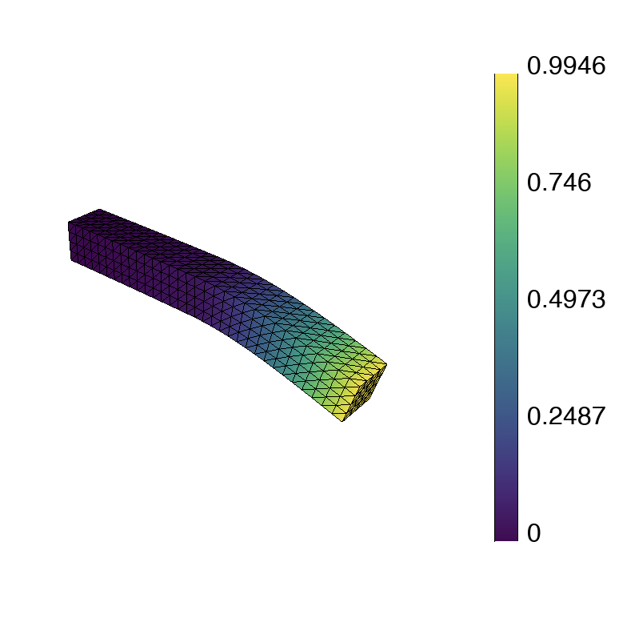

## <i class="fa fa-book"></i>&nbsp; Linear Elasticity

<span class="label label-default">45 minutes</span>
<span class="label label-default">basic</span>

---

<div class="panel panel-success">
<div class="panel-heading">
<h3 class="panel-title"><i class="fa fa-check"></i>&nbsp; Lesson Objectives</h3>
</div>
<div class="panel-body" style="line-height: 1.8;">
<i class="fa fa-square-o"></i>&nbsp; Understand the finite element discretization of a simple elastic deformation problem in MFEM.<br>
<i class="fa fa-square-o"></i>&nbsp; Learn how to handle vectorial solution variables in MFEM.<br>
</div>
</div>

<div class="panel panel-info">
<div class="panel-heading">
<h3 class="panel-title"><i class="fa fa-info-circle"></i>&nbsp; Note</h3>
</div>
<div class="panel-body">
Complete the <a href="../../tutorial/fem"><i class="fa fa-play-circle"></i>&nbsp; Example 1</a> tutorial before starting this lesson.
</div>
</div>

---

[_Linear elasticity_](https://en.wikipedia.org/wiki/Linear_elasticity) is a vectorial partial differential equation (PDE) that models how solid materials deform and develop stress under applied forces. It is widely used to analyze the stress-strain behavior of structural and mechanical systems.
Mathematically writing,

$$
\nabla \cdot \boldsymbol{\sigma(\boldsymbol{u})} + \boldsymbol{F} = \rho \boldsymbol{\ddot{u}}    
$$

where $\boldsymbol{u}$ is the vector valued displacement field, $\boldsymbol{\sigma}$ is the [_stress tensor_](https://en.wikipedia.org/wiki/Cauchy_stress_tensor), $\boldsymbol{F}$ is the body force per unit volume and $\rho$ is the material density. This PDE is obtained by using the [_Conservation of Linear Momentum_](https://en.wikipedia.org/wiki/Momentum#Conservation).

Using the [_Hooke's Law_](https://en.wikipedia.org/wiki/Hooke%27s_law) for an isotropic material,the stress tensor $\boldsymbol{\sigma}$ corresponding to the displacement field $\boldsymbol{u}$ is given as

$$
\boldsymbol{\sigma(\boldsymbol{u})} = \lambda \nabla \cdot (\boldsymbol{u}) \boldsymbol{I} + \mu (\nabla \boldsymbol{u} + \nabla \boldsymbol{u}^T)
$$

where $\lambda$ and $\mu$ are Lamé's constants which depend on material properties. 

To solve the above continuous equation numerically, we approximate it by converting it into a discrete problem with a finite number of unknowns. In the [_Finite Element Method_](https://en.wikipedia.org/wiki/Finite_element_method) (FEM), this is achieved using _basis functions_ to represent the solution over the domain.

Instead of calculating the exact analytic solution $\boldsymbol{u}$, we approximate it 

$$
u \approx u_h := \sum c_j \varphi_j
$$

where $\boldsymbol{u}_h$ is the finite element approximation with degrees of freedom (unknown
coefficients) $\boldsymbol{c}_j$, and $\varphi_j$ are known _basis functions_. The FEM basis
functions are typically piecewise-polynomial functions on a given computational mesh,
which are only non-zero on small portions of the mesh.

For this Example problem, we solve our PDE by neglecting the body force, $\boldsymbol{F} = 0$ and also by setting the inertial term, $\rho  \boldsymbol{\ddot{u}} = 0$.

To solve for the unknown coefficients, $\boldsymbol{c}_j$, we consider the <a href="../../fem_weak_form/">weak</a> (or variational) form of the Elasticity PDE. This is obtained by first multiplying with another test function $\boldsymbol{v}$:

$$
\int_{\Omega} \boldsymbol{v} \cdot \left( \nabla \cdot \boldsymbol{\sigma}(\boldsymbol{u}) \right)  d\boldsymbol{x} = 0
$$

and then integrating by parts using the [divergence theorem](https://en.wikipedia.org/wiki/Divergence_theorem):

$$
\int_{\Omega} \nabla \boldsymbol{v} : \boldsymbol{\sigma}(\boldsymbol{u})  d\boldsymbol{x} = \int_{\partial \Omega} \boldsymbol{v} \cdot (\boldsymbol{\sigma}(\boldsymbol{u}) \cdot \boldsymbol{n})
  d\boldsymbol{s}
$$

The boundary is divided into two parts, the Dirichlet boundary and the Neumann boundary conditions. In this example problem, the boundary with attribute 1 has a Dirichlet Boundary condition whereas the rest have a Neumann boundary condition. The Neumann boundary is non-zero only on the boundary with attribute 2. Susbstituting these in our formulation, we obtain,

$$
\int_{\Omega} \nabla \boldsymbol{v} : \boldsymbol{\sigma}(\boldsymbol{u})  d\boldsymbol{x} = \int_{\Gamma_N} \boldsymbol{v} \cdot \boldsymbol{f}  d\boldsymbol{s}
$$

Now using our constitutive law, which gives the relation between $\boldsymbol{\sigma}$ and the displacment field $\boldsymbol{u}$ in the above equation, testing it with basis functions and solving for $boldsymbol{u}_h$ ,Since the basis functions are known, we can rewrite (4) as

$$
\boldsymbol{A x} = \boldsymbol{b}
$$

This is a $mn \times mn$ linear system that can be solved directly or iteratively
for the unknown coefficients. Here, $m$ is the dimensionality of the solution field.  Note that we are free to choose the computational
mesh and the basis functions $\varphi_i$, and therefore the finite space, as we
see fit.

<div class="panel panel-info">
<div class="panel-heading">
<h3 class="panel-title"><i class="fa fa-info-circle"></i>&nbsp; Note</h3>
</div>
<div class="panel-body">
The above is a basic introduction to finite elements in the simplest possible settings.
To learn more, you can visit MFEM's <a href="../../fem/">Finite Element Method</a> page.
</div>
</div>

---

### <i class="fa fa-check-square-o"></i>&nbsp; Annotated Example 2

MFEM's Example 2 implements the above simple FEM for the Linear Elasticity problem consisting of two material domains 
in the source file [examples/ex2.cpp](https://github.com/mfem/mfem/blob/master/examples/ex2.cpp).
We set $f=-0.01$ and enforce our Dirichlet and Neumann boundary conditions on the whole boundary.

Below we highlight selected portions of the example code and connect them with
the description in the previous section. You can follow along by browsing
`ex2.cpp` in your VS Code browser window. In the settings of this tutorial, the
visualization will automatically update in the GLVis browser window.

The computational mesh is provided as input (option `-m`) that could be 3D, 2D,
surface, triangular/quadrilateral/tetrahedral/hexahedral elements, etc. (It defaults to `beam-tri.mesh` in line
[50](https://github.com/mfem/mfem/blob/master/examples/ex2.cpp#L50).) The code in
lines [73-84](https://github.com/mfem/mfem/blob/master/examples/ex2.cpp#L73-L84)
loads the mesh from the given file, `mesh_file` and creates the corresponding MFEM
pointer `*mesh` of class `Mesh`. It then checks that the mesh file uploaded has atleast two different materials and corresponding number of boundary attributes.

```c++
Mesh *mesh = new Mesh(mesh_file, 1, 1);
int dim = mesh->Dimension();

if (mesh->attributes.Max() < 2 || mesh->bdr_attributes.Max() < 2)
{
    cerr << "\nInput mesh should have at least two materials and "
        << "two boundary attributes! (See schematic in ex2.cpp)\n"
        << endl;
    return 3;
}
```

In the code lines [86-91](https://github.com/mfem/mfem/blob/master/examples/ex2.cpp#L86-L91) [_NURBS_](https://en.wikipedia.org/wiki/Non-uniform_rational_B-spline) meshes are used to create more realistic arcs

```c++
if (mesh->NURBSext)
{
    mesh->DegreeElevate(order, order);
}
```

The following code (lines
[93-104](https://github.com/mfem/mfem/blob/master/examples/ex2.cpp#L93-L104))
refines the mesh uniformly to about 5,000 elements. You can easily modify the
refinement by changing the definition of `ref_levels`.


```c++
int ref_levels =
    (int)floor(log(5000./mesh->GetNE())/log(2.)/dim);
for (int l = 0; l < ref_levels; l++)
{
    mesh->UniformRefinement();
}
```

In the next section we create the finite element space, i.e., specify the finite
element basis functions $\varphi_j$ on the mesh.  This involves the MFEM classes
`FiniteElementCollection`, which specifies the space (including its `order`,
provided as input via `-o`), and `FiniteElementSpace`, which connects the space
and the mesh. Vector valued finite elements are used for this example, by specifying it in the last argument of `FiniteElementSpace`. If we are using `NURBS` meshes, we use the `NURBS` space associated with our mesh

The code in lines
[106-124](https://github.com/mfem/mfem/blob/master/examples/ex2.cpp#L106-L124)
is essentially:

```c++
if (mesh->NURBSext)
{
    FiniteElementCollection *fec = NULL;
    FiniteElementSpace *fespace = mesh->GetNodes()->FESpace();
}
else
{
    FiniteElementCollection *fec = new H1_FECollection(order, dim);
    FiniteElementSpace *fespace = new FiniteElementSpace(mesh, fec, dim);
}
cout << "Number of finite element unknowns: " << fespace->GetTrueVSize() << endl << "Assembling: " << flush;
```

The printed number of finite element unknowns (typically) corresponds to the
size of the linear system $mn$ from the previous section.

The finite element degrees of freedom that are on the domain boundary are then
extracted in lines
[126-133](https://github.com/mfem/mfem/blob/master/examples/ex2.cpp#L126-L133).
The Dirichlet boundary conditions are then imposed only on the boundary with attribute 1 as the rest are subjected to Neumann boundary conditions.

```c++
Array<int> ess_tdof_list, ess_bdr(mesh->bdr_attributes.Max());
ess_bdr = 0;
ess_bdr[0] = 1;
fespace->GetEssentialTrueDofs(ess_bdr, ess_tdof_list);
```

The method `GetEssentialTrueDofs` takes a marker array of `Mesh` boundary
attributes and returns the `FiniteElementSpace` degrees of freedom that belong
to the marked attributes (the non-zero entries of `ess_bdr`).

The right-hand side $b$ is constructed in lines
[135-158](https://github.com/mfem/mfem/blob/master/examples/ex2.cpp#L135-L158).
In MFEM terminology, integrals of the form in the right hand side of the weak form are implemented in the
class `LinearForm`. The `pull_force` object corresponds to $f$ from the
previous section, which here is set to $-0.01$. The force on the boundary is specieid as a vector coefficient using the `VectorArayCoefficient` object. Piecewise constant coefficients `PWConstCoefficient` is used as f is non-zero on one of the boundaries. 

```c++
VectorArrayCoefficient f(dim);
for (int i = 0; i < dim-1; i++)
{
    f.Set(i, new ConstantCoefficient(0.0));
}
{
    Vector pull_force(mesh->bdr_attributes.Max());
    pull_force = 0.0;
    pull_force(1) = -1.0e-2;
    f.Set(dim-1, new PWConstCoefficient(pull_force));
}

LinearForm *b = new LinearForm(fespace);
b->AddBoundaryIntegrator(new VectorBoundaryLFIntegrator(f));
cout << "r.h.s. ... " << flush;
b->Assemble();
```

The finite element approximation $u_h$ is described in MFEM as a `GridFunction`
belonging to the `FiniteElementSpace`. Note that a `GridFunction` object can be
viewed both as the function $u_h$ in (2) as well as the vector of degrees of
freedom $x$ in (8). See lines
[160-164](https://github.com/mfem/mfem/blob/master/examples/ex2.cpp#L160-L164).

```c++
GridFunction x(fespace);
x = 0.0;
```

We need to initialize `x` with the boundary values we want to impose as Dirichlet
boundary conditions (for simplicity, here we just set `x=0` in the whole domain).

Now to start forming the bilinear form, we first start by defining the Lame parameters  using `PWConstCoefficient` to specify different material properties in different
portions of the domain. The matrix $A$ is represented as a `BilinearForm` object, with a specific
`ElasticityIntegrator` corresponding to the weak form. See lines
[166-187](https://github.com/mfem/mfem/blob/master/examples/ex2.cpp#L166-L187).

```c++
PWConstCoefficient lambda_func(lambda);
PWConstCoefficient mu_func(mu);
BilinearForm *a = new BilinearForm(fespace);
a->AddDomainIntegrator(new ElasticityIntegrator(lambda_func,mu_func));
cout << "matrix ... " << flush;
if (static_cond) { a->EnableStaticCondensation(); }
a->Assemble();
```

MFEM supports different assembly levels for $A$  and many different [integrators](https://mfem.org/bilininteg/). Here we use the static condensation transformation to reduce the size of our original system to the remaining interfacial unknowns and assemble it.

The linear system is formed in lines
[189-207](https://github.com/mfem/mfem/blob/master/examples/ex2.cpp#L189-L207):

```c++
SparseMatrix A;
Vector B, X;

a->FormLinearSystem(ess_tdof_list, x, *b, A, X, B);
cout << "Size of linear system: " << A.Height() << endl;

GSSmoother M(A);
PCG(A, M, B, X, 1, 500, 1e-8, 0.0);
```
The method `FormLinearSystem` takes the `BilinearForm`, `LinearForm`,
`GridFunction`, and boundary conditions (i.e., `a`, `b`, `x`, and `ess_tdof_list`);
applies any necessary transformations such as eliminating boundary conditions
(specified by the boundary values of `x`, applying conforming constraints for
non-conforming AMR, static condensation, etc.); and produces the corresponding
matrix $A$, right-hand side vector $B$, and unknown vector $X$.

In the above example, we then solve `A X = B` with
[conjugate gradient](https://en.wikipedia.org/wiki/Conjugate_gradient_method) iterations,
using a simple [Gauss-Seidel](https://en.wikipedia.org/wiki/Gauss%E2%80%93Seidel_method)
preconditioner. We set the maximum number of iterations to `500` and a convergence
criteria of residual norm reduction by 6 orders of magnitude (`1e-8` is the square of
that relative tolerance).

Solving the linear system is one of the main computational bottlenecks
in the FEM. It can take many preconditioned conjugate gradient (PCG) iterations
depending on the problem size, the difficulty of the problem, and the choice of the
preconditioner.

Once the linear system is solved, we recover the solution as a finite element
grid function, and then visualize and save the final results to disk (files
`displaced.mesh` and `sol.gf`). See lines
[210-248](https://github.com/mfem/mfem/blob/master/examples/ex2.cpp#L210-L248).

```c++
a->RecoverFEMSolution(X, *b, x);

ofstream mesh_ofs("displaced.mesh");
mesh->Print(mesh_ofs);
ofstream sol_ofs("sol.gf");
x.Save(sol_ofs);

socketstream sol_sock("localhost", 19916);
sol_sock << "solution\n" << mesh << x << flush;
```

---

### <i class="fa fa-check-square-o"></i>&nbsp; Parallel Example 2p

Like most MFEM examples, Example 2 has also a parallel version in the source file
[examples/ex2p.cpp](https://github.com/mfem/mfem/blob/master/examples/ex2p.cpp), which
illustrates the ease of transition between sequential and MPI-parallel code. The
parallel version supports all options of the serial example, and can be executed
on varying numbers of MPI ranks, e.g., with `mpirun -np`. Besides MPI, in parallel
we also depend on METIS for mesh partitioning and
[*hypre*](https://computing.llnl.gov/projects/hypre-scalable-linear-solvers-multigrid-methods)
for solvers.

The differences between the two versions are small, and you can compare them for
yourself by opening both files in your VS Code window.

The main additions in `ex2p.cpp` compared to `ex2.cpp` are:

*Initializing MPI and hypre*
```c++
Mpi::Init();
Hypre::Init();
```

*Splitting the serial mesh in parallel with additional parallel refinement (Lines [141-149](https://github.com/mfem/mfem/blob/master/examples/ex2p.cpp#L141-L149))*
```c++
ParMesh *pmesh = new ParMesh(MPI_COMM_WORLD, *mesh);
int par_ref_levels = 2;
for (int l = 0; l < par_ref_levels; l++)
{
   pmesh.UniformRefinement();
}
```

*Using the `Par`-prefixed versions of the classes*
```c++
ParFiniteElementSpace *fespace;
ParLinearForm *b = new ParLinearForm(fespace)
ParGridFunction x(fespace);
ParBilinearForm *a = new ParBilinearForm(fespace);
```

*Parallel PCG with hypre's algebraic multigrid BoomerAMG preconditioner*
```c++
HypreBoomerAMG *amg = new HypreBoomerAMG(A);
HyprePCG *pcg = new HyprePCG(A);
pcg->SetTol(1e-8);
pcg->SetMaxIter(500);
pcg->SetPrintLevel(2);
pcg->SetPreconditioner(*amg);
pcg->Mult(B, X);
```

<div class="panel panel-info">
<div class="panel-heading">
<h3 class="panel-title"><i class="fa fa-info-circle"></i>&nbsp; Note</h3>
</div>
<div class="panel-body">
Unlike in the serial version, we expect the number of PCG iterations to remain
relatively bounded with the <code>BoomerAMG</code> preconditioner independent of
the mesh size, coefficient jumps, and number of MPI ranks. Note, however, that
algebraic multigrid has a non-trivial setup phase, which can be comparable in
terms of time with the PCG solve phase. For more details, see the
<a href="../solvers"><i class="fa fa-tasks"></i>&nbsp; Solvers and Scalability</a>
page.
</div> </div>

---

### <i class="fa fa-check-square-o"></i>&nbsp; Serial and parallel runs

Both `ex2` and `ex2p` come pre-built in the tutorial environment. You can see a
number of sample runs at the beginning of their corresponding source files when
you open them in VS Code. To get a feel for how these examples work, you can copy
and paste some of these runs from the source to the terminal in VS Code.

<div class="panel panel-success">
<div class="panel-heading">
<h3 class="panel-title"><i class="fa fa-info-circle"></i>&nbsp; Try this!</h3>
</div>
<div class="panel-body">
Specify a couple different meshes with <kbd>-m</kbd>  in the VS Code terminal
to see how the image rendered by GLVis changes. Run
<p>
<pre>
./ex2 -m ../data/beam-tet.mesh
</pre>
</div>
</div>


<div class="panel panel-danger">
<div class="panel-heading">
<h3 class="panel-title"><i class="fa fa-warning"></i>&nbsp; Warning</h3>
</div>
<div class="panel-body">
The current directory is not in the VS Code <code>PATH</code> so make
sure to add <code>./</code> before the executable, e.g.,
<code>./ex2 -m ../data/beam-tet.mesh</code> not
<code>ex2 -m ../data/beam-tet.mesh</code>.
</div>
</div>

<div class="panel panel-info">
<div class="panel-heading">
<h3 class="panel-title"><i class="fa fa-info-circle"></i>&nbsp; Note</h3>
</div>
<div class="panel-body">
The GLVis visualization is local to your browser, so it may take a while
to update after a sample run. Once the data arrives, interaction with
the visualization window should be fast.
</div>
</div>


<div class="panel panel-success">
<div class="panel-heading">
<h3 class="panel-title"><i class="fa fa-info-circle"></i>&nbsp; Try this!</h3>
</div>
<div class="panel-body">
Now try out some sample parallel runs:
<p>
<pre>
mpirun -np 16 ex2p
mpirun -np 16 ex2p -m ../data/beam-tet.mesh
mpirun -np 48 ex2p -m ../data/beam-tet.mesh
</pre>
</div>
</div>

---

Back to the the <a href="../../getting-started"><i class="fa fa-play-circle"></i>&nbsp;Getting Started</a> page.

<script type="text/x-mathjax-config">MathJax.Hub.Config({TeX: {equationNumbers: {autoNumber: "all"}}, tex2jax: {inlineMath: [['$','$']]}});</script>
<script type="text/javascript" src="https://cdnjs.cloudflare.com/ajax/libs/mathjax/2.7.2/MathJax.js?config=TeX-AMS_HTML"></script>
<link href="https://cdn.jsdelivr.net/npm/@mdi/font@4.x/css/materialdesignicons.min.css" rel="stylesheet">