tag-fem:
tag-mesh-format-v1-0:

# Reference Element Types and Connectivities

The reference element types supported by MFEM are documented in the file 
[geom.hpp](https://github.com/mfem/mfem/blob/master/fem/geom.hpp). This file
contains the reference vertices and their order as well as edge and face
definitions when appropriate.

## 0D Element

Zero dimensional elements are used as boundary elements or interior "faces" of
one dimensional domains.

### `Point` Element

A `Point` element is simply a single vertex at the origin of reference space.

## 1D Element

One dimensional elements can be used within the domain of 1D meshes. They also
arise as boundary elements or interior "faces" of 2D domains.

### `Segment` Element

A `Segment` element is a line segment from the origin of a 1D reference space,
$x=0$, to the point $x=1$.

## 2D Elements

Two dimensional elements can be used within the domain of 2D meshes. They also
arise as boundary elements or interior "faces" of 3D domains.

### `Triangle` Element

|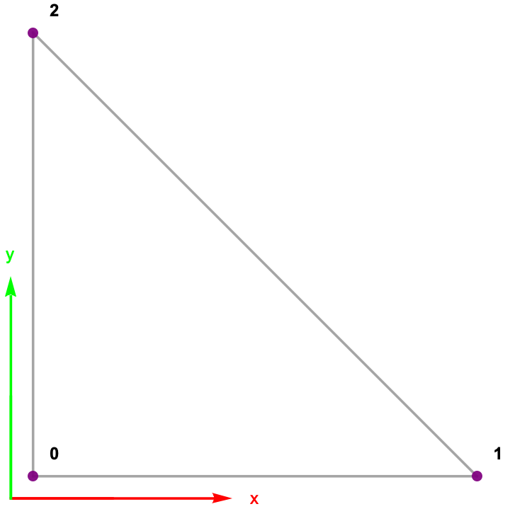{width=80%}|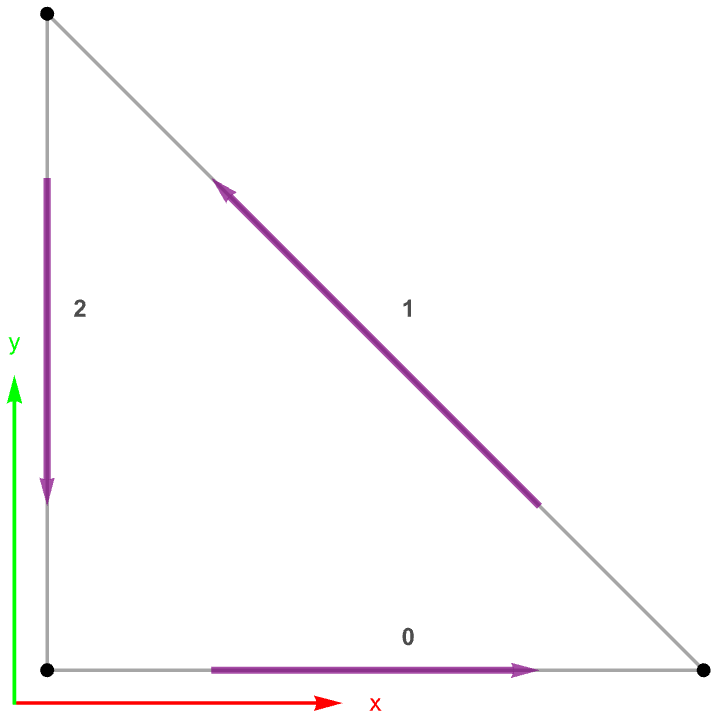{width=80%}|
|:--------:|:-----:|
| Vertices | Edges |

A `Triangle` element consists of three vertices in a 2D reference space:

|       |       |       |
|:-----:|:-----:|:-----:|
|   v0  |   v1  |   v2  |
| (0,0) | (1,0) | (0,1) |

The Edge-to-Vertex connectivity is:

|           |          |           |
|:---------:|:--------:|:---------:|
|     e0    |     e1   |     e2    |
| \{v0, v1} | \{v1, v2}| \{v2, v0} |

### `Square` Element

|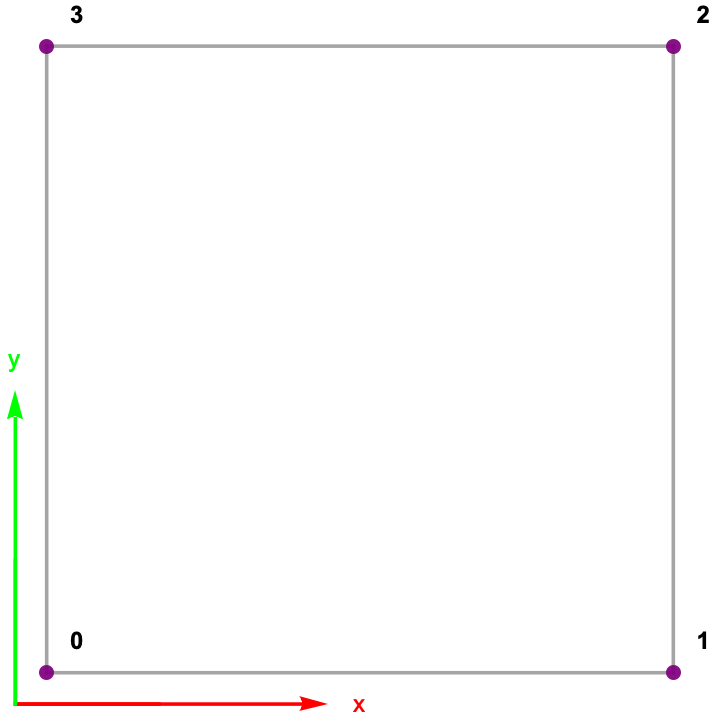{width=80%}|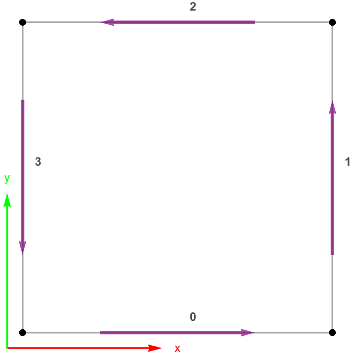{width=80%}|
|:--------:|:-----:|
| Vertices | Edges |

A `Square` element, a.k.a `Quadrilateral`, consists of four vertices in a 2D reference space:

|       |       |       |       |
|:-----:|:-----:|:-----:|:-----:|
|   v0  |   v1  |   v2  |   v3  |
| (0,0) | (1,0) | (1,1) | (0,1) |

The Edge-to-Vertex connectivity is:

|           |          |           |           |
|:---------:|:--------:|:---------:|:---------:|
|     e0    |     e1   |     e2    |     e3    |
| \{v0, v1} | \{v1, v2}| \{v2, v3} | \{v3, v0} |

## 3D Elements

Three dimensional elements can be used within the domain of 3D meshes.

### `Tetrahedron` Element

|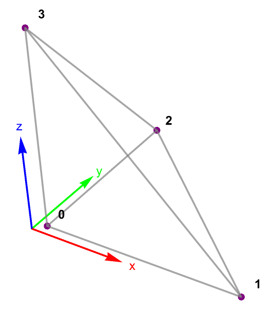|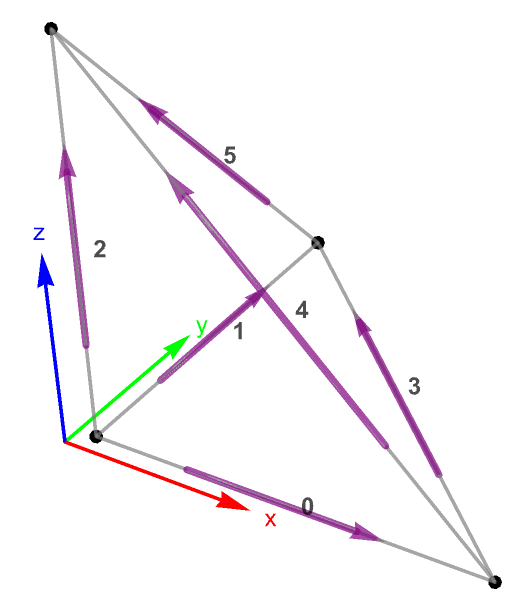|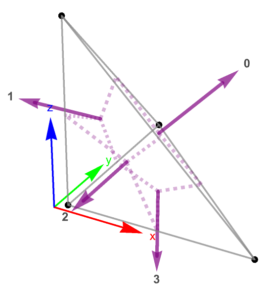|
|:--------:|:-----:|:-----:|
| Vertices | Edges | Faces |

A `Tetrahedron` element consists of four vertices in a 3D reference space:

|         |         |         |         |
|:-------:|:-------:|:-------:|:-------:|
|    v0   |    v1   |    v2   |    v3   |
| (0,0,0) | (1,0,0) | (0,1,0) | (0,0,1) |

The Edge-to-Vertex connectivity is:

|           |          |           |           |           |           |
|:---------:|:--------:|:---------:|:---------:|:---------:|:---------:|
|     e0    |     e1   |     e2    |     e3    |     e4    |     e5    |
| \{v0, v1} | \{v0, v2}| \{v0, v3} | \{v1, v2} | \{v1, v3} | \{v2, v3} |

The Face-to-Vertex connectivity is:

|               |               |               |               |
|:-------------:|:-------------:|:-------------:|:-------------:|
|       f0      |       f1      |       f2      |       f3      |
| \{v1, v2, v3} | \{v0, v3, v2} | \{v0, v1, v3} | \{v0, v2, v1} |

### `Cube` Element

|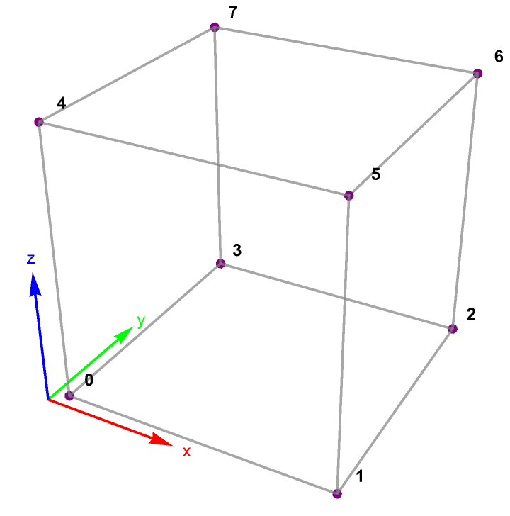{width=80%}|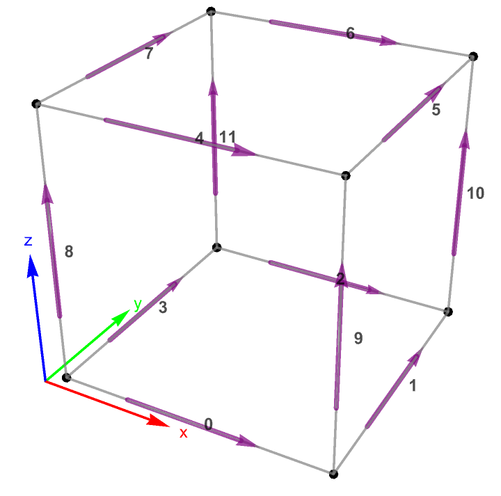{width=80%}|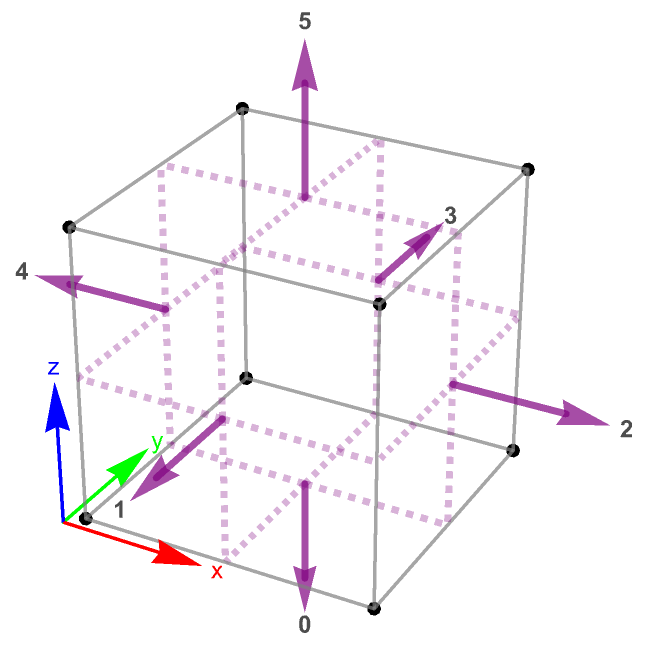|
|:--------:|:-----:|:-----:|
| Vertices | Edges | Faces |

A `Cube` element, a.k.a. `Hexahedron`, consists of eight vertices in a 3D
reference space:

|         |         |         |         |         |         |         |         |
|:-------:|:-------:|:-------:|:-------:|:-------:|:-------:|:-------:|:-------:|
|    v0   |    v1   |    v2   |    v3   |    v4   |    v5   |    v6   |    v7   |
| (0,0,0) | (1,0,0) | (1,1,0) | (0,1,0) | (0,0,1) | (1,0,1) | (1,1,1) | (0,1,1) |

The Edge-to-Vertex connectivity is:

|           |           |           |           |           |           |           |           |           |           |           |           |
|:---------:|:---------:|:---------:|:---------:|:---------:|:---------:|:---------:|:---------:|:---------:|:---------:|:---------:|:---------:|
|     e0    |     e1    |     e2    |     e3    |     e4    |     e5    |     e6    |     e7    |     e8    |     e9    |    e10    |    e11    |
| \{v0, v1} | \{v1, v2} | \{v3, v2} | \{v0, v3} | \{v4, v5} | \{v5, v6} | \{v7, v6} | \{v4, v7} | \{v0, v4} | \{v1, v5} | \{v2, v6} | \{v3, v7} |

The Face-to-Vertex connectivity is:

|                   |                   |                   |                   |                   |                   |
|:-----------------:|:-----------------:|:-----------------:|:-----------------:|:-----------------:|:-----------------:|
|         f0        |         f1        |         f2        |         f3        |         f4        |         f5        |
| \{v3, v2, v1, v0} | \{v0, v1, v5, v4} | \{v1, v2, v6, v5} | \{v2, v3, v7, v6} | \{v3, v0, v4, v7} | \{v4, v5, v6, v7} |

### `Prism` Element

|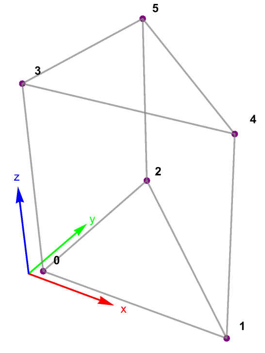{width=80%}|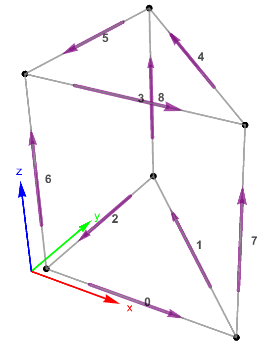{width=80%}|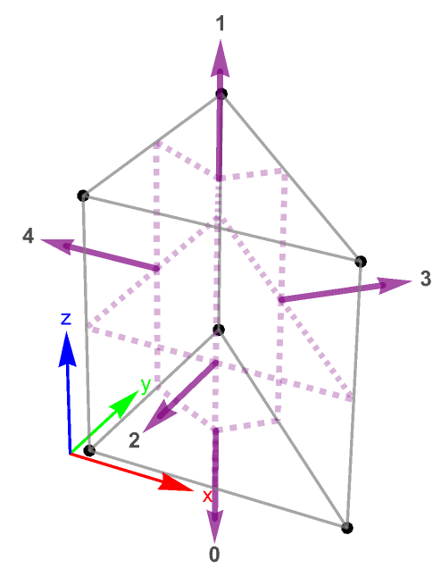|
|:--------:|:-----:|:-----:|
| Vertices | Edges | Faces |

A `Prism` element, a.k.a. `Wedge`, consists of six vertices in a 3D
reference space:

|         |         |         |         |         |         |
|:-------:|:-------:|:-------:|:-------:|:-------:|:-------:|
|    v0   |    v1   |    v2   |    v3   |    v4   |    v5   |
| (0,0,0) | (1,0,0) | (0,1,0) | (0,0,1) | (1,0,1) | (0,1,1) |

The Edge-to-Vertex connectivity is:

|           |           |           |           |           |           |           |           |           |
|:---------:|:---------:|:---------:|:---------:|:---------:|:---------:|:---------:|:---------:|:---------:|
|     e0    |     e1    |     e2    |     e3    |     e4    |     e5    |     e6    |     e7    |     e8    |
| \{v0, v1} | \{v1, v2} | \{v2, v0} | \{v3, v4} | \{v4, v5} | \{v5, v3} | \{v0, v3} | \{v1, v4} | \{v2, v5} |

The Face-to-Vertex connectivity is:

|               |               |               |               |               |
|:-------------:|:-------------:|:-------------:|:-------------:|:-------------:|
|       f0      |       f1      |         f2        |         f3        |         f4        |
| \{v0, v2, v1} | \{v3, v4, v5} | \{v0, v1, v4, v3} | \{v1, v2, v5, v4} | \{v2, v0, v3, v5} |

### `Pyramid` Element

|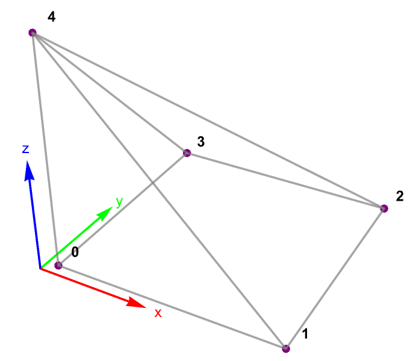{width=80%}|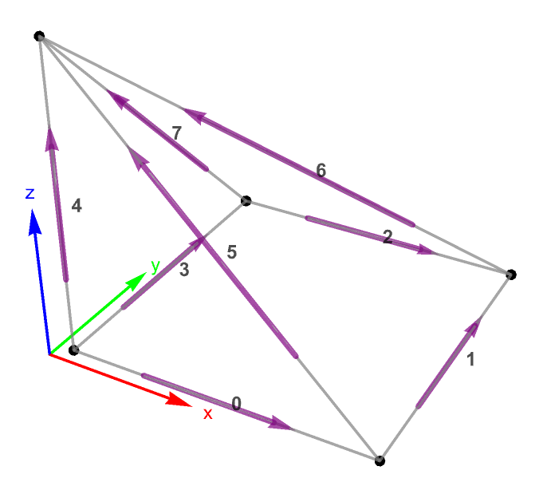{width=80%}|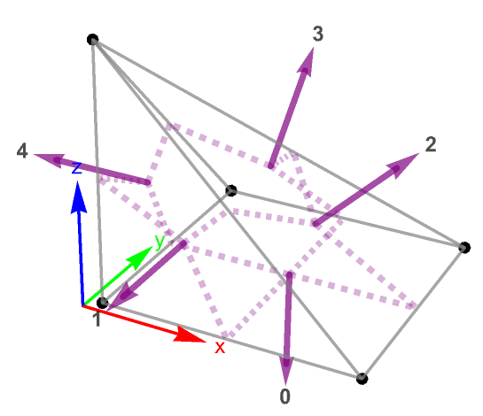|
|:--------:|:-----:|:-----:|
| Vertices | Edges | Faces |

A `Pyramid` element consists of five vertices in a 3D reference space:

|         |         |         |         |         |
|:-------:|:-------:|:-------:|:-------:|:-------:|
|    v0   |    v1   |    v2   |    v3   |    v4   |
| (0,0,0) | (1,0,0) | (1,1,0) | (0,1,0) | (0,0,1) |

The Edge-to-Vertex connectivity is:

|           |          |         |         |         |         |         |         |
|:---------:|:--------:|:-------:|:-------:|:-------:|:-------:|:-------:|:-------:|
|     e0    |     e1   |    e2   |    e3   |    e4   |    e5   |    e6   |    e7   |
| \{v0, v1} | \{v1, v2} | \{v3, v2} | \{v0, v3} | \{v0, v4} | \{v1, v4} | \{v2, v4} | \{v3, v4} |

The Face-to-Vertex connectivity is:

|                   |               |               |               |               |
|:-----------------:|:-------------:|:-------------:|:-------------:|:-------------:|
|         f0        |       f1      |       f2      |       f3      |       f4      |
| \{v3, v2, v1, v0} | \{v0, v1, v4} | \{v1, v2, v4} | \{v2, v3, v4} | \{v3, v0, v4} |

