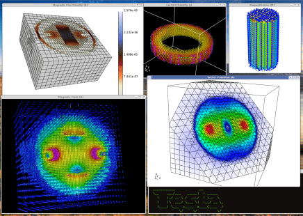
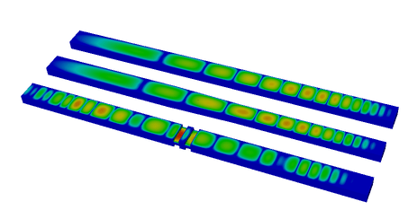
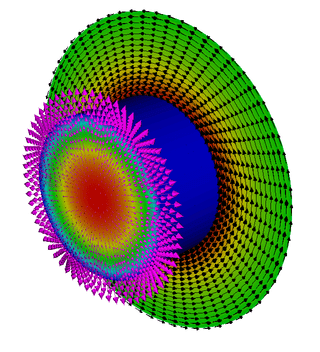

# Electromagnetics Mini Applications

$\newcommand{\A}{\vec{A}}\newcommand{\B}{\vec{B}}
\newcommand{\D}{\vec{D}}\newcommand{\E}{\vec{E}}
\newcommand{\H}{\vec{H}}\newcommand{\J}{\vec{J}}
\newcommand{\M}{\vec{M}}\newcommand{\P}{\vec{P}}
\newcommand{\F}{\vec{F}}
\newcommand{\dd}[2]{\frac{\partial #1}{\partial #2}}
\newcommand{\cross}{\times}\newcommand{\inner}{\cdot}
\newcommand{\div}{\nabla\cdot}\newcommand{\curl}{\nabla\times}
\newcommand{\grad}{\nabla}$

The `miniapps/electromagnetics` directory contains a collection of
electromagnetic miniapps based on MFEM.

Compared to the [example codes](examples.md), the miniapps are more complex,
demonstrating more advanced usage of the library. They are intended to be more
representative of MFEM-based application codes. We recommend that new users
start with the example codes before moving to the miniapps.

The current electromagnetic miniapps are described below.

## Electromagnetics

The equations describing electromagnetic phenomena are known collectively as
the Maxwell Equations. They are usually given as:

  $$\begin{align}
    \curl\H - \dd{\D}{t} & = \J    \label{ampere}  \\\\
    \curl\E + \dd{\B}{t} & = 0     \label{faraday} \\\\
                  \div\D & = \rho  \label{gauss}   \\\\
                  \div\B & = 0     \label{divb}
  \end{align}$$

Where equation \eqref{ampere} can be referred to as *Ampère's Law*, equation
\eqref{faraday} is called *Faraday's Law*, equation \eqref{gauss} is *Gauss's
Law*, and equation \eqref{divb} doesn't generally have a name but is related to
the nonexistence of magnetic monopoles. The various fields in these equations
are:

  Symbol | Name                  | SI Units
 --------|-----------------------|-------------------
  $\H$   | magnetic field        | Ampere/meter
  $\B$   | magnetic flux density | Tesla
  $\E$   | electric field        | Volt/meter
  $\D$   | electric displacement | Coulomb/meter$^2$
  $\J$   | current density       | Ampere/meter$^2$
  $\rho$ | charge density        | Coulomb/meter$^3$

In the literature these names do vary, particularly those for $\H$ and $\B$,
but in this document we will try to adhere to the convention laid out above.

Generally we also need constitutive relations between $\E$ and $\D$ and/or
between $\H$ and $\B$. These relations start with the definitions:

  $$\begin{align}
    \D & = \epsilon_0\E + \P \label{const_d}  \\\\
    \B & = \mu_0(\H + \M)    \label{const_b}
  \end{align}$$

Where $\P$ is the *polarization density*, and $\M$ is the *magnetization*.
Also, $\epsilon_0$ is the *permittivity of free space* and $\mu_0$ is the
*permeability of free space* which are both constants of nature. In many common
materials the polarization density can be approximated as a scalar multiple of
the electric field, i.e., $\P = \epsilon_0\chi\E$, where $\chi$ is called the
*electric susceptibility*. In such cases we usually use the relation $\D =
\epsilon\E$ with $\epsilon = \epsilon_0(1 + \chi)$ and call $\epsilon$ the
*permittivity* of the material.

The nature of magnetization is more complicated but we will take a very
simplified view which is valid in many situations. Specifically, we will assume
that either $\M$ is proportional to $\H$ yielding the relation $\B = \mu\H$
where $\mu = \mu_0(1 + \chi_M)$ and $\chi_M$ is the *magnetic susceptibility*
or that $\M$ is independent of the applied field. The former case pertains to
both diamagnetic and paramagnetic materials and the latter to ferromagnetic
materials.

Finally we should note that equations \eqref{ampere} and \eqref{gauss} can be
combined to yield the equation of charge continuity $\dd{\rho}{t} + \div\J = 0$
which can be important in plasma physics and magnetohydrodynamics (MHD).

## Electrostatics

Electrostatic problems come in a variety of subtypes but they all derive from
Gauss's Law and Faraday's Law (equations \eqref{gauss} and \eqref{faraday}).
When we assume no time variation, Faraday's Law becomes simply $\curl\E = 0$.
This suggests that the electric field can be expressed as the gradient of a
scalar field which is traditionally taken to be $-\varphi$, i.e.

  $$\E = -\grad\varphi   \label{gradphi}$$

where $\varphi$ is called the *electric potential* and has units of Volts in
the SI system. Inserting this definition into equation \eqref{gauss} gives:

  $$-\div\epsilon\grad\varphi = \rho - \div\P   \label{poisson}$$

which is *Poisson's equation* for the electric potential, where we have assumed
a linear constitutive relation between $\D$ and $\E$ of the form $\D =
\epsilon\E + \P$. This allows a polarization which is proportional to $\E$ as
well as a polarization independent of $\E$. If this relation happens to be
nonlinear then Poisson's equation would need to be replaced with a more
complicated nonlinear expression.

The solutions to equation \eqref{poisson} are non unique because they can be
shifted by any additive constant. This means that we must apply a Dirichlet
boundary condition at least at one point in the problem domain in order to
obtain a solution. Typically this point will be on the boundary but it need not
be so. Such a Dirichlet value is equivalent to fixing the voltage (a.k.a.
potential) at one or more locations. Additionally, this equation admits a normal
derivative boundary condition. This corresponds to setting $\hat{n}\cdot\D$ to a
prescribed value on some portion of the boundary. This is equivalent to defining
a surface charge density on that portion of the boundary.

### Volta Mini Application

The electrostatics mini application, named `volta` after the inventor of the
[voltaic pile](http://en.wikipedia.org/wiki/Voltaic_pile), is intended to
demonstrate how to solve standard electrostatics problems in MFEM. Its source
terms and boundary conditions are simple but they should indicate how more
specialized sources or boundary conditions could be implemented.

Note that this application assumes the mesh coordinates are given in meters.

#### Mini Application Features

**Permittivity:** The permittivity, $\epsilon$, is assumed to be that of free
  space except for an optional sphere of dielectric material which can be
  defined by the user. The command line option `-ds` can be used to set the
  parameters for this dielectric sphere. For example, to produce a sphere at the
  origin with a radius of 0.5 and a relative permittivity of 3 the user would
  specify: `-ds '0 0 0 0.5 3'`.

**Charge Density:** The charge density, $\rho$, is assumed to be zero except for
  an optional sphere of uniform charge density which can be defined by the user.
  The command line option for this is `-cs` which follows the same pattern as
  the dielectric sphere. Note that the last entry is the total charge of the
  sphere and not its charge density.

**Polarization:** A polarization vector function, $\P$, can be imposed as a
  source of the electric field. The command line option `-vp` creates a
  polarization due to a simple voltaic pile, i.e., a cylinder which is
  electrically polarized along its axis. The user should specify the two end
  points of the cylinder axis, its radius and the magnitude of the polarization
  vector.

**Dirichlet BC:** Dirichlet boundary conditions can either specify piecewise
  constant voltages on a collection of surfaces or they can specify a gradient
  field which approximates a uniform applied electric field. In either case the
  user specifies the surfaces where the Dirichlet boundary condition should be
  applied using the `-dbcs` option followed by a list of boundary attributes.
  For example to select surfaces 2, 3, and 4 the user would use the following:
  `-dbcs '2 3 4'`.

  To apply a gradient field on these surfaces the user would also use the
  `-dbcg` option. This defaults to the uniform field $\E = (0,0,1)$ in 3D or
  $\E = (0,1)$ in 2D. An arbitrary vector can be specified with `-uebc`
  followed by the desired vector, e.g., to apply $\E = (1,2,3)$ the user would
  supply: `-uebc '1 2 3'`.

  To specify piecewise constant potential values the user would list the
  desired values after `-dbcv` as follows: `-dbcv '0.0 1.0 -1.0'`.

**Neumann BC:** Neumann boundary conditions set the normal component of the
  electric displacement on portions of the boundary. This normal component is
  equivalent to the surface charge density on the surface. This is rarely used
  because surface charge densities are rarely known unless they are known to be
  zero. However, if the surface charge density is zero then the Neumann BCs are
  not needed because this is the natural boundary condition. Only piecewise
  constant Neumann boundary conditions are supported. They can be set
  analogously to piecewise Dirichlet boundary conditions but using options
  `-nbcs` and `-nbcv`.

## Magnetostatics

Magnetostatic problems arise when we assume no time variation in Ampère's Law
\eqref{ampere} which leads to:

  $$\curl\H = \J   \nonumber$$

We will again assume a somewhat more general constitutive relation between $\H$
and $\vec{B}$ than is normally seen:

  $$\B = \mu\H + \mu_0\M = \mu_0(1 + \chi_M)\H + \mu_0\M   \nonumber$$

Where the magnetization is split into two portions; one which is proportional
to $\H$ and given by $\chi_M\H$, and another which is independent of $\H$ and
is given by $\M$. This allows for paramagnetic and/or diamagnetic materials
defined through $\mu$ as well as ferromagnetic materials represented by $\M$.
This choice yields:

  $$\curl\mu^{-1}\B = \J + \curl\mu^{-1}\mu_0\M   \nonumber$$

Which, when combined with equation \eqref{divb}, becomes:

  $$\curl\mu^{-1}\curl\A = \J + \curl\mu^{-1}\mu_0\M $$

If $\J$ happens to be zero we have another option because we can assume that
$\H = -\grad\varphi_M$ for some scalar potential $\varphi_M$. When combined
with equation \eqref{divb} this leads to:

  $$\div\mu\grad\varphi_M = \div\mu_0\M $$

Currently only the vector potential equation is used so we will focus on that
for the remainder of this document.

The vector potential is again non unique so we must apply additional
constraints in order to arrive at a solution for $\A$. When working
analytically it is common to constrain the solution by restricting the
divergence of $\A$ but numerically this leads to other complications. For our
problems of interest it will be necessary to require Dirichlet boundary
conditions on the entire outer surface in order to sufficiently constrain the
solution.

Dirichlet boundary conditions for the vector potential on a surface provide a
means to specify the component of $\B$ normal to that surface. For example,
setting the tangential components of $\A$ to be zero on a particular surface
results in a magnetic flux density which must be tangent to that surface.

### Tesla Mini Application

The magnetostatics mini application, named `tesla` after the unit of magnetic
field strength (and of course the man Nikola Tesla), is intended to demonstrate
how to solve standard magnetostatics problems in MFEM. Its source terms and
boundary conditions are simple but they should indicate how more specialized
sources of boundary conditions could be implemented.

Note that this application assumes the mesh coordinates are given in meters.

#### Mini Application Features

**Permeability:** The permeability, $\mu$, is assumed to be that of free space
  except for an optional spherical shell of diamagnetic or paramagnetic material
  which can be defined by the user. The command line option `-ms` can be used to
  set the parameters for this shell.

  For example, to produce a shell at the origin with inner and outer radii of
  0.4 and 0.5 respectively and a relative permeability of 3 the user would
  specify: `-ms '0 0 0 0.4 0.5 3'`.

**Current Density:** The current density, $\J$, is assumed to be zero except for
  an optional ring of constant current which can be defined by the user. The
  command line option for this is `-cr` which requires two points giving the end
  points of the ring's axis, inner and outer radii, and a constant total
  current.

  For example, to specify a ring centered at the origin and laying in the XY
  plane with a thickness of 0.2 and radii 0.4 and 0.5, and a current of 2 amps
  the user would give: `-cr 0 0 -0.1 0 0 0.1 0.4 0.5 2`.

**Magnetization:** A permanent magnetization, $\M$, can be applied in the form
  of a cylindrical magnet with poles at its circular ends. The command line
  option is `-bm` which indicates a 'bar magnet'. The option requires the two
  end points of the cylinder's axis, its radius, and the magnitude of the
  magnetization.

**Surface Current Density:** A surface current can be imposed indirectly by
  specifying separate surface patches with different voltages as well as a
  collection of surface patches connecting the voltages through which the
  current will flow. The voltage surfaces and their voltages can be specified
  using `-vbcs` followed by the indices of the surfaces and `-vbcv` followed by
  their voltages. The path for the surface current ($\vec{K}$) is specified by
  using `-kbcs` followed by a set of surface indices.

  For example, applying voltages 1 and -1 to surfaces 2 and 3 with a current
  path along surfaces 4 and 6 would be specified as:
  `-vbcs '2 3' -vbcv '1 -1' -kbcs '4 6'`.

  Any surfaces not listed as voltage or current surfaces will be assigned as
  homogeneous Dirichlet boundaries. Note that when this option is selected an
  auxiliary electrostatic problem will be solved on the surface of the
  geometry to compute the surface current.

**Dirichlet BC:** Dirichlet boundary conditions are required if a surface
  current density is not defined. For this reason the user need not specify
  boundary surfaces by number since the boundary condition must be applied on
  all of them. The default boundary condition is a homogeneous Dirichlet
  boundary condition on all outer surfaces. This means that the normal
  component of $\B$ will be zero at the outer boundary. An alternative is to
  specify a desired uniform magnetic flux density on the entire outer surface.
  This is accomplished with the `-ubbc` command line option followed by the
  desired $\B$ vector.

## Transient Full-Wave Electromagnetics

Transient electromagnetics problems are governed by the time-dependent
Maxwell equations \eqref{ampere} and \eqref{faraday} when combined
using the constitutive relations \eqref{const_d} and \eqref{const_b}.
When combined these equations can describe the evolution and
propagation of electromagnetic waves.

  $$\begin{align}
    \dd{(\epsilon\E)}{t} & =   \curl(\mu^{-1}\B) - \sigma \E - \J  \\\\
    \dd{\B}{t}           & = - \curl\E
  \end{align}$$

The term $\sigma\E$ arises in the presence of electrically conductive
materials where the electric field induces a current which can be
separated from $\J$.  In such cases the total current appearing in
Ampère's Law \eqref{ampere} can be expressed as the sum of an applied
current (also labeled as $\J$) and an induced current $\sigma\E$.

Solving these equations requires initial conditions for both the
electric and magnetic fields $\E$ and $\B$ as well as boundary
conditions related to the tangential components of $\E$ or $\H$.
Other formulations are possible such as evolving $\H$ and $\D$ or the
potentials $\varphi$ and $\A$.  This system of equations can also be
written as a single second order equation involving only $\E$, $\H$,
$\varphi$, or $\A$.  Each of these formulations has a different set of
sources, initial and boundary conditions for which it is well-suited.
The choice we make here is perhaps the most common but it may not be
the most convenient choice for a given application.

These equations can be used to evolve their initial conditions or they
can be driven by either a current source or through time-varying
boundary conditions.  It is also possible to combine all three of
these sources in a single simulation.

### Maxwell Mini Application

The electrodynamics mini application, named `maxwell` after James Clerk Maxwell
who first formulated the classical theory of electromagnetic radiation, is
intended to demonstrate how to solve transient wave problems in MFEM. Its source
terms and boundary conditions are simple but they should indicate how more
specialized sources or boundary conditions could be implemented.

An example simulation is depicted below (click to animate the wave propagation).

Time integration is handled by a variable order symplectic time integration
algorithm.  This algorithm is designed for systems of equations which are
derived from a Hamiltonian and it helps to ensure energy conservation within
some tolerance.  The time step used during integration is automatically chosen
based on the largest stable time step as computed from the largest eigenvalue of
the update equations.  This determination involves a user-adjustable factor
which creates a safety margin.  By default the actual time step is less than 95%
of the estimate for the largest stable time step.

Note that this application assumes the mesh coordinates are given in meters.
Internally the code assumes time is in seconds but the command line options use
nanoseconds for convenience.

#### Mini Application Features

**Time Evolution:** The initial and final times for the simulation can be
  specified, in nanoseconds, with the `-ti` and `-tf` options.  Visualization
  snapshots of data will be written out after time intervals specified by `-ts`
  which again given in nanoseconds.  The order of the time integration can be
  specified, from 1 to 4, using the `-to` option.

**Permittivity:** The permittivity, $\epsilon$, is assumed to be that of free
  space except for an optional sphere of dielectric material which can be
  defined by the user. The command line option `-ds` can be used to set the
  parameters for this dielectric sphere. For example, to produce a sphere at the
  origin with a radius of 0.5 and a relative permittivity of 3 the user would
  specify: `-ds '0 0 0 0.5 3'`.

**Permeability:** The permeability, $\mu$, is assumed to be that of free space
  except for an optional spherical shell of diamagnetic or paramagnetic material
  which can be defined by the user. The command line option `-ms` can be used to
  set the parameters for this shell.

  For example, to produce a shell at the origin with inner and outer radii of
  0.4 and 0.5 respectively and a relative permeability of 3 the user would
  specify: `-ms '0 0 0 0.4 0.5 3'`.

**Conductivity:** The conductivity, $\sigma$, is assumed to be zero except for
  an optional sphere of conductive material which can be defined by the user.
  The command line option `-cs` can be used to set the parameters for this
  conductive sphere. For example, to produce a sphere at the origin with a
  radius of 0.5 and a conductivity of 3,000,000 S/m the user would specify: `-cs
  '0 0 0 0.5 3e6'`.

**Current Density:** The current density, $\J$, is assumed to be zero except for
  an optional cylinder of pulsed current which can be defined by the user.  The
  command line option for this is `-dp`, short for 'dipole pulse', which
  requires two points giving the end points of the cylinder's axis, radius,
  amplitude ($\alpha$), pulse center ($\beta$), and a pulse width ($\gamma$).
  The time dependence of this pulse is given by: $$\J(t) = \hat{a} \alpha
  e^{-(t-\beta)^2/(2\gamma^2)}$$ Where $\hat{a}$ is the unit vector along the
  cylinder's axis and both $\beta$ and $\gamma$ are specified in nanoseconds.

**Dirichlet BC:** Homogeneous Dirichlet boundary conditions, which constrain the
  tangential components of $\frac{\partial\E}{\partial t}$ to be zero, can be
  activated on a portion of the boundary by specifying a list of boundary
  attributes such as `-dbcs '4 8'`.  For convenience a boundary attribute of
  '-1' can be used to specify all boundary surfaces.  Non-Homogeneous,
  time-dependent Dirichlet boundary conditions are supported by the Maxwell
  solver so a user can edit `maxwell.cpp` and supply their own function if
  desired.

**Absorbing BC:** A first order Sommerfeld absorbing boundary condition can be
  applied to a portion of the boundary using the `-abcs` option along with a
  list of boundary attributes such as `-abcs '4 18'`.  Again, the special
  purpose boundary attribute '-1' can be used to specify all boundary surfaces.
  This boundary condition depends on a coefficient,
  $\eta^{-1}=\sqrt{\epsilon/\mu}$, which must be matched to the materials just
  inside the boundary.  The code assumes that the permittivity and permeability
  are those of the vacuum near the surface but, if this is not the case, an
  ambitious user can replace `etaInvCoef_` with a more appropriate function.

## Transient Magnetics and Joule Heating

### Joule Mini Application

The transient magnetics mini application, named `joule` after the SI unit of energy (and the
scientist James Prescott Joule, who was also a brewer), is intended to demonstrate how to solve
transient implicit diffusion problems. The equations of low-frequency electromagnetics are coupled
with the equations of heat transfer. The coupling is one way, electromagnetics generates Joule
heating, but the heating does not affect the electromagnetics.  The thermal problem
is solved using an $H(\\mathrm{div})$ method, i.e. temperature is discontinuous and the
thermal flux $\F$ is in $H(\\mathrm{div})$.
There are three linear solves per time step:

1. Poisson's equation for the scalar electric potential is solved using the AMG
 preconditioner,
2. the electric diffusion equation is solved using the AMS preconditioner, and
3. the thermal diffusion equation is solved using the ADS preconditioner.

Two example meshes are provided, one is a straight circular metal rod in vacuum, the other is a helical
coil in vacuum (the latter is 21MB and can be downloaded from [here](https://github.com/mfem/data/blob/master/coil.gen)).
The idea is that a voltage is applied to the ends of the rod/coil, the electric field diffuses
into the metal, the metal is heated by Joule heating, the heat diffuses out.

The equations are:

  $$\begin{align}
    \div\sigma\grad\Phi &= 0 \\\\
    \sigma \E &= \curl\mu^{-1} \B - \sigma \grad \Phi \\\\
    \frac{d \B}{d t} &= - \curl \E \\\\
    \F &= -k \grad T \\\\
    c \frac{d T}{d t} &= - \div \F + \sigma \E \cdot \E
  \end{align}$$

The equations are integrated in time using implicit time integration, either midpoint or
higher order SDIRK.

Since there are three solves,  three sets of boundary conditions must be specified. The
essential BC's are the scalar potential, the electric field, and the thermal flux. These are not
set via command line arguments, you have to edit the code to change these. To change these,
search the code for `ess_bdr`.

There are conducting and non-conducting material regions, and the mesh must have integer attributes
to specify these regions. To change these, search the code for `std::map<int, double>` this maps the
integer attribute to the floating-point material value.

Note that this application assumes the mesh coordinates are given in meters.

The above picture shows Joule heating of a cylinder using the mesh `cylinder-hex.mesh`. The cylinder is
surrounded by vacuum. The black arrows show the magnetic field $\B$, the magenta arrows show the heat
flux $\F$, and the pseudocolor in the center of the cylinder shows the temperature.

#### Mini Application Features

**Boundary Conditions:** Since there are three solves,  three sets of boundary conditions must be specified. The
essential BC's are the voltage for the scalar potential, the tangential electric field, and the normal thermal flux.
These are not
set via command line arguments, you have to edit the code to change these. To change these,
search the code for `ess_bdr`. Note that the essential BC's can be time varying.

**Material Properties:** There are conducting and non-conducting material regions, and the mesh must have integer attributes
to specify these regions. To change these, search the code for `std::map<int, double>` this maps the
integer attribute to the floating-point material value.

