

# Example Codes and Miniapps

This page provides a brief overview of MFEM's example codes and miniapps. For
detailed documentation of the MFEM sources, including the examples, see the
[online Doxygen documentation](https://docs.mfem.org),
or the `doc` directory in the distribution.

The goal of the example codes is to provide a step-by-step introduction to MFEM
in simple model settings. The miniapps are more complex, and are intended to be
more representative of the advanced usage of the library in physics/application
codes. We recommend that new users start with the example codes before moving to
the miniapps.

Select from the categories below to display examples and miniapps that contain the
respective feature. _All examples support (arbitrarily) high-order meshes and
finite element spaces_.
The numerical results from the example codes can be visualized using the
GLVis visualization tool (based on MFEM). See the
[GLVis website](https://glvis.org) for more details.

Users are encouraged to submit any example codes and miniapps that they have created and
would like to share.  
_Contact a member of the MFEM team to report
[bugs](https://github.com/mfem/mfem/issues/new?labels=bug)
or post [questions](https://github.com/mfem/mfem/issues/new?labels=question) or [comments](https://github.com/mfem/mfem/issues/new?labels=comment)_.

   <h5><strong>Application (PDE)</strong></h5>
   <select id="group1" onchange="update()">
      <option id="all1">All</option>
      <option id="diffusion">Diffusion</option>
      <option id="elasticity">Elasticity</option>
      <option id="maxwell">Electromagnetics</option>
      <option id="graddiv">grad-div</option>
      <option id="darcy">Darcy</option>
      <option id="advection">Advection</option>
      <option id="conduction">Conduction</option>
      <option id="wave">Wave</option>
      <option id="compressibleflow">Compressible flow</option>
      <option id="incompressibleflow">Incompressible flow</option>
      <option id="meshing">Meshing</option>
      <option id="nonlocal">Nonlocal models</option>
   </select>

   <h5><strong>Finite Elements</strong></h5>
   <select id="group2" onchange="update()">
      <option id="all2">All</option>
      <option id="h1">H1 nodal elements</option>
      <option id="l2">L2 discontinuous elements</option>
      <option id="hcurl">H(curl) Nedelec elements</option>
      <option id="hdiv">H(div) Raviart-Thomas elements</option>
      <option id="h12">H^{-1/2} interfacial elements</option>
   </select>

   <h5><strong>Discretization</strong></h5>
   <select id="group3" onchange="update()">
      <option id="all3">All</option>
      <option id="galerkin">Galerkin FEM</option>
      <option id="mixed">Mixed FEM</option>
      <option id="dg">Discontinuous Galerkin (DG)</option>
      <option id="dpg">Discont. Petrov-Galerkin (DPG)</option>
      <option id="hybr">Hybridization</option>
      <option id="staticcond">Static condensation</option>
      <option id="nurbs">Isogeometric analysis (NURBS)</option>
      <option id="amr">Adaptive mesh refinement (AMR)</option>
      <option id="pa">Partial assembly</option>
   </select>

   <h5><strong>Solver</strong></h5>
   <select id="group4" onchange="update()">
      <option id="all4">All</option>
      <option id="jacobi">Jacobi</option>
      <option id="gs">Gauss-Seidel</option>
      <option id="pcg">PCG</option>
      <option id="minres">MINRES</option>
      <option id="gmres">GMRES</option>
      <option id="amg">Algebraic Multigrid (BoomerAMG)</option>
      <option id="ams">Auxiliary-space Maxwell Solver (AMS)</option>
      <option id="ads">Auxiliary-space Divergence Solver (ADS)</option>
      <option id="superlu">SuperLU/STRUMPACK (parallel direct)</option>
      <option id="umfpack">UMFPACK (serial direct)</option>
      <option id="newton">Newton method (nonlinear solver)</option>
      <option id="rk">Explicit Runge-Kutta (ODE integration)</option>
      <option id="sdirk">Implicit Runge-Kutta (ODE integration)</option>
      <option id="newmark">Newmark (ODE Integration)</option>
      <option id="symplectic">Symplectic Algorithm (ODE Integration)</option>
      <option id="lobpcg">LOBPCG, AME (eigensolvers)</option>
      <option id="sundials">SUNDIALS solvers</option>
      <option id="petsc">PETSc solvers</option>
      <option id="slepc">SLEPc eigensolvers</option>
      <option id="hiop">HiOp solvers</option>
   </select>

 

<!-- ------------------------------------------------------------------------- -->

##Example 0: Simplest Laplace Problem

This is the simplest MFEM example and a good starting point for new users.
The example demonstrates the use of MFEM to define and solve an $H^1$ finite
element discretization of the Laplace problem
$$-\Delta u = 1 \quad\text{in } \Omega$$
with homogeneous Dirichlet boundary conditions
$$ u = 0 \quad\text{on } \partial\Omega$$

The example illustrates the use of the basic MFEM classes for defining the mesh,
finite element space, as well as linear and bilinear forms corresponding to the
left-hand side and right-hand side of the discrete linear system.

_The example has serial ([ex0.cpp](https://github.com/mfem/mfem/blob/master/examples/ex0.cpp))
and parallel ([ex0p.cpp](https://github.com/mfem/mfem/blob/master/examples/ex0p.cpp))
versions._

 

##Example 1: Laplace Problem

This example code demonstrates the use of MFEM to define a simple isoparametric
finite element discretization of the Laplace problem $$-\Delta u = 1$$ with
homogeneous Dirichlet boundary conditions. Specifically, we discretize with the
finite element space coming from the mesh (linear by default, quadratic for
quadratic curvilinear mesh, NURBS for NURBS mesh, etc.) The problem solved in
this example is the same as [ex0](#ex0), but with more sophisticated options and
features.

The example highlights the use of mesh refinement, finite element grid
functions, as well as linear and bilinear forms corresponding to the left-hand
side and right-hand side of the discrete linear system. We also cover the
explicit elimination of essential boundary conditions, static condensation, and
the optional connection to the [GLVis](https://glvis.org) tool for visualization.

_The example has a serial ([ex1.cpp](https://github.com/mfem/mfem/blob/master/examples/ex1.cpp)),
a parallel ([ex1p.cpp](https://github.com/mfem/mfem/blob/master/examples/ex1p.cpp)),
and HPC versions: [performance/ex1.cpp](https://github.com/mfem/mfem/blob/master/miniapps/performance/ex1.cpp),
[performance/ex1p.cpp](https://github.com/mfem/mfem/blob/master/miniapps/performance/ex1p.cpp).
It also has a PETSc modification in [examples/petsc](https://github.com/mfem/mfem/blob/master/examples/petsc)
, a PUMI modification in [examples/pumi](https://github.com/mfem/mfem/blob/master/examples/pumi) and a Ginkgo modification
in [examples/ginkgo](https://github.com/mfem/mfem/tree/master/examples/ginkgo).
Partial assembly and [GPU devices](gpu-support.md) are supported._

 

##Example 2: Linear Elasticity

This example code solves a simple linear elasticity problem
describing a multi-material cantilever beam.
Specifically, we approximate the weak form of
$$-{\rm div}({\sigma}({\bf u})) = 0$$
where
$${\sigma}({\bf u}) = \lambda\, {\rm div}({\bf u})\,I + \mu\,(\nabla{\bf u} + \nabla{\bf u}^T)$$
is the stress tensor corresponding to displacement field ${\bf u}$, and $\lambda$ and $\mu$
are the material Lame constants. The boundary conditions are
${\bf u}=0$ on the fixed part of the boundary with attribute 1, and
${\sigma}({\bf u})\cdot n = f$ on the remainder with $f$ being
a constant pull down vector on boundary elements with attribute 2, and zero
otherwise. The geometry of the domain is assumed to be as follows:

The example demonstrates the use of high-order and NURBS vector
finite element spaces with the linear elasticity bilinear form,
meshes with curved elements, and the definition of piece-wise
constant and vector coefficient objects. Static condensation is
also illustrated.

_The example has a serial ([ex2.cpp](https://github.com/mfem/mfem/blob/master/examples/ex2.cpp))
and a parallel ([ex2p.cpp](https://github.com/mfem/mfem/blob/master/examples/ex2p.cpp)) version.
It also has a PETSc modification in [examples/petsc](https://github.com/mfem/mfem/blob/master/examples/petsc)
and a PUMI modification in [examples/pumi](https://github.com/mfem/mfem/blob/master/examples/pumi).
We recommend viewing Example 1 before viewing this example._

 

##Example 3: Definite Maxwell Problem

This example code solves a simple 3D electromagnetic diffusion
problem corresponding to the second order definite Maxwell
equation $$\nabla\times\nabla\times\, E + E = f$$
with boundary condition $ E \times n $ = "given tangential field".
Here, we use a given exact solution $E$ and compute the corresponding r.h.s.
$f$. We discretize with Nedelec finite elements in 2D or 3D.

The example demonstrates the use of $H(curl)$ finite element
spaces with the curl-curl and the (vector finite element) mass
bilinear form, as well as the computation of discretization
error when the exact solution is known. Static condensation is
also illustrated.

_The example has a serial ([ex3.cpp](https://github.com/mfem/mfem/blob/master/examples/ex3.cpp))
and a parallel ([ex3p.cpp](https://github.com/mfem/mfem/blob/master/examples/ex3p.cpp)) version.
It also has a PETSc modification in [examples/petsc](https://github.com/mfem/mfem/blob/master/examples/petsc).
Partial assembly and [GPU devices](gpu-support.md) are supported.
We recommend viewing examples 1-2 before viewing this example._

 

##Example 4: Grad-div Problem

This example code solves a simple 2D/3D $H(div)$
diffusion problem corresponding to the second order definite equation
$$-{\rm grad}(\alpha\,{\rm div}(F)) + \beta F = f$$
with boundary condition $F \cdot n$ = "given normal field".
Here we use a given exact solution $F$ and compute the corresponding
right hand side $f$.  We discretize with the Raviart-Thomas finite elements.

The example demonstrates the use of $H(div)$
finite element spaces with the grad-div and $H(div)$
vector finite element mass bilinear form, as well as the computation of discretization
error when the exact solution is known.
Bilinear form hybridization and static condensation are also illustrated.

_The example has a serial ([ex4.cpp](https://github.com/mfem/mfem/blob/master/examples/ex4.cpp))
and a parallel ([ex4p.cpp](https://github.com/mfem/mfem/blob/master/examples/ex4p.cpp)) version.
It also has a PETSc modification in [examples/petsc](https://github.com/mfem/mfem/blob/master/examples/petsc).
Partial assembly and [GPU devices](gpu-support.md) are supported.
We recommend viewing examples 1-3 before viewing this example._

 

##Example 5: Darcy Problem

This example code solves a simple 2D/3D mixed Darcy problem
corresponding to the saddle point system
$$ \begin{array}{rcl}
   k\,{\bf u} + {\rm grad}\,p &=& f \\\\
   -{\rm div}\,{\bf u} &=& g
\end{array} $$
with natural boundary condition $-p = $ "given pressure".
Here we use a given exact solution $({\bf u},p)$ and compute the
corresponding right hand side $(f, g)$. We discretize with Raviart-Thomas
finite elements (velocity $\bf u$) and piecewise discontinuous
polynomials (pressure $p$).

The example demonstrates the use of the BlockMatrix and BlockOperator
classes, as well as the collective saving of several grid functions in
[VisIt](https://visit.llnl.gov) and [ParaView](https://www.paraview.org)
formats.

_The example has a serial ([ex5.cpp](https://github.com/mfem/mfem/blob/master/examples/ex5.cpp))
and a parallel ([ex5p.cpp](https://github.com/mfem/mfem/blob/master/examples/ex5p.cpp)) version.
It also has a PETSc modification in [examples/petsc](https://github.com/mfem/mfem/blob/master/examples/petsc).
Partial assembly is supported.
We recommend viewing examples 1-4 before viewing this example._

 

##Example 6: Laplace Problem with AMR

This is a version of Example 1 with a simple adaptive mesh
refinement loop. The problem being solved is again the Laplace
equation $$-\Delta u = 1$$ with homogeneous Dirichlet boundary
conditions. The problem is solved on a sequence of meshes which
are locally refined in a conforming (triangles, tetrahedrons)
or non-conforming (quadrilaterals, hexahedra) manner according
to a simple ZZ error estimator.

The example demonstrates MFEM's capability to work with both
conforming and nonconforming refinements, in 2D and 3D, on
linear, curved and surface meshes. Interpolation of functions
from coarse to fine meshes, as well as persistent [GLVis](https://glvis.org)
visualization are also illustrated.

_The example has a serial ([ex6.cpp](https://github.com/mfem/mfem/blob/master/examples/ex6.cpp))
and a parallel ([ex6p.cpp](https://github.com/mfem/mfem/blob/master/examples/ex6p.cpp)) version.
It also has a PETSc modification in [examples/petsc](https://github.com/mfem/mfem/blob/master/examples/petsc)
and a PUMI modification in [examples/pumi](https://github.com/mfem/mfem/blob/master/examples/pumi).
Partial assembly and [GPU devices](gpu-support.md) are supported.
We recommend viewing Example 1 before viewing this example._

 

##Example 7: Surface Meshes

This example code demonstrates the use of MFEM to define a
triangulation of a unit sphere and a simple isoparametric
finite element discretization of the Laplace problem with mass
term, $$-\Delta u + u = f.$$

The example highlights mesh generation, the use of mesh
refinement, high-order meshes and finite elements, as well as
surface-based linear and bilinear forms corresponding to the
left-hand side and right-hand side of the discrete linear
system. Simple local mesh refinement is also demonstrated.

_The example has a serial ([ex7.cpp](https://github.com/mfem/mfem/blob/master/examples/ex7.cpp))
and a parallel ([ex7p.cpp](https://github.com/mfem/mfem/blob/master/examples/ex7p.cpp)) version.
We recommend viewing Example 1 before viewing this example._

 

##Example 8: DPG for the Laplace Problem

This example code demonstrates the use of the Discontinuous
Petrov-Galerkin (DPG) method in its primal 2x2 block form as a
simple finite element discretization of the Laplace problem
$$-\Delta u = f$$ with homogeneous Dirichlet boundary conditions. We
use high-order continuous trial space, a high-order interfacial
(trace) space, and a high-order discontinuous test space
defining a local dual ($H^{-1}$) norm.
We use the primal form of DPG, see
["A primal DPG method without a first-order reformulation"](https://dx.doi.org/10.1016/j.camwa.2013.06.029),
Demkowicz and Gopalakrishnan, CAM 2013.

The example highlights the use of interfacial (trace) finite
elements and spaces, trace face integrators and the definition
of block operators and preconditioners.

_The example has a serial ([ex8.cpp](https://github.com/mfem/mfem/blob/master/examples/ex8.cpp))
and a parallel ([ex8p.cpp](https://github.com/mfem/mfem/blob/master/examples/ex8p.cpp)) version.
We recommend viewing examples 1-5 before viewing this example._

 

##Example 9: DG Advection

This example code solves the time-dependent advection equation
$$\frac{\partial u}{\partial t} + v \cdot \nabla u = 0,$$ where $v$ is a given fluid
velocity, and $u_0(x)=u(0,x)$ is a given initial condition.

The example demonstrates the use of Discontinuous Galerkin (DG) bilinear forms
in MFEM (face integrators), the use of explicit and implicit (with block ILU
preconditioning) ODE time integrators, the definition of periodic boundary
conditions through periodic meshes, as well as the use of
[GLVis](https://glvis.org) for persistent visualization of a time-evolving
solution. The saving of time-dependent data files for external visualization
with [VisIt](https://visit.llnl.gov) and [ParaView](https://www.paraview.org) is also illustrated.

_The example has a serial ([ex9.cpp](https://github.com/mfem/mfem/blob/master/examples/ex9.cpp))
and a parallel ([ex9p.cpp](https://github.com/mfem/mfem/blob/master/examples/ex9p.cpp)) version.
It also has a SUNDIALS modification in [examples/sundials](https://github.com/mfem/mfem/blob/master/examples/sundials)
, a PETSc modification in [examples/petsc](https://github.com/mfem/mfem/blob/master/examples/petsc),
and a HiOp modification in [examples/hiop](https://github.com/mfem/mfem/blob/master/examples/hiop)._

 

##Example 10: Nonlinear Elasticity

This example solves a time dependent nonlinear elasticity problem of the form
$$ \frac{dv}{dt} = H(x) + S v\,,\qquad \frac{dx}{dt} = v\,, $$
where $H$ is a hyperelastic model and $S$ is a viscosity operator of
Laplacian type. The geometry of the domain is assumed to be as follows:

The example demonstrates the use of nonlinear operators, as well as their
implicit time integration using a Newton method for solving an associated
reduced backward-Euler type nonlinear equation. Each Newton step requires the
inversion of a Jacobian matrix, which is done through a (preconditioned) inner
solver.

_The example has a serial ([ex10.cpp](https://github.com/mfem/mfem/blob/master/examples/ex10.cpp))
and a parallel ([ex10p.cpp](https://github.com/mfem/mfem/blob/master/examples/ex10p.cpp)) version.
It also has a SUNDIALS modification in [examples/sundials](https://github.com/mfem/mfem/blob/master/examples/sundials)
and a PETSc modification in [examples/petsc](https://github.com/mfem/mfem/blob/master/examples/petsc).
We recommend viewing examples 2 and 9 before viewing this example._

 

##Example 11: Laplace Eigenproblem

This example code demonstrates the use of MFEM to solve the eigenvalue problem
$$-\Delta u = \lambda u$$ with homogeneous Dirichlet boundary conditions.

We compute a number of the lowest eigenmodes by discretizing the Laplacian and
Mass operators using a finite element space of the specified order, or an
isoparametric/isogeometric space if order < 1 (quadratic for quadratic
curvilinear mesh, NURBS for NURBS mesh, etc.)

The example highlights the use of the LOBPCG eigenvalue solver together with the
BoomerAMG preconditioner in HYPRE, as well as optionally the SuperLU or
STRUMPACK parallel direct solvers. Reusing a single [GLVis](https://glvis.org)
visualization window for multiple eigenfunctions is also illustrated.

_The example has only a parallel
([ex11p.cpp](https://github.com/mfem/mfem/blob/master/examples/ex11p.cpp)) version.
It also has a SLEPc modification in [examples/petsc](https://github.com/mfem/mfem/blob/master/examples/petsc).
We recommend viewing Example 1 before viewing this example._

 

##Example 12: Linear Elasticity Eigenproblem
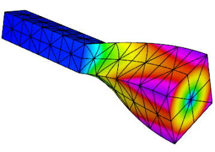

This example code solves the linear elasticity eigenvalue
problem for a multi-material cantilever beam.
Specifically, we compute a number of the lowest eigenmodes by approximating the weak form of
$$-{\rm div}({\sigma}({\bf u})) = \lambda {\bf u} \,,$$
where
$${\sigma}({\bf u}) = \lambda\, {\rm div}({\bf u})\,I + \mu\,(\nabla{\bf u} + \nabla{\bf u}^T)$$
is the stress tensor corresponding to displacement field $\bf u$, and $\lambda$ and $\mu$
are the material Lame constants. The boundary conditions are
${\bf u}=0$ on the fixed part of the boundary with attribute 1, and
${\sigma}({\bf u})\cdot n = f$ on the remainder.
The geometry of the domain is assumed to be as follows:

The example highlights the use of the LOBPCG eigenvalue solver together with the
BoomerAMG preconditioner in HYPRE.
Reusing a single [GLVis](https://glvis.org) visualization window for multiple
eigenfunctions is also illustrated.

_The example has only a parallel
([ex12p.cpp](https://github.com/mfem/mfem/blob/master/examples/ex12p.cpp)) version.
We recommend viewing examples 2 and 11 before viewing this example._

 

##Example 13: Maxwell Eigenproblem
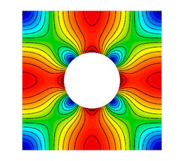

This example code solves the Maxwell (electromagnetic)
eigenvalue problem
$$\nabla\times\nabla\times\, E = \lambda\, E $$
with  homogeneous Dirichlet boundary conditions $E \times n = 0$.

We compute a number of the lowest nonzero eigenmodes by
discretizing the curl curl operator using a Nedelec finite element space of
the specified order in 2D or 3D.

The example highlights the use of the AME subspace eigenvalue
solver from HYPRE, which uses LOBPCG and AMS internally.
Reusing a single [GLVis](https://glvis.org) visualization window for multiple
eigenfunctions is also illustrated.

_The example has only a parallel
([ex13p.cpp](https://github.com/mfem/mfem/blob/master/examples/ex13p.cpp)) version.
We recommend viewing examples 3 and 11 before viewing this example._

 

##Example 14: DG Diffusion

This example code demonstrates the use of MFEM to define a
discontinuous Galerkin (DG) finite element discretization of
the Laplace problem  $$-\Delta u = 1$$ with homogeneous Dirichlet
boundary conditions. Finite element spaces of any order,
including zero on regular grids, are supported. The example highlights the use
of discontinuous spaces and DG-specific face integrators.

_The example has a serial ([ex14.cpp](https://github.com/mfem/mfem/blob/master/examples/ex14.cpp))
and a parallel ([ex14p.cpp](https://github.com/mfem/mfem/blob/master/examples/ex14p.cpp)) version.
We recommend viewing examples 1 and 9 before viewing this example._

 

##Example 15: Dynamic AMR

Building on [Example 6](#ex6), this example demonstrates dynamic adaptive mesh refinement.
The mesh is adapted to a time-dependent solution by refinement
as well as by derefinement. For simplicity, the solution is
prescribed and no time integration is done. However, the error
estimation and refinement/derefinement decisions are realistic.

At each outer iteration the right hand side function is changed
to mimic a time dependent problem.  Within each inner iteration
the problem is solved on a sequence of meshes which are locally
refined according to a simple ZZ error estimator.  At the end
of the inner iteration the error estimates are also used to
identify any elements which may be over-refined and a single
derefinement step is performed.  After each refinement or
derefinement step a rebalance operation is performed to keep
the mesh evenly distributed among the available processors.

The example demonstrates MFEM's capability to refine, derefine
and load balance nonconforming meshes, in 2D and 3D, and on
linear, curved and surface meshes. Interpolation of functions
between coarse and fine meshes, persistent [GLVis](https://glvis.org) visualization,
and saving of time-dependent fields for external visualization
with [VisIt](https://visit.llnl.gov) are also illustrated.

_The example has a serial ([ex15.cpp](https://github.com/mfem/mfem/blob/master/examples/ex15.cpp))
and a parallel ([ex15p.cpp](https://github.com/mfem/mfem/blob/master/examples/ex15p.cpp)) version.
We recommend viewing examples 1, 6 and 9 before viewing this example._

 

##Example 16: Time Dependent Heat Conduction

This example code solves a simple 2D/3D time dependent nonlinear heat conduction problem
$$\frac{du}{dt} = \nabla \cdot \left( \kappa + \alpha u \right) \nabla u$$
with a natural insulating boundary condition $\frac{du}{dn} = 0$.
We linearize the problem by using the temperature field $u$ from the previous time
step to compute the conductivity coefficient.

This example demonstrates both implicit and explicit time integration as well as a single
Picard step method for linearization. The saving of time dependent data files for external
visualization with [VisIt](https://visit.llnl.gov) is also illustrated.

_The example has a serial ([ex16.cpp](https://github.com/mfem/mfem/blob/master/examples/ex16.cpp))
and a parallel ([ex16p.cpp](https://github.com/mfem/mfem/blob/master/examples/ex16p.cpp)) version.
We recommend viewing examples 2, 9, and 10 before viewing this example._

 

##Example 17: DG Linear Elasticity

This example code solves a simple linear elasticity problem
describing a multi-material cantilever beam using symmetric or
non-symmetric discontinuous Galerkin (DG) formulation.

Specifically, we approximate the weak form of
$$-{\rm div}({\sigma}({\bf u})) = 0$$
where
$${\sigma}({\bf u}) = \lambda\, {\rm div}({\bf u})\,I + \mu\,(\nabla{\bf u} + \nabla{\bf u}^T)$$
is the stress tensor corresponding to displacement field ${\bf u}$, and $\lambda$ and $\mu$
are the material Lame constants. The boundary conditions are
Dirichlet, $\bf{u}=\bf{u_D}$, on the fixed part of the boundary, namely
boundary attributes 1 and 2; on the rest of the boundary we use
${\sigma}({\bf u})\cdot n = {\bf 0}$. The geometry of the domain is assumed to be
as follows:

The example demonstrates the use of high-order DG vector finite
element spaces with the linear DG elasticity bilinear form,
meshes with curved elements, and the definition of piece-wise
constant and function vector-coefficient objects. The use of
non-homogeneous Dirichlet b.c. imposed weakly, is also
illustrated.

_The example has a serial ([ex17.cpp](https://github.com/mfem/mfem/blob/master/examples/ex17.cpp))
and a parallel ([ex17p.cpp](https://github.com/mfem/mfem/blob/master/examples/ex17p.cpp)) version.
We recommend viewing examples 2 and 14 before viewing this example._

 

##Example 18: DG Euler Equations
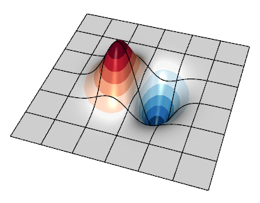

This example code solves the compressible Euler system of equations, a model
nonlinear hyperbolic PDE, with a discontinuous Galerkin (DG) formulation. The
primary purpose is to show how a transient system of nonlinear equations can be
formulated in MFEM. The equations are solved in conservative form

$$\frac{\partial u}{\partial t} + \nabla \cdot {\bf F}(u) = 0$$

with a state vector $u = [ \rho, \rho v_0, \rho v_1, \rho E ]$, where $\rho$ is
the density, $v_i$ is the velocity in the $i^{\rm th}$ direction, $E$ is the
total specific energy, and $H = E + p / \rho$ is the total specific enthalpy.
The pressure, $p$ is computed through a simple equation of state (EOS) call.
The conservative hydrodynamic flux ${\bf F}$ in each direction $i$ is

$${\bf F_{\it i}} = \[ \rho v_i, \rho v_0 v_i + p \delta_{i,0}, \rho v_1 v_i + p \delta_{i,1}, \rho v_i H \]$$

Specifically, the example solves for an exact solution of the equations whereby
a vortex is transported by a uniform flow. Since all boundaries are periodic
here, the method's accuracy can be assessed by measuring the difference between
the solution and the initial condition at a later time when the vortex returns
to its initial location.

Note that as the order of the spatial discretization increases, the timestep
must become smaller. This example currently uses a simple estimate derived by
[Cockburn and Shu](https://link.springer.com/article/10.1023/A:1012873910884)
for the 1D RKDG method. An additional factor can be tuned by passing the `--cfl`
(or `-c` shorter) flag.

The example demonstrates user-defined bilinear and nonlinear form integrators
for systems of equations that are defined with block vectors, and how these are
used with an operator for explicit time integrators. In this case the system
also involves an external approximate Riemann solver for the DG interface flux.
It also demonstrates how to use GLVis for in-situ visualization of vector grid
functions.

_The example has a serial ([ex18.cpp](https://github.com/mfem/mfem/blob/master/examples/ex18.cpp))
and a parallel ([ex18p.cpp](https://github.com/mfem/mfem/blob/master/examples/ex18p.cpp)) version.
We recommend viewing examples 9, 14 and 17 before viewing this example._

 

##Example 19: Incompressible Nonlinear Elasticity
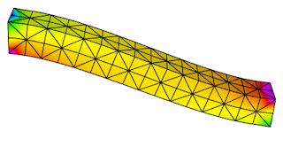

This example code solves the quasi-static incompressible nonlinear
hyperelasticity equations. Specifically, it solves the nonlinear equation
$$
\nabla \cdot \sigma(F) = 0
$$
subject to the constraint
$$
\text{det } F = 1
$$
where $\sigma$ is the Cauchy stress and $F_{ij} = \delta_{ij} + u_{i,j}$ is the deformation
gradient. To handle the incompressibility constraint, pressure is included as
an independent unknown $p$ and the stress response is modeled as an [incompressible
neo-Hookean hyperelastic solid](http://solidmechanics.org/text/Chapter3_5/Chapter3_5.htm).
The geometry of the domain is assumed to be as follows:

This formulation requires solving the saddle point system
$$ \left[ \begin{array}{cc}
   K &B^T \\\\
   B & 0
\end{array} \right]
\left[\begin{array}{c} \Delta u \\\\ \Delta p \end{array} \right] =
\left[\begin{array}{c} R_u \\\\ R_p \end{array} \right]
$$
at each Newton step. To solve this linear system, we implement a specialized block
preconditioner of the form
$$
P^{-1} =
\left[\begin{array}{cc} I & -\tilde{K}^{-1}B^T \\\\ 0 & I \end{array} \right]
\left[\begin{array}{cc} \tilde{K}^{-1} & 0 \\\\ 0 & -\gamma \tilde{S}^{-1} \end{array} \right]
$$
where $\tilde{K}^{-1}$ is an approximation of the inverse of the stiffness matrix $K$ and
$\tilde{S}^{-1}$ is an approximation of the inverse of the Schur complement $S = BK^{-1}B^T$.
To approximate the Schur complement, we use the mass matrix for the pressure variable $p$.

The example demonstrates how to solve nonlinear systems of equations that are defined with
block vectors as well as how to implement specialized block preconditioners for use in
iterative solvers.

_The example has a serial ([ex19.cpp](https://github.com/mfem/mfem/blob/master/examples/ex19.cpp))
and a parallel ([ex19p.cpp](https://github.com/mfem/mfem/blob/master/examples/ex19p.cpp)) version.
We recommend viewing examples 2, 5 and 10 before viewing this example._

 

##Example 20: Symplectic Integration of Hamiltonian Systems

This example demonstrates the use of the variable order, symplectic time
integration algorithm. Symplectic integration algorithms are designed to
conserve energy when integrating systems of ODEs which are derived from
Hamiltonian systems.

Hamiltonian systems define the energy of a system as a function of
time (t), a set of generalized coordinates (q), and their corresponding
generalized momenta (p).
$$
H(q,p,t) = T(p) + V(q,t)
$$
Hamilton's equations then specify how q and p evolve in time:
$$
\frac{dq}{dt} =  \frac{dH}{dp}\,,\qquad
\frac{dp}{dt} = -\frac{dH}{dq}
$$

To use the symplectic integration classes we need to define an `mfem::Operator`
${\bf P}$ which evaluates the action of dH/dp, and an
`mfem::TimeDependentOperator` ${\bf F}$ which computes -dH/dq.

This example visualizes its results as an evolution in phase space by defining
the axes to be $q$, $p$, and $t$ rather than $x$, $y$, and $z$.  In this space
we build a ribbon-like mesh with nodes at $(0,0,t)$ and $(q,p,t)$. Finally we
plot the energy as a function of time as a scalar field on this ribbon-like
mesh.  This scheme highlights any variations in the energy of the system.

This example offers five simple 1D Hamiltonians:

- Simple Harmonic Oscillator (mass on a spring)
  $$H = \frac{1}{2}\left( \frac{p^2}{m} + \frac{q^2}{k} \right)$$
- Pendulum
  $$H = \frac{1}{2}\left[ \frac{p^2}{m} - k \left( 1 - cos(q) \right) \right]$$
- Gaussian Potential Well
  $$H = \frac{p^2}{2m} - k e^{-q^2 / 2}$$
- Quartic Potential
  $$H = \frac{1}{2}\left[ \frac{p^2}{m} + k \left( 1 + q^2 \right) q^2 \right]$$
- Negative Quartic Potential
  $$H = \frac{1}{2}\left[ \frac{p^2}{m} + k \left( 1 - \frac{q^2}{8} \right) q^2 \right]$$

In all cases these Hamiltonians are shifted by constant values so that the
energy will remain positive. The mean and standard deviation of the computed
energies at each time step are displayed upon completion.

When run in parallel, each processor integrates the same Hamiltonian
system but starting from different initial conditions.

_The example has a serial ([ex20.cpp](https://github.com/mfem/mfem/blob/master/examples/ex20.cpp))
and a parallel ([ex20p.cpp](https://github.com/mfem/mfem/blob/master/examples/ex20p.cpp)) version.
See the [Maxwell](#maxwell-miniapp-transient-full-wave-electromagnetics) miniapp for another
application of symplectic integration._

 

##Example 21: Adaptive mesh refinement for linear elasticity

This is a version of Example 2 with a simple adaptive mesh
refinement loop. The problem being solved is again linear
elasticity describing a multi-material cantilever beam.
The problem is solved on a sequence of meshes which
are locally refined in a conforming (triangles, tetrahedrons)
or non-conforming (quadrilaterals, hexahedra) manner according
to a simple ZZ error estimator.

The example demonstrates MFEM's capability to work with both
conforming and nonconforming refinements, in 2D and 3D, on
linear and curved meshes. Interpolation of functions from
coarse to fine meshes, as well as persistent GLVis
visualization are also illustrated.

_The example has a serial ([ex21.cpp](https://github.com/mfem/mfem/blob/master/examples/ex21.cpp))
and a parallel ([ex21p.cpp](https://github.com/mfem/mfem/blob/master/examples/ex21p.cpp)) version.
We recommend viewing Examples 2 and 6 before viewing this example._

 

##Example 22: Complex Linear Systems
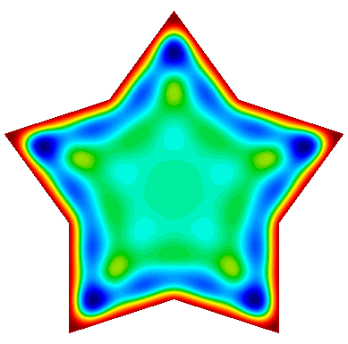

This example code demonstrates the use of MFEM to define and
solve a complex-valued linear system. It implements three variants
of a damped harmonic oscillator:

- A scalar $H^1$ field:
  $$-\nabla\cdot\left(a \nabla u\right) - \omega^2 b\,u + i\,\omega\,c\,u = 0$$

- A vector $H(curl)$ field:
  $$\nabla\times\left(a\nabla\times\vec{u}\right) - \omega^2 b\,\vec{u} + i\,\omega\,c\,\vec{u} = 0$$

- A vector $H(div)$ field:
  $$-\nabla\left(a \nabla\cdot\vec{u}\right) - \omega^2 b\,\vec{u} + i\,\omega\,c\,\vec{u} = 0$$

In each case the field is driven by a forced oscillation, with
angular frequency $\omega$, imposed at the boundary or a portion
of the boundary.

The example also demonstrates how to display a time-varying solution as
a sequence of fields sent to a single GLVis socket.

_The example has a serial ([ex22.cpp](https://github.com/mfem/mfem/blob/master/examples/ex22.cpp))
and a parallel ([ex22p.cpp](https://github.com/mfem/mfem/blob/master/examples/ex22p.cpp)) version.
We recommend viewing examples 1, 3, and 4 before viewing this example._

 

##Example 23: Wave Problem
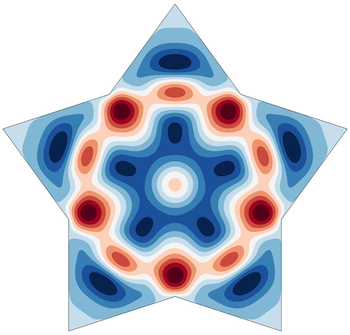

This example code solves a simple 2D/3D  wave
equation with a second order time derivative:
$$\frac{\partial^2 u}{\partial t^2} - c^2\Delta u = 0$$
The boundary conditions are either Dirichlet or Neumann.

The example demonstrates the use of time dependent operators,
implicit solvers and second order time integration.

_The example has only a serial ([ex23.cpp](https://github.com/mfem/mfem/blob/master/examples/ex23.cpp)) version.
We recommend viewing examples 9 and 10 before viewing this example._

 

##Example 24: Mixed finite element spaces

This example code illustrates usage of mixed finite element
spaces, with three variants:

- $H^1 \times H(curl)$
- $H(curl) \times H(div)$
- $H(div) \times L_2$

Using different approaches for demonstration purposes, we project or interpolate a gradient, curl, or
divergence in the appropriate spaces, comparing the errors in each case.

Partial assembly and [GPU devices](gpu-support.md) are supported.

_The example has a serial ([ex24.cpp](https://github.com/mfem/mfem/blob/master/examples/ex24.cpp))
and a parallel ([ex24p.cpp](https://github.com/mfem/mfem/blob/master/examples/ex24p.cpp)) version.
We recommend viewing examples 1 and 3 before viewing this example._

 

##Example 25: Perfectly Matched Layers

The example illustrates the use of a Perfectly Matched Layer (PML) for the
simulation of time-harmonic electromagnetic waves propagating in unbounded
domains.

PML was originally introduced by Berenger in ["A Perfectly Matched Layer for the
Absorption of Electromagnetic Waves"](https://doi.org/10.1006/jcph.1994.1159).
It is a technique used to solve wave propagation problems posed in infinite
domains. The implementation involves the introduction of an artificial absorbing
layer that minimizes undesired reflections. Inside this layer a complex
coordinate stretching map is used which forces the wave modes to decay
exponentially.

The example solves the indefinite Maxwell equations
$$\nabla \times (a \nabla \times E) - \omega^2 b E = f.$$
where $a = \mu^{-1} |J|^{-1} J^T J$, $b= \epsilon |J| J^{-1} J^{-T}$ and $J$ is
the Jacobian matrix of the coordinate transformation.

The example demonstrates discretization with Nedelec finite elements in 2D or
3D, as well as the use of complex-valued bilinear and linear forms. Several
test problems are included, with known exact solutions.

_The example has a serial ([ex25.cpp](https://github.com/mfem/mfem/blob/master/examples/ex25.cpp))
and a parallel ([ex25p.cpp](https://github.com/mfem/mfem/blob/master/examples/ex25p.cpp)) version.
We recommend viewing Example 22 before viewing this example._

 

##Example 26: Multigrid Preconditioner
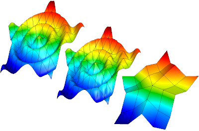

This example code demonstrates the use of MFEM to define a
simple isoparametric finite element discretization of the
Laplace problem $$-\Delta u = 1$$ with homogeneous Dirichlet
boundary conditions and how to solve it efficiently using a
matrix-free multigrid preconditioner.

The example highlights on the creation of a hierarchy of
discretization spaces and diffusion bilinear forms using
partial assembly. The levels in the hierarchy of finite
element spaces maybe constructed through geometric or
order refinements. Moreover, the construction of a multigrid
preconditioner for the PCG solver is shown. The multigrid
uses a PCG solver on the coarsest level and second order
Chebyshev accelerated smoothers on the other levels.

_The example has a serial ([ex26.cpp](https://github.com/mfem/mfem/blob/master/examples/ex26.cpp))
and a parallel ([ex26p.cpp](https://github.com/mfem/mfem/blob/master/examples/ex26p.cpp)) version.
We recommend viewing Example 1 before viewing this example._

 

##Example 27: Laplace Boundary Conditions

This example code demonstrates the use of MFEM to define a
simple finite element discretization of the Laplace problem:
$$
-\Delta u = 0
$$
with a variety of boundary conditions.

Specifically, we discretize
using a FE space of the specified order using a continuous or
discontinuous space.  We then apply Dirichlet, Neumann (both
homogeneous and inhomogeneous), Robin, and Periodic boundary
conditions on different portions of a predefined mesh.

| Boundary conditions:               |                      |
|------------------------------------|----------------------|
| $u = u_\{dbc}$                     | on $\Gamma_\{dbc}$   |
| $\hat\{n}\cdot\nabla u = g_\{nbc}$ | on $\Gamma_\{nbc}$   |
| $\hat\{n}\cdot\nabla u = 0$        | on $\Gamma_\{nbc_0}$ |
| $\hat\{n}\cdot\nabla u + a u = b$  | on $\Gamma_\{rbc}$   |

as well as periodic boundary conditions which are enforced topologically.

_The example has a serial ([ex27.cpp](https://github.com/mfem/mfem/blob/master/examples/ex27.cpp))
and a parallel ([ex27p.cpp](https://github.com/mfem/mfem/blob/master/examples/ex27p.cpp)) version.
We recommend viewing examples 1 and 14 before viewing this example._

 

##Example 28: Constraints and Sliding Boundary Conditions

This example code illustrates the use of constraints in linear solvers by
solving an elasticity problem where the normal component of the displacement
is constrained to zero on two boundaries but tangential displacement is
allowed.

The constraints can be enforced in several different ways, including
eliminating them from the linear system or solving a saddle-point
system that explicitly includes constraint conditions.

_The example has a serial ([ex28.cpp](https://github.com/mfem/mfem/blob/master/examples/ex28.cpp))
and a parallel ([ex28p.cpp](https://github.com/mfem/mfem/blob/master/examples/ex28p.cpp)) version.
We recommend viewing example 2 before viewing this example._

 

##Example 29: Solving PDEs on embedded surfaces

This example demonstrates setting up and solving an anisotropic Laplace problem
$$-\nabla\cdot(\sigma\nabla u) = 1 \quad\text{in } \Omega$$
with homogeneous Dirichlet boundary conditions
$$ u = 0 \quad\text{on } \partial\Omega$$
where $\Omega$ is a two dimensional curved surface embedded in three
dimensions and $\sigma$ is an anisotropic diffusion tensor.

The example demonstrates and validates our `DiffusionIntegrator`'s ability to
properly integrate three dimensional fluxes on a two dimensional domain. Not
all of our integrators currently support such cases but the
`DiffusionIntegrator` can be used as a simple example of how extend other
integrators when necessary.

_The example has a serial ([ex29.cpp](https://github.com/mfem/mfem/blob/master/examples/ex29.cpp))
and a parallel ([ex29p.cpp](https://github.com/mfem/mfem/blob/master/examples/ex29p.cpp)) version.
We recommend viewing examples 1 and 7 before viewing this example._

 

##Example 30: Resolving rough and fine-scale problem data

Unresolved problem data will affect the accuracy of a discretized PDE solution as
well as a posteriori estimates of the solution error.
This example uses a `CoefficientRefiner` object to preprocess an input mesh until
the resolution of the prescribed problem data $f \\in L^2$ is below a prescribed
tolerance. In this example, the resolution is identified with a data oscillation
function on the mesh $\\mathcal{T}$, defined
$$ \\mathrm{osc}(f) = \\Big( \\sum\_{T\\in\\mathcal{T}} \\| h \\cdot (I - \Pi)\\, f \\|^2\_{L^2(T)} \\Big)^{1/2}, $$
where $h$ is the local element size function and $\\Pi$ is a finite element projection
operator, and the sum is taken over all elements $T$ in the mesh.

In this example, the coarse initial mesh is adaptively refined until $\\mathrm{osc}(f)$ is below a
prescribed tolerance for various candidate functions $f \\in L^2$. When using rough problem data,
it is recommended to perform this type of preprocessing before a posteriori error estimation.

_The example has a serial ([ex30.cpp](https://github.com/mfem/mfem/blob/master/examples/ex30.cpp))
and a parallel ([ex30p.cpp](https://github.com/mfem/mfem/blob/master/examples/ex30p.cpp)) version.
We recommend viewing examples 1 and 6 before viewing this example._

 

##Example 31: Anisotropic Definite Maxwell Problem

This example code solves a simple electromagnetic diffusion
problem corresponding to the second order definite Maxwell
equation $$\nabla\times\nabla\times\, E + \sigma E = f$$
with boundary condition $ E \times n $ = "given tangential field".
In this example $\sigma$ is an anisotropic 3x3 tensor. Here, we use a
given exact solution $E$ and compute the corresponding r.h.s.
$f$. We discretize with Nedelec finite elements in 1D, 2D, or 3D.

The example demonstrates the use of restricted $H(curl)$ finite element
spaces with the curl-curl and the (vector finite element) mass
bilinear form, as well as the computation of discretization
error when the exact solution is known. These restricted spaces allow
the solution of 1D or 2D electromagnetic problems which involve 3D
field vectors. Such problems arise in plasma physics and crystallography.

_The example has a serial ([ex31.cpp](https://github.com/mfem/mfem/blob/master/examples/ex31.cpp))
and a parallel ([ex31p.cpp](https://github.com/mfem/mfem/blob/master/examples/ex31p.cpp)) version.
We recommend viewing example 3 before viewing this example._

 

##Example 32: Anisotropic Maxwell Eigenproblem

This example code solves the Maxwell (electromagnetic)
eigenvalue problem with anisotropic permittivity, $\epsilon$
$$\nabla\times\nabla\times\, E = \lambda\, \epsilon E $$
with  homogeneous Dirichlet boundary conditions $E \times n = 0$.

We compute a number of the lowest nonzero eigenmodes by
discretizing the curl curl operator using a Nedelec finite element space of
the specified order in 1D, 2D, or 3D.

The example demonstrates the use of restricted $H(curl)$ finite element
spaces in an eigenmode context. These restricted spaces allow
the solution of 1D or 2D electromagnetic problems which involve 3D
field vectors. Such problems arise in plasma physics and crystallography.
The example highlights the use of the AME subspace eigenvalue
solver from HYPRE, which uses LOBPCG and AMS internally.
Reusing multiple [GLVis](https://glvis.org) visualization windows for multiple
eigenfunctions is also illustrated.

_The example has only a parallel
([ex32p.cpp](https://github.com/mfem/mfem/blob/master/examples/ex32p.cpp)) version.
We recommend viewing examples 13 and 31 before viewing this example._

 

##Example 33: Spectral fractional Laplacian

This example code demonstrates the use of MFEM to solve the fractional Laplacian problem
$$ (-\Delta)^\alpha u = 1, \quad 0 < \alpha < 1, $$
with homogeneous Dirichlet boundary conditions. The problem solved in this example is similar to
[ex1](#ex1), but involves a fractional-order diffusion operator whose inverse can be approximated
by a series of inverses of integer-order diffusion operators. Solving each of these independent
integer-order PDEs with MFEM and summing their solutions results in a discrete solution to the
fractional Laplacian problem above.

_The example has a serial ([ex33.cpp](https://github.com/mfem/mfem/blob/master/examples/ex33.cpp))
and a parallel ([ex33p.cpp](https://github.com/mfem/mfem/blob/master/examples/ex33p.cpp)) version.
We recommend viewing Example 1 before viewing this example._

 

##Volta Miniapp: Electrostatics
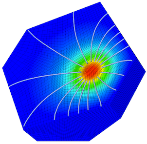

This miniapp demonstrates the use of MFEM to solve realistic problems
in the field of linear electrostatics.  Its features include:

- dielectric materials
- charge densities
- surface charge densities
- prescribed voltages
- applied polarizations
- high order meshes
- high order basis functions
- adaptive mesh refinement
- advanced visualization

For more details, please see the [documentation](electromagnetics.md) in the
`miniapps/electromagnetics` directory.

_The miniapp has only a parallel
([volta.cpp](https://github.com/mfem/mfem/blob/master/miniapps/electromagnetics/volta.cpp)) version.
**We recommend that new users start with the example codes before
moving to the miniapps.**_

 

##Tesla Miniapp: Magnetostatics
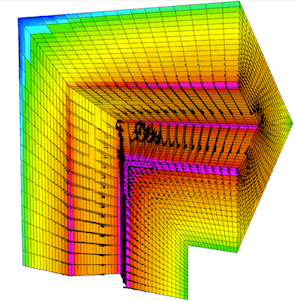

This miniapp showcases many of MFEM's features while solving a variety
of realistic magnetostatics problems.  Its features include:

- diamagnetic and/or paramagnetic materials
- ferromagnetic materials
- volumetric current densities
- surface current densities
- external fields
- high order meshes
- high order basis functions
- adaptive mesh refinement
- advanced visualization

For more details, please see the [documentation](electromagnetics.md) in the
`miniapps/electromagnetics` directory.

_The miniapp has only a parallel
([tesla.cpp](https://github.com/mfem/mfem/blob/master/miniapps/electromagnetics/tesla.cpp)) version.
**We recommend that new users start with the example codes before
moving to the miniapps.**_

 

##Maxwell Miniapp: Transient Full-Wave Electromagnetics
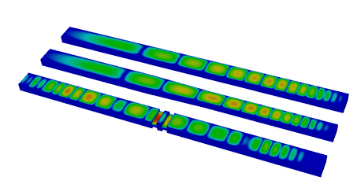

This miniapp solves the equations of transient full-wave electromagnetics.

Its features include:

- mixed formulation of the coupled first-order Maxwell equations
- $H(\\mathrm{curl})$ discretization of the electric field
- $H(\\mathrm{div})$ discretization of the magnetic flux
- energy conserving, variable order, implicit time integration
- dielectric materials
- diamagnetic and/or paramagnetic materials
- conductive materials
- volumetric current densities
- Sommerfeld absorbing boundary conditions
- high order meshes
- high order basis functions
- advanced visualization

For more details, please see the [documentation](electromagnetics.md) in the
`miniapps/electromagnetics` directory.

_The miniapp has only a parallel
([maxwell.cpp](https://github.com/mfem/mfem/blob/master/miniapps/electromagnetics/maxwell.cpp)) version.
**We recommend that new users start with the example codes before
moving to the miniapps.**_

 

##Joule Miniapp: Transient Magnetics and Joule Heating

This miniapp solves the equations of transient low-frequency (a.k.a. eddy current)
electromagnetics, and simultaneously computes transient heat transfer with the heat source given
by the electromagnetic Joule heating.

Its features include:

- $H^1$ discretization of the electrostatic potential
- $H(\\mathrm{curl})$ discretization of the electric field
- $H(\\mathrm{div})$ discretization of the magnetic field
- $H(\\mathrm{div})$ discretization of the heat flux
- $L^2$ discretization of the temperature
- implicit transient time integration
- high order meshes
- high order basis functions
- adaptive mesh refinement
- advanced visualization

For more details, please see the [documentation](electromagnetics.md) in the
`miniapps/electromagnetics` directory.

_The miniapp has only a parallel
([joule.cpp](https://github.com/mfem/mfem/blob/master/miniapps/electromagnetics/joule.cpp)) version.
**We recommend that new users start with the example codes before
moving to the miniapps.**_

 

##Mobius Strip Miniapp

This miniapp generates various Mobius strip-like surface meshes. It is a good
way to generate complex surface meshes.

Manipulating the mesh topology and performing mesh transformation are demonstrated.

The `mobius-strip` mesh in the `data` directory was generated with this miniapp.

For more details, please see the [documentation](meshing-miniapps.md) in the
`miniapps/meshing` directory.

_The miniapp has only a serial
([mobius-strip.cpp](https://github.com/mfem/mfem/blob/master/miniapps/meshing/mobius-strip.cpp)) version.
**We recommend that new users start with the example codes before
moving to the miniapps.**_

 

##Klein Bottle Miniapp

This miniapp generates three types of Klein bottle surfaces. It is similar to
the mobius-strip miniapp.

Manipulating the mesh topology and performing mesh transformation are demonstrated.

The `klein-bottle` and `klein-donut` meshes in the `data` directory were generated with this miniapp.

For more details, please see the [documentation](meshing-miniapps.md) in the
`miniapps/meshing` directory.

_The miniapp has only a serial
([klein-bottle.cpp](https://github.com/mfem/mfem/blob/master/miniapps/meshing/klein-bottle.cpp)) version.
**We recommend that new users start with the example codes before
moving to the miniapps.**_

 

##Toroid Miniapp

This miniapp generates two types of toroidal volume meshes; one with
triangular cross sections and one with square cross sections.  It
works by defining a stack of individual elements and bending them so
that the bottom and top of the stack can be joined to form a torus. It
supports various options including:

- The element type: 0 - Wedge, 1 - Hexahedron
- The geometric order of the elements
- The major and minor radii
- The number of elements in the azimuthal direction
- The number of nodes to offset by before rejoining the stack
- The initial angle of the cross sectional shape
- The number of uniform refinement steps to apply

Along with producing some visually interesting meshes, this miniapp
demonstrates how simple 3D meshes can be constructed and transformed
in MFEM.  It also produces a family of meshes with simple but
non-trivial topology for testing various features in MFEM.

_This miniapp has only a serial
([toroid.cpp](https://github.com/mfem/mfem/blob/master/miniapps/meshing/toroid.cpp)) version.
**We recommend that new users start with the example codes before
moving to the miniapps.**_

 

##Twist Miniapp

This miniapp generates simple periodic meshes to demonstrate MFEM's handling
of periodic domains. MFEM's strategy is to use a discontinuous vector field
to define the mesh coordinates on a topologically periodic mesh. It works by
defining a stack of individual elements and stitching together the top and
bottom of the mesh. The stack can also be twisted so that the vertices of the
bottom and top can be joined with any integer offset (for tetrahedral and
wedge meshes only even offsets are supported).

The Twist miniapp supports various options including:

- The element type: 4 - Tetrahedron, 6 - Wedge, 8 - Hexahedron
- The geometric order of the elements
- The dimensions of the initial brick-shaped stack of elements
- The number of elements in the z direction
- The number of nodes to offset by before rejoining the stack
- The number of uniform refinement steps to apply

Along with producing some visually interesting meshes, this miniapp
demonstrates how simple 3D meshes can be constructed and transformed
in MFEM.  It also produces a family of meshes with simple but
non-trivial topology for testing various features in MFEM.

_This miniapp has only a serial
([twist.cpp](https://github.com/mfem/mfem/blob/master/miniapps/meshing/twist.cpp)) version.
**We recommend that new users start with the example codes before
moving to the miniapps.**_

 

##Extruder Miniapp

This miniapp creates higher dimensional meshes from lower dimensional meshes
by extrusion.  Simple coordinate transformations can also be applied if desired.

- The initial mesh can be 1D or 2D
- 1D meshes can be extruded in both the y and z directions
- 2D meshes can be triangular, quadrilateral, or contain both element types
- Meshes with high order geometry are supported
- User can specify the number of elements and the distance to extrude
- Geometric order of the transformed mesh can be user selected or automatic

This miniapp provides another demonstration of how simple meshes can be
constructed and transformed in MFEM.

_This miniapp has only a serial
([extruder.cpp](https://github.com/mfem/mfem/blob/master/miniapps/meshing/extruder.cpp)) version.
**We recommend that new users start with the example codes before
moving to the miniapps.**_

 

##Trimmer Miniapp

This miniapp creates a new mesh file from an existing mesh by trimming away
elements with selected attributes. Newly exposed boundary elements will be
assigned new or user specified boundary attributes.

 - The initial mesh can be 2D or 3D
 - Meshes with high order geometry are supported
 - Periodic meshes are supported
 - NURBS meshes are _not_ supported

This miniapp provides another demonstration of how simple meshes can be
constructed in MFEM.

_This miniapp has only a serial
([trimmer.cpp](https://github.com/mfem/mfem/blob/master/miniapps/meshing/trimmer.cpp)) version.
**We recommend that new users start with the example codes before
moving to the miniapps.**_

 

##Polar-NC Miniapp
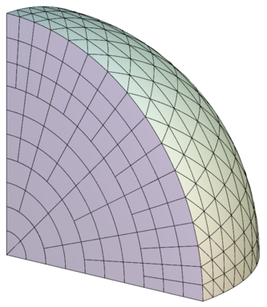

This miniapp generates a circular sector mesh that consist of quadrilaterals
and triangles of similar sizes. The 3D version of the mesh is made of prisms
and tetrahedra.

The mesh is non-conforming by design, and can optionally be made curvilinear.
The elements are ordered along a space-filling curve by default, which makes
the mesh ready for parallel non-conforming AMR in MFEM.

The implementation also demonstrates how to initialize a non-conforming mesh
on the fly by marking hanging nodes with `Mesh::AddVertexParents`.

For more details, please see the [documentation](meshing-miniapps.md) in the
`miniapps/meshing` directory.

_The miniapp has only a serial
([polar-nc.cpp](https://github.com/mfem/mfem/blob/master/miniapps/meshing/polar-nc.cpp)) version.
**We recommend that new users start with the example codes before
moving to the miniapps.**_

 

##Shaper Miniapp

This miniapp performs multiple levels of adaptive mesh refinement to resolve the
interfaces between different "materials" in the mesh, as specified by a given
material function.

It can be used as a simple initial mesh generator, for example in the case when
the interface is too complex to describe without local refinement. Both
conforming and non-conforming refinements are supported.

For more details, please see the [documentation](meshing-miniapps.md) in the
`miniapps/meshing` directory.

_The miniapp has only a serial
([shaper.cpp](https://github.com/mfem/mfem/blob/master/miniapps/meshing/shaper.cpp)) version.
**We recommend that new users start with the example codes before
moving to the miniapps.**_

 

##Mesh Explorer Miniapp
<a href="https://glvis.org/live/?stream=../data/streams/mesh-explorer.saved" target="_blank">
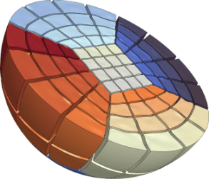
</a>

This miniapp is a handy tool to examine, visualize and manipulate a given
mesh. Some of its features are:

- visualizing of mesh materials and individual mesh elements
- mesh scaling, randomization, and general transformation
- manipulation of the mesh curvature
- the ability to simulate parallel partitioning
- quantitative and visual reports of mesh quality

For more details, please see the [documentation](meshing-miniapps.md) in the
`miniapps/meshing` directory.

_The miniapp has only a serial
([mesh-explorer.cpp](https://github.com/mfem/mfem/blob/master/miniapps/meshing/mesh-explorer.cpp)) version.
**We recommend that new users start with the example codes before moving to the miniapps.**_

 

##Mesh Optimizer Miniapp

This miniapp performs mesh optimization using the Target-Matrix Optimization
Paradigm (TMOP) by P.Knupp et al., and a global variational minimization
approach. It minimizes the quantity

$$\sum_T \int_T \mu(J(x)),$$

where $T$ are the target (ideal) elements, $J$ is the Jacobian of the
transformation from the target to the physical element, and $\mu$ is the mesh
quality metric.

This metric can measure shape, size or alignment of the region around each
quadrature point. The combination of targets and quality metrics is used to
optimize the physical node positions, i.e., they must be as close as possible to
the shape / size / alignment of their targets.

This code also demonstrates a possible use of nonlinear operators, as well as
their coupling to Newton methods for solving minimization problems. Note that
the utilized Newton methods are oriented towards avoiding invalid meshes with
negative Jacobian determinants. Each Newton step requires the inversion of a
Jacobian matrix, which is done through an inner linear solver.

For more details, please see the [documentation](meshing-miniapps.md) in the
`miniapps/meshing` directory.

_The miniapp has a serial
([mesh-optimizer.cpp](https://github.com/mfem/mfem/blob/master/miniapps/meshing/mesh-optimizer.cpp)) and a
parallel ([pmesh-optimizer.cpp](https://github.com/mfem/mfem/blob/master/miniapps/meshing/pmesh-optimizer.cpp))
version.
**We recommend that new users start with the example codes before moving to the miniapps.**_

 

##Minimal Surface Miniapp
<a href="https://glvis.org/live/?stream=../data/streams/minimal-surface.saved" target="_blank">
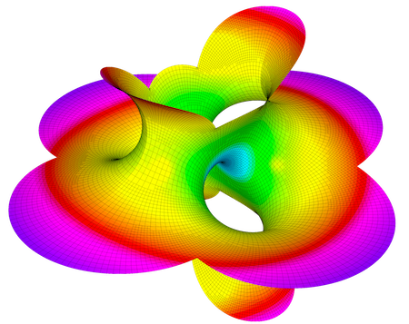
</a>

This miniapp solves Plateau's problem: the Dirichlet problem for the minimal surface equation.

Options to solve the minimal surface equations of both parametric surfaces as well as
surfaces restricted to be graphs of the form $z=f(x,y)$ are supported, including a
number of examples such as the Catenoid, Helicoid, Costa and Schrek surfaces.

For more details, please see the [documentation](meshing-miniapps.md) in the `miniapps/meshing` directory.

_The miniapp has a serial
([minimal-surface.cpp](https://github.com/mfem/mfem/blob/master/miniapps/meshing/minimal-surface.cpp)) and a
parallel ([pminimal-surface.cpp](https://github.com/mfem/mfem/blob/master/miniapps/meshing/pminimal-surface.cpp))
version.
**We recommend that new users start with the example codes before moving to the miniapps.**_

 

##Low-Order Refined Transfer Miniapp

The `lor-transfer` miniapp, found under `miniapps/tools` demonstrates the
capability to generate a *low-order refined* mesh from a high-order mesh, and to
transfer solutions between these meshes.

Grid functions can be transferred between the coarse, high-order mesh and the
low-order refined mesh using either $L^2$ projection or pointwise evaluation.
These transfer operators can be designed to discretely conserve mass and to
recover the original high-order solution when transferring a low-order grid
function that was obtained by restricting a high-order grid function to the
low-order refined space.

_The miniapp has only a serial
([lor-transfer.cpp](https://github.com/mfem/mfem/blob/master/miniapps/tools/lor-transfer.cpp)) version._
_**We recommend that new users start with the example codes before moving to the miniapps.**_

 

##Interpolation Miniapps

The interpolation miniapp, found under `miniapps/gslib`, demonstrate the
capability to interpolate high-order finite element functions at given set of
points in physical space.
These miniapps utilize the [`gslib`](https://github.com/gslib/gslib) library's
high-order  interpolation utility for quad and hex meshes:

- _Find Points_ miniapp has a serial
([findpts.cpp](https://github.com/mfem/mfem/blob/master/miniapps/gslib/findpts.cpp))
and a parallel
([pfindpts.cpp](https://github.com/mfem/mfem/blob/master/miniapps/gslib/pfindpts.cpp))
version that demonstrate the basic procedures for point search and evaluation
of grid functions.
- _Field Interp_ miniapp
([field-interp.cpp](https://github.com/mfem/mfem/blob/master/miniapps/gslib/field-interp.cpp))
demonstrates how grid functions can be transferred between meshes.
- _Field Diff_ miniapp
([field-diff.cpp](https://github.com/mfem/mfem/blob/master/miniapps/gslib/field-diff.cpp))
demonstrates how grid functions on two different meshes can be compared with
each other.

_**These miniapps require installation of the [`gslib`](https://github.com/gslib/gslib) library. We recommend that new users start with the example codes before moving to the miniapps.**_

 

##Extrapolation Miniapp

The `extrapolate` miniapp, found in the `miniapps/shifted` directory,
extrapolates a finite element function from a set of elements (known values) to
the rest of the domain. The set of elements that contains the known values is
specified by the positive values of a level set Coefficient. The known values
are not modified. The miniapp supports two PDE-based approaches
([Aslam](https://www.sciencedirect.com/science/article/pii/S0021999103004170?via%3Dihub), [Bochkov & Gibou](https://epubs.siam.org/doi/10.1137/19M1307883)),
both of which rely on solving a sequence of advection problems in the
direction of the unknown parts of the domain. The extrapolation can be constant
(1st order), linear (2nd order), or quadratic (3rd order). These formal orders
hold for a limited band around the zero level set, see the above references for
further information.

_The miniapp has only a parallel
([extrapolate.cpp](https://github.com/mfem/mfem/blob/master/miniapps/shifted/extrapolate.cpp)) version._
_**We recommend that new users start with the example codes before moving to the miniapps.**_

 

##Distance Solver Miniapp

The `distance` miniapp, found in the `miniapps/shifted` directory demonstrates the
capability to compute the "distance" to a given point source or to the zero
level set of a given function.
Here "distance" refers to the length of the shortest path through the mesh.
The input can be a `DeltaCoefficient` (representing a point source),
or any `Coefficient` (for the case of a level set).
The output is a `ParGridFunction` that can be scalar (representing the scalar
distance), or a vector (its magnitude is the distance, and its direction is
the starting direction of the shortest path).

_The miniapp has only a parallel
([distance.cpp](https://github.com/mfem/mfem/blob/master/miniapps/shifted/distance.cpp)) version._
_**We recommend that new users start with the example codes before moving to the miniapps.**_

 

##Shifted Diffusion Miniapp

The `diffusion` miniapp, found in the `miniapps/shifted` directory, demonstrates
the capability to formulate a boundary value problem using a surrogate
computational domain. The method uses a distance function to the true boundary
to enforce Dirichlet boundary conditions on the (non-aligned) mesh faces,
therefore "shifting" the location where boundary conditions are imposed. The
implementation in the miniapp is a high-order extension of the
second-generation
[shifted boundary method](https://www.sciencedirect.com/science/article/pii/S0045782520305260).

_The miniapp has only a parallel
([diffusion.cpp](https://github.com/mfem/mfem/blob/master/miniapps/shifted/distance.cpp)) version._
_**We recommend that new users start with the example codes before moving to the miniapps.**_

 

##Laghos Miniapp

**Laghos** (LAGrangian High-Order Solver) is a miniapp that solves the
time-dependent Euler equations of compressible gas dynamics in a moving
Lagrangian frame using unstructured high-order finite element spatial
discretization and explicit high-order time-stepping.

The computational motives captured in Laghos include:

- Support for unstructured meshes, in 2D and 3D, with quadrilateral and
  hexahedral elements (triangular and tetrahedral elements can also be used, but
  with the less efficient full assembly option). Serial and parallel mesh
  refinement options can be set via a command-line flag.
- Explicit time-stepping loop with a variety of time integrator options. Laghos
  supports Runge-Kutta ODE solvers of orders 1, 2, 3, 4 and 6.
- Continuous and discontinuous high-order finite element discretization spaces
  of runtime-specified order.
- Moving (high-order) meshes.
- Separation between the assembly and the quadrature point-based computations.
- Point-wise definition of mesh size, time-step estimate and artificial
  viscosity coefficient.
- Constant-in-time velocity mass operator that is inverted iteratively on
  each time step. This is an example of an operator that is prepared once (fully
  or partially assembled), but is applied many times. The application cost is
  dominant for this operator.
- Time-dependent force matrix that is prepared every time step (fully or
  partially assembled) and is applied just twice per "assembly". Both the
  preparation and the application costs are important for this operator.
- Domain-decomposed MPI parallelism.
- Optional in-situ visualization with [GLVis](http:/glvis.org) and data output
  for visualization / data analysis with [VisIt](https://visit.llnl.gov).

The Laghos miniapp is part of the [CEED software suite](https://ceed.exascaleproject.org/software),
a collection of software benchmarks, miniapps, libraries and APIs for
efficient exascale discretizations based on high-order finite element
and spectral element methods. See https://github.com/ceed for more
information and source code availability.

_This is an external miniapp, available at [https://github.com/CEED/Laghos](https://github.com/CEED/Laghos)._

 

##Remhos Miniapp
<a href="https://glvis.org/live/?stream=../data/streams/remhos.saved" target="_blank">
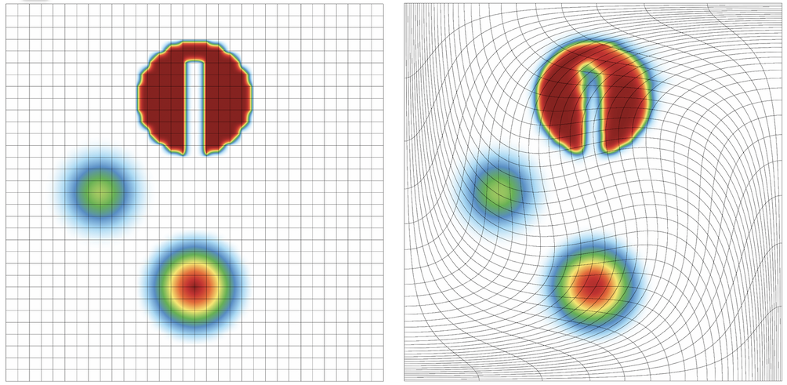
</a>

**Remhos** (REMap High-Order Solver) is a miniapp that solves the pure advection
equations that are used to perform monotonic and conservative discontinuous
field interpolation (remap) as part of the Eulerian phase in Arbitrary
Lagrangian Eulerian (ALE) simulations.

The computational motives captured in Remhos include:

- Support for unstructured meshes, in 2D and 3D, with quadrilateral and
  hexahedral elements. Serial and parallel mesh refinement options can be
  set via a command-line flag.
- Explicit time-stepping loop with a variety of time integrator options. Remhos
  supports Runge-Kutta ODE solvers of orders 1, 2, 3, 4 and 6.
- Discontinuous high-order finite element discretization spaces
  of runtime-specified order.
- Moving (high-order) meshes.
- Mass operator that is local per each zone. It is inverted by iterative or exact
  methods at each time step. This operator is constant in time (transport mode)
  or changing in time (remap mode). Options for full or partial assembly.
- Advection operator that couples neighboring zones. It is applied once at each
  time step. This operator is constant in time (transport mode) or
  changing in time (remap mode). Options for full or partial assembly.
- Domain-decomposed MPI parallelism.
- Optional in-situ visualization with [GLVis](http:/glvis.org) and data output
  for visualization and data analysis with [VisIt](https://visit.llnl.gov).

The Remhos miniapp is part of the [CEED software suite](https://ceed.exascaleproject.org/software),
a collection of software benchmarks, miniapps, libraries and APIs for
efficient exascale discretizations based on high-order finite element
and spectral element methods. See https://github.com/ceed for more
information and source code availability.

_This is an external miniapp, available at [https://github.com/CEED/Remhos](https://github.com/CEED/Remhos)._

 

##Navier Miniapp

Navier is a miniapp that solves the time-dependent Navier-Stokes equations of
incompressible fluid dynamics
\begin{align}
\frac{\partial u}{\partial t} + (u \cdot \nabla) u - \frac{1}{Re} \nabla^2 u - \nabla p &= f \\\\
\nabla \cdot u &= 0
\end{align}
using a spatially high-order finite element discretization.

The time-dependent problem is solved using a (up to) third order
implicit-explicit method which leverages an extrapolation scheme for the
convective parts and a backward-difference formulation for the viscous parts of
the equation.

The miniapp supports:

- Arbitrary order H1 elements
- High order mesh elements
- IMEX (EXTk-BDFk) time-stepping up to third order
- Convenient interface for new users
- A variety of test cases and benchmarks

_This miniapp has only a parallel
([navier_solver.cpp](https://github.com/mfem/mfem/blob/master/miniapps/navier/navier_solver.cpp)) version.
**We recommend that new users start with the example codes before
moving to the miniapps.**_

 

##Block Solvers Miniapp

The Block Solvers miniapp, found under `miniapps/solvers`, compares various linear solvers for the saddle
point system obtained from mixed finite element discretization of the Darcy's flow problem
\begin{array}{rcl}
      k{\bf u}        & + \nabla p & = f \\\\
-\nabla \cdot {\bf u} &            & = g
\end{array}

The solvers being compared include:

- The divergence-free solver (couple and decoupled modes), which is based on a multilevel decomposition of
the Raviart-Thomas finite element space and its divergence-free subspace.
- MINRES preconditioned by the block diagonal preconditioner in
[ex5p.cpp](https://github.com/mfem/mfem/blob/master/examples/ex5p.cpp).

For more details, please see the
[documentation](https://github.com/mfem/mfem/blob/master/miniapps/solvers/README) in the `miniapps/solvers`
directory.

The miniapp supports:

- Arbitrary order mixed finite element pair (Raviart-Thomas elements + piecewise discontinuous polynomials)
- Various combination of essential and natural boundary conditions
- Homogeneous or heterogeneous scalar coefficient k

_This miniapp has only a parallel
([block-solvers.cpp](https://github.com/mfem/mfem/blob/master/miniapps/solvers/block-solvers.cpp)) version.
**We recommend that new users start with the example codes before
moving to the miniapps.**_

 

##Overlapping Grids Miniapps

Overlapping grids-based frameworks can often make problems tractable that are
otherwise inaccessible with a single conforming grid. The following
`gslib`-based miniapps in MFEM demonstrate how to set up and use overlapping grids:

- The _Schwarz Example 1_ miniapp in `miniapps/gslib` has a serial
([schwarz_ex1.cpp](https://github.com/mfem/mfem/blob/master/miniapps/gslib/schwarz_ex1.cpp))
a parallel
([schwarz_ex1p.cpp](https://github.com/mfem/mfem/blob/master/miniapps/gslib/schwarz_ex1p.cpp))
version that solves the
Poisson problem on overlapping grids. The serial version is restricted to use
two overlapping grids, while the parallel version supports arbitrary number of
overlapping grids.

- The _Navier Conjugate Heat Transfer_ miniapp in `miniapps/navier`
([navier_cht.cpp](https://github.com/mfem/mfem/blob/master/miniapps/navier/navier_cht.cpp))
demonstrates how a conjugate heat transfer problem can be solved with the fluid
dynamics (incompressible Navier-Stokes equations) and heat transfer
(advection-diffusion equation) PDEs modeled on different meshes.

_These miniapps require installation of the [`gslib`](https://github.com/gslib/gslib) library.
**We recommend that new users start with the example codes before moving to the miniapps.**_

 

##ParELAG AMGe for H(curl) and H(div) Miniapp

This is a miniapp that exhibits the **ParELAG** library and part of its
capabilities. The miniapp employs MFEM and ParELAG to solve $H(\\mathrm{curl})$-
and $H(\\mathrm{div})$-elliptic forms by an element based algebraic multigrid
(AMGe).

[ParELAG](https://github.com/LLNL/parelag) is a library mostly developed at the
Center for Applied Scientific Computing of Lawrence Livermore National
Laboratory, California, USA.

The miniapp uses:

- A multilevel hierarchy of de Rham complexes of finite element spaces, built by
ParELAG;

- Hiptmair-type (hybrid) smoothers, implemented in ParELAG;

- AMS (Auxiliary-space Maxwell Solver) or ADS (Auxiliary-space Divergence
Solver), from HYPRE, for preconditioning or solving on the coarsest levels.

Alternatively, it is possible to precondition or solve the $H(\\mathrm{div})$
form on the coarsest level via a [hybridization](https://docs.mfem.org/html/classmfem_1_1Hybridization.html)
approach. However, this is not yet implemented in ParELAG for the coarse levels.
Only the hybridization solver that is directly applicable to an
$H(\\mathrm{div})$-$L^2$ mixed (saddle-point) system is currently available in
ParELAG.

We recommend viewing [ex3p.cpp](https://github.com/mfem/mfem/blob/master/examples/ex3p.cpp)
and [ex4p.cpp](https://github.com/mfem/mfem/blob/master/examples/ex4p.cpp)
before viewing this miniapp.

For more details, please see the
[documentation](https://github.com/mfem/mfem/blob/master/miniapps/parelag/README) in the `miniapps/parelag`
directory.

_This miniapp has only a parallel
([MultilevelHcurlHdivSolver.cpp](https://github.com/mfem/mfem/blob/master/miniapps/parelag/MultilevelHcurlHdivSolver.cpp)) version.
**We recommend that new users start with the example codes before
moving to the miniapps.**_

 

<!-- ------------------------------------------------------------------------- -->

   

No examples or miniapps match your criteria.

   

