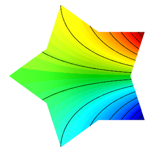
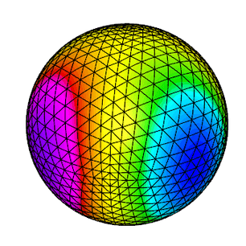
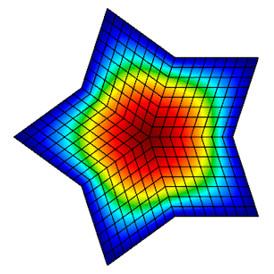
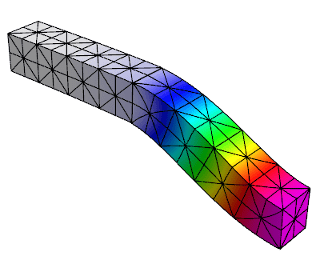

# Example Codes and Miniapps

This page provides a brief overview of MFEM's example codes and miniapps. For
detailed documentation of the MFEM sources, including the examples, see the
[online Doxygen documentation](http://mfem.github.io/doxygen/html/index.html),
or the `doc` directory in the distribution.

The goal of the example codes is to provide a step-by-step introduction to MFEM
in simple model settings. The miniapps are more complex, and are intended to be
more representative of the advanced usage of the library in physics/application
codes. We recommend that new users start with the example codes before moving to
the miniapps.

Clicking on any of the categories below displays examples and miniapps that contain the
described feature. _All examples support (arbitrarily) high-order meshes and
finite element spaces_.
The numerical results from the example codes can be visualized using the
GLVis visualization tool (based on MFEM). See the
[GLVis website](http://glvis.org) for more details.

Users are encouraged to submit any example codes and miniapps that they have created and
would like to share.  
_Contact a member of the MFEM team to report
[bugs](https://github.com/mfem/mfem/issues/new?labels=bug)
or post [questions](https://github.com/mfem/mfem/issues/new?labels=question) or [comments](https://github.com/mfem/mfem/issues/new?labels=comment)_.

   <h5>**Application (PDE)**</h5>
   <label><input type="radio" id="all1" onchange="update(this.id);" checked="checked" /> All</label> 
   <label><input type="radio" id="laplace" onchange="update(this.id);" /> Laplace</label> 
   <label><input type="radio" id="elasticity" onchange="update(this.id);" /> Elasticity</label> 
   <label><input type="radio" id="maxwell" onchange="update(this.id);" /> Electromagnetics</label> 
   <label><input type="radio" id="graddiv" onchange="update(this.id);" /> grad-div</label> 
   <label><input type="radio" id="darcy" onchange="update(this.id);" /> Darcy</label> 
   <label><input type="radio" id="advection" onchange="update(this.id);" /> Advection</label> 
   <label><input type="radio" id="conduction" onchange="update(this.id);" /> Conduction</label> 
   <label><input type="radio" id="hydro" onchange="update(this.id);" /> Hydrodynamics</label> 
   <label><input type="radio" id="meshing" onchange="update(this.id);" /> Meshing</label> 
   <label><input type="radio" id="hpc" onchange="update(this.id);" /> High-performance</label> 

   <h5>**Finite Elements**</h5>
   <label><input type="radio" id="all2" onchange="update(this.id);" checked="checked" /> All</label> 
   <label><input type="radio" id="l2" onchange="update(this.id);" /> $L_2$ discontinuous elements</label> 
   <label><input type="radio" id="h1" onchange="update(this.id);" /> $H^1$ nodal elements</label> 
   <label><input type="radio" id="hcurl" onchange="update(this.id);" /> $H(curl)$ Nedelec elements</label> 
   <label><input type="radio" id="hdiv" onchange="update(this.id);" /> $H(div)$ Raviart-Thomas elements</label> 
   <label><input type="radio" id="h12" onchange="update(this.id);" /> $H^{-1/2}$ interfacial elements</label> 

   <h5>**Discretization**</h5>
   <label><input type="radio" id="all3" onchange="update(this.id);" checked="checked" /> All</label> 
   <label><input type="radio" id="galerkin" onchange="update(this.id);" /> Galerkin FEM</label> 
   <label><input type="radio" id="mixed" onchange="update(this.id);" /> Mixed FEM</label> 
   <label><input type="radio" id="dg" onchange="update(this.id);" /> Discontinuous Galerkin (DG)</label> 
   <label><input type="radio" id="dpg" onchange="update(this.id);" /> Discont. Petrov-Galerkin (DPG)</label> 
   <label><input type="radio" id="hybr" onchange="update(this.id);" /> Hybridization</label> 
   <label><input type="radio" id="staticcond" onchange="update(this.id);" /> Static condensation</label> 
   <label><input type="radio" id="nurbs" onchange="update(this.id);" /> Isogeometric analysis (NURBS)</label> 
   <label><input type="radio" id="amr" onchange="update(this.id);" /> Adaptive mesh refinement (AMR)</label> 

   <h5>**Solver**</h5>
   <label><input type="radio" id="all4" onchange="update(this.id);" checked="checked" /> All</label> 
   <label><input type="radio" id="jacobi" onchange="update(this.id);" /> Jacobi</label>  
   <label><input type="radio" id="gs" onchange="update(this.id);" /> Gauss-Seidel</label>  
   <label><input type="radio" id="pcg" onchange="update(this.id);" /> PCG</label>  
   <label><input type="radio" id="minres" onchange="update(this.id);" /> MINRES</label>  
   <label><input type="radio" id="gmres" onchange="update(this.id);" /> GMRES</label>  
   <label><input type="radio" id="amg" onchange="update(this.id);" /> Algebraic Multigrid (BoomerAMG)</label>  
   <label><input type="radio" id="ams" onchange="update(this.id);" /> Auxiliary-space Maxwell Solver (AMS)</label>  
   <label><input type="radio" id="ads" onchange="update(this.id);" /> Auxiliary-space Divergence Solver (ADS)</label>  
   <label><input type="radio" id="superlu" onchange="update(this.id);" /> SuperLU/STRUMPACK (parallel direct)</label> 
   <label><input type="radio" id="umfpack" onchange="update(this.id);" /> UMFPACK (serial direct)</label> 
   <label><input type="radio" id="newton" onchange="update(this.id);" /> Newton method (nonlinear solver)</label> 
   <label><input type="radio" id="rk" onchange="update(this.id);" /> Explicit Runge-Kutta (ODE integration)</label> 
   <label><input type="radio" id="sdirk" onchange="update(this.id);" /> Implicit Runge-Kutta (ODE integration)</label> 
   <label><input type="radio" id="lobpcg" onchange="update(this.id);" /> LOBPCG, AME (eigensolvers)</label> 
   <label><input type="radio" id="sundials" onchange="update(this.id);" /> SUNDIALS solvers</label> 
   <label><input type="radio" id="petsc" onchange="update(this.id);" /> PETSc solvers</label> 

<!-- ------------------------------------------------------------------------- -->

##Example 1: Laplace Problem

This example code demonstrates the use of MFEM to define a
simple isoparametric finite element discretization of the
Laplace problem $$-\Delta u = 1$$ with homogeneous Dirichlet
boundary conditions. Specifically, we discretize with the
finite element space coming from the mesh (linear by default, quadratic
for quadratic curvilinear mesh, NURBS for NURBS mesh, etc.)

The example highlights the use of mesh refinement, finite
element grid functions, as well as linear and bilinear forms
corresponding to the left-hand side and right-hand side of the
discrete linear system. We also cover the explicit elimination
of essential boundary conditions, static condensation, and the optional
connection to the [GLVis](http://glvis.org) tool for visualization.

_The example has a serial ([ex1.cpp](https://github.com/mfem/mfem/blob/master/examples/ex1.cpp)),
a parallel ([ex1p.cpp](https://github.com/mfem/mfem/blob/master/examples/ex1p.cpp)),
and HPC versions: [performance/ex1.cpp](https://github.com/mfem/mfem/blob/master/miniapps/performance/ex1.cpp),
[performance/ex1p.cpp](https://github.com/mfem/mfem/blob/master/miniapps/performance/ex1p.cpp).
It also has a PETSc modification in [examples/petsc](https://github.com/mfem/mfem/blob/master/examples/petsc)._

 

##Example 2: Linear Elasticity

This example code solves a simple linear elasticity problem
describing a multi-material cantilever beam.
Specifically, we approximate the weak form of
$$-{\rm div}({\sigma}({\bf u})) = 0$$
where
$${\sigma}({\bf u}) = \lambda\, {\rm div}({\bf u})\,I + \mu\,(\nabla{\bf u} + \nabla{\bf u}^T)$$
is the stress tensor corresponding to displacement field ${\bf u}$, and $\lambda$ and $\mu$
are the material Lame constants. The boundary conditions are
${\bf u}=0$ on the fixed part of the boundary with attribute 1, and
${\sigma}({\bf u})\cdot n = f$ on the remainder with $f$ being
a constant pull down vector on boundary elements with attribute 2, and zero
otherwise. The geometry of the domain is assumed to be as follows:

The example demonstrates the use of high-order and NURBS vector
finite element spaces with the linear elasticity bilinear form,
meshes with curved elements, and the definition of piece-wise
constant and vector coefficient objects. Static condensation is
also illustrated.

_The example has a serial ([ex2.cpp](https://github.com/mfem/mfem/blob/master/examples/ex2.cpp))
and a parallel ([ex2p.cpp](https://github.com/mfem/mfem/blob/master/examples/ex2p.cpp)) version.
It also has a PETSc modification in [examples/petsc](https://github.com/mfem/mfem/blob/master/examples/petsc).
We recommend viewing Example 1 before viewing this example._

 

##Example 3: Definite Maxwell Problem

This example code solves a simple 3D electromagnetic diffusion
problem corresponding to the second order definite Maxwell
equation $$\nabla\times\nabla\times\, E + E = f$$
with boundary condition $ E \times n $ = "given tangential field".
Here, we use a given exact solution $E$ and compute the corresponding r.h.s.
$f$. We discretize with Nedelec finite elements in 2D or 3D.

The example demonstrates the use of $H(curl)$ finite element
spaces with the curl-curl and the (vector finite element) mass
bilinear form, as well as the computation of discretization
error when the exact solution is known. Static condensation is
also illustrated.

_The example has a serial ([ex3.cpp](https://github.com/mfem/mfem/blob/master/examples/ex3.cpp))
and a parallel ([ex3p.cpp](https://github.com/mfem/mfem/blob/master/examples/ex3p.cpp)) version.
It also has a PETSc modification in [examples/petsc](https://github.com/mfem/mfem/blob/master/examples/petsc).
We recommend viewing examples 1-2 before viewing this example._

 

##Example 4: Grad-div Problem

This example code solves a simple 2D/3D $H(div)$
diffusion problem corresponding to the second order definite equation
$$-{\rm grad}(\alpha\,{\rm div}(F)) + \beta F = f$$
with boundary condition $F \cdot n$ = "given normal field".
Here we use a given exact solution $F$ and compute the corresponding
right hand side $f$.  We discretize with the Raviart-Thomas finite elements.

The example demonstrates the use of $H(div)$
finite element spaces with the grad-div and $H(div)$
vector finite element mass bilinear form, as well as the computation of discretization
error when the exact solution is known.
Bilinear form hybridization and static condensation are also illustrated.

_The example has a serial ([ex4.cpp](https://github.com/mfem/mfem/blob/master/examples/ex4.cpp))
and a parallel ([ex4p.cpp](https://github.com/mfem/mfem/blob/master/examples/ex4p.cpp)) version.
It also has a PETSc modification in [examples/petsc](https://github.com/mfem/mfem/blob/master/examples/petsc).
We recommend viewing examples 1-3 before viewing this example._

 

##Example 5: Darcy Problem

This example code solves a simple 2D/3D mixed Darcy problem
corresponding to the saddle point system
$$ \begin{array}{rcl}
   k\,{\bf u} + {\rm grad}\,p &=& f \\\\
   -{\rm div}\,{\bf u} &=& g
\end{array} $$
with natural boundary condition $-p = $ "given pressure".
Here we use a given exact solution $({\bf u},p)$ and compute the
corresponding right hand side $(f, g)$. We discretize with Raviart-Thomas
finite elements (velocity $\bf u$) and piecewise discontinuous
polynomials (pressure $p$).

The example demonstrates the use of the BlockMatrix and BlockOperator
classes, as well as the collective saving of several grid functions in
a [VisIt](http://visit.llnl.gov) visualization format.

_The example has a serial ([ex5.cpp](https://github.com/mfem/mfem/blob/master/examples/ex5.cpp))
and a parallel ([ex5p.cpp](https://github.com/mfem/mfem/blob/master/examples/ex5p.cpp)) version.
It also has a PETSc modification in [examples/petsc](https://github.com/mfem/mfem/blob/master/examples/petsc).
We recommend viewing examples 1-4 before viewing this example._

 

##Example 6: Laplace Problem with AMR

This is a version of Example 1 with a simple adaptive mesh
refinement loop. The problem being solved is again the Laplace
equation $$-\Delta u = 1$$ with homogeneous Dirichlet boundary
conditions. The problem is solved on a sequence of meshes which
are locally refined in a conforming (triangles, tetrahedrons)
or non-conforming (quadrilateral, hexahedrons) manner according
to a simple ZZ error estimator.

The example demonstrates MFEM's capability to work with both
conforming and nonconforming refinements, in 2D and 3D, on
linear, curved and surface meshes. Interpolation of functions
from coarse to fine meshes, as well as persistent [GLVis](http://glvis.org)
visualization are also illustrated.

_The example has a serial ([ex6.cpp](https://github.com/mfem/mfem/blob/master/examples/ex6.cpp))
and a parallel ([ex6p.cpp](https://github.com/mfem/mfem/blob/master/examples/ex6p.cpp)) version.
It also has a PETSc modification in [examples/petsc](https://github.com/mfem/mfem/blob/master/examples/petsc).
We recommend viewing Example 1 before viewing this example._

 

##Example 7: Surface Meshes

This example code demonstrates the use of MFEM to define a
triangulation of a unit sphere and a simple isoparametric
finite element discretization of the Laplace problem with mass
term, $$-\Delta u + u = f.$$

The example highlights mesh generation, the use of mesh
refinement, high-order meshes and finite elements, as well as
surface-based linear and bilinear forms corresponding to the
left-hand side and right-hand side of the discrete linear
system. Simple local mesh refinement is also demonstrated.

_The example has a serial ([ex7.cpp](https://github.com/mfem/mfem/blob/master/examples/ex7.cpp))
and a parallel ([ex7p.cpp](https://github.com/mfem/mfem/blob/master/examples/ex7p.cpp)) version.
We recommend viewing Example 1 before viewing this example._

 

##Example 8: DPG for the Laplace Problem

This example code demonstrates the use of the Discontinuous
Petrov-Galerkin (DPG) method in its primal 2x2 block form as a
simple finite element discretization of the Laplace problem
$$-\Delta u = f$$ with homogeneous Dirichlet boundary conditions. We
use high-order continuous trial space, a high-order interfacial
(trace) space, and a high-order discontinuous test space
defining a local dual ($H^{-1}$) norm.
We use the primal form of DPG, see
["A primal DPG method without a first-order reformulation"](http://dx.doi.org/10.1016/j.camwa.2013.06.029),
Demkowicz and Gopalakrishnan, CAM 2013.

The example highlights the use of interfacial (trace) finite
elements and spaces, trace face integrators and the definition
of block operators and preconditioners.

_The example has a serial ([ex8.cpp](https://github.com/mfem/mfem/blob/master/examples/ex8.cpp))
and a parallel ([ex8p.cpp](https://github.com/mfem/mfem/blob/master/examples/ex8p.cpp)) version.
We recommend viewing examples 1-5 before viewing this example._

 

##Example 9: DG Advection

This example code solves the time-dependent advection equation
$$\frac{\partial u}{\partial t} + v \cdot \nabla u = 0,$$ where $v$ is a given fluid
velocity, and $u_0(x)=u(0,x)$ is a given initial condition.

The example demonstrates the use of Discontinuous Galerkin (DG) bilinear forms
in MFEM (face integrators), the use of explicit ODE time integrators, the
definition of periodic boundary conditions through periodic meshes, as well as
the use of [GLVis](http://glvis.org) for persistent
visualization of a time-evolving solution. The saving of time-dependent data
files for external visualization with [VisIt](http://visit.llnl.gov)
is also illustrated.

_The example has a serial ([ex9.cpp](https://github.com/mfem/mfem/blob/master/examples/ex9.cpp))
and a parallel ([ex9p.cpp](https://github.com/mfem/mfem/blob/master/examples/ex9p.cpp)) version.
It also has a SUNDIALS modification in [examples/sundials](https://github.com/mfem/mfem/blob/master/examples/sundials)
and a PETSc modification in [examples/petsc](https://github.com/mfem/mfem/blob/master/examples/petsc)._

 

##Example 10: Nonlinear Elasticity

This example solves a time dependent nonlinear elasticity problem of the form
$$ \frac{dv}{dt} = H(x) + S v\,,\qquad \frac{dx}{dt} = v\,, $$
where $H$ is a hyperelastic model and $S$ is a viscosity operator of
Laplacian type. The geometry of the domain is assumed to be as follows:

The example demonstrates the use of nonlinear operators, as well as their
implicit time integration using a Newton method for solving an associated
reduced backward-Euler type nonlinear equation. Each Newton step requires the
inversion of a Jacobian matrix, which is done through a (preconditioned) inner
solver.

_The example has a serial ([ex10.cpp](https://github.com/mfem/mfem/blob/master/examples/ex10.cpp))
and a parallel ([ex10p.cpp](https://github.com/mfem/mfem/blob/master/examples/ex10p.cpp)) version.
It also has a SUNDIALS modification in [examples/sundials](https://github.com/mfem/mfem/blob/master/examples/sundials)
and a PETSc modification in [examples/petsc](https://github.com/mfem/mfem/blob/master/examples/petsc).
We recommend viewing examples 2 and 9 before viewing this example._

 

##Example 11: Laplace Eigenproblem

This example code demonstrates the use of MFEM to solve the eigenvalue problem
$$-\Delta u = \lambda u$$ with homogeneous Dirichlet boundary conditions.

We compute a number of the lowest eigenmodes by discretizing the Laplacian and
Mass operators using a finite element space of the specified order, or an
isoparametric/isogeometric space if order < 1 (quadratic for quadratic
curvilinear mesh, NURBS for NURBS mesh, etc.)

The example highlights the use of the LOBPCG eigenvalue solver together with the
BoomerAMG preconditioner in HYPRE, as well as optionally the SuperLU or
STRUMPACK parallel direct solvers. Reusing a single [GLVis](http://glvis.org)
visualization window for multiple eigenfunctions is also illustrated.

_The example has only a parallel
([ex11p.cpp](https://github.com/mfem/mfem/blob/master/examples/ex11p.cpp)) version.
We recommend viewing Example 1 before viewing this example._

 

##Example 12: Linear Elasticity Eigenproblem

This example code solves the linear elasticity eigenvalue
problem for a multi-material cantilever beam.
Specifically, we compute a number of the lowest eigenmodes by approximating the weak form of
$$-{\rm div}({\sigma}({\bf u})) = \lambda {\bf u} \,,$$
where
$${\sigma}({\bf u}) = \lambda\, {\rm div}({\bf u})\,I + \mu\,(\nabla{\bf u} + \nabla{\bf u}^T)$$
is the stress tensor corresponding to displacement field $\bf u$, and $\lambda$ and $\mu$
are the material Lame constants. The boundary conditions are
${\bf u}=0$ on the fixed part of the boundary with attribute 1, and
${\sigma}({\bf u})\cdot n = f$ on the remainder.
The geometry of the domain is assumed to be as follows:

The example highlights the use of the LOBPCG eigenvalue solver together with the
BoomerAMG preconditioner in HYPRE.
Reusing a single [GLVis](http://glvis.org) visualization window for multiple
eigenfunctions is also illustrated.

_The example has only a parallel
([ex12p.cpp](https://github.com/mfem/mfem/blob/master/examples/ex12p.cpp)) version.
We recommend viewing examples 2 and 11 before viewing this example._

 

##Example 13: Maxwell Eigenproblem

This example code solves the Maxwell (electromagnetic)
eigenvalue problem
$$\nabla\times\nabla\times\, E = \lambda\, E $$
with  homogeneous Dirichlet boundary conditions $E \times n = 0$.

We compute a number of the lowest nonzero eigenmodes by
discretizing the curl curl operator using a Nedelec finite element space of
the specified order in 2D or 3D.

The example highlights the use of the AME subspace eigenvalue
solver from HYPRE, which uses LOBPCG and AMS internally.
Reusing a single [GLVis](http://glvis.org) visualization window for multiple
eigenfunctions is also illustrated.

_The example has only a parallel
([ex13p.cpp](https://github.com/mfem/mfem/blob/master/examples/ex13p.cpp)) version.
We recommend viewing examples 3 and 11 before viewing this example._

 

##Example 14: DG Diffusion

This example code demonstrates the use of MFEM to define a
discontinuous Galerkin (DG) finite element discretization of
the Laplace problem  $$-\Delta u = 1$$ with homogeneous Dirichlet
boundary conditions. Finite element spaces of any order,
including zero on regular grids, are supported. The example highlights the use
of discontinuous spaces and DG-specific face integrators.

_The example has a serial ([ex14.cpp](https://github.com/mfem/mfem/blob/master/examples/ex14.cpp))
and a parallel ([ex14p.cpp](https://github.com/mfem/mfem/blob/master/examples/ex14p.cpp)) version.
We recommend viewing examples 1 and 9 before viewing this example._

 

##Example 15: Dynamic AMR

Building on [Example 6](#ex6), this example demonstrates dynamic adaptive mesh refinement.
The mesh is adapted to a time-dependent solution by refinement
as well as by derefinement. For simplicity, the solution is
prescribed and no time integration is done. However, the error
estimation and refinement/derefinement decisions are realistic.

At each outer iteration the right hand side function is changed
to mimic a time dependent problem.  Within each inner iteration
the problem is solved on a sequence of meshes which are locally
refined according to a simple ZZ error estimator.  At the end
of the inner iteration the error estimates are also used to
identify any elements which may be over-refined and a single
derefinement step is performed.  After each refinement or
derefinement step a rebalance operation is performed to keep
the mesh evenly distributed among the available processors.

The example demonstrates MFEM's capability to refine, derefine
and load balance nonconforming meshes, in 2D and 3D, and on
linear, curved and surface meshes. Interpolation of functions
between coarse and fine meshes, persistent [GLVis](http://glvis.org) visualization,
and saving of time-dependent fields for external visualization
with [VisIt](http://visit.llnl.gov) are also illustrated.

_The example has a serial ([ex15.cpp](https://github.com/mfem/mfem/blob/master/examples/ex15.cpp))
and a parallel ([ex15p.cpp](https://github.com/mfem/mfem/blob/master/examples/ex15p.cpp)) version.
We recommend viewing examples 1, 6 and 9 before viewing this example._

 

##Example 16: Time Dependent Heat Conduction

This example code solves a simple 2D/3D time dependent nonlinear heat conduction problem
$$\frac{du}{dt} = \nabla \cdot \left( \kappa + \alpha u \right) \nabla u$$
with a natural insulating boundary condition $\frac{du}{dn} = 0$.
We linearize the problem by using the temperature field $u$ from the previous time
step to compute the conductivity coefficient.

This example demonstrates both implicit and explicit time integration as well as a single
Picard step method for linearization. The saving of time dependent data files for external
visualization with [VisIt](http://visit.llnl.gov) is also illustrated.

_The example has a serial ([ex16.cpp](https://github.com/mfem/mfem/blob/master/examples/ex16.cpp))
and a parallel ([ex16p.cpp](https://github.com/mfem/mfem/blob/master/examples/ex16p.cpp)) version.
We recommend viewing examples 2, 9, and 10 before viewing this example._

 

##Example 17: DG Linear Elasticity

This example code solves a simple linear elasticity problem
describing a multi-material cantilever beam using symmetric or
non-symmetric discontinuous Galerkin (DG) formulation.

Specifically, we approximate the weak form of
$$-{\rm div}({\sigma}({\bf u})) = 0$$
where
$${\sigma}({\bf u}) = \lambda\, {\rm div}({\bf u})\,I + \mu\,(\nabla{\bf u} + \nabla{\bf u}^T)$$
is the stress tensor corresponding to displacement field ${\bf u}$, and $\lambda$ and $\mu$
are the material Lame constants. The boundary conditions are
Dirichlet, $\bf{u}=\bf{u_D}$, on the fixed part of the boundary, namely
boundary attributes 1 and 2; on the rest of the boundary we use
${\sigma}({\bf u})\cdot n = {\bf 0}$. The geometry of the domain is assumed to be
as follows:

The example demonstrates the use of high-order DG vector finite
element spaces with the linear DG elasticity bilinear form,
meshes with curved elements, and the definition of piece-wise
constant and function vector-coefficient objects. The use of
non-homogeneous Dirichlet b.c. imposed weakly, is also
illustrated.

_The example has a serial ([ex17.cpp](https://github.com/mfem/mfem/blob/master/examples/ex17.cpp))
and a parallel ([ex17p.cpp](https://github.com/mfem/mfem/blob/master/examples/ex17p.cpp)) version.
We recommend viewing examples 2 and 14 before viewing this example._

 

##Volta Miniapp: Electrostatics

This miniapp demonstrates the use of MFEM to solve realistic problems
in the field of linear electrostatics.  Its features include:

- dielectric materials
- charge densities
- surface charge densities
- prescribed voltages
- applied polarizations
- high order meshes
- high order basis functions
- adaptive mesh refinement
- advanced visualization

For more details, please see the [documentation](electromagnetics.md) in the
`miniapps/electromagnetics` directory.

_The miniapp has only a parallel
([volta.cpp](https://github.com/mfem/mfem/blob/master/miniapps/electromagnetics/volta.cpp)) version.
**We recommend that new users start with the example codes before
moving to the miniapps.**_

 

##Tesla Miniapp: Magnetostatics

This miniapp showcases many of MFEM's features while solving a variety
of realistic magnetostatics problems.  Its features include:

- diamagnetic and/or paramagnetic materials
- ferromagnetic materials
- volumetric current densities
- surface current densities
- external fields
- high order meshes
- high order basis functions
- adaptive mesh refinement
- advanced visualization

For more details, please see the [documentation](electromagnetics.md) in the
`miniapps/electromagnetics` directory.

_The miniapp has only a parallel
([tesla.cpp](https://github.com/mfem/mfem/blob/master/miniapps/electromagnetics/tesla.cpp)) version.
**We recommend that new users start with the example codes before
moving to the miniapps.**_

 

##Joule Miniapp: Transient Magnetics and Joule Heating

This miniapp solves the equations of transient low-frequency (a.k.a. eddy current)
electromagnetics, and simultaneously computes transient heat transfer with the heat source given
by the electromagnetic Joule heating.

Its features include:

- $H^1$ discretization of the electrostatic potential
- $H(\\mathrm{curl})$ discretization of the electric field
- $H(\\mathrm{div})$ discretization of the magnetic field
- $H(\\mathrm{div})$ discretization of the heat flux
- $L^2$ discretization of the temperature
- implicit transient time integration
- high order meshes
- high order basis functions
- adaptive mesh refinement
- advanced visualization

For more details, please see the [documentation](electromagnetics.md) in the
`miniapps/electromagnetics` directory.

_The miniapp has only a parallel
([joule.cpp](https://github.com/mfem/mfem/blob/master/miniapps/electromagnetics/joule.cpp)) version.
**We recommend that new users start with the example codes before
moving to the miniapps.**_

 

##Mobius Strip Miniapp

This miniapp generates various Mobius strip-like surface meshes. It is a good
way to generate complex surface meshes.

Manipulating the mesh topology and performing mesh transformation are demonstrated.

The `mobius-strip` mesh in the `data` directory was generated with this miniapp.

For more details, please see the [documentation](meshing.md) in the
`miniapps/meshing` directory.

_The miniapp has only a serial
([mobius-strip.cpp](https://github.com/mfem/mfem/blob/master/miniapps/meshing/mobius-strip.cpp)) version.
**We recommend that new users start with the example codes before
moving to the miniapps.**_

 

##Klein Bottle Miniapp

This miniapp generates three types of Klein bottle surfaces. It is similar to
the mobius-strip miniapp.

Manipulating the mesh topology and performing mesh transformation are demonstrated.

The `klein-bottle` and `klein-donut` meshes in the `data` directory was generated with this miniapp.

For more details, please see the [documentation](meshing.md) in the
`miniapps/meshing` directory.

_The miniapp has only a serial
([klein-bottle.cpp](https://github.com/mfem/mfem/blob/master/miniapps/meshing/klein-bottle.cpp)) version.
**We recommend that new users start with the example codes before
moving to the miniapps.**_

 

##Shaper Miniapp

This miniapp performs multiple levels of adaptive mesh refinement to resolve the
interfaces between different "materials" in the mesh, as specified by a given
material function.

It can be used as a simple initial mesh generator, for example in the case when
the interface is too complex to describe without local refinement. Both
conforming and non-conforming refinements are supported.

For more details, please see the [documentation](meshing.md) in the
`miniapps/meshing` directory.

_The miniapp has only a serial
([shaper.cpp](https://github.com/mfem/mfem/blob/master/miniapps/meshing/shaper.cpp)) version.
**We recommend that new users start with the example codes before
moving to the miniapps.**_

 

##Laghos Miniapp

**Laghos** (LAGrangian High-Order Solver) is a miniapp that solves the
time-dependent Euler equations of compressible gas dynamics in a moving
Lagrangian frame using unstructured high-order finite element spatial
discretization and explicit high-order time-stepping.

The computational motives captured in Laghos include:

- Support for unstructured meshes, in 2D and 3D, with quadrilateral and
  hexahedral elements (triangular and tetrahedral elements can also be used, but
  with the less efficient full assembly option). Serial and parallel mesh
  refinement options can be set via a command-line flag.
- Explicit time-stepping loop with a variety of time integrator options. Laghos
  supports Runge-Kutta ODE solvers of orders 1, 2, 3, 4 and 6.
- Continuous and discontinuous high-order finite element discretization spaces
  of runtime-specified order.
- Moving (high-order) meshes.
- Separation between the assembly and the quadrature point-based computations.
- Point-wise definition of mesh size, time-step estimate and artificial
  viscosity coefficient.
- Constant-in-time velocity mass operator that is inverted iteratively on
  each time step. This is an example of an operator that is prepared once (fully
  or partially assembled), but is applied many times. The application cost is
  dominant for this operator.
- Time-dependent force matrix that is prepared every time step (fully or
  partially assembled) and is applied just twice per "assembly". Both the
  preparation and the application costs are important for this operator.
- Domain-decomposed MPI parallelism.
- Optional in-situ visualization with [GLVis](http:/glvis.org) and data output
  for visualization / data analysis with [VisIt](http://visit.llnl.gov).

The Laghos miniapp is part of the [CEED software suite](http://ceed.exascaleproject.org/software),
a collection of software benchmarks, miniapps, libraries and APIs for
efficient exascale discretizations based on high-order finite element
and spectral element methods. See http://github.com/ceed for more
information and source code availability.

_This is an external miniapp, available at [https://github.com/CEED/Laghos](https://github.com/CEED/Laghos)._

 

<!-- ------------------------------------------------------------------------- -->

   

No examples or miniapps match your criteria.

   

