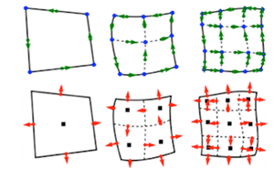

# Features

The goal of MFEM is to enable research and development of scalable finite element discretization and solver algorithms through general finite element abstractions, accurate and flexible visualization, and tight integration with the *[hypre](http://www.llnl.gov/CASC/hypre)* library.

Conceptually, MFEM can be viewed as a finite element toolbox that provides the building blocks for developing finite element algorithms in a manner similar to that of MATLAB for linear algebra methods.

## Higher-order Finite Element Spaces

MFEM supports a wide variety of [finite element](http://mfem.github.io/doxygen/html/inherit_graph_20.svg) [spaces](http://mfem.github.io/doxygen/html/inherit_graph_21.svg) in 2D and 3D, including arbitrary high-order:

 - [H1](examples.md?h1)-conforming, [H(div)](examples.md?hdiv)-conforming, [H(curl)](examples.md?hcurl)-conforming spaces,
 - discontinuous [L2](examples.md?l2) spaces,
 - numerical trace ([interfacial](examples.md?h12)) spaces,
 - [NURBS](examples.md?nurbs) spaces for isogeometric analysis.

Many [bilinear](http://mfem.github.io/doxygen/html/inherit_graph_79.svg) and [linear](http://mfem.github.io/doxygen/html/inherit_graph_47.svg) forms defined on these spaces, as well as linear operators such as gradient, curl and embedding between these spaces, are available in the code.

## Flexible Discretization

In addition to classical Galerkin methods, MFEM enables the quick prototyping of

 - [mixed](examples.md?mixed) finite elements,
 - Discontinuous Galerkin ([DG](examples.md?dg)) methods,
 - [isogeometric](examples.md?nurbs) analysis methods,
 - Discontinuous Petrov-Galerkin ([DPG](examples.md?dpg)) approaches,
 - [Hybridization](examples.md?hybr) and [static condensation](examples.md?staticcond) for high-order problems.

## Wide Range of Mesh Types

MFEM supports arbitrary element [transformations](http://mfem.github.io/doxygen/html/inherit_graph_18.svg) and includes classes for dealing with:

 - triangular, quadrilateral, tetrahedral and hexahedral [elements](http://mfem.github.io/doxygen/html/inherit_graph_17.svg),
 - conforming local mesh refinement (triangular/tetrahedral meshes),
 - non-conforming mesh refinement (quadrilateral/hexahedral meshes), including anisotropic refinement,
 - higher-order elements with [curved](mesh-formats.md#curvilinear-vtk-meshes) boundaries,
 - [surface](https://github.com/mfem/mfem/blob/master/data/square-disc-surf.mesh) meshes embedded in 3D,
 - topologically [periodic](https://github.com/mfem/mfem/blob/master/data/periodic-hexagon.mesh) meshes,
 - 1D meshes.

## Parallel and Scalable

MFEM supports MPI-based parallelism throughout the library, and can readily be used as a scalable unstructured finite element problem generator.

 - MFEM-based [applications](http://www.llnl.gov/casc/blast) have been [scaled](http://www.llnl.gov/casc/blast/parallel.php) to [hundreds of thousands](http://computation.llnl.gov/project/blast/images/blast_strong_vulcan_inline.png) of parallel cores.
 - An experimental support for OpenMP acceleration is also included.

A serial MFEM application typically requires [minimal](http://mfem.github.io/doxygen/html/ex1_8cpp_source.html) [changes](http://mfem.github.io/doxygen/html/ex1p_8cpp_source.html) to transition to a high-performing parallel version of the code, where it can take advantage of the integrated scalable linear solvers from the *[hypre](http://www.llnl.gov/CASC/hypre)* library.

## Built-in Solvers

MFEM is commonly used as a "finite element to linear algebra translator", since it can take a problem described in terms of finite element-type objects, and produce the corresponding linear algebra
[vectors](http://mfem.github.io/doxygen/html/inherit_graph_120.svg) and [sparse matrices](http://mfem.github.io/doxygen/html/inherit_graph_84.svg).

Several matrix storage formats are available including dense, compressed sparse row ([CSR](http://mfem.github.io/doxygen/html/classmfem_1_1SparseMatrix.html)) and parallel compressed sparse row ([ParCSR](http://mfem.github.io/doxygen/html/classmfem_1_1HypreParMatrix.html)). Block vectors, operators and [matrices](http://mfem.github.io/doxygen/html/classmfem_1_1BlockMatrix.html) are also supported.

A variety of solvers are available for the resulting linear algebra systems (or semi-discrete time-integration problems):

 - point-wise and polynomial [serial](http://mfem.github.io/doxygen/html/classmfem_1_1SparseSmoother.html) and [parallel](http://mfem.github.io/doxygen/html/classmfem_1_1HypreSmoother.html) smoothers,

 - [Krylov solvers](http://mfem.github.io/doxygen/html/classmfem_1_1IterativeSolver.html), such as PCG, MINRES and GMRES applicable to general [operators](http://mfem.github.io/doxygen/html/inherit_graph_84.svg) in serial and in parallel,
 - parallel eigensolvers: [LOBPCG](examples.md?lobpcg) and [AME](examples.md?ame),
 - high-performance preconditioners from the *[hypre](http://www.llnl.gov/CASC/hypre)* library including the [BoomerAMG](examples.md?amg), [AMS](examples.md?ams) and [ADS](examples.md?ads) solvers,
 - discretization-specific solvers for electromagnetic, elasticity, hybridization and DPG methods,
 - sequential sparse direct solvers from the [SuiteSparse](http://faculty.cse.tamu.edu/davis/suitesparse.html) library,
 - explicit and implicit high-order Runge-Kutta [time integrators](http://mfem.github.io/doxygen/html/inherit_graph_83.svg),
 - solvers for nonlinear problems (Newton) and for single linearly constrained [quadratic minimization](http://mfem.github.io/doxygen/html/classmfem_1_1SLBQPOptimizer.html) problems.

## Extensive Examples

MFEM includes a number of well-documented [example codes](examples.md) that can be used as tutorials, as well as simple starting points for user applications. Some of the included example codes are:

 - [Example 1](http://mfem.github.io/doxygen/html/ex1_8cpp_source.html): nodal H1 FEM for the Laplace problem,
 - [Example 2](http://mfem.github.io/doxygen/html/ex2_8cpp_source.html): vector FEM for linear elasticity,
 - [Example 3](http://mfem.github.io/doxygen/html/ex3_8cpp_source.html): Nedelec H(curl) FEM for the definite Maxwell problem,
 - [Example 4](http://mfem.github.io/doxygen/html/ex4_8cpp_source.html): Raviart-Thomas H(div) FEM for the grad-div problem,
 - [Example 5](http://mfem.github.io/doxygen/html/ex5_8cpp_source.html): mixed pressure-velocity FEM for the Darcy problem,
 - [Example 6](http://mfem.github.io/doxygen/html/ex6_8cpp_source.html): non-conforming adaptive mesh refinement for the Laplace problem,
 - [Example 7](http://mfem.github.io/doxygen/html/ex7_8cpp_source.html): Laplace problem on a surface (the unit sphere),
 - [Example 8](http://mfem.github.io/doxygen/html/ex8_8cpp_source.html): Discontinuous Petrov-Galerkin (DPG) for the Laplace problem,
 - [Example 9](http://mfem.github.io/doxygen/html/ex9_8cpp_source.html): Discontinuous Galerkin (DG) time-dependent advection,
 - [Example 10](http://mfem.github.io/doxygen/html/ex10_8cpp_source.html): time-dependent implicit nonlinear elasticity,
 - [Example 11](http://mfem.github.io/doxygen/html/ex11p_8cpp_source.html): parallel Laplace eigensolver,
 - [Example 12](http://mfem.github.io/doxygen/html/ex12p_8cpp_source.html): parallel linear elasticity eigensolver,
 - [Example 13](http://mfem.github.io/doxygen/html/ex13p_8cpp_source.html): parallel Maxwell eigensolver,
 - [Example 14](http://mfem.github.io/doxygen/html/ex14_8cpp_source.html): Discontinuous Galerkin (DG) for the Laplace problem.

Most of the examples have a serial and a parallel version, illustrating the ease of transition and the minimal code changes between the two.

Beyond the examples, a number of miniapps are available that are more representative of the advanced usage of the library in physics/application codes. Some of the included miniapps are:

 - [Volta](http://mfem.github.io/doxygen/html/volta_8cpp_source.html): simple electrostatics simulation code,
 - [Tesla](http://mfem.github.io/doxygen/html/volta_8cpp_source.html): simple magnetostatics simulation code,
 - [Mesh Explorer](http://mfem.github.io/doxygen/html/mesh-explorer_8cpp_source.html): visualize and manipulate meshes.

## Accurate and Flexible Visualization

The general (high-order) meshes and finite element functions in MFEM can be visualized accurately using the companion OpenGL visualization tool [GLVis](http://glvis.org), which is built on top of MFEM.

The [VisIt](http://visit.llnl.gov) visualization and analysis tool also natively supports MFEM formats.

## Lightweight, Portable and Easily Extendable

The MFEM code base is [relatively small](download.md) and is written in highly portable C++ (e.g. with very limited use of templates and the STL).

 - The serial version of MFEM has no external dependencies and is [straightforward to build](building.md) on Linux, Mac and Windows machines.
 - The MPI-parallel version uses two third-party libraries (*hypre* and METIS), and is also easy to build with an MPI compiler.
 - On most machines, both versions can be built in under a minute by typing: "`make serial -j`" and "`make parallel -j`" respectively.

The object-oriented design of MFEM [separates](http://mfem.github.io/doxygen/html/index.html) the mesh, finite element and linear algebra abstractions, making it easy to extend the library and adapt it to a variety of [applications](publications.md).

## Open Source

MFEM is an open-source software, and can be freely used under the terms of the [LGPL 2.1](https://www.gnu.org/licenses/lgpl-2.1.html) license.
