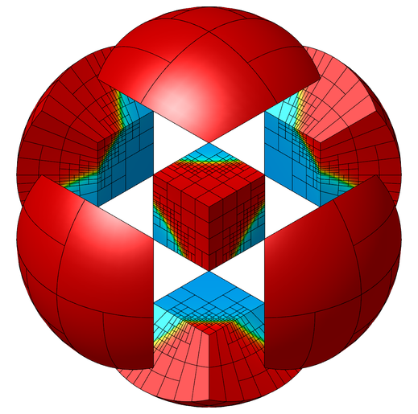
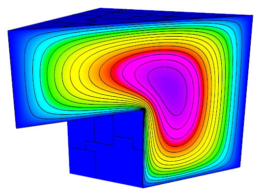
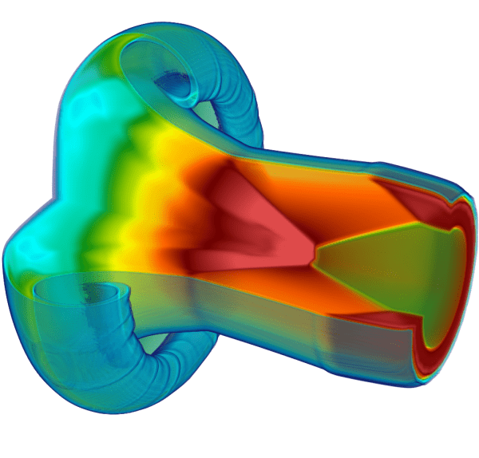
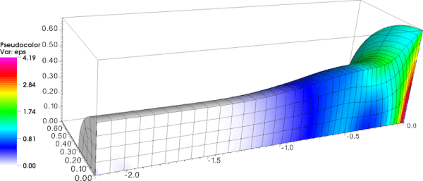
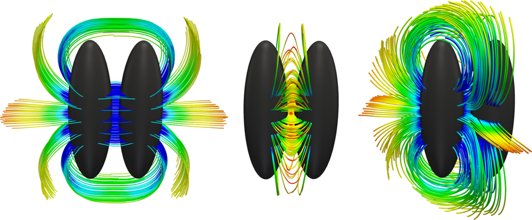
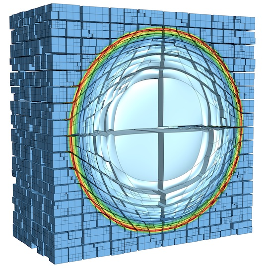
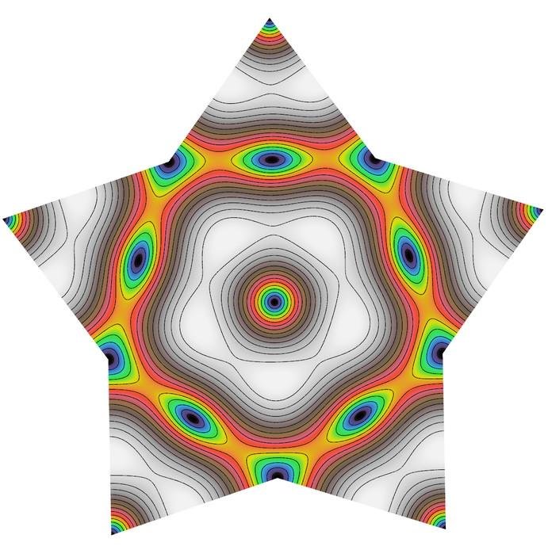
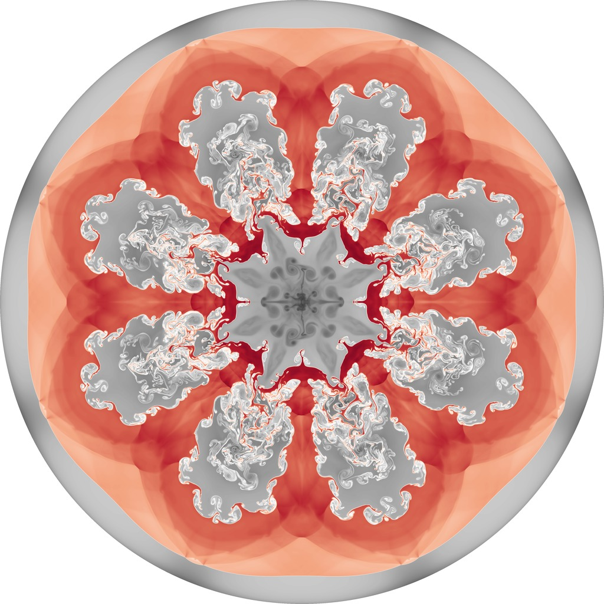
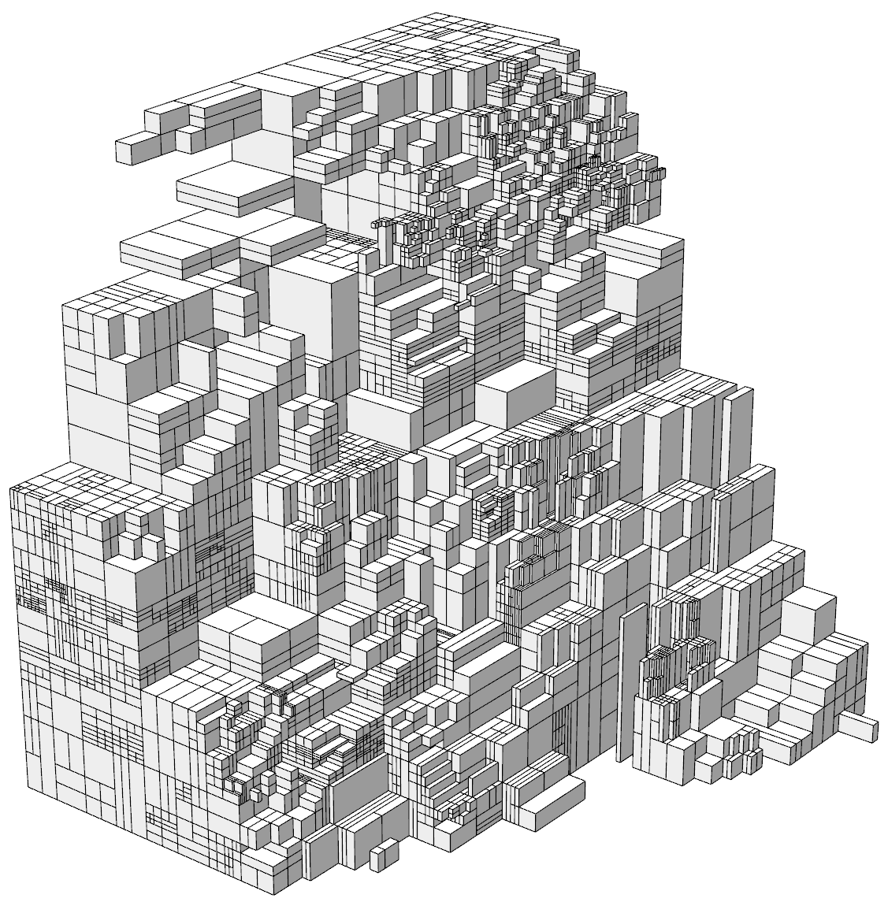
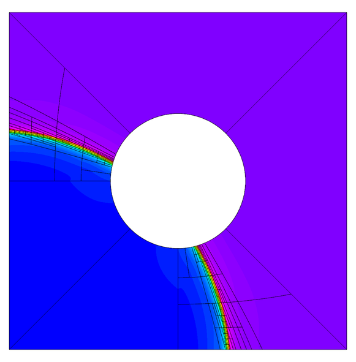

# Gallery

This page collects screenshots from various simulations based on MFEM. Additional images can be found in the [GLVis gallery](http://glvis.org/gallery/).

 

*A version of the MFEM logo demonstrating curvilinear elements, [adaptive mesh refinement](examples.md?amr) and (idealized) parallel partitioning. Visualization with [GLVis](http://glvis.org).*

----

*Level lines in a cutting plane of the solution from the parallel version of [Example 1](http://mfem.github.io/doxygen/html/ex1p_8cpp_source.html) on 64 processors with [fichera.mesh](https://github.com/mfem/mfem/blob/master/data/fichera.mesh). Visualization with [GLVis](http://glvis.org).*

----

*Solution of a Maxwell problem on a Klein bottle. Mesh generated with the [klein-bottle](http://mfem.github.io/doxygen/html/klein-bottle_8cpp_source.html) miniapp. Solution with [Example 3](http://mfem.github.io/doxygen/html/ex3_8cpp_source.html).*

----

*Level surfaces in the interior of the solution from [Example 1](http://mfem.github.io/doxygen/html/ex1_8cpp_source.html) on [escher.mesh](https://github.com/mfem/mfem/blob/master/data/escher.mesh). Visualization with [GLVis](http://glvis.org).*

----

*3D Arbitrary Lagrangian-Eulerian (ALE) simulation of a shock-triple point interaction with Q2-Q1 elements in the MFEM-based [BLAST](http://www.llnl.gov/casc/blast) shock hydrodynamics code. Volume visualization with [VisIt](http://visit.llnl.gov).*

---

*Modeling elastic-plastic flow in the 3D Taylor high-velocity impact problem using 4th order mixed elements in the MFEM-based [BLAST](http://www.llnl.gov/casc/blast) shock hydrodynamics code. Visualization with [VisIt](http://visit.llnl.gov).*

*Streamlines of the magnetic field from a [parallel computation](http://computation.llnl.gov/project/linear_solvers/pubs/Kolev-2009-par-aux-space.pdf) of the magnetostatic interaction of two magnetic orbs. Visualization with [VTK](http://www.vtk.org/).*

----

*Test of the propagation of a spherical shock wave through a random non-conforming mesh in the MFEM-based [BLAST](http://www.llnl.gov/casc/blast) shock hydrodynamics code. Visualization with [GLVis](http://glvis.org).*

----

*An electromagnetic eigenmode of a star-shaped domain computed with 3rd order finite elements computed with [Example 13](http://mfem.github.io/doxygen/html/ex13p_8cpp_source.html).*

----

*High-order multimaterial inertial confinement fusion (ICF)-like implosion in the MFEM-based [BLAST](http://www.llnl.gov/casc/blast) shock hydrodynamics code. Visualization with [VisIt](http://visit.llnl.gov).*

----

*Test of the anisotropic refinement feature on a random mesh. A slightly modified version of [Example 1](http://mfem.github.io/doxygen/html/ex1_8cpp_source.html). Visualization with [GLVis](http://glvis.org).*

*Purely Lagrangian Rayleigh-Taylor instability simulation using 8th order mixed elements in the MFEM-based [BLAST](http://www.llnl.gov/casc/blast) shock hydrodynamics code. Visualization with [GLVis](http://glvis.org).*

----

*Multi-mode Rayleigh-Taylor instability simulation using 4th order mixed elements in the MFEM-based [BLAST](http://www.llnl.gov/casc/blast) shock hydrodynamics code. Visualization with [VisIt](http://visit.llnl.gov).*

----

*Anisotropic refinement in a 2D shock-like AMR test problem. Visualization with [GLVis](http://glvis.org).*

----

*Parallel version of [Example 1](http://mfem.github.io/doxygen/html/ex1p_8cpp_source.html) on 100 processors with a relatively coarse version of [square-disc.mesh](https://github.com/mfem/mfem/blob/master/data/square-disc.mesh). Visualization with [GLVis](http://glvis.org).*

----

*Anisotropic refinement in a 3D version of the AMR test. Portion of the spherical domain is cut away in [GLVis](http://glvis.org).*

