# Gallery

This page collects screenshots from various simulations based on MFEM. Additional images can be found in the [GLVis gallery](http://glvis.org/gallery/).

 

*A version of the MFEM logo demonstrating curvilinear elements, [adaptive mesh refinement](examples.md?amr) and (idealized) parallel partitioning. Visualization with [GLVis](http://glvis.org).*

----

[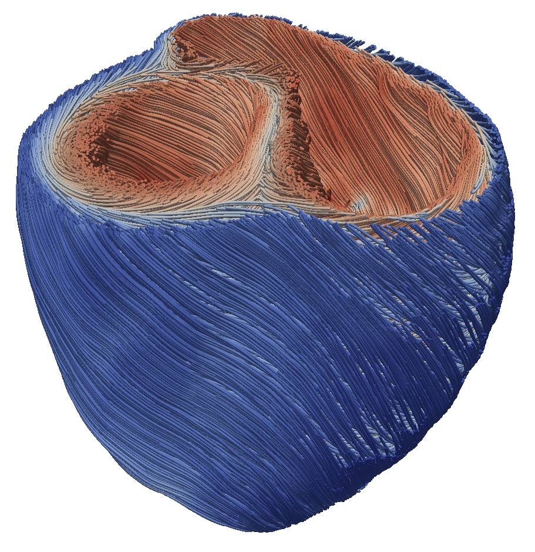](img/gallery/cardioid.png)

*Fibers generated by LDRB approach based on 4 Laplacian solves in the [Cardioid](https://education.llnl.gov/programs/science-on-saturday/lecture/541) project.*

----

*Solution of a Maxwell problem on a Klein bottle. Mesh generated with the [klein-bottle](http://mfem.github.io/doxygen/html/klein-bottle_8cpp_source.html) miniapp. Solution with [Example 3](http://mfem.github.io/doxygen/html/ex3_8cpp_source.html).*

----

[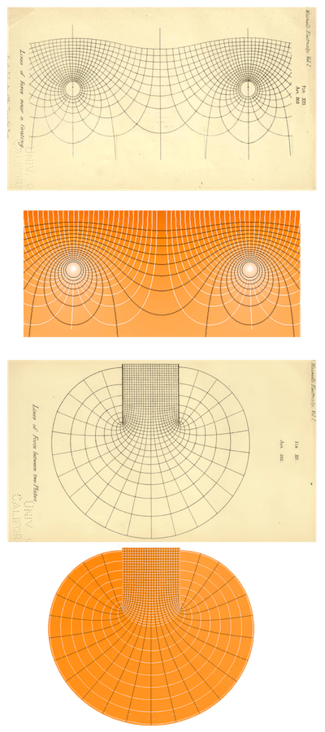](img/gallery/maxwell-eq-full.png)

*Comparisons of equipotential surfaces and force lines from Maxwell's [Treatise on Electricity and Magnetism](https://archive.org/details/ATreatiseOnElectricityMagnetism-Volume1/page/n552) with results from MFEM's [Volta miniapp](http://mfem.github.io/doxygen/html/volta_8cpp_source.html).*

----

*Level surfaces in the interior of the solution from [Example 1](http://mfem.github.io/doxygen/html/examples_2ex1_8cpp_source.html) on [escher.mesh](https://github.com/mfem/mfem/blob/master/data/escher.mesh). Visualization with [GLVis](http://glvis.org).*

----

*3D Arbitrary Lagrangian-Eulerian (ALE) simulation of a shock-triple point interaction with Q2-Q1 elements in the MFEM-based [BLAST](http://www.llnl.gov/casc/blast) shock hydrodynamics code. Volume visualization with [VisIt](http://visit.llnl.gov).*

---

*Modeling elastic-plastic flow in the 3D Taylor high-velocity impact problem using 4th order mixed elements in the MFEM-based [BLAST](http://www.llnl.gov/casc/blast) shock hydrodynamics code. Visualization with [VisIt](http://visit.llnl.gov).*

----

[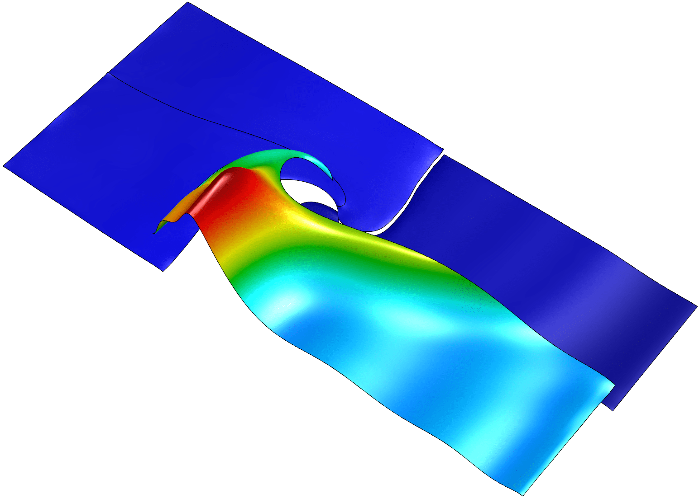](img/gallery/triple-pt-2x2-q12-3d.png)

*[Triple point shock interaction](https://computation.llnl.gov/projects/blast/triple-point-shock-interaction) on 4 elements of order 12.  Note the element curvature and the high variation of the field inside the lower right element.*

----

[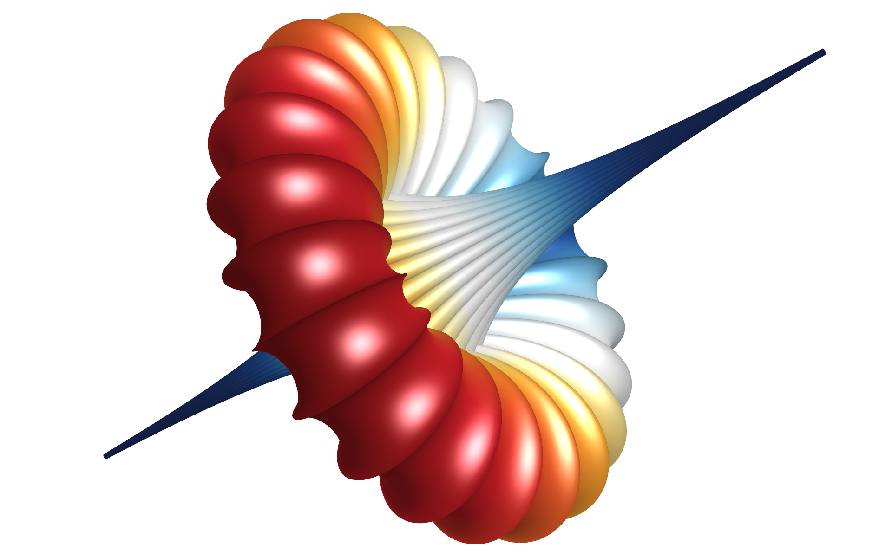](img/gallery/breather.png)

*Poisson problem on a "Breather" surface. Mesh generated with the [Mesh Explorer](http://mfem.github.io/doxygen/html/mesh-explorer_8cpp_source.html) miniapp. Solution with [Example 1](http://mfem.github.io/doxygen/html/examples_2ex1_8cpp_source.html).*

*Streamlines of the magnetic field from a [parallel computation](http://computation.llnl.gov/hypre/Kolev-2009-par-aux-space.pdf) of the magnetostatic interaction of two magnetic orbs. Visualization with [VTK](http://www.vtk.org/).*

----

*Test of the propagation of a spherical shock wave through a random non-conforming mesh in the MFEM-based [BLAST](http://www.llnl.gov/casc/blast) shock hydrodynamics code. Visualization with [GLVis](http://glvis.org).*

----

*An electromagnetic eigenmode of a star-shaped domain computed with 3rd order finite elements computed with [Example 13](http://mfem.github.io/doxygen/html/ex13p_8cpp_source.html).*

----

*High-order multi-material inertial confinement fusion (ICF)-like implosion in the MFEM-based [BLAST](http://www.llnl.gov/casc/blast) shock hydrodynamics code. Visualization with [VisIt](http://visit.llnl.gov).*

----

[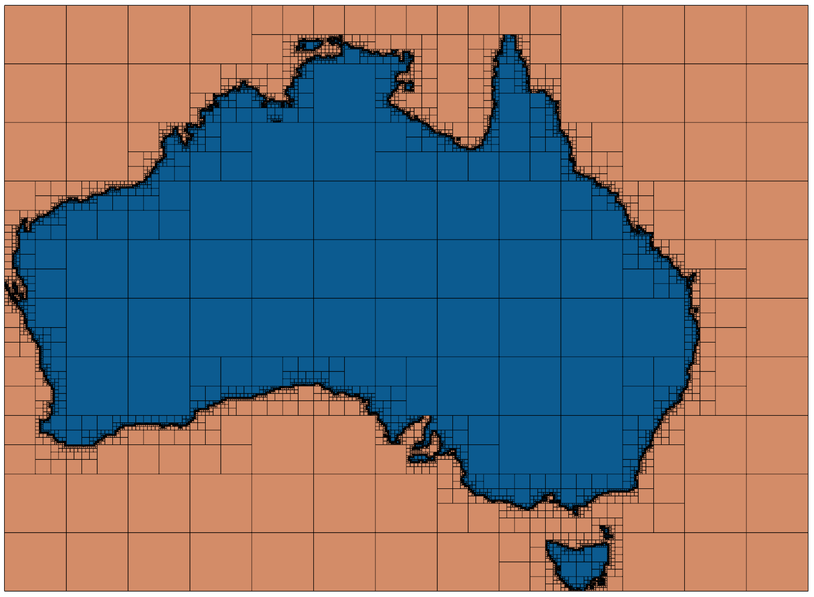](img/gallery/au.png)

*Two-region AMR mesh generated by the [Shaper](http://mfem.github.io/doxygen/html/shaper_8cpp_source.html) miniapp from successive adaptation to the outlines of Australia.*

----

[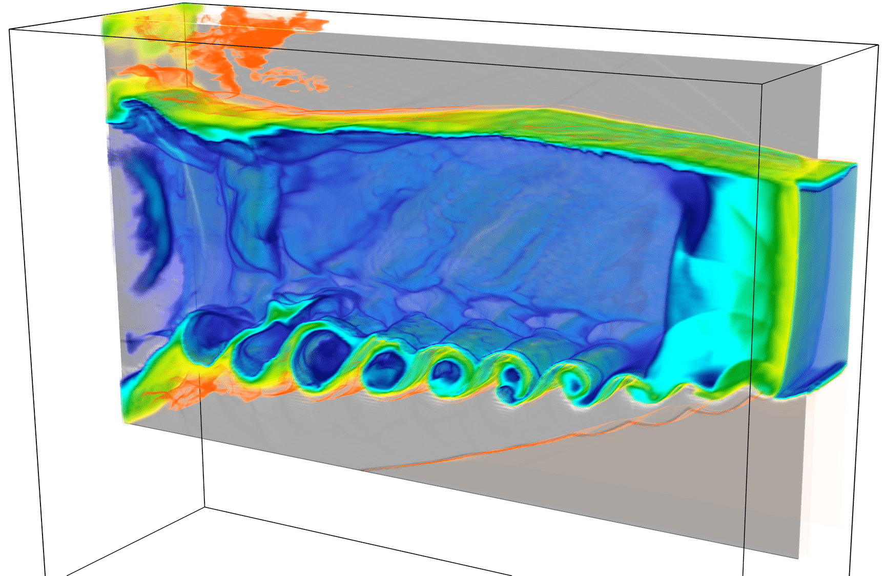](img/gallery/rkh-132.png)

*Radiating Kevin-Helmholtz modeled with the MFEM-based [BLAST](http://www.llnl.gov/casc/blast) shock hydrodynamics code. Volume visualization with [VisIt](http://visit.llnl.gov).*

----

*The [Shaper](http://mfem.github.io/doxygen/html/shaper_8cpp_source.html) miniapp applied to a multi-material input functions described by the iterates of the Mandelbrot set. Visualization with [GLVis](http://glvis.org).*

----

[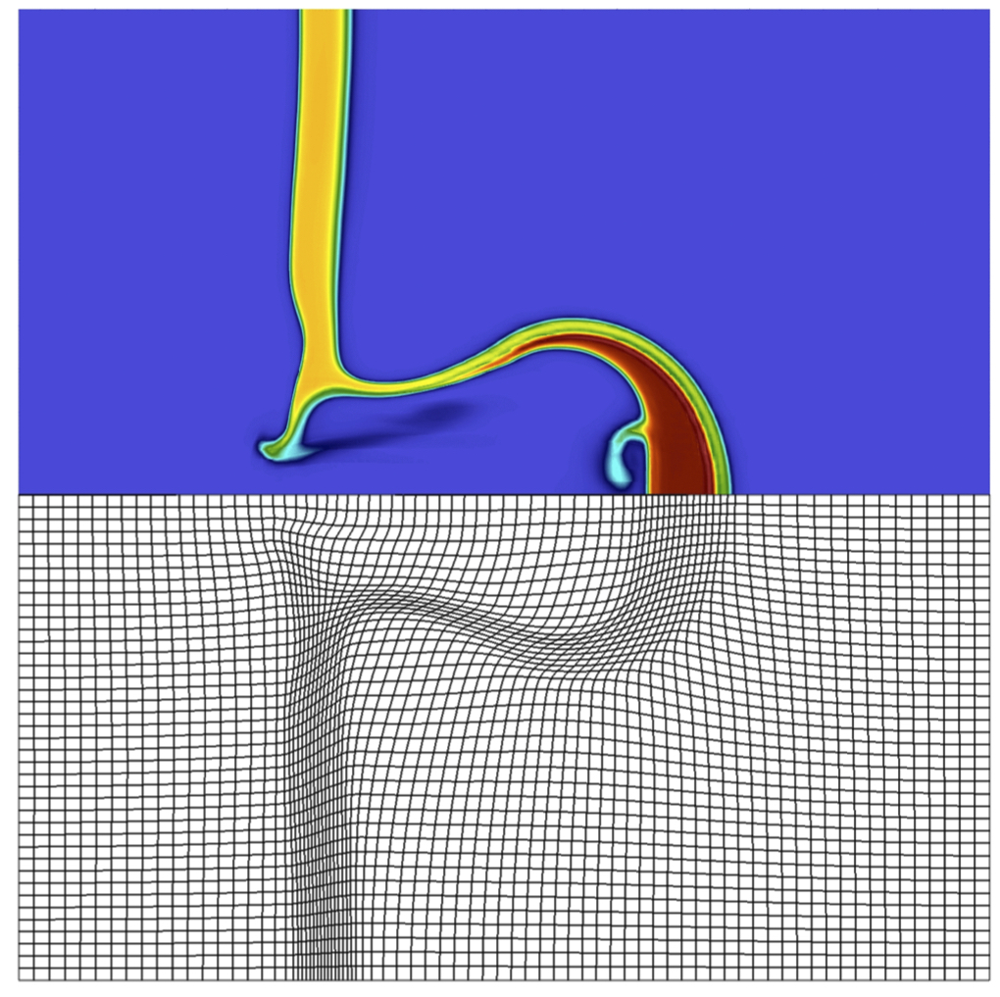](img/gallery/gas_impact.gif)

*Simulation-driven r-adaptivity using [TMOP](https://github.com/mfem/mfem/blob/master/miniapps/meshing/mesh-optimizer.cpp) for a three-material high-velocity gas impact in [BLAST](https://computing.llnl.gov/projects/blast).  Visualization with [VisIt](http://visit.llnl.gov). Click [here](img/gallery/gas_impact.gif) for a movie.*

----

[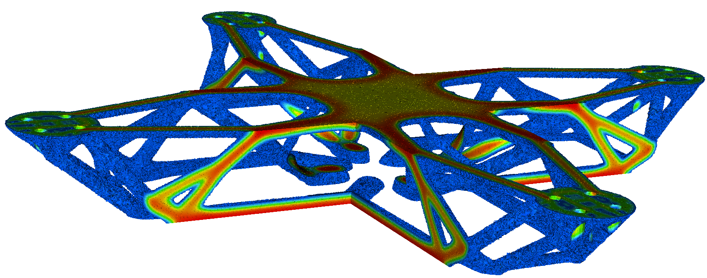](img/gallery/drone.png)

*Topology optimization of a drone body using LLNL's [LiDO project](https://str.llnl.gov/2018-03/tortorelli), based on MFEM.*

[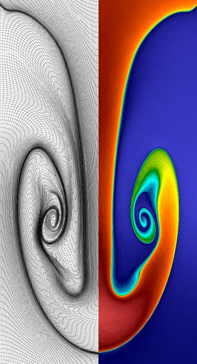](img/gallery/rt-q8-full.png)

*Purely Lagrangian Rayleigh-Taylor instability simulation using 8th order mixed elements in the MFEM-based [BLAST](http://www.llnl.gov/casc/blast) shock hydrodynamics code. Visualization with [GLVis](http://glvis.org).*

----

[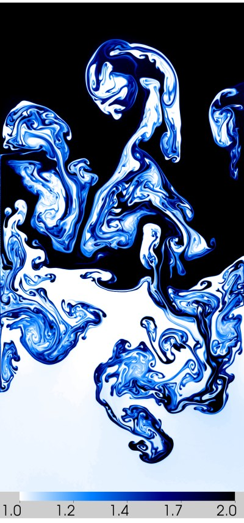](img/gallery/blast_rt_eulerian_q4_t3-full.png)

*Multi-mode Rayleigh-Taylor instability simulation using 4th order mixed elements in the MFEM-based [BLAST](http://www.llnl.gov/casc/blast) shock hydrodynamics code. Visualization with [VisIt](http://visit.llnl.gov).*

----

*Anisotropic refinement in a 2D shock-like AMR test problem. Visualization with [GLVis](http://glvis.org).*

----

[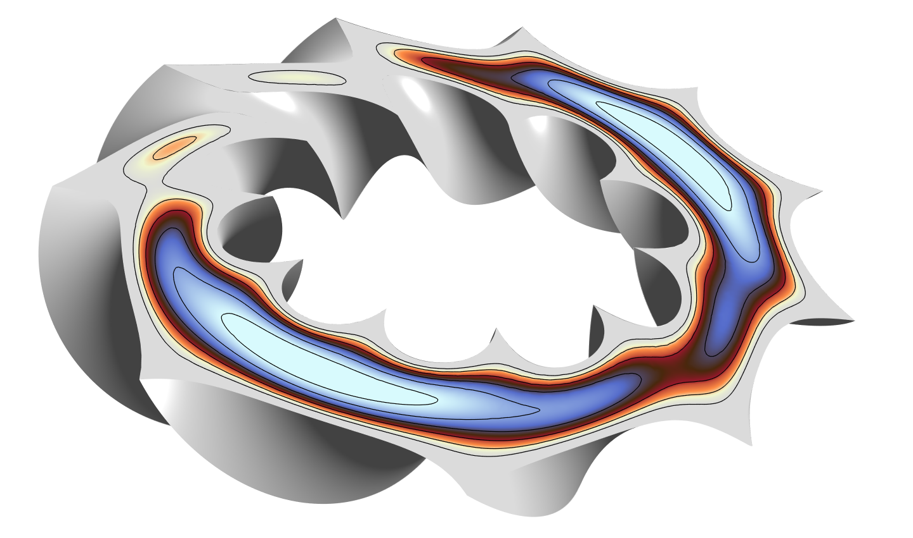](img/gallery/toroid-wedge-o6-s10-ex1-2.png)

*Cut image of the solution from [Example 1](http://mfem.github.io/doxygen/html/examples_2ex1p_8cpp_source.html) on a sharply twisted, high order toroidal mesh.  The mesh was generated with the [toroid](http://mfem.github.io/doxygen/html/toroid_8cpp_source.html) miniapp.*

----

*Parallel version of [Example 1](http://mfem.github.io/doxygen/html/examples_2ex1p_8cpp_source.html) on 100 processors with a relatively coarse version of [square-disc.mesh](https://github.com/mfem/mfem/blob/master/data/square-disc.mesh). Visualization with [GLVis](http://glvis.org).*

----

*Anisotropic refinement in a 3D version of the AMR test. Portion of the spherical domain is cut away in [GLVis](http://glvis.org).*

----

[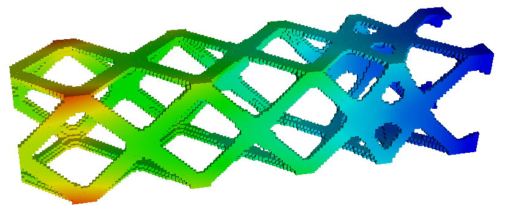](img/gallery/twist.png)

*Structural topology optimization with MFEM in LLNL's [Center for Design and Optimization](https://www.llnl.gov/news/llnl-gears-next-generation-computer-aided-design-and-engineering).*

----

*Test of the anisotropic refinement feature on a random mesh. A slightly modified version of [Example 1](http://mfem.github.io/doxygen/html/examples_2ex1_8cpp_source.html). Visualization with [GLVis](http://glvis.org).*

----

*Level lines in a cutting plane of the solution from the parallel version of [Example 1](http://mfem.github.io/doxygen/html/examples_2ex1p_8cpp_source.html) on 64 processors with [fichera.mesh](https://github.com/mfem/mfem/blob/master/data/fichera.mesh). Visualization with [GLVis](http://glvis.org).*

