# Gallery

This page collects screenshots and videos from various simulations based on MFEM.

Click thumbnails to open full-resolution images or simulation videos.
Video captions include 🎬 and, when available, 🖼️ for a full-resolution still image.

Additional images can be found in the [GLVis gallery](https://glvis.org/gallery/).

 

[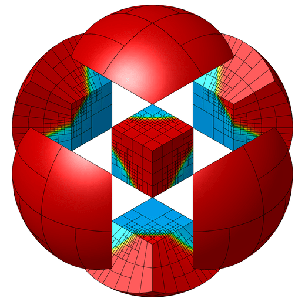{: loading="eager" width="519" height="515"}](img/gallery/logo2-full.png)

*A version of the MFEM logo demonstrating curvilinear elements, [adaptive mesh refinement](examples.md?amr) and (idealized) parallel partitioning. Visualization with [GLVis](https://glvis.org).*

----

[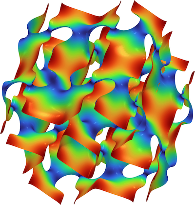{: loading="lazy" width="400" height="419"}](img/gallery/tg-vortex-full.png)

*Incompressible Taylor-Green vortex simulation with high-order finite elements. Visualization with [ParaView](https://www.paraview.org).*

----

[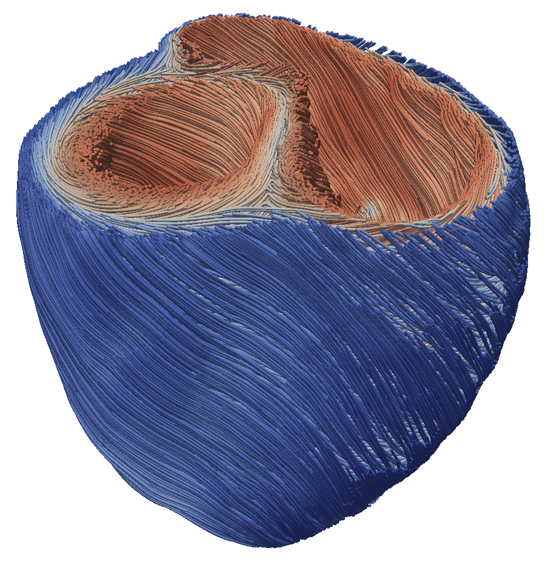{: loading="lazy" width="911" height="940"}](img/gallery/cardioid.png)

*Fibers generated by LDRB approach based on 4 Laplacian solves in the [Cardioid](https://github.com/LLNL/cardioid) project.*

----

[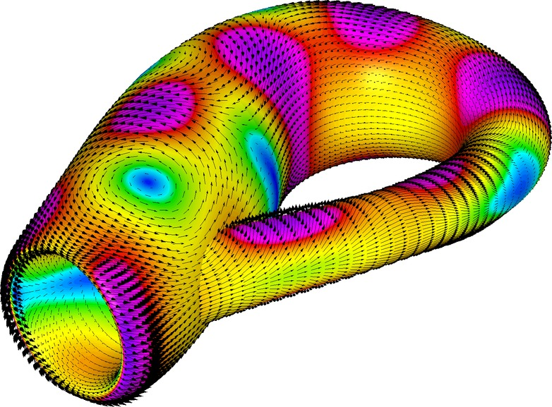{: loading="lazy" width="782" height="577"}](img/gallery/ex3-klein-1-full.png)

*Solution of a Maxwell problem on a Klein bottle. Mesh generated with the [klein-bottle](https://docs.mfem.org/html/klein-bottle_8cpp_source.html) miniapp. Solution with [Example 3](https://docs.mfem.org/html/ex3_8cpp_source.html).*

----

[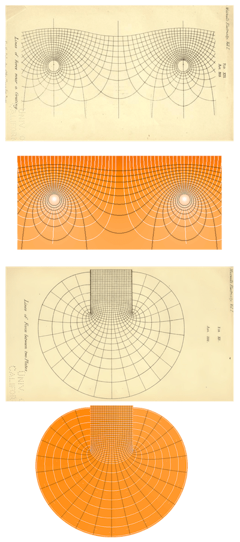{: loading="lazy" width="400" height="901"}](img/gallery/maxwell-eq-full.png)

*Comparisons of equipotential surfaces and force lines from Maxwell's [Treatise on Electricity and Magnetism](https://archive.org/details/treatiseonelectr01maxwrich/page/n525) with results from MFEM's [Volta miniapp](https://docs.mfem.org/html/volta_8cpp_source.html).*

----

[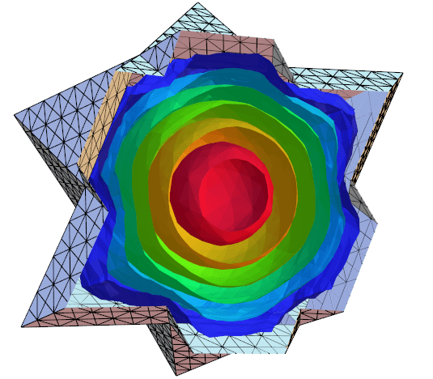{: loading="lazy" width="535" height="468"}](img/gallery/ex1-escher.png)

*Level surfaces in the interior of the solution from [Example 1](https://docs.mfem.org/html/examples_2ex1_8cpp_source.html) on [escher.mesh](https://github.com/mfem/mfem/blob/master/data/escher.mesh). Visualization with [GLVis](https://glvis.org).*

----

[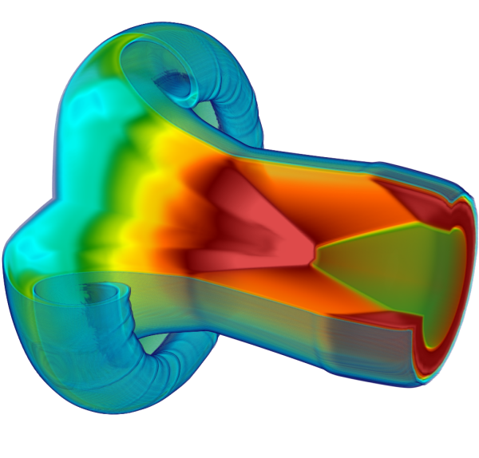{: loading="lazy" width="600" height="574"}](img/gallery/TPblast_3dq2_t2_1024.png)

*3D Arbitrary Lagrangian-Eulerian (ALE) simulation of a shock-triple point interaction with Q2-Q1 elements in the MFEM-based [BLAST](https://www.llnl.gov/casc/blast) shock hydrodynamics code. Volume visualization with [VisIt](https://visit.llnl.gov).*

----

[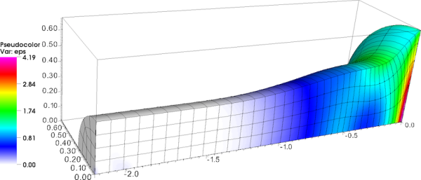{: loading="lazy" width="600" height="257"}](img/gallery/taylor_impact_compare_3d.png)

*Modeling elastic-plastic flow in the 3D Taylor high-velocity impact problem using 4th-order mixed elements in the MFEM-based [BLAST](https://www.llnl.gov/casc/blast) shock hydrodynamics code. Visualization with [VisIt](https://visit.llnl.gov).*

----

[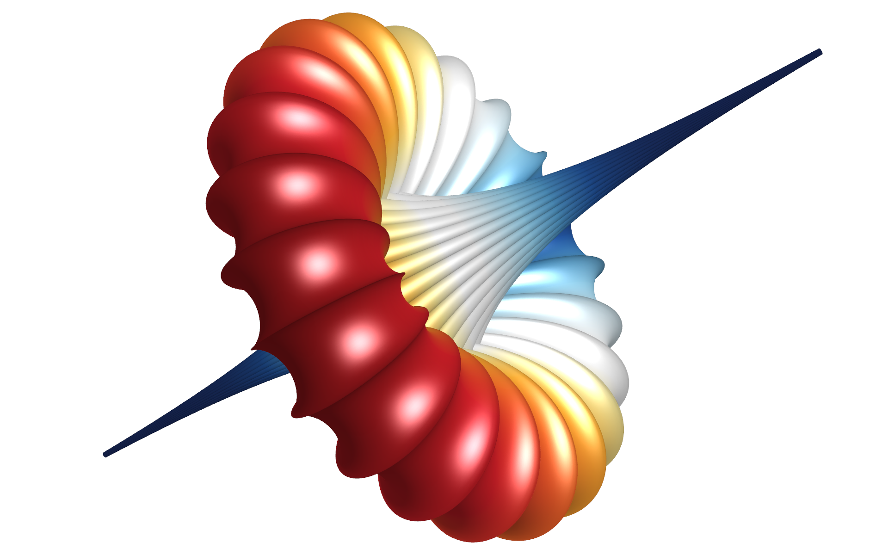{: loading="lazy" width="1920" height="1200"}](img/gallery/breather.png)

*Poisson problem on a "Breather" surface. Mesh generated with the [Mesh Explorer](https://docs.mfem.org/html/mesh-explorer_8cpp_source.html) miniapp. Solution with [Example 1](https://docs.mfem.org/html/examples_2ex1_8cpp_source.html).*

----

[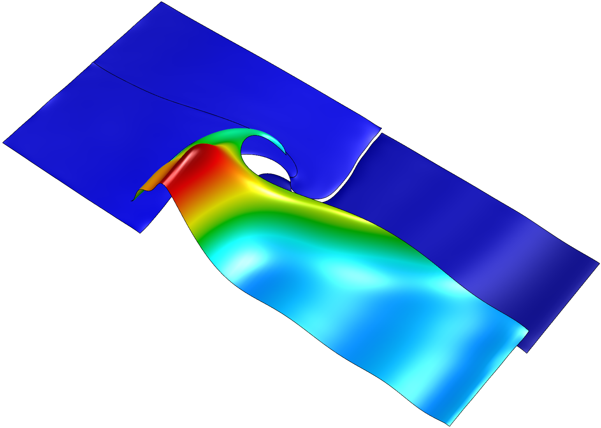{: loading="lazy" width="1544" height="1102"}](img/gallery/triple-pt-2x2-q12-3d.png)

*[Triple point shock interaction](https://computing.llnl.gov/projects/blast/triple-point-shock-interaction) on 4 elements of order 12. Note the element curvature and the high variation of the field inside the lower right element.*

----

[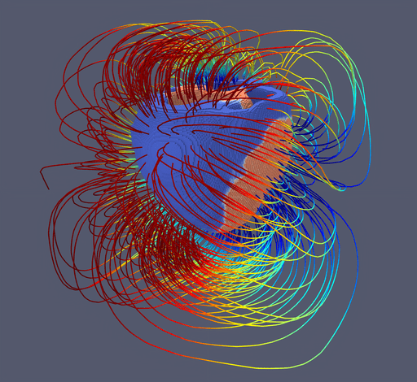{: loading="lazy" width="512" height="470"}](img/gallery/workshop21/rabbit-biventricular-e_field-ogiermann.png)

*<i class="fa fa-trophy"></i> Visualization of the electric field generated by the electrical wave on rabbit heart ventricles during depolarization of the heart. Image courtesy of Dennis Ogiermann, **winner** of the 2021 MFEM Visualization Contest.*

----

[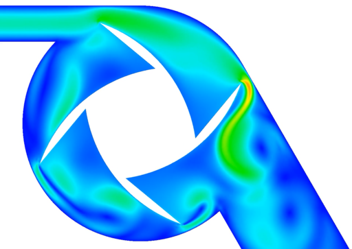{: loading="lazy" width="512" height="363"}](img/gallery/workshop21/turbine.mp4)

*<i class="fa fa-trophy"></i> Incompressible fluid flow around a rotating turbine using a space-time embedded-hybridized discontinuous Galerkin discretization. Image courtesy of Tamas Horvath, **winner** of the 2021 MFEM Visualization Contest.* [🎬](img/gallery/workshop21/turbine.mp4 "Video"){: aria-label="Video"}

----

[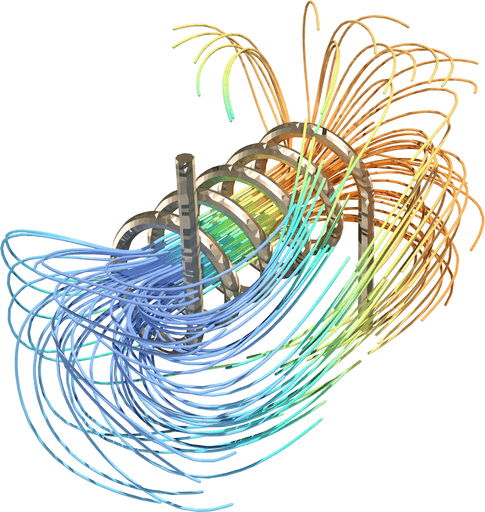{: loading="lazy" width="485" height="512"}](img/gallery/workshop22/coil.mp4)

*<i class="fa fa-trophy"></i> Magnetic diffusion problem solved to compute the magnetic field induced by current running through copper wire in air. Image courtesy of Will Pazner, **winner** of the 2022 MFEM Visualization Contest.* [🎬](img/gallery/workshop22/coil.mp4 "Video"){: aria-label="Video"}

----

[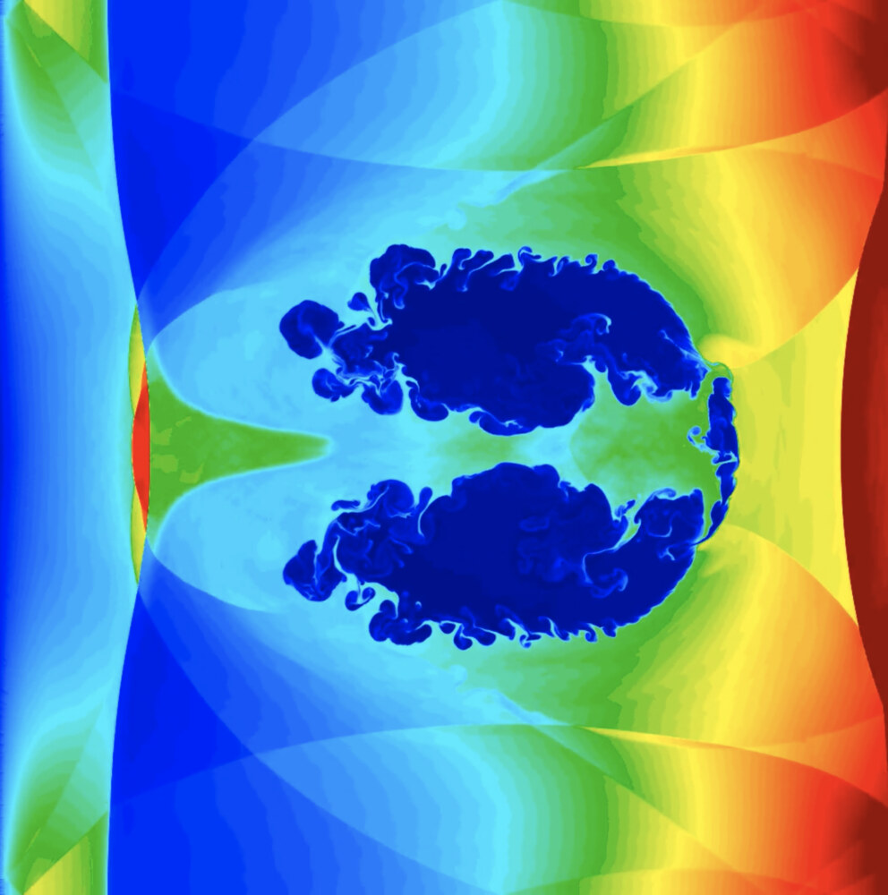{: loading="lazy" width="992" height="1000"}](img/gallery/workshop23/shock-bubble.mp4)

*Shock-bubble interaction using a property-preserving discontinuous Galerkin scheme, see [book](https://doi.org/10.1142/13466). Image courtesy of Hennes Hajduk, as part of the 2023 MFEM Visualization Contest.* [🖼️](img/gallery/workshop23/shock-bubble.png "Full-resolution image"){: aria-label="Full-resolution image"} [🎬](img/gallery/workshop23/shock-bubble.mp4 "Video"){: aria-label="Video"}

----

[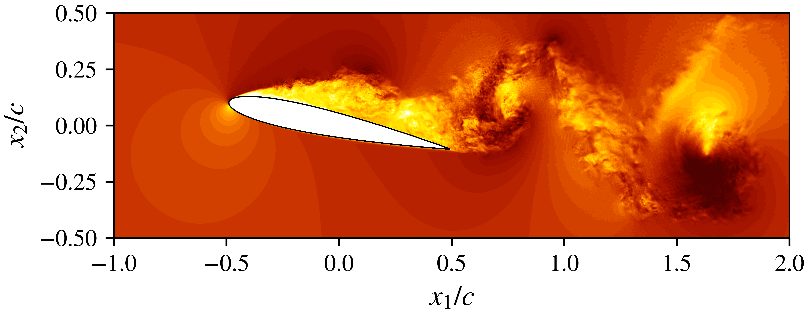{: loading="lazy" width="5650" height="2193"}](img/gallery/workshop23/airfoil_NACA0012.mp4)

*Re=50,000 incompressible Navier-Stokes wall-resolved LES of a NACA 0012 airfoil in stall regime using MFEM's Navier miniapp. Image courtesy of Étienne Spieser, as part of the 2023 MFEM Visualization Contest.* [🎬](img/gallery/workshop23/airfoil_NACA0012.mp4 "Video"){: aria-label="Video"}

----

[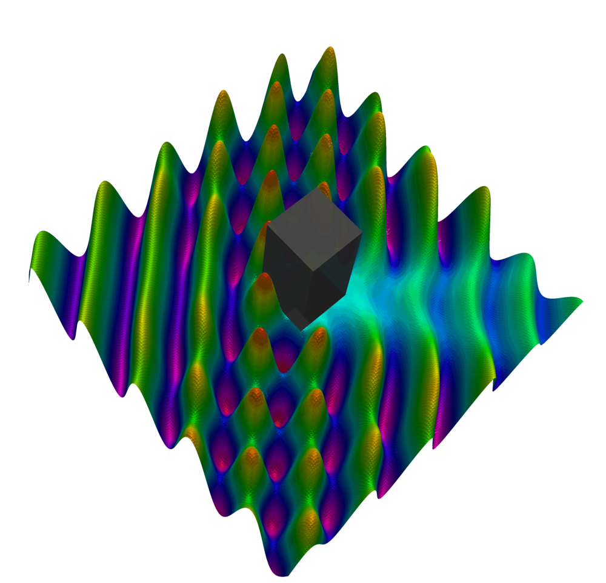{: loading="lazy" width="1000" height="962"}](img/gallery/workshop23/plane_wave.mp4)

*Plane wave scattering from a cube using a DPG ultraweak formulation in MFEM to solve the time-harmonic linear acoustics equations. Image courtesy of Socratis Petrides, as part of the 2023 MFEM Visualization Contest.* [🖼️](img/gallery/workshop23/plane_wave.png "Full-resolution image"){: aria-label="Full-resolution image"} [🎬](img/gallery/workshop23/plane_wave.mp4 "Video"){: aria-label="Video"}

----

[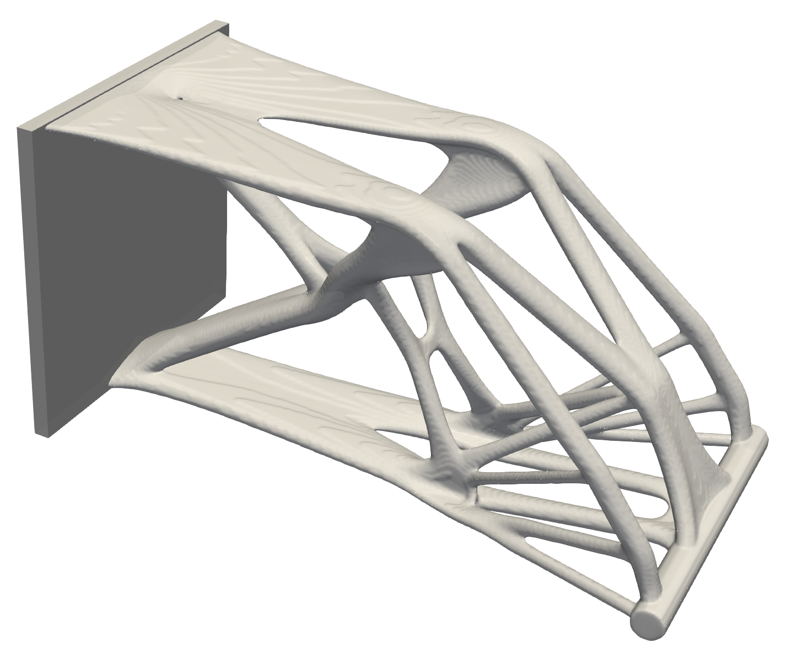{: loading="lazy" width="1428" height="1185"}](img/gallery/workshop24/canti3.png)

*Density-based topology optimization for a cantilever beam with the [SiMPL method](https://arxiv.org/abs/2409.19341). Image courtesy of Dohyun Kim, as part of the 2024 MFEM Visualization Contest.*

----

[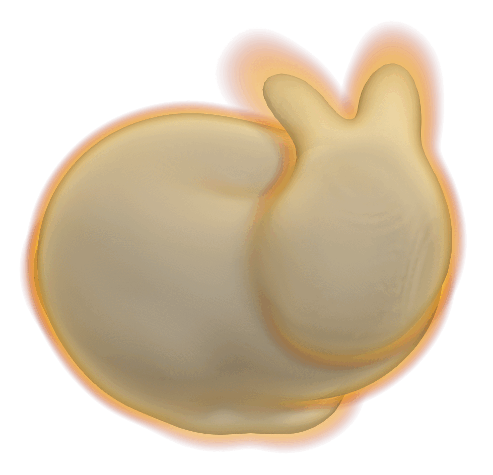{: loading="lazy" width="979" height="943"}](img/gallery/workshop24/T-SB.mp4)

*Shape interpolation between a torus and a bunny by computing their generalized Wasserstein barycenter. This barycenter is obtained by solving a mean-field optimal control problem. Image courtesy of Arjun Vijaywargiya, as part of the 2024 MFEM Visualization Contest.* [🎬](img/gallery/workshop24/T-SB.mp4 "Video"){: aria-label="Video"}

----

[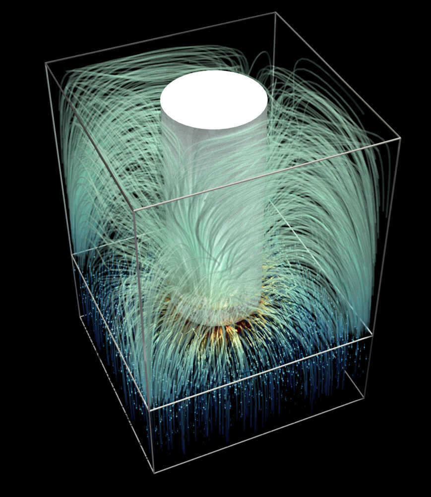{: loading="lazy" width="869" height="1000"}](img/gallery/workshop25/RFA-ElectricField.png)

*<i class="fa fa-trophy"></i> Electric field distribution during a radiofrequency (RF) ablation procedure on an idealized intracardiac geometry. The simulation solves a Poisson problem across three heterogeneous domains using a nonoverlapping domain decomposition approach. Image courtesy of Leonardo Molinari, **winner** of the 2025 MFEM Visualization Contest.*

----

[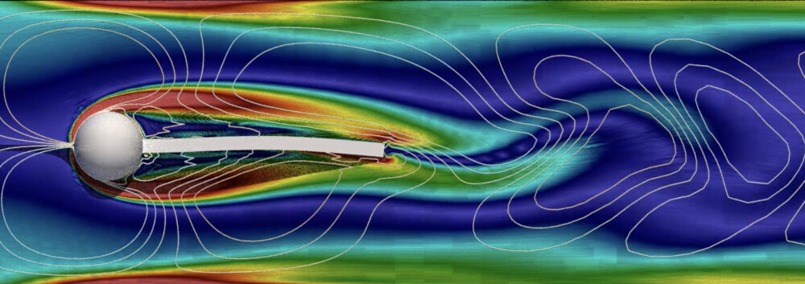{: loading="lazy" width="1000" height="353"}](img/gallery/workshop25/FSI2-Turek.mp4)

*Visualization of a two-dimensional incompressible flow past a cylinder with an attached deformable elastic beam. The simulation uses a strongly coupled partitioned fluid-structure interaction (FSI) solver. Image courtesy of Leonardo Molinari, as part of the 2025 MFEM Visualization Contest.* [🖼️](img/gallery/workshop25/FSI2-Turek.png "Full-resolution image"){: aria-label="Full-resolution image"} [🎬](img/gallery/workshop25/FSI2-Turek.mp4 "Video"){: aria-label="Video"}

----

[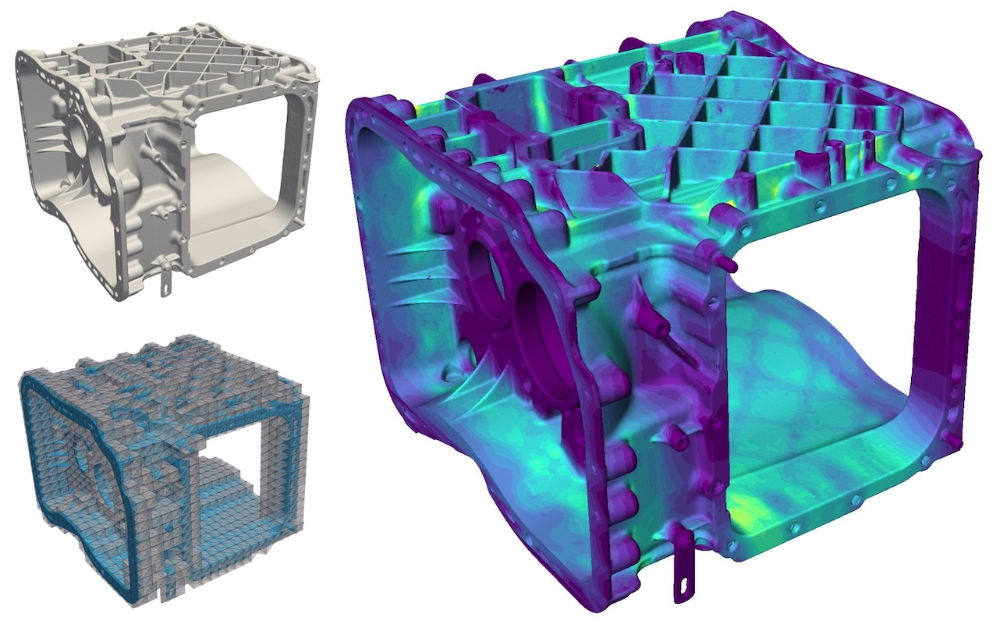{: loading="lazy" width="1282" height="800"}](img/gallery/workshop26/gearbox.jpg)

*<i class="fa fa-trophy"></i> High-order fictitious domain thermal computation on a scan-based geometry: scan; immersed geometry; raw temperature gradient. Image courtesy of Grégory Legrain, **winner** of the 2026 MFEM Visualization Contest.*

----

[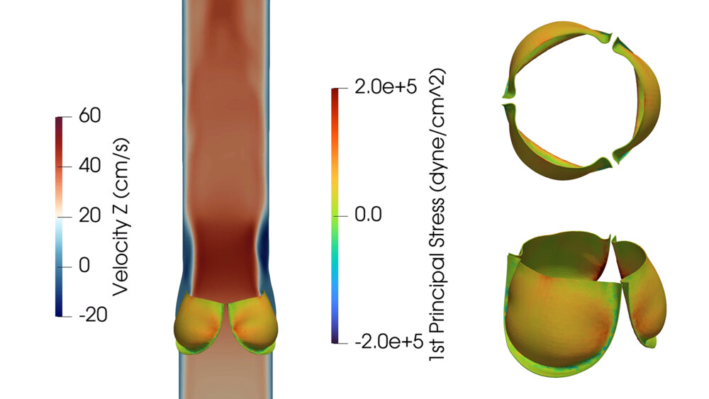{: loading="lazy" width="1000" height="563"}](img/gallery/workshop26/valve-fsi.mp4)

*FSI simulation of semilunar heart valve dynamics under pulsatile blood flow using a VMS-stabilized immersed FSI formulation in the FEBio MFEM iFSI code. Image courtesy of Ryan Black, as part of the 2026 MFEM Visualization Contest.* [🖼️](img/gallery/workshop26/valve-fsi.png "Full-resolution image"){: aria-label="Full-resolution image"} [🎬](img/gallery/workshop26/valve-fsi.mp4 "Video"){: aria-label="Video"}

----

[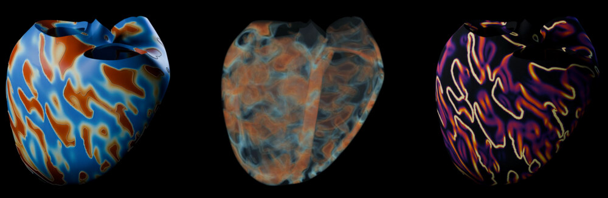{: loading="lazy" width="1000" height="326"}](img/gallery/workshop26/heart-scroll-waves.mp4)

*Formation of three-dimensional scroll waves in a biventricular geometry following an S1–S2 cross-stimulation protocol. The simulation solves the anisotropic Monodomain model with Fenton–Karma kinetics on rule-based (LDRB) myocardial fibers. Image courtesy of Leonardo Molinari, as part of the 2026 MFEM Visualization Contest.* [🖼️](img/gallery/workshop26/heart-scroll-waves.png "Full-resolution image"){: aria-label="Full-resolution image"} [🎬](img/gallery/workshop26/heart-scroll-waves.mp4 "Video"){: aria-label="Video"}

[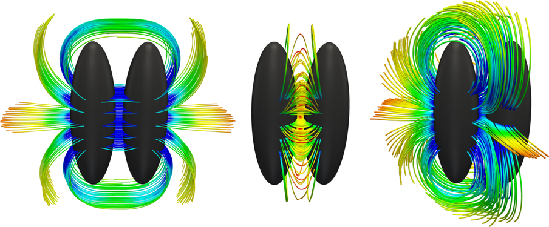{: loading="eager" width="904" height="375"}](img/gallery/uorbs.png)

*Streamlines of the magnetic field from a [parallel computation](https://github.com/hypre-space/hypre/wiki/pubs/Kolev-2009-par-aux-space.pdf) of the magnetostatic interaction of two magnetic orbs. Visualization with [VTK](https://www.vtk.org/).*

----

[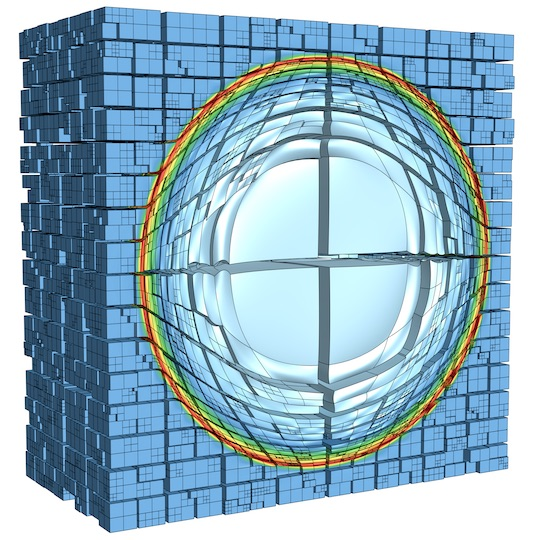{: loading="lazy" width="540" height="540"}](img/gallery/sedov-3d-4096p-2c-full.png)

*Test of the propagation of a spherical shock wave through a random non-conforming mesh in the MFEM-based [BLAST](https://www.llnl.gov/casc/blast) shock hydrodynamics code. Visualization with [GLVis](https://glvis.org).*

----

[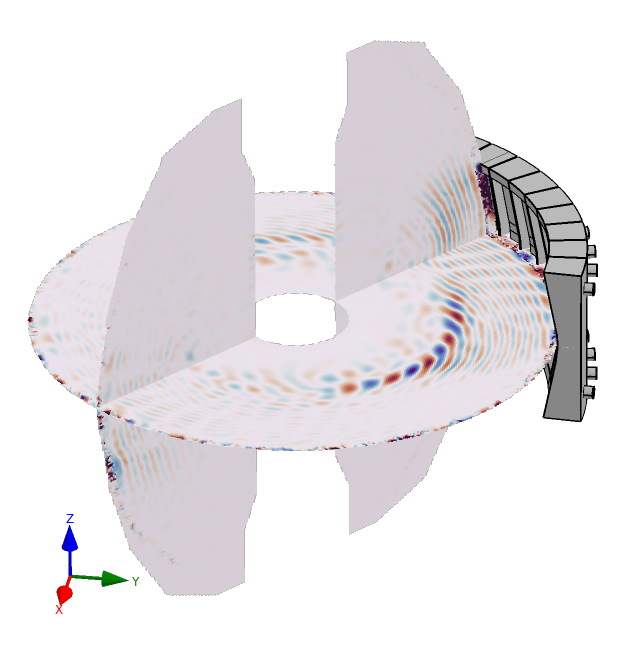{: loading="lazy" width="876" height="854"}](img/gallery/nstxu_hhfw.png)

*Slice image of the high harmonic fast wave propagation in the [NSTX-U](https://nstx-u.pppl.gov/overview) magnetic fusion device. Computed using MFEM's 4th-order H(curl) elements by the [RF-SciDAC project](https://www.rfscidac4.org).*

----

[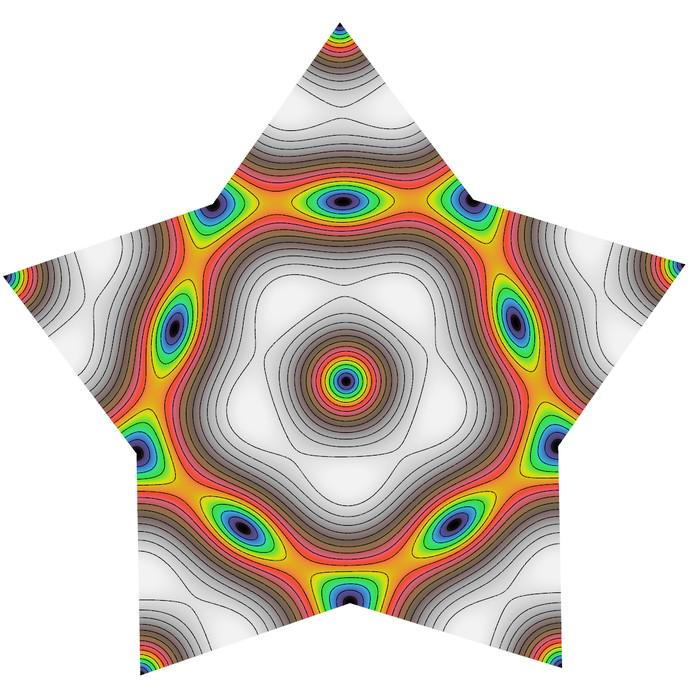{: loading="lazy" width="691" height="689"}](img/gallery/maxwell-snowflake-full.png)

*An electromagnetic eigenmode of a star-shaped domain computed with [Example 13](https://docs.mfem.org/html/ex13p_8cpp_source.html) using 3rd-order finite elements.*

----

[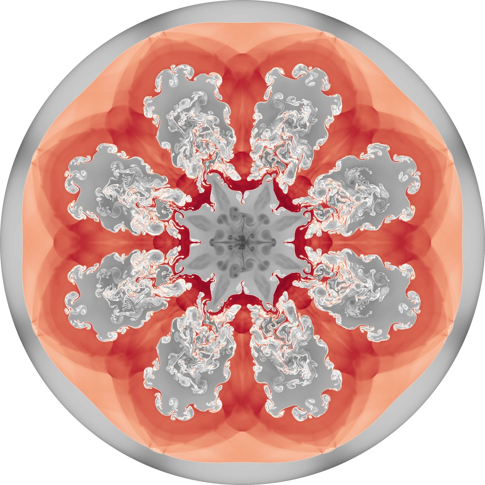{: loading="lazy" width="1024" height="1024"}](img/gallery/hres_icfcyl_4096_5-full.jpg)

*High-order multi-material inertial confinement fusion (ICF)-like implosion in the MFEM-based [BLAST](https://www.llnl.gov/casc/blast) shock hydrodynamics code. Visualization with [VisIt](https://visit.llnl.gov).*

----

[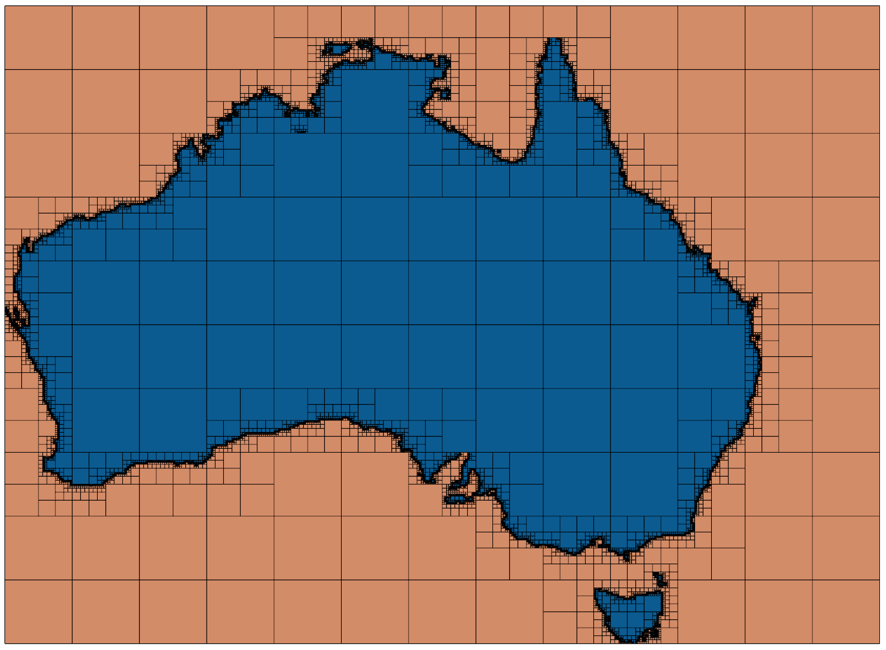{: loading="lazy" width="1587" height="1166"}](img/gallery/au.png)

*Two-region AMR mesh generated by the [Shaper](https://docs.mfem.org/html/shaper_8cpp_source.html) miniapp from successive adaptation to the outlines of Australia.*

----

[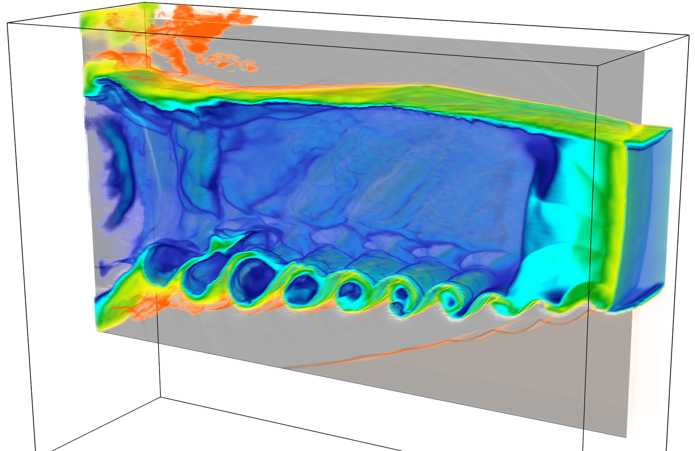{: loading="lazy" width="1729" height="1124"}](img/gallery/rkh-132.png)

*Radiating Kelvin-Helmholtz modeled with the MFEM-based [BLAST](https://www.llnl.gov/casc/blast) shock hydrodynamics code. Volume visualization with [VisIt](https://visit.llnl.gov).*

----

[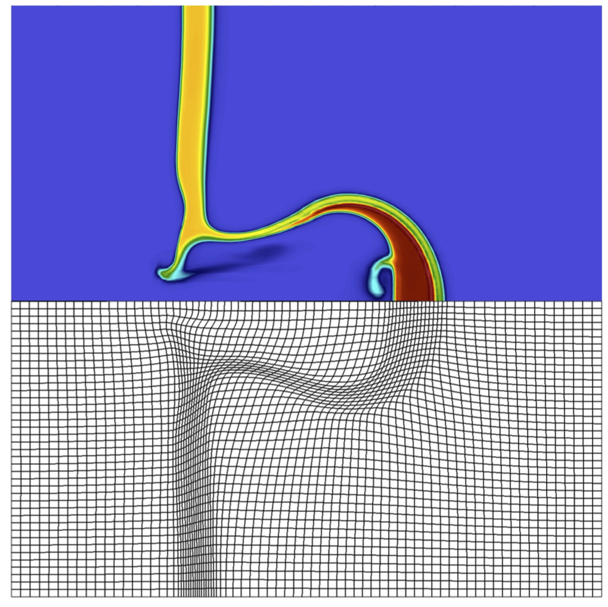{: loading="lazy" width="1020" height="1017"}](img/gallery/gas_impact.mp4)

*Simulation-driven r-adaptivity using [TMOP](https://github.com/mfem/mfem/blob/master/miniapps/meshing/mesh-optimizer.cpp) for a three-material high-velocity gas impact in [BLAST](https://computing.llnl.gov/projects/blast). Visualization with [VisIt](https://visit.llnl.gov).* [🎬](img/gallery/gas_impact.mp4 "Video"){: aria-label="Video"}

----

[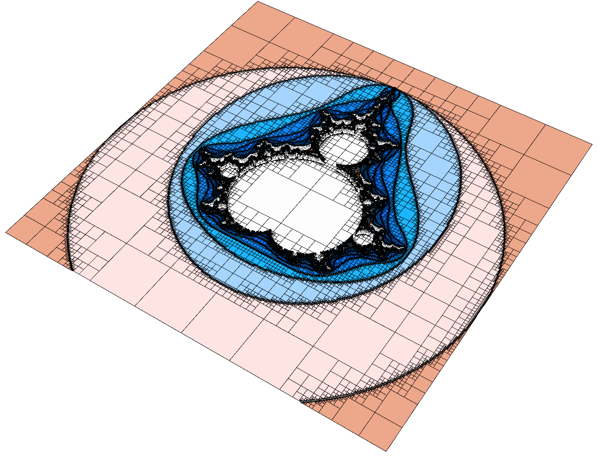{: loading="lazy" width="1322" height="1011"}](img/gallery/mandel.png)

*The [Shaper](https://docs.mfem.org/html/shaper_8cpp_source.html) miniapp applied to multi-material input functions described by the iterates of the Mandelbrot set. Visualization with [GLVis](https://glvis.org).*

----

[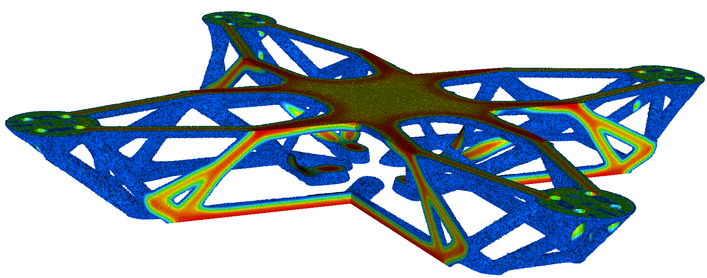{: loading="lazy" width="1748" height="689"}](img/gallery/drone.png)

*Topology optimization of a drone body using LLNL's [LiDO project](https://str.llnl.gov/2018-03/tortorelli), based on MFEM.*

----

[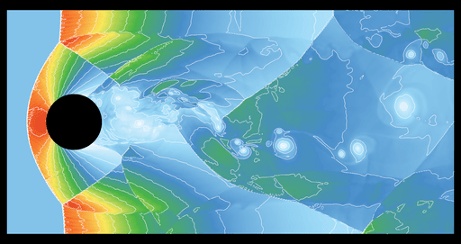{: loading="lazy" width="512" height="271"}](img/gallery/workshop21/GLVis_s00640.png)

*Compressible Euler equations, Mach 3 flow around a cylinder in 2D, stabilized DG-P1 spatial discretization. Image courtesy of Hennes Hajduk, as part of the 2021 MFEM Visualization Contest.*

----

[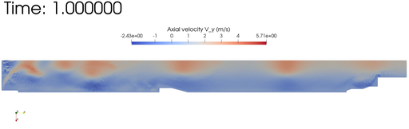{: loading="lazy" width="512" height="162"}](img/gallery/workshop21/v34_mux1_vz_t0_t2.mp4)

*Axisymmetric computation of an air flow in a tube with continuous Galerkin discretization. Image courtesy of Raphael Zanella, as part of the 2021 MFEM Visualization Contest.* [🎬](img/gallery/workshop21/v34_mux1_vz_t0_t2.mp4 "Video"){: aria-label="Video"}

----

[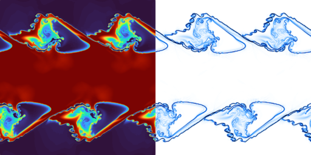{: loading="lazy" width="512" height="256"}](img/gallery/workshop21/kh.mp4)

*Inviscid Kelvin-Helmholtz instability using high-order invariant domain preserving discontinuous Galerkin methods with convex limiting. Image courtesy of Will Pazner, as part of the 2021 MFEM Visualization Contest.* [🎬](img/gallery/workshop21/kh.mp4 "Video"){: aria-label="Video"}

----

[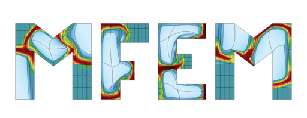{: loading="lazy" width="512" height="198"}](img/gallery/workshop21/mfem.mp4)

*Compressible Euler in Lagrangian frame using the [Laghos](https://github.com/CEED/Laghos) miniapp. Image courtesy of Vladimir Tomov, as part of the 2021 MFEM Visualization Contest.* [🎬](img/gallery/workshop21/mfem.mp4 "Video"){: aria-label="Video"}

----

[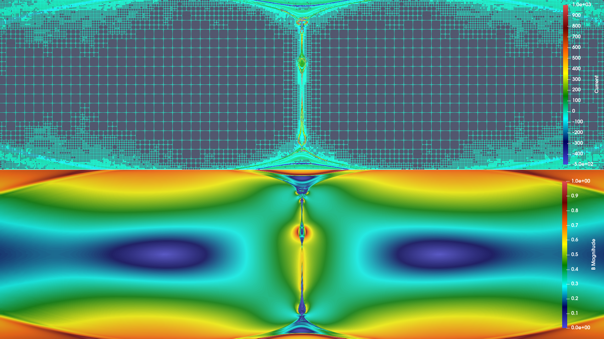{: loading="lazy" width="1920" height="1080"}](img/gallery/island_coalescence.mp4)

*Adaptive, implicit resistive MHD solver (from [TDS-SciDAC](https://tds-scidac.github.io/)) resolves multi-scale features of plasmoid instability.* [🎬](img/gallery/island_coalescence.mp4 "Video"){: aria-label="Video"}

----

[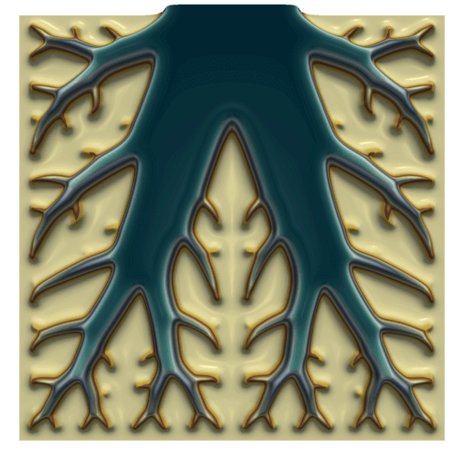{: loading="lazy" width="512" height="503"}](img/gallery/workshop22/heat.mp4)

*<i class="fa fa-trophy"></i> Topology-optimized heat sink obtained by minimizing the thermal energy in a domain with constant internal heating. Image courtesy of Tobias Duswald, **winner** of the 2022 MFEM Visualization Contest.* [🎬](img/gallery/workshop22/heat.mp4 "Video"){: aria-label="Video"}

----

[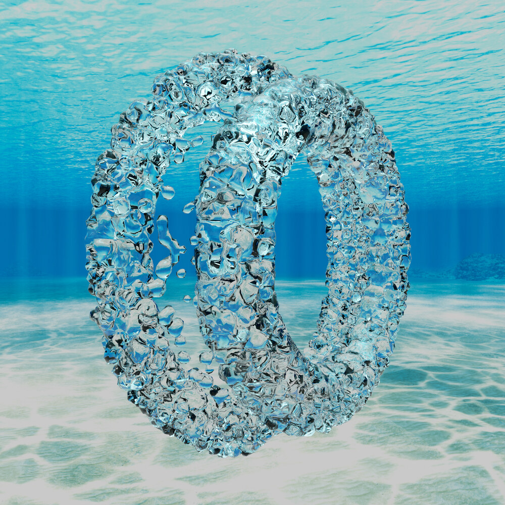{: loading="lazy" width="1000" height="1000"}](img/gallery/workshop23/lf_vortex_rings.mp4)

*<i class="fa fa-trophy"></i> Leapfrogging vortex rings using an incompressible Schrödinger fluid solver in MFEM. Image courtesy of John Camier, **winner** of the 2023 MFEM Visualization Contest.* [🖼️](img/gallery/workshop23/lf_vortex_rings.png "Full-resolution image"){: aria-label="Full-resolution image"} [🎬](img/gallery/workshop23/lf_vortex_rings.mp4 "Video"){: aria-label="Video"}

----

[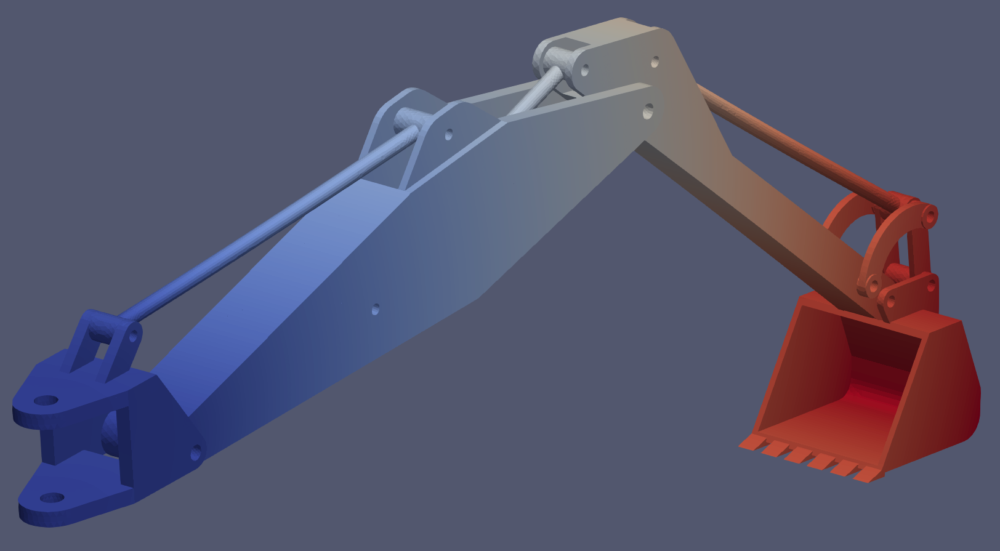{: loading="lazy" width="1624" height="895"}](img/gallery/workshop23/excavator.png)

*<i class="fa fa-trophy"></i> Displacement distribution of a loaded excavator arm under static equilibrium using MFEM's API in an external library. Image courtesy of Mehran Ebrahimi, **winner** of the 2023 MFEM Visualization Contest.*

----

[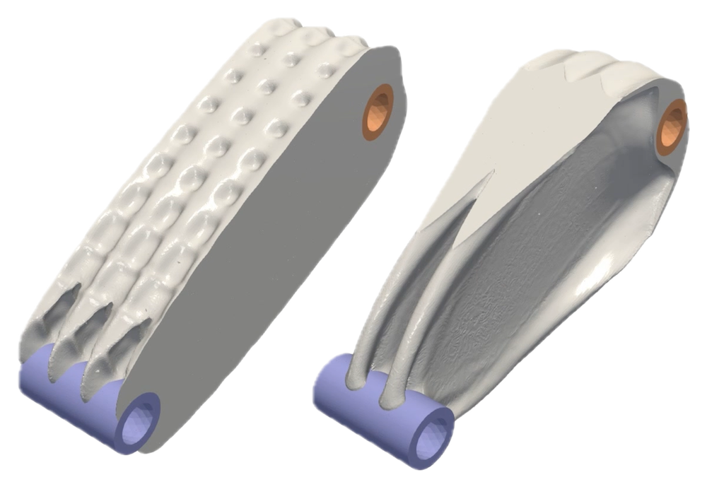{: loading="lazy" width="1000" height="682"}](img/gallery/workshop24/conf-topopt.mp4)

*<i class="fa fa-trophy"></i> Multi-component [topology optimization](https://doi.org/10.1007/s00158-024-03870-3) with conformal meshes. Image courtesy of Mathias Schmidt, **winner** of the 2024 MFEM Visualization Contest.* [🎬](img/gallery/workshop24/conf-topopt.mp4 "Video"){: aria-label="Video"}

----

[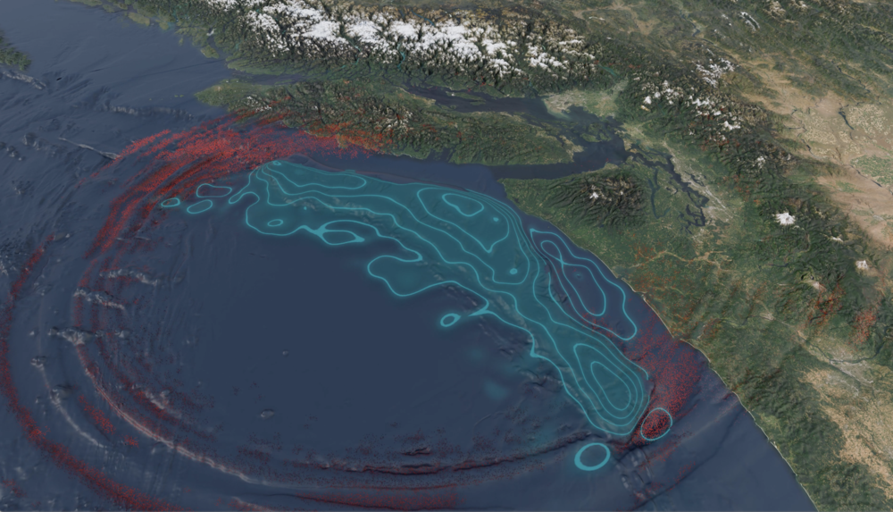{: loading="lazy" width="1000" height="573"}](img/gallery/workshop25/cascadia.mp4)

*<i class="fa fa-trophy"></i> Real-time Bayesian inference at extreme scale: A digital twin for tsunami early warning applied to the Cascadia subduction zone. Image courtesy of the [Cascadia team](https://arxiv.org/abs/2504.16344), **winners** of the 2025 MFEM Visualization Contest.* [🖼️](img/gallery/workshop25/cascadia.png "Full-resolution image"){: aria-label="Full-resolution image"} [🎬](img/gallery/workshop25/cascadia.mp4 "Video"){: aria-label="Video"}

----

[{: loading="lazy" width="1000" height="426"}](img/gallery/workshop25/mfem-particles.mp4)

***Particles lighting up MFEM**.
The new [particle framework](https://github.com/mfem/mfem/pull/4986) is used to inject particles into the MFEM mesh at random positions and velocities, with perfectly elastic collisions to model interaction with domain boundaries. Visualization with [Blender](https://www.blender.org/). Image courtesy of Ketan Mittal and Joe Signorelli.* [🖼️](img/gallery/workshop25/mfem-particles.png "Full-resolution image"){: aria-label="Full-resolution image"} [🎬](img/gallery/workshop25/mfem-particles.mp4 "Video"){: aria-label="Video"}

----

[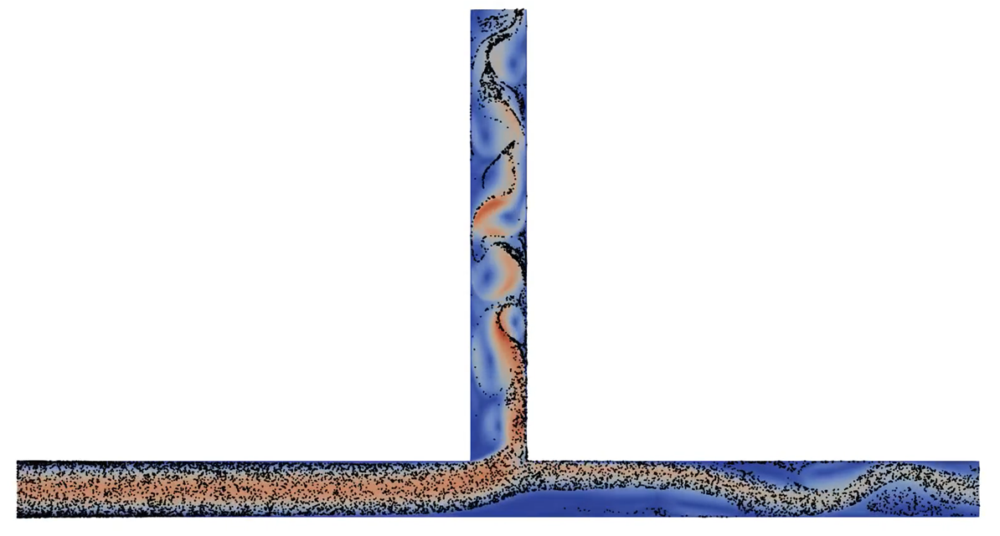{: loading="lazy" width="1194" height="641"}](img/gallery/workshop25/particles.mp4)

*[Particle-laden fluid flow](https://github.com/mfem/mfem/pull/4986) in a 2D bifurcated channel using the Navier miniapp in MFEM. Image courtesy of Joe Signorelli and Ketan Mittal, as part of the 2025 MFEM Visualization Contest.* [🎬](img/gallery/workshop25/particles.mp4 "Video"){: aria-label="Video"}

----

[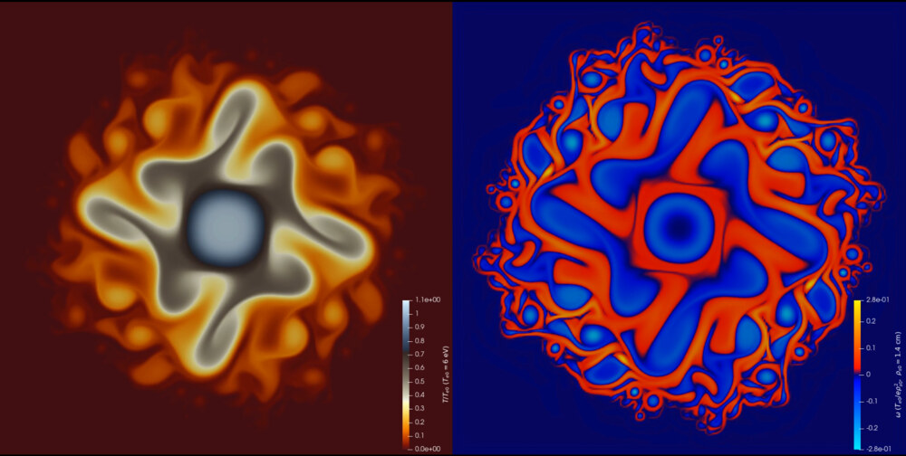{: loading="lazy" width="1000" height="504"}](img/gallery/workshop26/RR2D.mp4)

*<i class="fa fa-trophy"></i> Video of temperature and vorticity evolution in the 2D Rogers-Ricci model in a cross-section of a linear plasma device. Image courtesy of Henrique Bergallo Rocha, **winner** of the 2026 MFEM Visualization Contest.* [🖼️](img/gallery/workshop26/RR2D.png "Full-resolution image"){: aria-label="Full-resolution image"} [🎬](img/gallery/workshop26/RR2D.mp4 "Video"){: aria-label="Video"}

----

[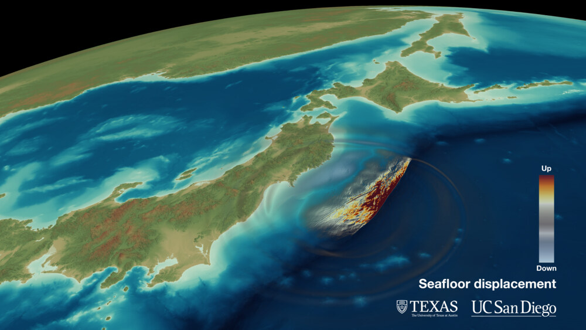{: loading="lazy" width="1000" height="563"}](img/gallery/workshop26/tohoku-oki.mp4)

*Dynamic rupture and acoustic–gravity simulations of the 2011 Tōhoku–Oki earthquake in the Japan Trench. Image courtesy of Stefan Henneking, as part of the 2026 MFEM Visualization Contest.* [🖼️](img/gallery/workshop26/tohoku-oki.png "Full-resolution image"){: aria-label="Full-resolution image"} [🎬](img/gallery/workshop26/tohoku-oki.mp4 "Video"){: aria-label="Video"}

----

[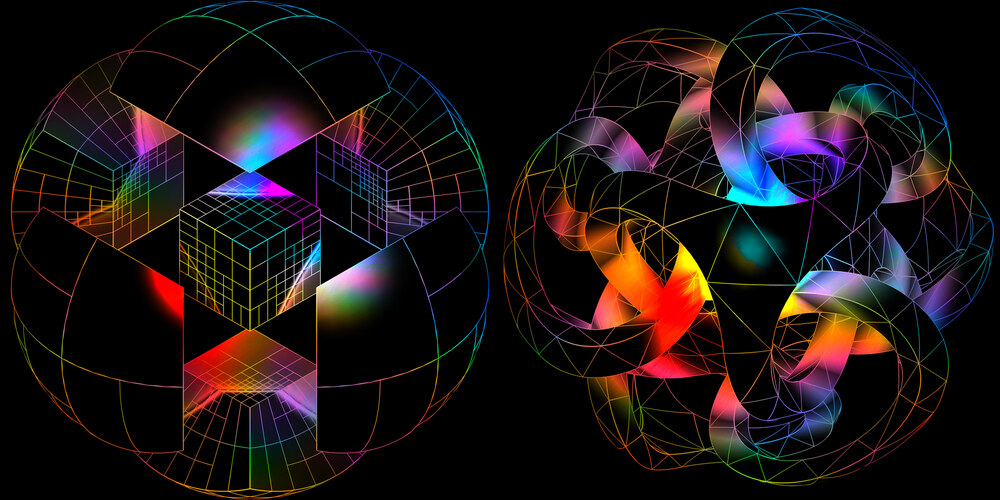{: loading="lazy" width="1000" height="500"}](img/gallery/workshop26/holograms.mp4)

*Spectral Fresnel holograms and diffraction grating of the MFEM and GLVis logos. Image courtesy of John Camier, as part of the 2026 MFEM Visualization Contest.* [🖼️](img/gallery/workshop26/holograms.png "Full-resolution image"){: aria-label="Full-resolution image"} [🎬](img/gallery/workshop26/holograms.mp4 "Video"){: aria-label="Video"}

[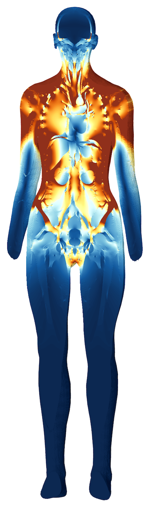{: loading="eager" width="368" height="554"}](img/gallery/mri-full.png)

*Electric field induced by an MRI gradient coil in a human body. Simulation by the [Magnetic Resonance Physics and Instrumentation Group](https://www.nmr.mgh.harvard.edu/lab/mr-pig/research/pns-gradient-coils) at Harvard Medical School.*

----

[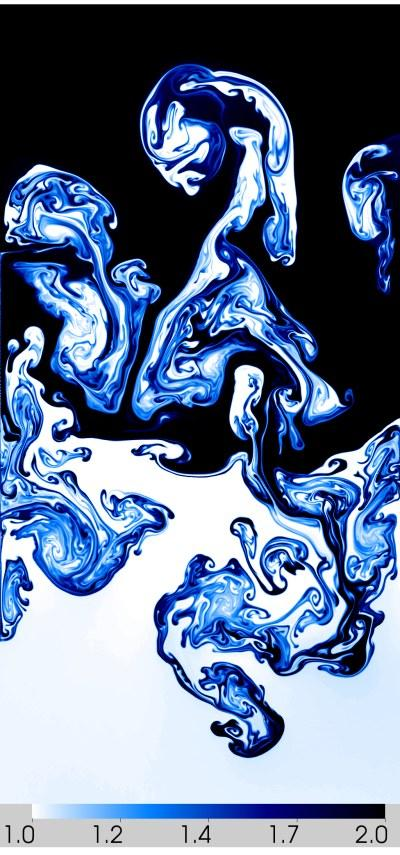{: loading="lazy" width="400" height="855"}](img/gallery/blast_rt_eulerian_q4_t3-full.png)

*Multi-mode Rayleigh-Taylor instability simulation using 4th-order mixed elements in the MFEM-based [BLAST](https://www.llnl.gov/casc/blast) shock hydrodynamics code. Visualization with [VisIt](https://visit.llnl.gov).*

----

[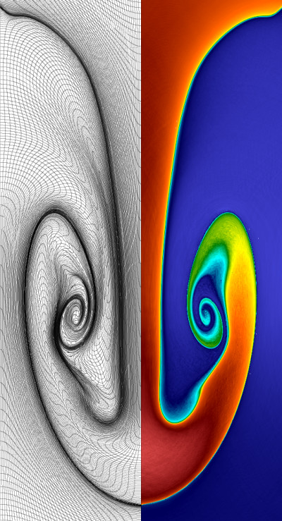{: loading="lazy" width="400" height="739"}](img/gallery/rt-q8-full.png)

*Purely Lagrangian Rayleigh-Taylor instability simulation using 8th-order mixed elements in the MFEM-based [BLAST](https://www.llnl.gov/casc/blast) shock hydrodynamics code. Visualization with [GLVis](https://glvis.org).*

----

[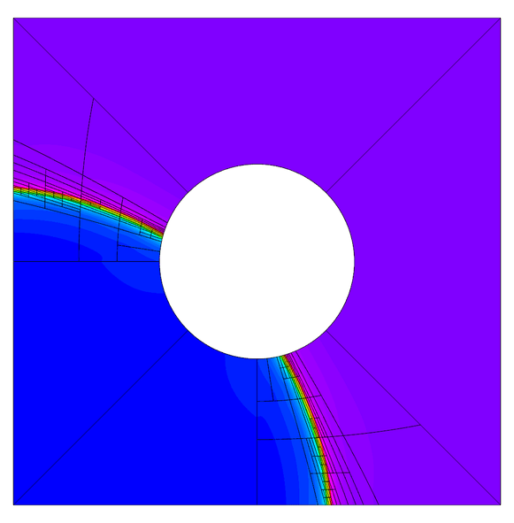{: loading="lazy" width="581" height="591"}](img/gallery/gallery-curved-2d-full.png)

*Anisotropic refinement in a 2D shock-like AMR test problem. Visualization with [GLVis](https://glvis.org).*

----

[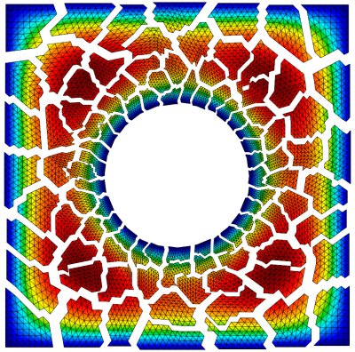{: loading="lazy" width="400" height="396"}](img/gallery/ex1p-np100.png)

*Parallel version of [Example 1](https://docs.mfem.org/html/examples_2ex1p_8cpp_source.html) on 100 processors with a relatively coarse version of [square-disc.mesh](https://github.com/mfem/mfem/blob/master/data/square-disc.mesh). Visualization with [GLVis](https://glvis.org).*

----

[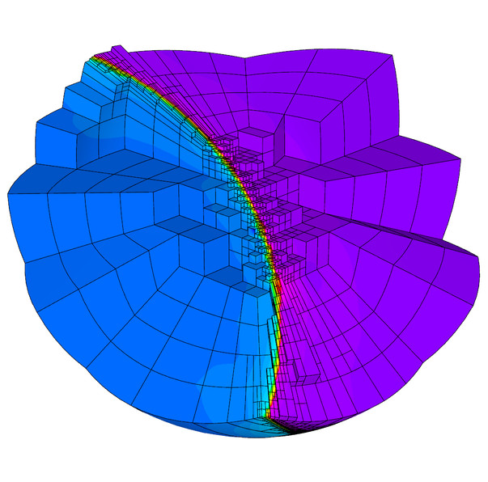{: loading="lazy" width="603" height="596"}](img/gallery/gallery-ball-aniso-full.png)

*Anisotropic refinement in a 3D version of the AMR test. Portion of the spherical domain is cut away in [GLVis](https://glvis.org).*

----

[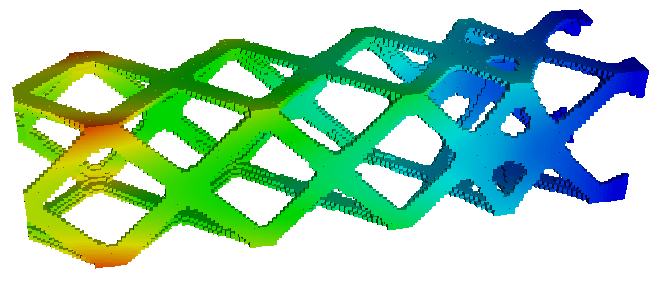{: loading="lazy" width="825" height="355"}](img/gallery/twist.png)

*Structural topology optimization with MFEM in LLNL's [Center for Design and Optimization](https://www.llnl.gov/news/llnl-gears-next-generation-computer-aided-design-and-engineering).*

----

[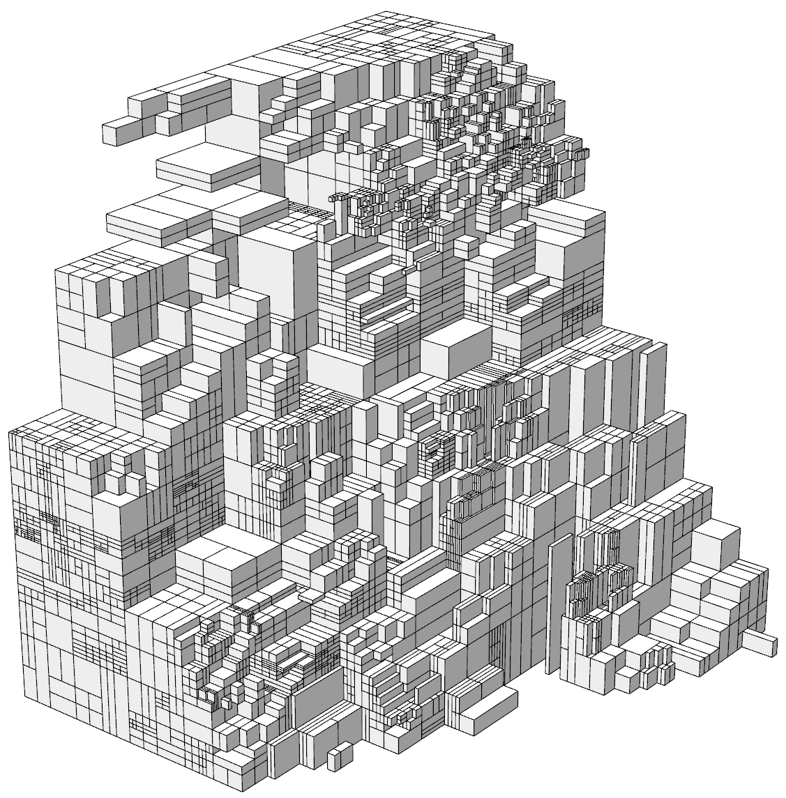{: loading="lazy" width="1127" height="1145"}](img/gallery/random4.png)

*Test of the anisotropic refinement feature on a random mesh. A slightly modified version of [Example 1](https://docs.mfem.org/html/examples_2ex1_8cpp_source.html). Visualization with [GLVis](https://glvis.org).*

----

[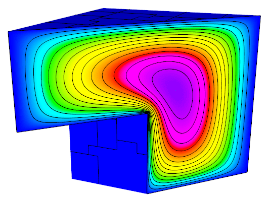{: loading="lazy" width="534" height="397"}](img/gallery/ex1p-np64.png)

*Level lines in a cutting plane of the solution from the parallel version of [Example 1](https://docs.mfem.org/html/examples_2ex1p_8cpp_source.html) on 64 processors with [fichera.mesh](https://github.com/mfem/mfem/blob/master/data/fichera.mesh). Visualization with [GLVis](https://glvis.org).*

----

[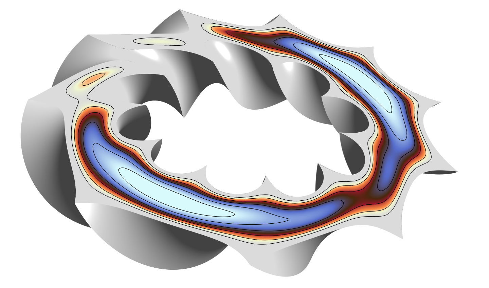{: loading="lazy" width="1440" height="851"}](img/gallery/toroid-wedge-o6-s10-ex1-2.png)

*Cut image of the solution from [Example 1](https://docs.mfem.org/html/examples_2ex1p_8cpp_source.html) on a sharply twisted, high-order toroidal mesh. The mesh was generated with the [toroid](https://docs.mfem.org/html/toroid_8cpp_source.html) miniapp.*

----

[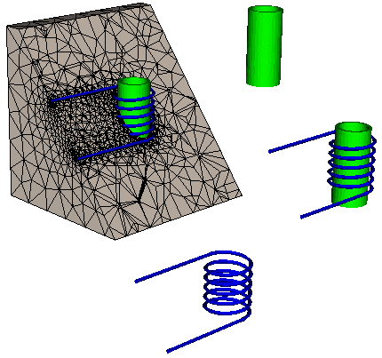{: loading="lazy" width="430" height="403"}](img/examples/trimmer.png)

*Cut image of an induction coil mesh and three sub-meshes created with the [Trimmer](https://docs.mfem.org/html/trimmer_8cpp_source.html) miniapp. Visualization with [VisIt](https://visit.llnl.gov).*

----

[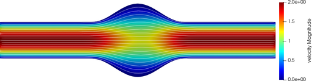{: loading="lazy" width="512" height="133"}](img/gallery/workshop21/arteryStreamlinesQ01.png)

*Viscoelastic flow of blood through an artery with aneurysm modeled by the Hookean dumbbell model discretized with BCF-method (Navier-Stokes+SUPG). Image courtesy of Andreas Meier, as part of the 2021 MFEM Visualization Contest.*

----

[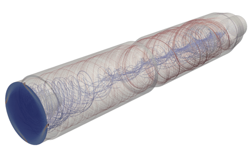{: loading="lazy" width="512" height="314"}](img/gallery/workshop21/flow-vis3-final.png)

*Visualization of time-averaged mean flow from a compressible, DG Navier-Stokes solver using MFEM modeling a plasma torch. Image courtesy of Karl W. Schulz, as part of the 2021 MFEM Visualization Contest.*

----

[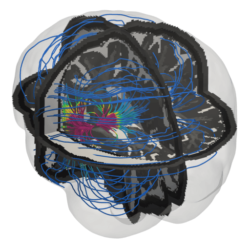{: loading="lazy" width="512" height="512"}](img/gallery/workshop22/brain_electric_field.png)

*<i class="fa fa-trophy"></i> Streamlines of the electric field generated by a current dipole source located in the temporal lobe of an epilepsy patient. Image courtesy of Ben Zwick, **winner** of the 2022 MFEM Visualization Contest.*

----

[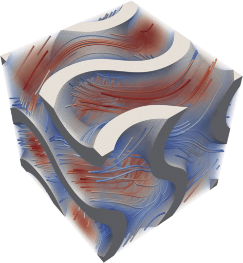{: loading="lazy" width="473" height="512"}](img/gallery/workshop22/gyroid_microcell.png)

*Flow through a periodic gyroid microcell, using the MFEM [Navier miniapp](https://mfem.org/fluids/) with additional Brinkman penalization. Image courtesy of Mathias Schmidt, as part of the 2022 MFEM Visualization Contest.*

----

[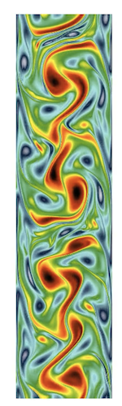{: loading="lazy" width="150" height="500"}](img/gallery/workshop23/KHI2D.mp4)

*Turbulence effect of the Kelvin-Helmholtz instability in tokamak edge plasma using an MHDeX code developed at LLNL. Image courtesy of Milan Holec, as part of the 2023 MFEM Visualization Contest.* [🎬](img/gallery/workshop23/KHI2D.mp4 "Video"){: aria-label="Video"}

----

[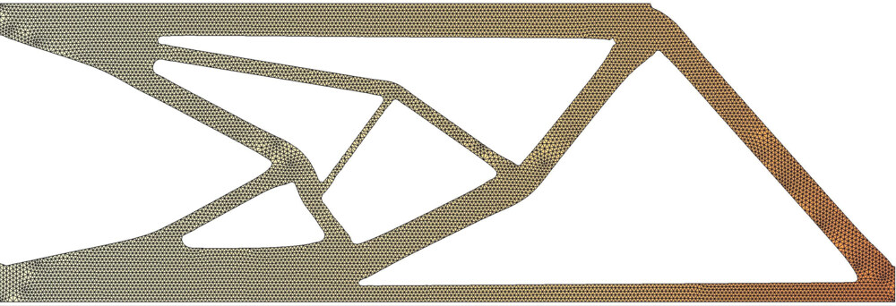{: loading="lazy" width="1000" height="342"}](img/gallery/workshop23/MBBBeam2D.mp4)

*Topology optimization with [conformal meshes](https://computing.llnl.gov/projects/ethos-enabling-technologies-high-order-simulations) to maximize beam stiffness under a downward force on the right wall. Image courtesy of Ketan Mittal and Mathias Schmidt, as part of the 2023 MFEM Visualization Contest.* [🖼️](img/gallery/workshop23/MBBBeam2D.png "Full-resolution image"){: aria-label="Full-resolution image"} [🎬](img/gallery/workshop23/MBBBeam2D.mp4 "Video"){: aria-label="Video"}

----

[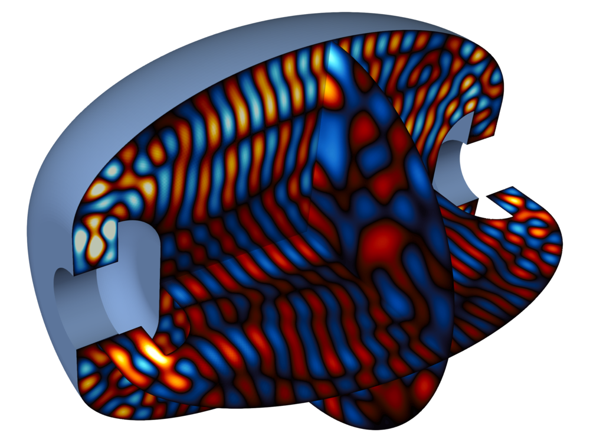{: loading="lazy" width="1000" height="755"}](img/gallery/workshop23/penrose.png)

*Penrose unilluminable room appears rather illuminable in 3D (at least when constructed as a solid of revolution). Image courtesy of Amit Rotem, as part of the 2023 MFEM Visualization Contest.*

----

[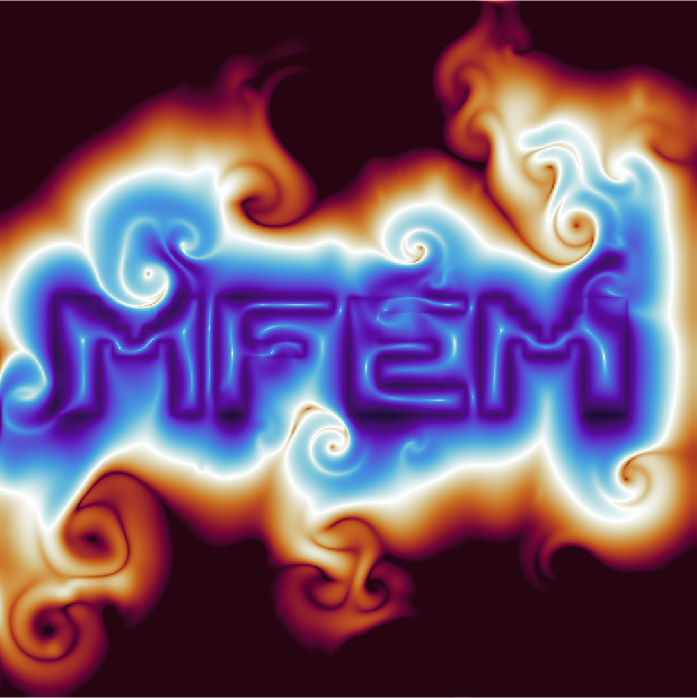{: loading="lazy" width="1006" height="1007"}](img/gallery/workshop24/ex5-aniso-q-200x200-p2-Q3-HDG-a1e3-ks1e-3-c2e4.png)

*<i class="fa fa-trophy"></i> Heat flux magnitude in a [convection - (anisotropic) diffusion simulation](https://github.com/mfem/mfem/blob/darcy-hdg-dev/examples/ex5-aniso.cpp) with MFEM text as the initial temperature profile. A single implicit step of the [HDG scheme](https://github.com/mfem/mfem/pull/4350) was used. Image courtesy of Jan Nikl, **winner** of the 2024 MFEM Visualization Contest.*

----

[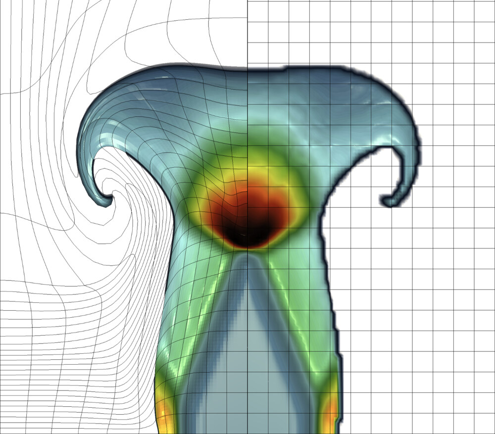{: loading="lazy" width="1000" height="877"}](img/gallery/workshop25/remap.png)

*Conservative and bounded remap of Lagrangian hydrodynamics to a uniform mesh with Laghos and Remhos. Image courtesy of Vladimir Tomov, as part of the 2025 MFEM Visualization Contest.*

----

[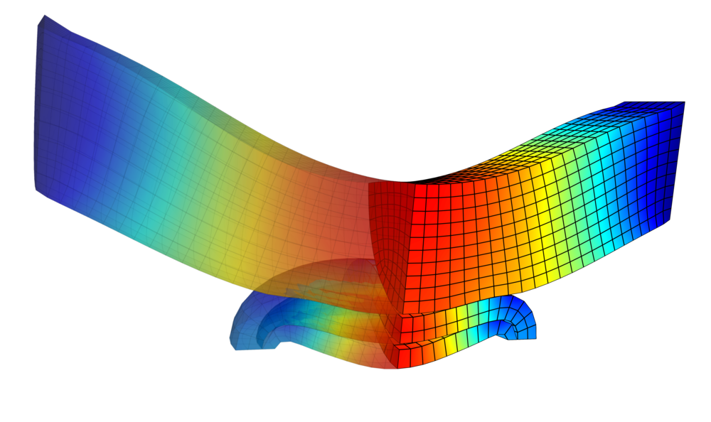{: loading="lazy" width="1000" height="594"}](img/gallery/workshop25/contact.mp4)

*Layered spherical shell compressed by half-elliptical beams, modeled as a nonlinear Neo-Hookean solid. Contact constraints are provided by [Tribol](https://github.com/LLNL/Tribol), enforced with an Interior Point method, and linear systems solved by [AMGF](https://arxiv.org/abs/2505.18576)-preconditioned PCG. Image courtesy of Socratis Petrides, as part of the 2025 MFEM Visualization Contest.* [🖼️](img/gallery/workshop25/contact.png "Full-resolution image"){: aria-label="Full-resolution image"} [🎬](img/gallery/workshop25/contact.mp4 "Video"){: aria-label="Video"}

----

[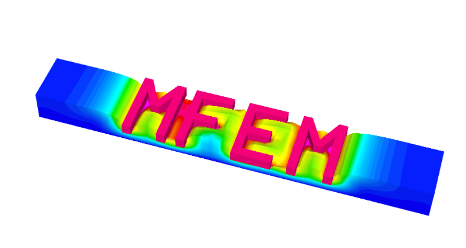{: loading="lazy" width="910" height="484"}](img/gallery/workshop26/amgf-schwarz.png)

*Linear elastic letters pushed into a soft block, solved via an AMGF-Schwarz preconditioner tailored to the contact constraints. Image courtesy of Max Paik, as part of the 2026 MFEM Visualization Contest.*

----

[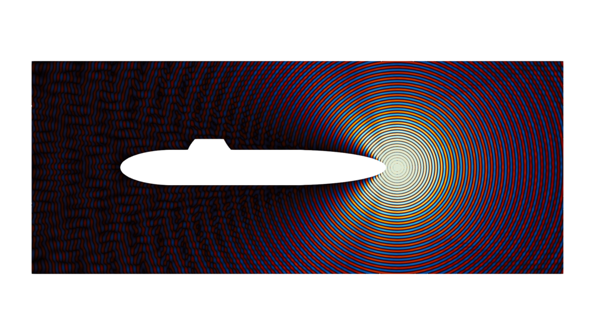{: loading="lazy" width="1000" height="563"}](img/gallery/workshop26/waveholtz-submarine.png)

*Acoustic scattering off of the hull of a submarine computed using WaveHoltz in MFEM with high-order elements. Visualization with [ParaView](https://www.paraview.org/). Image courtesy of Amit Rotem, as part of the 2026 MFEM Visualization Contest.*

----

[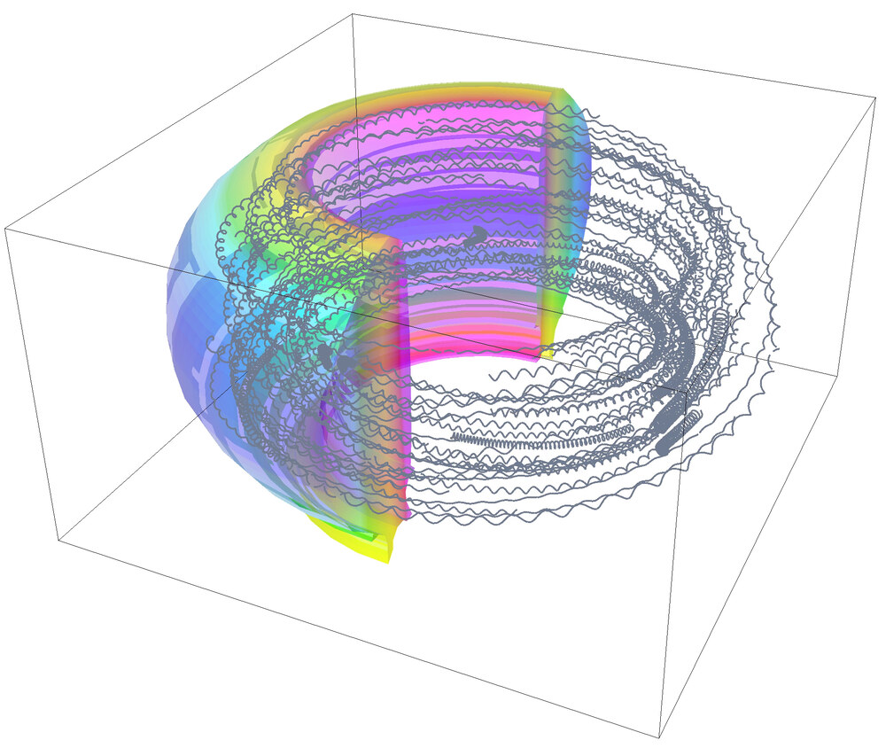{: loading="lazy" width="1000" height="844"}](img/gallery/workshop26/lorentz-particles.mp4)

*Particle tracing in a Taylor tokamak equilibrium with ITER geometry, simulated using the Lorentz miniapp in MFEM. The equilibrium magnetic field is represented with an H(curl)-conforming finite element discretization, obtained using the [GS solver](https://epubs.siam.org/doi/10.1137/24M1674108) and [GS-to-MHD transfer](https://doi.org/10.1016/j.jcp.2026.115369), while particle trajectories are advanced using the Boris algorithm. The simulation captures both passing and trapped particles, with the latter exhibiting characteristic banana orbits. Image courtesy of Rushan Zhang, as part of the 2026 MFEM Visualization Contest.* [🖼️](img/gallery/workshop26/lorentz-particles.png "Full-resolution image"){: aria-label="Full-resolution image"} [🎬](img/gallery/workshop26/lorentz-particles.mp4 "Video"){: aria-label="Video"}

