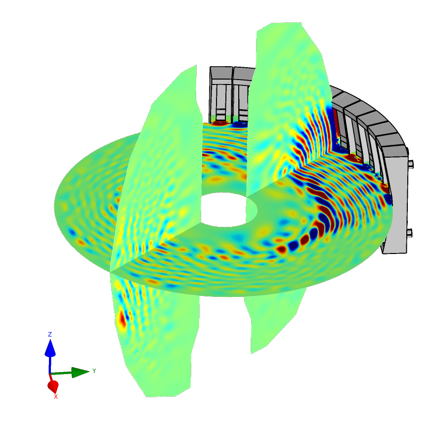

# Gallery

This page collects screenshots from various simulations based on MFEM.

Image captions with 🎬 link to simulation videos.
Additional images can be found in the [GLVis gallery](https://glvis.org/gallery/).

 

*A version of the MFEM logo demonstrating curvilinear elements, [adaptive mesh refinement](examples.md?amr) and (idealized) parallel partitioning. Visualization with [GLVis](https://glvis.org).*

----

*Incompressible Taylor-Green vortex simulation with high-order finite elements. Visualization with [ParaView](https://www.paraview.org).*

----

*Fibers generated by LDRB approach based on 4 Laplacian solves in the [Cardioid](https://github.com/LLNL/cardioid) project.*

----

*Solution of a Maxwell problem on a Klein bottle. Mesh generated with the [klein-bottle](https://docs.mfem.org/html/klein-bottle_8cpp_source.html) miniapp. Solution with [Example 3](https://docs.mfem.org/html/ex3_8cpp_source.html).*

----

*Comparisons of equipotential surfaces and force lines from Maxwell's [Treatise on Electricity and Magnetism](https://archive.org/details/treatiseonelectr01maxwrich/page/n525) with results from MFEM's [Volta miniapp](https://docs.mfem.org/html/volta_8cpp_source.html).*

----

*Level surfaces in the interior of the solution from [Example 1](https://docs.mfem.org/html/examples_2ex1_8cpp_source.html) on [escher.mesh](https://github.com/mfem/mfem/blob/master/data/escher.mesh). Visualization with [GLVis](https://glvis.org).*

----

*3D Arbitrary Lagrangian-Eulerian (ALE) simulation of a shock-triple point interaction with Q2-Q1 elements in the MFEM-based [BLAST](https://www.llnl.gov/casc/blast) shock hydrodynamics code. Volume visualization with [VisIt](https://visit.llnl.gov).*

---

*Modeling elastic-plastic flow in the 3D Taylor high-velocity impact problem using 4th order mixed elements in the MFEM-based [BLAST](https://www.llnl.gov/casc/blast) shock hydrodynamics code. Visualization with [VisIt](https://visit.llnl.gov).*

----

*Poisson problem on a "Breather" surface. Mesh generated with the [Mesh Explorer](https://docs.mfem.org/html/mesh-explorer_8cpp_source.html) miniapp. Solution with [Example 1](https://docs.mfem.org/html/examples_2ex1_8cpp_source.html).*

----

*[Triple point shock interaction](https://computing.llnl.gov/projects/blast/triple-point-shock-interaction) on 4 elements of order 12.  Note the element curvature and the high variation of the field inside the lower right element.*

----

*Visualization of the electric field generated by the electrical wave on rabbit heart ventricles during depolarization of the heart. Image courtesy of Dennis Ogiermann, **winner** of the 2021 MFEM Workshop Visualization Contest.*

----

[🎬](img/gallery/workshop21/turbine.mp4)
*Incompressible fluid flow around a rotating turbine using a space-time embedded-hybridized discontinuous Galerkin discretization. Image courtesy of Tamas Horvath, **winner** of the 2021 MFEM Workshop Visualization Contest.*

----

[🎬](img/gallery/workshop21/v34_mux1_vz_t0_t2.mp4)
*Axisymmetric computation of an air flow in a tube with continuous Galerkin discretization. Image courtesy of Raphael Zanella, as part of the 2021 MFEM Workshop Visualization Contest.*

----

[🎬](img/gallery/workshop22/coil.mp4)
*Magnetic diffusion problem solved to compute the magnetic field induced by current running through copper wire in air. Image courtesy of Will Pazner, **winner** of the 2022 MFEM Workshop Visualization Contest.*

----

[🎬](img/gallery/workshop23/shock-bubble.mp4)
*Shock-bubble-interaction using a Property-preserving discontinuous Galerkin scheme, see [article](https://doi.org/10.1142/13466). Image courtesy of Hennes Hajduk, as part of the 2023 MFEM Workshop Visualization Contest.*

----

[{:width="100%"}](img/gallery/workshop23/airfoil_NACA0012.mp4)

[🎬](img/gallery/workshop23/airfoil_NACA0012.mp4)
*Re=50,000 incompressible Navier-Stokes wall-resolved LES of a NACA 0012 airfoil in stall regime using MFEM's Navier miniapp. Image courtesy of Étienne Spieser, as part of the 2023 MFEM Workshop Visualization Contest.*

----

[🎬](img/gallery/workshop23/plane_wave.mp4)
*Plane wave scattering from a cube using a DPG Ultraweak formulation in MFEM to solve the time-harmonic linear acoustics equations. Image courtesy of Socratis Petrides, as part of the 2023 MFEM Workshop Visualization Contest.*

----

*Streamlines of the magnetic field from a [parallel computation](https://github.com/hypre-space/hypre/wiki/pubs/Kolev-2009-par-aux-space.pdf) of the magnetostatic interaction of two magnetic orbs. Visualization with [VTK](https://www.vtk.org/).*

----

*Test of the propagation of a spherical shock wave through a random non-conforming mesh in the MFEM-based [BLAST](https://www.llnl.gov/casc/blast) shock hydrodynamics code. Visualization with [GLVis](https://glvis.org).*

---

*Slice image of the high harmonic fast wave propagation in the [NSTX-U](https://nstx-u.pppl.gov/overview) magnetic fusion device. Computed using MFEM's 4th order H(curl) elements by the [RF-SciDAC project](https://www.rfscidac4.org).*

----

*An electromagnetic eigenmode of a star-shaped domain computed with 3rd order finite elements computed with [Example 13](https://docs.mfem.org/html/ex13p_8cpp_source.html).*

----

*High-order multi-material inertial confinement fusion (ICF)-like implosion in the MFEM-based [BLAST](https://www.llnl.gov/casc/blast) shock hydrodynamics code. Visualization with [VisIt](https://visit.llnl.gov).*

----

*Two-region AMR mesh generated by the [Shaper](https://docs.mfem.org/html/shaper_8cpp_source.html) miniapp from successive adaptation to the outlines of Australia.*

----

*Radiating Kelvin-Helmholtz modeled with the MFEM-based [BLAST](https://www.llnl.gov/casc/blast) shock hydrodynamics code. Volume visualization with [VisIt](https://visit.llnl.gov).*

----

[🎬](img/gallery/gas_impact.mp4)
*Simulation-driven r-adaptivity using [TMOP](https://github.com/mfem/mfem/blob/master/miniapps/meshing/mesh-optimizer.cpp) for a three-material high-velocity gas impact in [BLAST](https://computing.llnl.gov/projects/blast).  Visualization with [VisIt](https://visit.llnl.gov).*

----

*The [Shaper](https://docs.mfem.org/html/shaper_8cpp_source.html) miniapp applied to a multi-material input functions described by the iterates of the Mandelbrot set. Visualization with [GLVis](https://glvis.org).*

----

*Topology optimization of a drone body using LLNL's [LiDO project](https://str.llnl.gov/2018-03/tortorelli), based on MFEM.*

----

*Compressible Euler equations, Mach 3 flow around a cylinder in 2D, stabilized DG-P1 spacial discretization. Image courtesy of Hennes Hajduk, as part of the 2021 MFEM Workshop Visualization Contest.*

----

[🎬](img/gallery/workshop21/kh.mp4)
*Inviscid Kelvin-Helmholtz instability using high-order invariant domain preserving discontinuous Galerkin methods with convex limiting. Image courtesy of Will Pazner, as part of the 2021 MFEM Workshop Visualization Contest.*

----

[🎬](img/gallery/workshop21/mfem.mp4)
*Compressible Euler in Lagrangian frame using the [Laghos](https://github.com/CEED/Laghos) miniapp. Image courtesy of Vladimir Tomov, as part of the 2021 MFEM Workshop Visualization Contest.*

----

[🎬](img/gallery/island_coalescence.mp4)
*Adaptive, implicit resistive MHD solver (from [TDS-SciDAC](https://tds-scidac.github.io/)) resolves multi-scale features of plasmoid instability.*

----

[🎬](img/gallery/workshop22/heat.mp4)
*Topology-optimized heat sink obtained by minimizing the thermal energy in a domain with constant internal heating. Image courtesy of Tobias Duswald, **winner** of the 2022 MFEM Workshop Visualization Contest.*

----

[🎬](img/gallery/workshop23/lf_vortex_rings.mp4)
*Leapfrogging vortex rings using an incompressible Schrödinger fluid solver in MFEM. Image courtesy of John Camier, **winner** of the 2023 MFEM Workshop Visualization Contest.*

----

*Displacement distribution of a loaded excavator arm under static equilibrium using MFEM's API in an external library. Image courtesy of Mehran Ebrahimi, **winner** of the 2023 MFEM Workshop Visualization Contest.*

----

[🎬](img/gallery/workshop23/MBBBeam2D.mp4)
*Topology optimization with [conformal meshes](https://computing.llnl.gov/projects/ethos-enabling-technologies-high-order-simulations) to maximize beam stiffness under a downward force on the right wall. Image courtesy of Ketan Mittal and Mathias Schmidt, as part of the 2023 MFEM Workshop Visualization Contest.*

----

*Electric field induced by an MRI gradient coil in a human body. Simulation by the [Magnetic Resonance Physics and Instrumentation Group](https://www.nmr.mgh.harvard.edu/lab/mr-pig/research/pns-gradient-coils) at Harvard Medical School.*

----

*Multi-mode Rayleigh-Taylor instability simulation using 4th order mixed elements in the MFEM-based [BLAST](https://www.llnl.gov/casc/blast) shock hydrodynamics code. Visualization with [VisIt](https://visit.llnl.gov).*

----

*Purely Lagrangian Rayleigh-Taylor instability simulation using 8th order mixed elements in the MFEM-based [BLAST](https://www.llnl.gov/casc/blast) shock hydrodynamics code. Visualization with [GLVis](https://glvis.org).*

----

*Anisotropic refinement in a 2D shock-like AMR test problem. Visualization with [GLVis](https://glvis.org).*

----

*Parallel version of [Example 1](https://docs.mfem.org/html/examples_2ex1p_8cpp_source.html) on 100 processors with a relatively coarse version of [square-disc.mesh](https://github.com/mfem/mfem/blob/master/data/square-disc.mesh). Visualization with [GLVis](https://glvis.org).*

----

*Anisotropic refinement in a 3D version of the AMR test. Portion of the spherical domain is cut away in [GLVis](https://glvis.org).*

----

*Structural topology optimization with MFEM in LLNL's [Center for Design and Optimization](https://www.llnl.gov/news/llnl-gears-next-generation-computer-aided-design-and-engineering).*

----

*Test of the anisotropic refinement feature on a random mesh. A slightly modified version of [Example 1](https://docs.mfem.org/html/examples_2ex1_8cpp_source.html). Visualization with [GLVis](https://glvis.org).*

----

*Level lines in a cutting plane of the solution from the parallel version of [Example 1](https://docs.mfem.org/html/examples_2ex1p_8cpp_source.html) on 64 processors with [fichera.mesh](https://github.com/mfem/mfem/blob/master/data/fichera.mesh). Visualization with [GLVis](https://glvis.org).*

----

*Cut image of the solution from [Example 1](https://docs.mfem.org/html/examples_2ex1p_8cpp_source.html) on a sharply twisted, high order toroidal mesh.  The mesh was generated with the [toroid](https://docs.mfem.org/html/toroid_8cpp_source.html) miniapp.*

----

*Cut image of an induction coil mesh and three sub-meshes created with the [Trimmer](https://docs.mfem.org/html/trimmer_8cpp_source.html) miniapp. Visualization with [VisIt](https://visit.llnl.gov).*

----

*Viscoealstic flow of blood through an artery with aneurysm modeled by the Hookean dumbbell model discretized with BCF-method (Navier-Stokes+SUPG). Image courtesy of Andreas Meier, as part of the 2021 MFEM Workshop Visualization Contest.*

----

*Visualization of time-averaged mean flow from a compressible, DG Navier-Stokes solver using MFEM modeling a plasma torch. Image courtesy of Karl W. Schulz, as part of the 2021 MFEM Workshop Visualization Contest.*

----

*Streamlines of the electric field generated by a current dipole source located in the temporal lobe of an epilepsy patient. Image courtesy of Ben Zwick, **winner** of the 2022 MFEM Workshop Visualization Contest.*

----

*Flow through periodic Gyroid micro-cell, MFEM [Navier mini-app](https://mfem.org/fluids/) with additional Brinkman penalization. Image courtesy of Mathias Schmidt, as part of the 2022 MFEM Workshop Visualization Contest.*

----

[🎬](img/gallery/workshop23/KHI2D.mp4)
*Turbulence effect of the Kelvin-Helmholtz instability in tokamak edge plasma using an MHDeX code developed at LLNL. Image courtesy of Milan Holec, as part of the 2023 MFEM Workshop Visualization Contest.*

----

*Penrose unilluminable room appears rather illuminable in 3D (at least when constructed as a solid of revolution). Image courtesy of Amit Rotem, as part of the 2023 MFEM Workshop Visualization Contest.*

----

