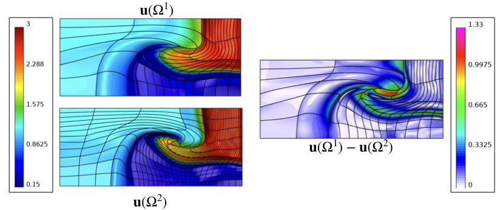

# Interpolation

This page provides a brief description of the high-order 
interpolation miniapp that can be found under `miniapps/gslib`.

## Overview
The support for `gslib`, a highly scalable communication library that includes
a high-order interpolation utility (`findpts`), has been added to MFEM. 
`findpts` provides two key functionalities. First, for a given set 
of points in physical-space, it determines the computational 
coordinates for each point. The computational coordinates of a point 
include the element number that the point is found in, the reference-space 
coordinates inside that element, and the processor number (in parallel). 
Second, using these computational coordinates, `findpts` interpolates a 
gridfunction on the given points. All the parallel communication during the 
point-search and interpolation is handed internally using `gslib`. 

## Example
The interpolation miniapp includes two different examples that demonstrates use
of `gslib`. The first example
([findpts.cpp](https://github.com/mfem/mfem/blob/master/miniapps/gslib/findpts.cpp)
and
[pfindpts.cpp](https://github.com/mfem/mfem/blob/master/miniapps/gslib/pfindpts.cpp))
shows how `findpts` can robustly interpolate a gridfunction at
randomly distributed points in a high-order mesh. The second example
([field-diff.cpp](https://github.com/mfem/mfem/blob/master/miniapps/gslib/field-diff.cpp)) demonstrates how gridfunctions on two different meshes can be
compared with each other.

The plot below is output from the second example where a solution is 
interpolated between two meshes of different resolution for the 
same domain to do a grid independence analysis.

This next plot shows a high-order spiral ($p=15$) that is used to test 
the robustness of `gslib`. 1000 randomly distributed points can be 
found in this 3D spiral with machine precision in 0.08 sec on a 2.3 GHz Macbook
Pro. 

