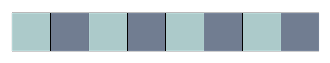
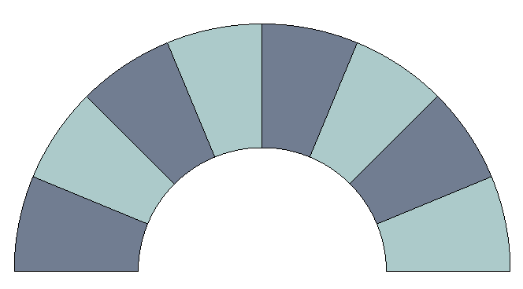
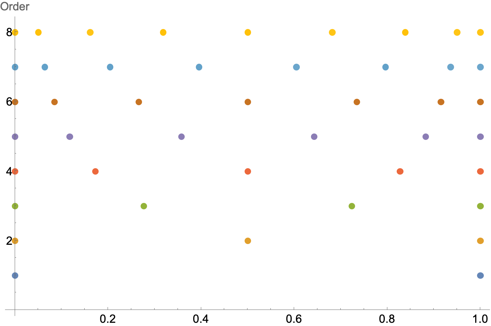
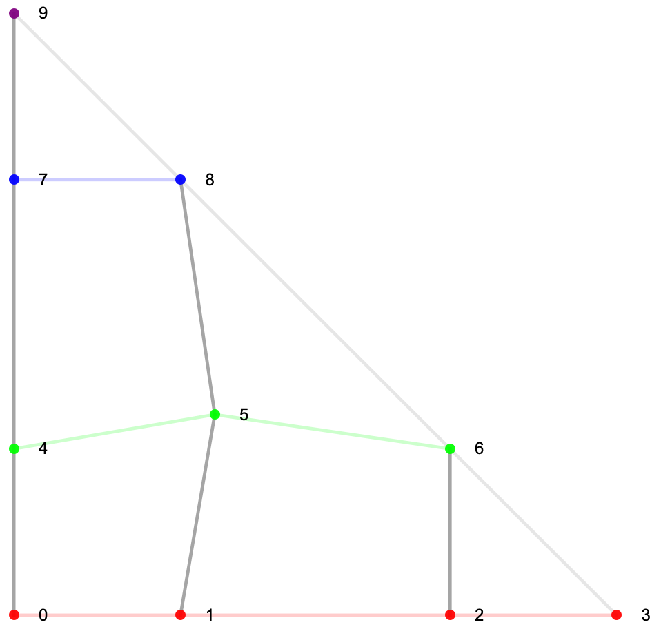
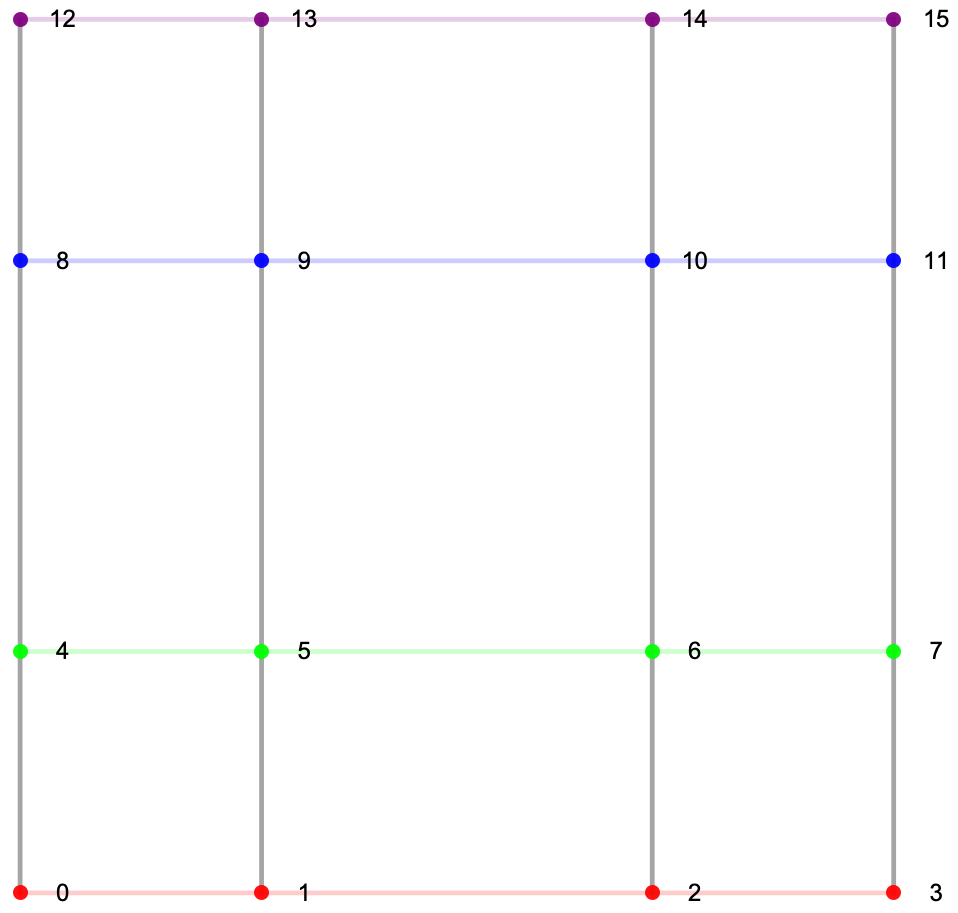
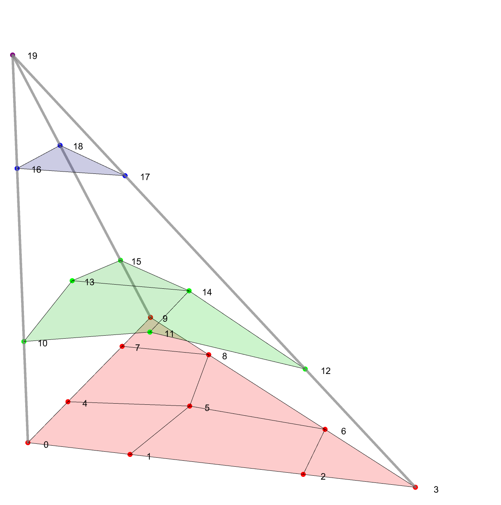
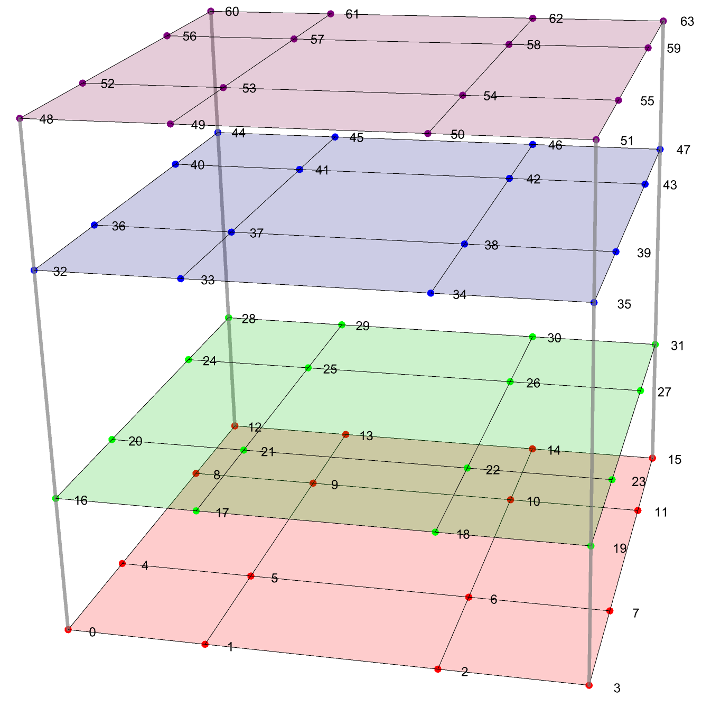
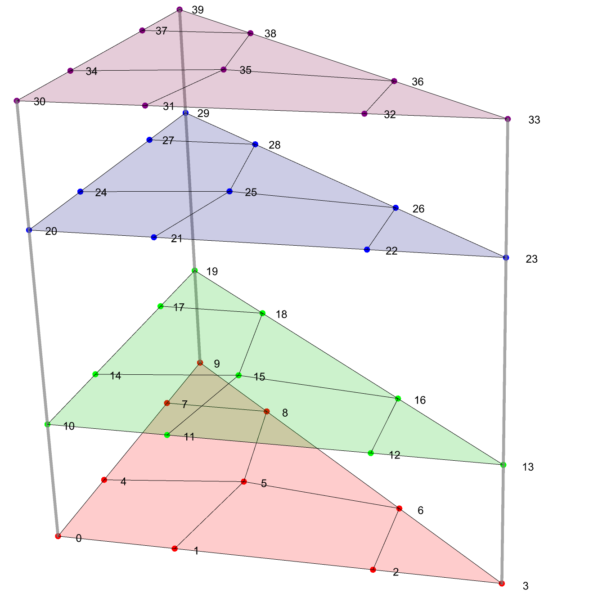
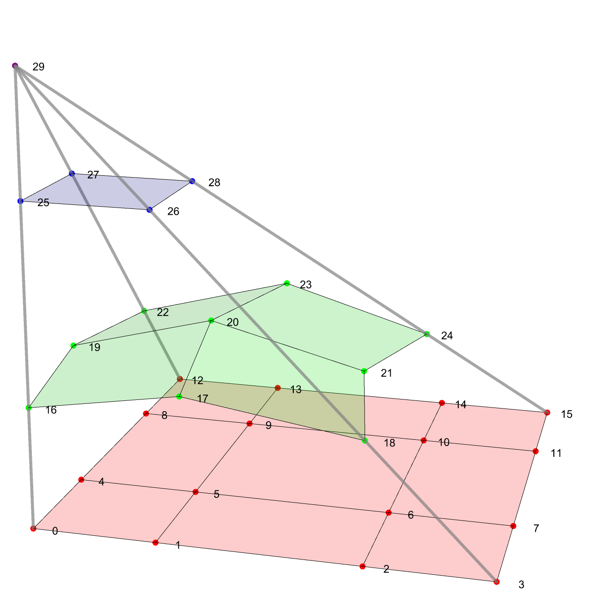

tag-mesh:

# Getting High-Order Mesh Data into MFEM

## Coordinate Mapping Using a Transformation Function

Perhaps the simplest method to create a mesh with high-order geometry involves
the use of a coordinates transformation, $\vec{\phi}$, which maps a starting
domain to the desired curved domain, $\vec{x} = \vec{\phi}(\vec{u})$.

The process starts with a mesh of the starting domain. This can be a first-order
or high-order mesh. Then promote this starting mesh to the desired higher-order.
Finally, transform the starting mesh geometry using the transformation function.
This process can be implemented as follows:
```
Mesh mesh("beam-quad.mesh");

const int geom_order = 3;
mesh.SetCurvature(geom_order);

mesh.Transform([](const Vector &u, Vector &x)
                  {
                     x[0] = (1.0+u[1])*cos(M_PI*u[0]/8.);
                     x[1] = (1.0+u[1])*sin(M_PI*u[0]/8.);
                  }
               );
```
This simple example transforms this:

to this:


Clearly this method has practical limitations. Strictly speaking, any high-order
finite element mesh supported by MFEM can be generated in this manner. It only
requires a starting mesh which represents the necessary topology of the desired
domain and a sufficiently detailed transformation function which can transform
each region of that topological structure to its desired shape. In deed, this is
exactly how MFEM represents high-order meshes by using finite element basis
functions and degrees of freedom to transform reference elements to the desired
curved elements. However, most realistic domains would present some very
daunting challenges for this method.

## Projecting One Representation to Another Element-by-Element

TBD

## DIY Computation of Nodal Values

MFEM can use either continuous or discontinuous scalar basis functions to
represent each component of the coordinates of the nodal values. The ordering
of the degrees of freedom for a continuous representation is determined by the
local node numberings used for vertices, edges, and faces of the various
element types. There is a straightforward logic to this ordering, of course, but
it requires pulling information from multiple locations and applying it
carefully. The ordering used for discontinuous representation is much more
simple and, therefore, we will only focus on this simple case.

In the pseudo-code shown below the `p1d` array, of length `order+1`, contains a
set of 1D interpolation points. When these bases are used for representing mesh
geometry we use the closed Gauss-Lobatto points. Note that these orderings mimic
a tensor product ordering, as much as possible, with the first coordinate
cycling fastest and the last coordinate slowest. The integer `order` must only
be greater than zero but first order meshes typically define their nodes
differently. When representing mesh geometry the `order` variable typically
satisfies `order ≥ 2`.

### 1D Mesh Geometry

```
nodes
FiniteElementSpace
FiniteElementCollection: L2_T1_1D_P3
VDim: 1
Ordering: 1
```

#### Segment

MFEM provides a handful of options for basis interpolation points but for this
purpose we will use the closed Gauss-Lobatto points. These are shown below for
orders 1 through 8.

{width=50%}
*Figure: L2 Segment Nodes for orders 1 to 8.*

### 2D Mesh Geometry

```
nodes
FiniteElementSpace
FiniteElementCollection: L2_T1_2D_P3
VDim: 2
Ordering: 1
```

#### Triangle

```
for (int o = 0, j = 0; j <= order; j++)
   for (int i = 0; i + j <= order; i++)
   {
      double w = p1d[i] + p1d[j] + p1d[order-i-j];
      Nodes.IntPoint(o++).Set2(p1d[i]/w, p1d[j]/w);
   }
```

{width=40%}
*Figure: As an example this image shows the placement and numbering of the
nodes of a third order triangle. The colored lines correspond to constant `j`
values from the above loop. The darker gray lines correspond to constant `i`
values.*

#### Quadrilateral

```
for (int o = 0, j = 0; j <= order; j++)
   for (int i = 0; i <= order; i++)
   {
      Nodes.IntPoint(o++).Set2(p1d[i], p1d[j]);
   }
```

{width=40%}
*Figure: As an example this image shows the placement and numbering of the
nodes of a third order quadrilateral. The colored lines correspond to constant
`j` values from the above loop. The gray lines correspond to constant `i`
values.*

### 3D Mesh Geometry

```
nodes
FiniteElementSpace
FiniteElementCollection: L2_T1_3D_P3_Pyr0
VDim: 3
Ordering: 1
```

#### Tetrahedra

The nodes of the `L2_TetrahedronElement` are computed as follows:
```
for (int o = 0, k = 0; k <= order; k++)
   for (int j = 0; j + k <= order; j++)
      for (int i = 0; i + j + k <= order; i++)
      {
         double w = p1d[i] + p1d[j] + p1d[k] + p1d[order-i-j-k];
         Nodes.IntPoint(o++).Set3(p1d[i]/w, p1d[j]/w, p1d[k]/w);
      }
```

{width=50%}
*Figure: As an example this image shows the placement and numbering of the
nodes of a third order tetrahedron. The surfaces correspond to constant `k`
values from the above loop. The lines within the surfaces correspond to
constant `j` and `i` values.*


#### Hexahedra

The nodes of the `L2_HexahedronElement` are computed as follows:
```
for (int o = 0, k = 0; k <= order; k++)
   for (int j = 0; j <= order; j++)
      for (int i = 0; i <= order; i++)
      {
         Nodes.IntPoint(o++).Set3(p1d[i], p1d[j], p1d[k]);
      }
```

{width=50%}
*Figure: As an example this image shows the placement and numbering of the
nodes of a third order hexahedron. The surfaces correspond to constant `k`
values from the above loop. The lines within the surfaces correspond to
constant `j` and `i` values.*


#### Wedges (or Prisms)

The nodes of the `L2_WedgeElement` are computed as a tensor product of the nodes
of a triangle and a segment. This is equivalent to the following nested loops:
```
for (int o = 0, k = 0; k <= order; k++)
   for (int j = 0; j <= order; j++)
      for (int i = 0; i + j <= order; i++)
      {
         double w = p1d[i] + p1d[j] + p1d[order-i-j];
         Nodes.IntPoint(o++).Set3(p1d[i]/w, p1d[j]/w, p1d[k]);
      }
```

{width=50%}
*Figure: As an example this image shows the placement and numbering of the
nodes of a third order wedge. The surfaces correspond to constant `k` values
from the above loop. The lines within the surfaces correspond to constant `j`
and `i` values.*

#### Pyramids

MFEM has two sets of basis functions that might be used with pyramid-shaped elements. The set which is recommended for high-order mesh geometry is implemented in `H1_BergotPyramidElement` or `L2_BergotPyramidElement` (referred to as type 0 pyramids within MFEM).

The nodes of the `L2_BergotPyramidElement` are computed as follows:
```
const double apex_tol = 1e-8;
int o = 0;
for (int k = 0; k <= order; k++)
   for (int j = 0; j <= order - k; j++)
   {
      const double wjk = p1d[j] + p1d[k] + p1d[order-j-k];
      for (int i = 0; i <= order - k; i++)
      {
         const double wik = p1d[i] + p1d[k] + p1d[order-i-k];
         const double w = wik * wjk * p1d[order-k];
         if (std::abs(w) < apex_tol)
         {
            Nodes.IntPoint(o++).Set3(0.,0.,1.);
         }
         else
         {
            Nodes.IntPoint(o++).Set3(p1d[i] * (p1d[j] + p1d[order-j-k]) / w,
                                     p1d[j] * (p1d[j] + p1d[order-j-k]) / w,
                                     p1d[k] * p1d[order-k] / w);
         }
      }
   }

```

{width=50%}
*Figure: As an example this image shows the placement and numbering of the
nodes of a third order pyramid. The surfaces correspond to constant `k` values
from the above loop. The lines within the surfaces correspond to constant `j`
and `i` values.*

<script type="text/x-mathjax-config">MathJax.Hub.Config({TeX: {equationNumbers: {autoNumber: "all"}}, tex2jax: {inlineMath: [['$','$']]}});</script>
<script type="text/javascript" src="https://cdnjs.cloudflare.com/ajax/libs/mathjax/2.7.2/MathJax.js?config=TeX-AMS_HTML"></script>
