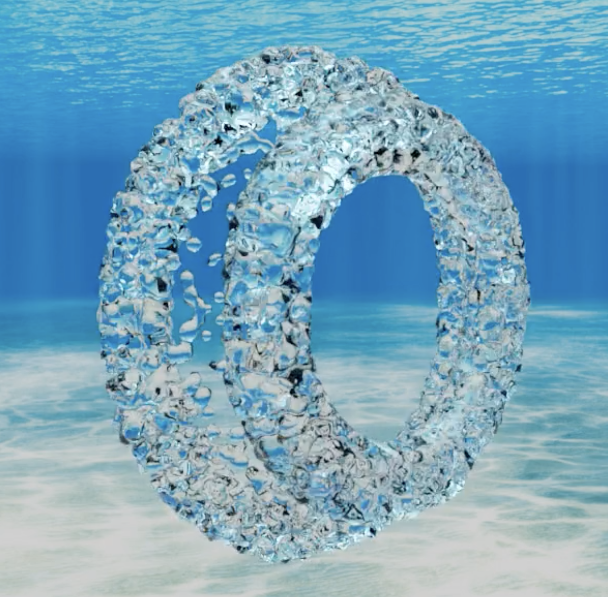
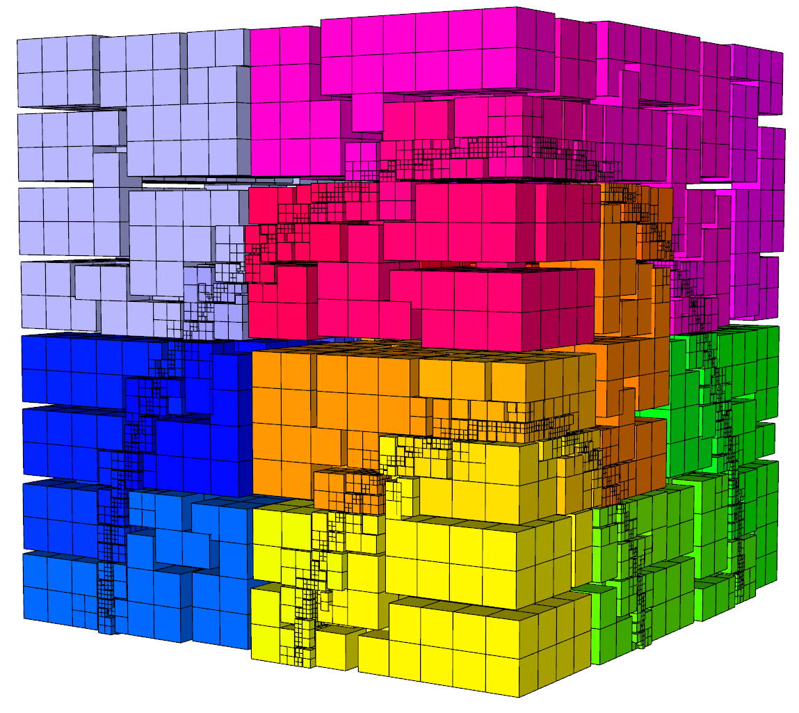

[<button type="button" class="btn btn-success">
**<i class="fa fa-calendar" aria-hidden="true"></i>&nbsp; MFEM Community Workshop on October 22th**
</button>](workshop.md)
&nbsp;
[<button type="button" class="btn btn-primary">
**<i class="fa fa-pencil" aria-hidden="true"></i>&nbsp; Register**
</button>](https://docs.google.com/forms/d/e/1FAIpQLSfv419dXX4yPS7Tk1sNbfi_2YXgt3DpW56KCd3TZjjsswKpBw/viewform?usp=sf_link)

  <!-- Indicators -->
  <ol class="carousel-indicators">
    <li data-target="#myCarousel" data-slide-to="0" class="active"></li>
    <li data-target="#myCarousel" data-slide-to="1"></li>
    <li data-target="#myCarousel" data-slide-to="2"></li>
    <li data-target="#myCarousel" data-slide-to="3"></li>
    <li data-target="#myCarousel" data-slide-to="4"></li>
    <li data-target="#myCarousel" data-slide-to="5"></li>
    <li data-target="#myCarousel" data-slide-to="6"></li>
    <li data-target="#myCarousel" data-slide-to="7"></li>
  </ol>

  <!-- Wrapper for slides -->
  

    

      
    

    

      
      

        2023 Visualization Contest Winner John Camier
      

    

    

      
      

        2023 Visualization Contest Winner Mehran Ebrahimi
      

    

    

      
      

        Electromagnetic wave propagation in the [NSTX-U](https://nstx-u.pppl.gov/overview) tokamak
      

    

    

      
      

        High-order multi-material hydrodynamics in the [BLAST](https://www.llnl.gov/casc/blast) code
      

    

    

      
      

        Topology optimization of a drone body using   LLNL's [LiDO code](https://str.llnl.gov/2018-03/tortorelli), based on MFEM
      

    

    

      
      

        Non-conforming adaptive mesh refinement with parallel load-balancing
      

    

  

  <!-- Left and right controls -->
  <a class="left carousel-control" href="#myCarousel" data-slide="prev">
    
    Previous
  </a>
  <a class="right carousel-control" href="#myCarousel" data-slide="next">
    
    Next
  </a>

MFEM is a _free_, _lightweight_, _scalable_ C++ library for finite element methods.

## Features

* Arbitrary high-order finite element [meshes](features.md#wide-range-of-mesh-types)
and [spaces](features.md#higher-order-finite-element-spaces).
* [Wide variety](features.md#flexible-discretization) of finite element discretization approaches.
* Conforming and nonconforming [adaptive mesh refinement](examples.md?amr).
* Scalable from laptops to [GPU-accelerated](features#parallel-scalable-and-gpu-ready) supercomputers.
* ... and [many more](features.md).

MFEM is used in many projects, including [BLAST](https://www.llnl.gov/casc/blast), [Cardioid](https://github.com/llnl/cardioid), [Palace](https://github.com/awslabs/palace), [VisIt](https://visit.llnl.gov), [RF-SciDAC](https://www.rfscidac4.org/), [FASTMath](https://scidac5-fastmath.lbl.gov/), [xSDK](https://xsdk.info/), and [CEED](https://ceed.exascaleproject.org) in the [Exascale Computing Project](https://exascaleproject.org).

We host an annual [workshop](workshop.md) and [FEM@LLNL seminar series](seminar.md) series.

See also our [Gallery](gallery.md), [Publications](publications.md), [Videos](videos.md) and [News](news.md) pages.

## News

Date         | Message
------------ | -----------------------------------------------------------------
Oct 22, 2024 | 2024 [MFEM Community Workshop](workshop.md).
 Jun 5, 2024 | [Register](https://hpcic.llnl.gov/tutorials/2024-hpc-tutorials) for MFEM [tutorial](tutorial/index.md) on Aug 22.
 May 7, 2024 | Version 4.7 [released](https://github.com/mfem/mfem/blob/v4.7/CHANGELOG).
 May 2, 2024 | New MFEM [paper](https://journals.sagepub.com/doi/pdf/10.1177/10943420241261981) in IJHPCA.
Feb 22, 2023 | AWS releases [Palace](https://aws.amazon.com/blogs/quantum-computing/aws-releases-open-source-software-palace-for-cloud-based-electromagnetics-simulations-of-quantum-computing-hardware/) based on MFEM.

## Latest Release

[New features](https://github.com/mfem/mfem/blob/v4.7/CHANGELOG)
┊ [Examples](examples.md)
┊ [Code documentation](dox.md)
┊ [Sources](https://github.com/mfem/mfem)

[<button type="button" class="btn btn-success">
**Download mfem-4.7.tgz**
</button>](https://bit.ly/mfem-4-7)

[Older releases](download.md) ┊ [Python wrapper](https://github.com/mfem/PyMFEM) ┊
[{style="display:inline;margin:0"}](https://colab.research.google.com/github/GLVis/pyglvis/blob/main/examples/ex1.ipynb "Python Jupyter notebook")

## Documentation

[Building MFEM](building.md)
┊ [Getting Started](getting-started.md)
┊ [Finite Elements](fem.md)
┊ [Performance](performance.md)

New users should start by examining the [example codes](examples.md).

We also recommend using [GLVis](https://glvis.org) for visualization.

## Contact

Use the GitHub [issue tracker](https://github.com/mfem/mfem/issues)
to report [bugs](https://github.com/mfem/mfem/issues/new?labels=bug)
or post [questions](https://github.com/mfem/mfem/issues/new?labels=question)
or [comments](https://github.com/mfem/mfem/issues/new?labels=comment).
See&nbsp;the [About](about.md) page for citation information.

