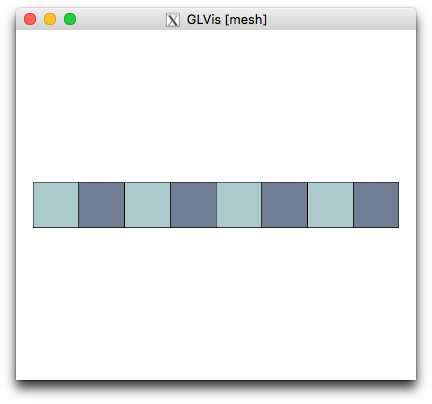
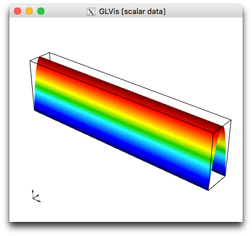
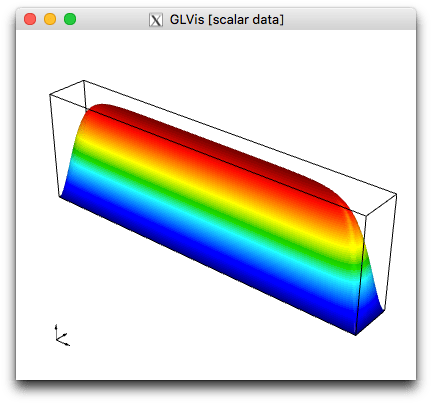
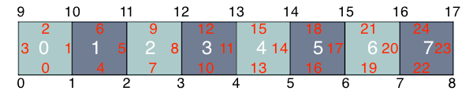

# General MFEM Mesh Format

The MFEM mesh v1.x format supports the general description of meshes based on a vector finite element grid function with degrees of freedom in the *nodes* of the mesh. For simplicity, in this document we refer to this version of the format as `MFEM mesh v1.x`. The legacy version for meshes with straight edges we will call `MFEM linear mesh` format.

A mesh in the `MFEM mesh v1.x` format consists of two parts: Topology and Geometry. We illustrate these concepts by comparing with the `beam-quad.mesh` from MFEM's `data/` directory. This is just a simple quadrilateral beam mesh with 8 elements, 18 vertices (numbered 0 to 17) and 18 boundary segments:



The original linear mesh version of this file is given in [Listing 1](#listing-1).

## Topology

The topological part of the mesh describes the relations between the elements in the mesh, in terms of neighborhood implied by shared vertices. Actual coordinates do not play a role in this part, so the *vertices* are just labels used to imply which elements share a vertex, an edge or a face.

Some examples:

### General version of `data/beam-quad.mesh`

Below is the annotated topological part of the `MFEM mesh v1.x` format for the beam mesh. The complete file is given in [Listing 2](#listing-2).


```
...
# BEGIN Topology Part

dimension
2

elements
8
1 3 0 1 10 9
1 3 1 2 11 10
1 3 2 3 12 11
1 3 3 4 13 12
2 3 4 5 14 13
2 3 5 6 15 14
2 3 6 7 16 15
2 3 7 8 17 16

boundary
# Skipping the 18 boundary segments for simplicity

vertices
18

# END Topology Part
...
```

The element format above is: `<attribute> <type> <vertex1> ... <vertexN>`. Type `3` is quadrilateral, which requires 4 vertex indices. The `attribute` identify e.g. material sub-domains (2 in this case).

**NOTE:** The topology part of this mesh will be the same, irrespective of the order. Compare e.g. [Listing 2](#listing-2), [Listing 3](#listing-3) and [Listing 4](#listing-4).

**WARNING:** The vertices are used only to imply topology, and so there coordinates are not important. The mesh coordinates are implied by the mesh `nodes` not `vertices`. In particular, while the `Mesh` object can return vertex coordinates, they are not used an may be incorrect for high-order mesh.

### Periodic version of `data/beam-quad.mesh`

The topology part can be used to describe more complicated mesh relations. For example we can identify the two vertical lines of the beam mesh, turning it topologically into a
cylinder. The complete file is given in [Listing 5](#listing-5).

```
...
# BEGIN Topology Part

dimension
2

elements
8
1 3 0 1 10 9
1 3 1 2 11 10
1 3 2 3 12 11
1 3 3 4 13 12
2 3 4 5 14 13
2 3 5 6 15 14
2 3 6 7 16 15
2 3 7 0 9 16   # Last element uses vertices 0 and 9

# two vertical boundary have been removed
boundary
16
3 1 0 1
3 1 1 2
3 1 2 3
3 1 3 4
3 1 4 5
3 1 5 6
3 1 6 7
3 1 7 0
3 1 10 9
3 1 11 10
3 1 12 11
3 1 13 12
3 1 14 13
3 1 15 14
3 1 16 15
3 1 9 16

vertices
18

# END Topology Part
...
```

Compared to the non-periodic version, e.g. [Listing 2](#listing-2), the main difference above is that we have fused vertices 8 and 0 and vertices 17 and 9.

The difference between the two topologies can be illustrated by solving a simple Laplace problem with homogeneous essential boundary conditions on the resulting mesh.

In the periodic case we get:



while the solution on the non-periodic mesh looks like:



**NOTE:** Meshes with periodic topology allow us to solve problems with periodic boundary conditions without modifying the application to impose them -- we simply run on a different mesh.

## Geometry
The geometry of the mesh, i.e. the actual position of mesh elements in physical space is described by specifying the mesh *nodes* as a general finite element (vector) function.

In MFEM, finite element functions are objects of type `GridFunction` which belong to discrete finite element spaces specified by objects `FiniteElementSpace` and `FiniteElementCollection`.

The actual geometry of each element is obtained by extracting the local degrees of freedom from the global *nodes*, expanding them in the corresponding (reference element) finite element basis, and using the resulting polynomial vector field to map the reference element.

An example of a first order geometry is given in [Listing 2](#listing-2):

```
...
# BEGIN Geometry Part

nodes
FiniteElementSpace
FiniteElementCollection: H1_2D_P1
VDim: 2
Ordering: 1

0 0
1 0
2 0
3 0
4 0
5 0
6 0
7 0
8 0
0 1
1 1
2 1
3 1
4 1
5 1
6 1
7 1
8 1

# END Geometry Part
```

Here `VDim: 2` means that the *nodes* grid function is a vector field with two components (i.e. the mesh is embedded in R^2); `H1_2D_P1` describes the finite element space (H1/continuous finite elements in 2D of order 1); `Ordering` refers to how the vector field values are serialized (in this case x,y,x,y,...); and the rest is just the global degrees of freedom representing in this case the vertex coordinates.

Compare the above with the linear mesh vertex coordinates from [Listing 1](#listing-1):

```
vertices
18
2
0 0
1 0
2 0
3 0
4 0
5 0
6 0
7 0
8 0
0 1
1 1
2 1
3 1
4 1
5 1
6 1
7 1
8 1

```

In the MFEM mesh v1.x format, the *nodes* are a regular grid function, just like an other discretized field in a simulation, which has several advantages:

- The *nodes* can be part of the discretization, and be evolved directly e.g. in a Lagrangian/ALE simulation.
- Mesh optimization problems can be posed directly for the *nodes* variable.
- Since the *nodes* can be any finite element function, a wide variety of meshes are easily supported.

As an illustration of the last point, consider the geometry of the periodic version of the mesh in [Listing 5](#listing-5)

```
...
# BEGIN Geometry Part

nodes
FiniteElementSpace
FiniteElementCollection: L2_T1_2D_P1
VDim: 2
Ordering: 1

0 0
1 0
0 1
1 1

1 0
2 0
1 1
2 1

2 0
3 0
2 1
3 1

3 0
4 0
3 1
4 1

4 0
5 0
4 1
5 1

5 0
6 0
5 1
6 1

6 0
7 0
6 1
7 1

7 0
8 0
7 1
8 1

8 0
9 0
8 1
9 1

9 0
10 0
9 1
10 1
# END Geometry Part
...
```

Note that the space here is `L2`, which means a discontinuous linear vector field, where four vertex coordinates are specified on each element. This allows us to plot the periodic mesh as a regular beam, which is what you'd expect for periodic boundary conditions.

## Finite Element Spaces

To fully specify the  MFEM mesh v1.x format, we need to describe the degrees of freedom of the *nodes* finite element space and their global numbering.

This is something that the MFEM team is very interested to discuss and standardize with other high-order projects and applications. Below is a description of our current approach...

Finite element spaces have degrees of freedom (dofs) that are associated with the (interiors of the) mesh vertices, edges, faces and elements.
There may be multiple dofs associated with the same geometric entity (e.g. vector fields), and different spaces have different sets of degrees of freedom.
For example H1/continuous spaces can have degrees of freedom associated with the Gauss-Lobatto points in a quadrilateral, while L2/discontinuous spaces can have degrees of freedom associated with the Gauss-Legendre points.
These are just examples, many choices for the basis are actually possible to be encoded in the `FiniteElementCollection` string above.

In general, based just on the mesh topology and the type of the space, the `FiniteElementSpace` object can determine a global set of dofs, that will be the values listed for the mesh *nodes*.

The algorithm starts with the given numbering of the elements and the vertices, from which a numbering of the edges and the faces is derived as follows:

```
loop over elements
  loop over edges and faces inside each element (clock-wise)
    number currently the edges and faces that have not been numbered yet
```

Here is the result of this numbering for the beam mesh



In addition to a number, each edges and face is also given a global orientation.

In 2D and 3D, an edge is oriented from the vertex with the lower vertex id to the vertex with the higher vertex id.

In 3D, a face is oriented according to the face-to-vertex mappings in the first element in which the face is enumerated. See the `fem/geom.cpp` for the definitions of the [tetrahedral](https://github.com/mfem/mfem/blob/master/fem/geom.cpp#L503-L505) and [hexahedral](https://github.com/mfem/mfem/blob/master/fem/geom.cpp#L524-L529) mappings on the reference element, as well as the `Mesh::GenerateFaces` method in `mesh/mesh.cpp`. In particular, the normal of the face between two elements points from the element with lower number to the element with higher number. Face orientation however includes not just the normal direction, but also any rotation of the vertices compared to the base, i.e. _orientation_ here means permutation of vertices.

The global numbering of degrees of freedom is now performed as follows:

```
loop over vertices
  list the dofs associated with each vertex

loop over edges
  list the dofs associated with the interior of the edge,
  lexicographically with respect to the edge orientation

loop over faces
  list the dofs associated with the interior of the face,
  lexicographically with respect to the face orientation

loop over elements
  list the dofs associated with the interior of the element
```

An example of this is the quadratic mesh in  [Listing 3](#listing-3)

```
...
# BEGIN Geometry Part

nodes
FiniteElementSpace
FiniteElementCollection: H1_2D_P2
VDim: 2
Ordering: 1

# 18 vertex dofs
0 0
1 0
2 0
3 0
4 0
5 0
6 0
7 0
8 0
0 1
1 1
2 1
3 1
4 1
5 1
6 1
7 1
8 1

# 25 edge dofs
0.5 0
1 0.5
0.5 1
0 0.5
1.5 0
2 0.5
1.5 1
2.5 0
3 0.5
2.5 1
3.5 0
4 0.5
3.5 1
4.5 0
5 0.5
4.5 1
5.5 0
6 0.5
5.5 1
6.5 0
7 0.5
6.5 1
7.5 0
8 0.5
7.5 1

# 8 element dofs
0.5 0.5
1.5 0.5
2.5 0.5
3.5 0.5
4.5 0.5
5.5 0.5
6.5 0.5
7.5 0.5

# END Geometry Part
...
```

## Listings

### Listing 1
This is the original version of the `beam-quad.mesh` using the linear mesh format.

```
MFEM mesh v1.0

#
# MFEM Geometry Types (see mesh/geom.hpp):
#
# POINT       = 0
# SEGMENT     = 1
# TRIANGLE    = 2
# SQUARE      = 3
# TETRAHEDRON = 4
# CUBE        = 5
#

dimension
2

elements
8
1 3 0 1 10 9
1 3 1 2 11 10
1 3 2 3 12 11
1 3 3 4 13 12
2 3 4 5 14 13
2 3 5 6 15 14
2 3 6 7 16 15
2 3 7 8 17 16

boundary
18
3 1 0 1
3 1 1 2
3 1 2 3
3 1 3 4
3 1 4 5
3 1 5 6
3 1 6 7
3 1 7 8
3 1 10 9
3 1 11 10
3 1 12 11
3 1 13 12
3 1 14 13
3 1 15 14
3 1 16 15
3 1 17 16
1 1 9 0
2 1 8 17

vertices
18
2
0 0
1 0
2 0
3 0
4 0
5 0
6 0
7 0
8 0
0 1
1 1
2 1
3 1
4 1
5 1
6 1
7 1
8 1

```

### Listing 2
This is a `MFEM mesh v1.x` version of the `beam-quad.mesh` which is first order. The mesh is identical to the one of [Listing 1](#listing-1), it is just described in a different format.

```
MFEM mesh v1.0

#
# MFEM Geometry Types (see mesh/geom.hpp):
#
# POINT       = 0
# SEGMENT     = 1
# TRIANGLE    = 2
# SQUARE      = 3
# TETRAHEDRON = 4
# CUBE        = 5
#

dimension
2

elements
8
1 3 0 1 10 9
1 3 1 2 11 10
1 3 2 3 12 11
1 3 3 4 13 12
2 3 4 5 14 13
2 3 5 6 15 14
2 3 6 7 16 15
2 3 7 8 17 16

boundary
18
3 1 0 1
3 1 1 2
3 1 2 3
3 1 3 4
3 1 4 5
3 1 5 6
3 1 6 7
3 1 7 8
3 1 10 9
3 1 11 10
3 1 12 11
3 1 13 12
3 1 14 13
3 1 15 14
3 1 16 15
3 1 17 16
1 1 9 0
2 1 8 17

vertices
18

nodes
FiniteElementSpace
FiniteElementCollection: H1_2D_P1
VDim: 2
Ordering: 1

0 0
1 0
2 0
3 0
4 0
5 0
6 0
7 0
8 0
0 1
1 1
2 1
3 1
4 1
5 1
6 1
7 1
8 1
```

### Listing 3
This is a second order version of the `beam-quad.mesh`.

```
MFEM mesh v1.0

#
# MFEM Geometry Types (see mesh/geom.hpp):
#
# POINT       = 0
# SEGMENT     = 1
# TRIANGLE    = 2
# SQUARE      = 3
# TETRAHEDRON = 4
# CUBE        = 5
#

dimension
2

elements
8
1 3 0 1 10 9
1 3 1 2 11 10
1 3 2 3 12 11
1 3 3 4 13 12
2 3 4 5 14 13
2 3 5 6 15 14
2 3 6 7 16 15
2 3 7 8 17 16

boundary
18
3 1 0 1
3 1 1 2
3 1 2 3
3 1 3 4
3 1 4 5
3 1 5 6
3 1 6 7
3 1 7 8
3 1 10 9
3 1 11 10
3 1 12 11
3 1 13 12
3 1 14 13
3 1 15 14
3 1 16 15
3 1 17 16
1 1 9 0
2 1 8 17

vertices
18

nodes
FiniteElementSpace
FiniteElementCollection: H1_2D_P2
VDim: 2
Ordering: 1

0 0
1 0
2 0
3 0
4 0
5 0
6 0
7 0
8 0
0 1
1 1
2 1
3 1
4 1
5 1
6 1
7 1
8 1
0.5 0
1 0.5
0.5 1
0 0.5
1.5 0
2 0.5
1.5 1
2.5 0
3 0.5
2.5 1
3.5 0
4 0.5
3.5 1
4.5 0
5 0.5
4.5 1
5.5 0
6 0.5
5.5 1
6.5 0
7 0.5
6.5 1
7.5 0
8 0.5
7.5 1
0.5 0.5
1.5 0.5
2.5 0.5
3.5 0.5
4.5 0.5
5.5 0.5
6.5 0.5
7.5 0.5
```

### Listing 4
This is a third order version of the `beam-quad.mesh`.

```
MFEM mesh v1.0

#
# MFEM Geometry Types (see mesh/geom.hpp):
#
# POINT       = 0
# SEGMENT     = 1
# TRIANGLE    = 2
# SQUARE      = 3
# TETRAHEDRON = 4
# CUBE        = 5
#

dimension
2

elements
8
1 3 0 1 10 9
1 3 1 2 11 10
1 3 2 3 12 11
1 3 3 4 13 12
2 3 4 5 14 13
2 3 5 6 15 14
2 3 6 7 16 15
2 3 7 8 17 16

boundary
18
3 1 0 1
3 1 1 2
3 1 2 3
3 1 3 4
3 1 4 5
3 1 5 6
3 1 6 7
3 1 7 8
3 1 10 9
3 1 11 10
3 1 12 11
3 1 13 12
3 1 14 13
3 1 15 14
3 1 16 15
3 1 17 16
1 1 9 0
2 1 8 17

vertices
18

nodes
FiniteElementSpace
FiniteElementCollection: H1_2D_P3
VDim: 2
Ordering: 1

0 0
1 0
2 0
3 0
4 0
5 0
6 0
7 0
8 0
0 1
1 1
2 1
3 1
4 1
5 1
6 1
7 1
8 1
0.27639320225002 0
0.72360679774998 0
1 0.27639320225002
1 0.72360679774998
0.27639320225002 1
0.72360679774998 1
0 0.27639320225002
0 0.72360679774998
1.27639320225 0
1.72360679775 0
2 0.27639320225002
2 0.72360679774998
1.27639320225 1
1.72360679775 1
2.27639320225 0
2.72360679775 0
3 0.27639320225002
3 0.72360679774998
2.27639320225 1
2.72360679775 1
3.27639320225 0
3.72360679775 0
4 0.27639320225002
4 0.72360679774998
3.27639320225 1
3.72360679775 1
4.27639320225 0
4.72360679775 0
5 0.27639320225002
5 0.72360679774998
4.27639320225 1
4.72360679775 1
5.27639320225 0
5.72360679775 0
6 0.27639320225002
6 0.72360679774998
5.27639320225 1
5.72360679775 1
6.27639320225 0
6.72360679775 0
7 0.27639320225002
7 0.72360679774998
6.27639320225 1
6.72360679775 1
7.27639320225 0
7.72360679775 0
8 0.27639320225002
8 0.72360679774998
7.27639320225 1
7.72360679775 1
0.27639320225002 0.27639320225002
0.72360679774998 0.27639320225002
0.27639320225002 0.72360679774998
0.72360679774998 0.72360679774998
1.27639320225 0.27639320225002
1.72360679775 0.27639320225002
1.27639320225 0.72360679774998
1.72360679775 0.72360679774998
2.27639320225 0.27639320225002
2.72360679775 0.27639320225002
2.27639320225 0.72360679774998
2.72360679775 0.72360679774998
3.27639320225 0.27639320225002
3.72360679775 0.27639320225002
3.27639320225 0.72360679774998
3.72360679775 0.72360679774998
4.27639320225 0.27639320225002
4.72360679775 0.27639320225002
4.27639320225 0.72360679774998
4.72360679775 0.72360679774998
5.27639320225 0.27639320225002
5.72360679775 0.27639320225002
5.27639320225 0.72360679774998
5.72360679775 0.72360679774998
6.27639320225 0.27639320225002
6.72360679775 0.27639320225002
6.27639320225 0.72360679774998
6.72360679775 0.72360679774998
7.27639320225 0.27639320225002
7.72360679775 0.27639320225002
7.27639320225 0.72360679774998
7.72360679775 0.72360679774998
```

### Listing 5
Periodic version of the first-order mesh from [Listing 1](#listing-1).

```
MFEM mesh v1.0

#
# MFEM Geometry Types (see mesh/geom.hpp):
#
# POINT       = 0
# SEGMENT     = 1
# TRIANGLE    = 2
# SQUARE      = 3
# TETRAHEDRON = 4
# CUBE        = 5
#

dimension
2

elements
8
1 3 0 1 10 9
1 3 1 2 11 10
1 3 2 3 12 11
1 3 3 4 13 12
2 3 4 5 14 13
2 3 5 6 15 14
2 3 6 7 16 15
2 3 7 0 9 16

boundary
16
3 1 0 1
3 1 1 2
3 1 2 3
3 1 3 4
3 1 4 5
3 1 5 6
3 1 6 7
3 1 7 0
3 1 10 9
3 1 11 10
3 1 12 11
3 1 13 12
3 1 14 13
3 1 15 14
3 1 16 15
3 1 9 16

vertices
18

nodes
FiniteElementSpace
FiniteElementCollection: L2_T1_2D_P1
VDim: 2
Ordering: 1

0 0
1 0
0 1
1 1

1 0
2 0
1 1
2 1

2 0
3 0
2 1
3 1

3 0
4 0
3 1
4 1

4 0
5 0
4 1
5 1

5 0
6 0
5 1
6 1

6 0
7 0
6 1
7 1

7 0
8 0
7 1
8 1

8 0
9 0
8 1
9 1

9 0
10 0
9 1
10 1
```
