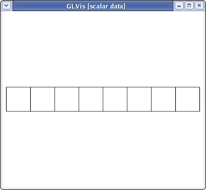
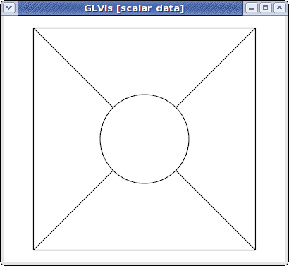
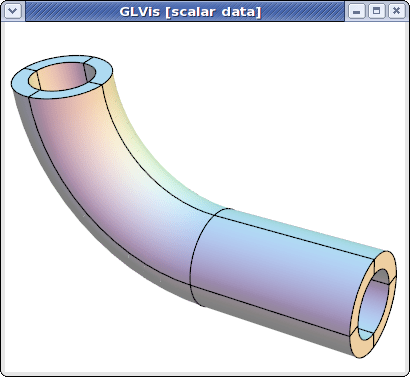
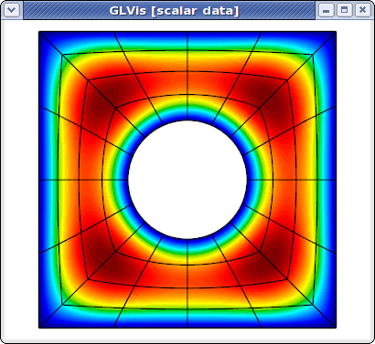
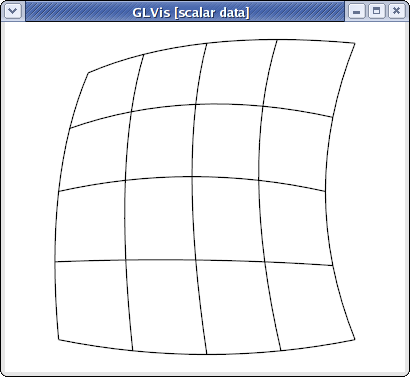
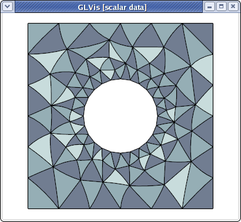
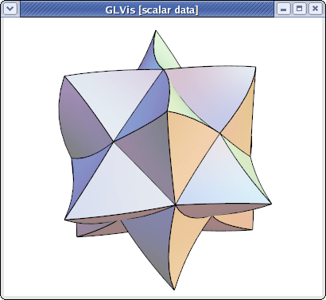
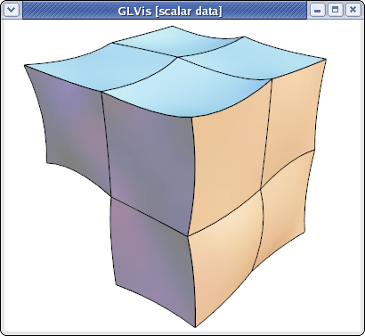

# Mesh Formats

## MFEM mesh v1.0

This is the default format in GLVis. It can be used to describe simple (triangular, quadrilateral, tetrahedral and hexahedral meshes with straight edges) or complicated (curvilinear and more general) meshes.

### Straight meshes

In the simple case of a mesh with straight edges the format looks as follows
```sh
MFEM mesh v1.0

# Space dimension: 2 or 3
dimension
<dimension>

# Mesh elements, e.g. tetrahedrons (4)
elements
<number of elements>
<element attribute> <geometry type> <vertex index 1> ... <vertex index m>
...

# Mesh faces/edges on the boundary, e.g. triangles (2)
boundary
<number of boundary elements>
<boundary element attribute> <geometry type> <vertex index 1> ... <vertex index m>
...

# Vertex coordinates
vertices
<number of vertices>
<vdim>
<coordinate 1> ... <coordinate <vdim>>
...
```

Lines starting with "#" denote comments. The supported geometry types are:

  - POINT       = 0
  - SEGMENT     = 1
  - TRIANGLE    = 2
  - SQUARE      = 3
  - TETRAHEDRON = 4
  - CUBE        = 5

see the comments in [this source file](https://github.com/mfem/mfem/blob/master/fem/geom.hpp) for more details.

For example, the [beam-quad.mesh](https://github.com/mfem/mfem/blob/master/data/beam-quad.mesh) file from the data directory looks like this:
```sh
MFEM mesh v1.0

dimension
2

elements
8
1 3 0 1 10 9
1 3 1 2 11 10
1 3 2 3 12 11
1 3 3 4 13 12
2 3 4 5 14 13
2 3 5 6 15 14
2 3 6 7 16 15
2 3 7 8 17 16

boundary
18
3 1 1 0
3 1 2 1
3 1 3 2
3 1 4 3
3 1 5 4
3 1 6 5
3 1 7 6
3 1 8 7
3 1 9 10
3 1 10 11
3 1 11 12
3 1 12 13
3 1 13 14
3 1 14 15
3 1 15 16
3 1 16 17
1 1 0 9
2 1 17 8

vertices
18
2
0 0
1 0
2 0
3 0
4 0
5 0
6 0
7 0
8 0
0 1
1 1
2 1
3 1
4 1
5 1
6 1
7 1
8 1
```
which corresponds to the mesh



visualized with
```sh
glvis -m beam-quad.mesh -k "Ame****"
```

### Curvilinear and more general meshes

The MFEM mesh v1.0 format also support the general description of meshes based on a vector finite element grid function with degrees of freedom in the "nodes" of the mesh:
```sh
MFEM mesh v1.0

# Space dimension: 2 or 3
dimension
<dimension>

# Mesh elements, e.g. tetrahedrons (4)
elements
<number of elements>
<element attribute> <geometry type> <vertex index 1> ... <vertex index m>
...

# Mesh faces/edges on the boundary, e.g. triangles (2)
boundary
<number of boundary elements>
<boundary element attribute> <geometry type> <vertex index 1> ... <vertex index m>
...

# Number of vertices (no coordinates)
vertices
<number of vertices>

# Mesh nodes as degrees of freedom of a finite element grid function
nodes
FiniteElementSpace
FiniteElementCollection: <finite element collection>
VDim: <dimension>
Ordering: 0
<x-coordinate degrees of freedom>
...
<y-coordinate degrees of freedom>
...
<z-coordinate degrees of freedom>
...
```
Some possible [finite element collection](https://github.com/mfem/mfem/blob/master/fem/fe_coll.hpp) choices are: `Linear`, `Quadratic` and `Cubic` corresponding to curvilinear P1/Q1, P2/Q2 and P3/Q3 meshes. The algorithm for the numbering of the degrees of freedom can be found in [MFEM's source code](https://github.com/mfem/mfem/blob/master/fem/fespace.cpp#L739).

For example, the [escher-p3.mesh](https://github.com/mfem/mfem/blob/master/data/escher-p3.mesh) from MFEM's [data directory](https://github.com/mfem/mfem/blob/master/data) describes a tetrahedral mesh with nodes given by a P3 vector Lagrangian finite element function. Visualizing this mesh with
```sh
glvis -m escher-p3.mesh -k "Aaaoooooooooo**************tt"
```
we get:


Topologically periodic meshes can also be described in this format, see for example the [periodic-segment](https://github.com/mfem/mfem/blob/master/data/periodic-segment.mesh), [periodic-square](https://github.com/mfem/mfem/blob/master/data/periodic-square.mesh), and [periodic-cube](https://github.com/mfem/mfem/blob/master/data/periodic-cube.mesh) meshes in the data directory, as well as [Example 9](examples.md?advection).


## NURBS meshes

MFEM provides full support for meshes and discretization spaces based on Non-uniform Rational B-Splines (NURBS). These are treated similarly to general [curvilinear meshes](#curvilinear-and-more-general-meshes) where the NURBS nodes are specified as a grid function at the end of the mesh file.

For example, here is a simple quadratic NURBS mesh for a square domain with a (perfectly) circular hole in the middle. (The exact representation of conical sections is a major advantage of the NURBS approach over high-order finite elements.)
```sh
MFEM NURBS mesh v1.0

#
# MFEM Geometry Types (see mesh/geom.hpp):
#
# SEGMENT     = 1
# SQUARE      = 3
# CUBE        = 5
#

dimension
2

elements
4
1 3 0 1 5 4
1 3 1 2 6 5
1 3 2 3 7 6
1 3 3 0 4 7

boundary
8
1 1 0 1
1 1 1 2
1 1 2 3
1 1 3 0
1 1 5 4
1 1 6 5
1 1 7 6
1 1 4 7

edges
12
0 0 1
0 4 5
1 1 2
1 5 6
2 2 3
2 6 7
3 3 0
3 7 4
4 0 4
4 1 5
4 2 6
4 3 7

vertices
8

knotvectors
5
2  3 0 0 0 1 1 1
2  3 0 0 0 1 1 1
2  3 0 0 0 1 1 1
2  3 0 0 0 1 1 1
2  3 0 0 0 1 1 1

weights
1
1
1
1
1
1
1
1
1
0.707106781
1
0.707106781
1
0.707106781
1
0.707106781
1
1
1
1
0.853553391
0.853553391
0.853553391
0.853553391

FiniteElementSpace
FiniteElementCollection: NURBS2
VDim: 2
Ordering: 1

0 0
1 0
1 1
0 1
0.358578644 0.358578644
0.641421356 0.358578644
0.641421356 0.641421356
0.358578644 0.641421356
0.5 0
0.5 0.217157288
1 0.5
0.782842712 0.5
0.5 1
0.5 0.782842712
0 0.5
0.217157288 0.5
0.15 0.15
0.85 0.15
0.85 0.85
0.15 0.85
0.5  0.108578644
0.891421356 0.5
0.5 0.891421356
0.108578644 0.5
```
This above file, as well as other examples of NURBS meshes, can be found in [MFEM's data directory](https://github.com/mfem/mfem/tree/master/data). It can be visualized directly with
```sh
glvis -m square-disc-nurbs.mesh
```
which after several refinements with the "`i`" key looks like



To explain MFEM's NURBS mesh file format, we first note that the topological part of the mesh (the `elements` and `boundary` sections) describe the 4 NURBS patches visible above. We use the vertex numbers as labels, so we only need the number of vertices.

In the NURBS case we need to also provide description of the edges on the patch boundaries and associate a knot vector with each of them. This is done in the `edges` section where the first index in each row refers to the knot vector id (from the following `knotvectors` section), while the remaining two indexes are the edge vertex numbers.

The position of the NURBS nodes (control points) is given as a NURBS grid function at the end of the file, while the associated weights are listed in the preceding `weights` section.

Some examples of VTK meshes can be found in MFEM's [data directory](https://github.com/mfem/mfem/blob/master/data). Here is one of the 3D NURBS meshes



The image above was produced with some refinement (key "`o`") and mouse manipulations from
```sh
glvis -m pipe-nurbs.mesh
```

Solutions from NURBS discretization spaces are also natively supported. For example here is the approximation for the solution of a simple Poisson problem on a refined version of the above mesh.
```sh
glvis -m square-disc-nurbs.mesh -g sol.gf
```




## Curvilinear VTK meshes

MFEM also supports quadratic triangular, quadrilaterals, tetrahedral and hexahedral curvilinear meshes in VTK format. This format is described in the [VTK file format documentation](http://vtk.org/VTK/img/file-formats.pdf). The local numbering of degrees of freedom for the biquadratic quads and triquadratic hexes can be found in the Doxygen reference of the [vtkBiQuadraticQuad](http://www.vtk.org/doc/release/5.6/html/a00185.html) and [vtkTriQuadraticHexahedron](http://www.vtk.org/doc/release/5.6/html/a02039.html) classes. Currently VTK does not support cubic, and higher-order meshes.

As an example, consider a simple curved quadrilateral saved in a file `quad.vtk`:
```sh
# vtk DataFile Version 3.0
Generated by MFEM
ASCII
DATASET UNSTRUCTURED_GRID
POINTS 9 double
0 0 0
1 0 0
1 1 0
0.1 0.9 0
0.5 -0.05 0
0.9 0.5 0
0.5 1 0
0 0.5 0
0.45 0.55 0
CELLS 1 10
9 0 1 2 3 4 5 6 7 8
CELL_TYPES 1
28
CELL_DATA 1
SCALARS material int
LOOKUP_TABLE default
1
```
Visualizing it with "`glvis -m quad.vtk`" and typing "`Aemiii`" in the GLVis window we get:


The "`i`" key increases the reference element subdivision which gives an increasingly better approximation of the actual curvature of the element. To view the curvature of the mapping inside the element we can use the "I" key, e.g.,
```sh
glvis -m quad.vtk -k "AemIIiii"
```


Here is a slightly more complicated [quadratic quadrilateral](https://github.com/mfem/mfem/blob/master/data/star-q2.vtk) mesh example (the different colors in the GLVis window are used to distinguish neighboring elements):
```sh
glvis -m star-q2.vtk -k "Am"
```


MFEM and GLVis can also handle [quadratic triangular](https://github.com/mfem/mfem/blob/master/data/square-disc-p2.vtk) meshes:
```sh
glvis -m square-disc-p2.vtk -k "Am"
```


As well as [quadratic tetrahedral](https://github.com/mfem/mfem/blob/master/data/escher-p2.vtk) and [quadratic hexahedral](https://github.com/mfem/mfem/blob/master/data/fichera-q2.vtk) VTK meshes:
```sh
glvis -m escher-p2.vtk -k "Aaaooooo**************"
```

```sh
glvis -m fichera-q2.vtk -k "Aaaooooo******"
```

