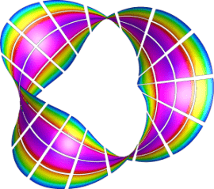
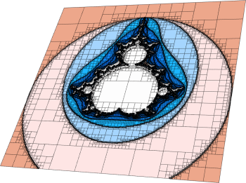
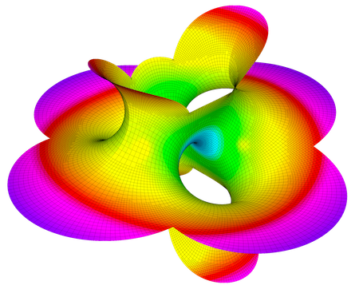

tag-gettingstarted:

# Meshing Miniapps

The `miniapps/meshing` directory contains a collection of meshing-related miniapps based on MFEM.

Compared to the [example codes](examples.md), the miniapps are more complex,
demonstrating more advanced usage of the library. They are intended to be more
representative of MFEM-based application codes. We recommend that new users
start with the example codes before moving to the miniapps.

The current meshing miniapps are described below.

### Mobius Strip

This miniapp generates various Mobius strip-like surface meshes. It is a good
way to generate complex surface meshes.

Manipulating the mesh topology and
performing mesh transformation are demonstrated. The `mobius-strip` mesh in the
`data` directory was generated with this miniapp.

### Klein Bottle

This miniapp generates three types of Klein bottle surfaces. It is similar to
the mobius-strip miniapp.

The `klein-bottle` and `klein-donut` meshes in the
`data` directory were generated with this miniapp.

### Toroid

This miniapp generates two types of toroidal volume meshes; one with
triangular cross sections and one with square cross sections.

A wide variety of toroidal meshes can be generated by varying the
amount of twist as well as the major and minor radii and other
variables.  The `toroid-wedge` and `toroid-hex` meshes in the `data` directory
were generated with this miniapp.

### Twist

This miniapp generates simple periodic meshes made from different types of
elements.

A wide variety of twisted meshes can be generated by varying the
amount of twist as well as the dimensions, element types, and other
variables.

### Extruder

This miniapp creates higher dimensional meshes from lower dimensional meshes
by extrusion.

Simple coordinate transformations can also be applied if desired.  The initial
mesh can be 1D or 2D. 1D meshes can be extruded in the y-direction first and
then in the z-direction.  2D meshes can be triangular, quadrilateral, or
contain both element types.

### Trimmer

This miniapp creates a new mesh file from an existing mesh by trimming away
elements with selected attributes. High order and/or periodic meshes are
supported although NURBS meshes are not.

By default newly exposed boundaries will be assigned unique boundary
attributes. The new boundary attributes are determined by adding the volume
attribute of the exposing elements to the maximum boundary attribute in the
original mesh. Alternatively the user can specify new boundary attributes to be
associated with each volume attribute being trimmed away. In the later case
the new attributes need not be unique.

### Polar-NC

This miniapp generates a circular sector mesh that consist of quadrilaterals
and triangles of similar sizes. The 3D version of the mesh is made of prisms
and tetrahedra:

The mesh is non-conforming by design, and can optionally be
made curvilinear. The elements are ordered along a space-filling curve by
default, which makes the mesh ready for parallel non-conforming AMR in MFEM.

### Shaper

This miniapp performs multiple levels of adaptive mesh refinement to resolve the
interfaces between different "materials" in the mesh, as specified by a given
material() function.

It can be used as a simple initial mesh generator, for example in the case when
the interface is too complex to describe without local refinement. Both
conforming and non-conforming refinements are supported.

### Mesh Explorer

This miniapp is a handy tool to examine, visualize and manipulate a given
mesh.

Some of its features are:

- visualizing of mesh materials and individual mesh elements
- mesh scaling, randomization, and general transformation
- manipulation of the mesh curvature
- the ability to simulate parallel partitioning
- quantitative and visual reports of mesh quality

### Mesh Optimizer

This miniapp performs mesh optimization using the Target-Matrix Optimization
Paradigm (TMOP) by P.Knupp et al., and a global variational minimization
approach.

It minimizes the quantity $\sum_T \int_T \mu(J(x))$, where $T$ are the target
(ideal) elements, $J$ is the Jacobian of the transformation from the target
to the physical element, and $\mu$ is the mesh quality metric.

This metric can measure shape, size or alignment of the region around each
quadrature point. The combination of targets and quality metrics is used to
optimize the physical node positions, i.e., they must be as close as possible to
the shape / size / alignment of their targets.

### Minimal Surface

This miniapp solves Plateau's nonlinear elliptic problem: the Dirichlet problem for the minimal surface equation.

The weak form of the equation, with prescribed boundary conditions, is given by:

$$\int_\Omega\frac{\nabla{u}\cdot\nabla{v}}{\sqrt{1+|\nabla{u}|^2}}dx = 0$$

Two problems can be run:

1. Problem 0 solves the *minimal surface equation of parametric surfaces*.
   The command line options allow the selection of different parametrization:

    - Catenoid,
    - Helicoid,
    - Enneper,
    - Hold,
    - Costa,
    - Shell,
    - Scherk

    or simply one from an input mesh file.

2. Problem 1 solves the *minimal surface equation for surfaces restricted to be graphs of the form $z=f(x,y)$*.
   This problem is solved using the Picard iterations: $$\int_\Omega\frac{\nabla{u_{n+1}}\cdot\nabla{v}}{\sqrt{1+|\nabla{u_n}|^2}}dx = 0$$

