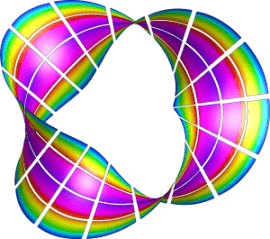
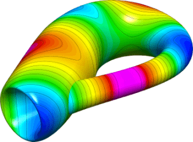
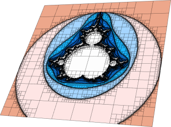
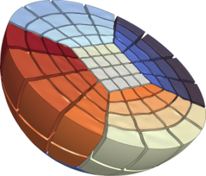

# Meshing

This page provides a brief description of MFEM's mesh formats and meshing mini applications.

## Mesh formats

MFEM supports a number of mesh formats, including:

  - MFEM's own [mesh v1.0 format](mesh-formats.md#mfem-mesh-v10), which can describe both [straight](mesh-formats.md#straight-meshes) as well as [arbitrary high-order curvilinear](mesh-formats.md#curvilinear-and-more-general-meshes) and [more general](mesh-formats.md#curvilinear-and-more-general-meshes) meshes,
  - MFEM's own format for [NURBS](mesh-formats.md#nurbs-meshes) meshes,
  - The [VTK](mesh-formats.md#curvilinear-vtk-meshes) unstructured mesh format, for triangular, quadrilateral, tetrahedral and hexahedral meshes,
  - The [Gmsh](http://gmsh.info/) ASCII and binary formats for 2D and 3D meshes.
  - The [CUBIT](https://cubit.sandia.gov/) meshes through the Genesis (NetCDF) binary format.
  - The [NETGEN](http://sourceforge.net/projects/netgen-mesher/) triangular and tetrahedral mesh formats,
  - The [TrueGrid](http://www.truegrid.com/) hexahedral mesh format.

Detailed description of these formats can be found on the [mesh formats](mesh-formats.md) page. These formats are also supported by MFEM's native visualization tool, [GLVis](http://glvis.org/).

## Meshing miniapps

The `miniapps/meshing` directory contains a collection of meshing-related miniapps based on MFEM.

Compared to the [example codes](examples.md), the miniapps are more complex,
demonstrating more advanced usage of the library. They are intended to be more
representative of MFEM-based application codes. We recommend that new users
start with the example codes before moving to the miniapps.

The current meshing miniapps are described below.

### Mobius Strip

This miniapp generates various Mobius strip-like surface meshes. It is a good
way to generate complex surface meshes.

Manipulating the mesh topology and
performing mesh transformation are demonstrated. The `mobius-strip` mesh in the
`data` directory was generated with this miniapp.

### Klein Bottle

This miniapp generates three types of Klein bottle surfaces. It is similar to
the mobius-strip miniapp.

The `klein-bottle` and `klein-donut` meshes in the
`data` directory were generated with this miniapp.

### Shaper

This miniapp performs multiple levels of adaptive mesh refinement to resolve the
interfaces between different "materials" in the mesh, as specified by a given
material() function.

It can be used as a simple initial mesh generator, for example in the case when
the interface is too complex to describe without local refinement. Both
conforming and non-conforming refinements are supported.

### Mesh Explorer

This miniapp is a handy tool to examine, visualize and manipulate a given
mesh.

Some of its features are:

- visualizing of mesh materials and individual mesh elements
- mesh scaling, randomization, and general transformation
- manipulation of the mesh curvature
- the ability to simulate parallel partitioning
- quantitative and visual reports of mesh quality
