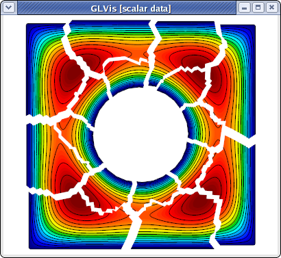
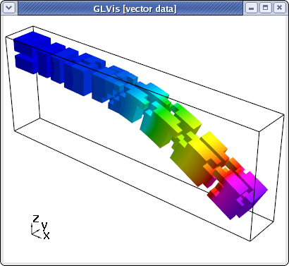
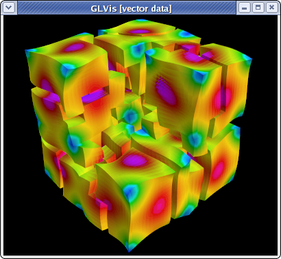

# Parallel Tutorial

## Summary

This tutorial illustrates the building and sample use of the following MFEM parallel example codes:

  - [Example 1p](#example-1p)
  - [Example 2p](#example-2p)
  - [Example 3p](#example-3p)

An interactive documentation of all example codes is available [here](examples.md).

## Building

Follow the [building instructions](building.md) to build the parallel MFEM library and to start a GLVis server. The latter is the recommended visualization software for MFEM (though its use is optional).

To build the parallel example codes, type `make` in MFEM's examples directory:
<pre>
~/mfem/examples> make
mpicxx  -O3 -I..  -I../../hypre-2.10.0b/src/hypre/include ex1p.cpp -o ex1p ...
mpicxx  -O3 -I..  -I../../hypre-2.10.0b/src/hypre/include ex2p.cpp -o ex2p ...
mpicxx  -O3 -I..  -I../../hypre-2.10.0b/src/hypre/include ex3p.cpp -o ex3p ...
mpicxx  -O3 -I..  -I../../hypre-2.10.0b/src/hypre/include ex4p.cpp -o ex4p ...
mpicxx  -O3 -I..  -I../../hypre-2.10.0b/src/hypre/include ex5p.cpp -o ex5p ...
mpicxx  -O3 -I..  -I../../hypre-2.10.0b/src/hypre/include ex7p.cpp -o ex7p ...
mpicxx  -O3 -I..  -I../../hypre-2.10.0b/src/hypre/include ex8p.cpp -o ex8p ...
mpicxx  -O3 -I..  -I../../hypre-2.10.0b/src/hypre/include ex9p.cpp -o ex9p ...
mpicxx  -O3 -I..  -I../../hypre-2.10.0b/src/hypre/include ex10p.cpp -o ex10p ...
</pre>

## Example 1p

This is a parallel version of [Example 1](serial-tutorial.md#example-1) using *hypre*'s BoomerAMG preconditioner. Run this example as follows:
<pre>
~/mfem/examples> mpirun -np 16 ex1p -m ../data/square-disc.mesh
...
PCG Iterations = 26
Final PCG Relative Residual Norm = 4.30922e-13
</pre>

If a GLVis server is running, the computed finite element solution **combined from all processors**, will appear in an interactive window:

You can examine the solution using the mouse and the GLVis [command keystrokes](https://raw.githubusercontent.com/glvis/glvis/master/README).
To view the parallel partitioning, for example, press the following keys in the GLVis window: "`RAjlmm`" followed by F11/F12 and zooming with the right mouse button.

To examine the solution only in one, or a few parallel subdomains, one can use the F9/F10 and the F8 keys. In 2D, one can also use press "`b`" to draw the only the boundaries between the subdomains. For example

was produced by
<pre>
glvis -np 16 -m mesh -g sol -k "RAjlb"
</pre>
followed by F9 and scaling/position adjustment with the mouse.

Three-dimensional and curvilinear meshes are also supported in parallel:

<pre>
~/mfem/examples> mpirun -np 16 ex1p -m ../data/escher-p3.mesh
...
PCG Iterations = 24
Final PCG Relative Residual Norm = 3.59964e-13
~/mfem/examples> glvis -np 16 -m mesh -g sol -k "Aooogtt"
</pre>

The continuity of the solution across the inter-processor interfaces can be seen by using a cutting plane (keys "`AoooiMMtmm`" followed by "`z`" and "`Y`" adjustments):

## Example 2p

This is a parallel version of [Example 2](serial-tutorial.md#example-2) using the systems version of *hypre*'s BoomerAMG preconditioner, which can be run analogous to the serial case:

<pre>
~/mfem/examples> mpirun -np 16 ex2p -m ../data/beam-hex.mesh -o 1
...
PCG Iterations = 39
Final PCG Relative Residual Norm = 2.91528e-09
</pre>

To view the parallel partitioning with the magnitude of the computed displacement field, type "`Atttaa`" in the GLVis window followed by subdomain shrinking with F11 and scaling adjustments with the mouse:

## Example 3p

This is a parallel version of [Example 3](serial-tutorial.md#example-3) using *hypre*'s AMS preconditioner. Its use is analogous to the serial case:

<pre>
/mfem/examples> mpirun -np 16 ex3p -m ../data/fichera-q3.mesh
...
PCG Iterations = 17
Final PCG Relative Residual Norm = 7.61595e-13

|| E_h - E ||_{L^2} = 0.0821685
</pre>

Note that AMS leads to much fewer iterations than the Gauss-Seidel precondiotioner used in the serial code. The parallel subdomain partitioning can be seen with "`ooogt`" and F11/F12:

One can also visualize individual components of the Nedelec solution and remove the elements in a cutting plane to see the surfaces corresponding to inter-processor boundaries:
<pre>
glvis -np 16 -m mesh -g sol -k "ooottmiEF"
</pre>

