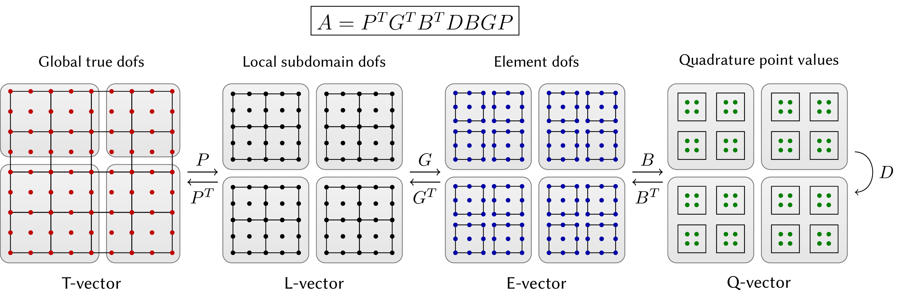

# Performance and Partial Assembly

This document provides a brief overview of the tensor-based high-performance
and partial assembly features in MFEM. In the traditional finite element
setting, the operator is assembled in the form of a matrix. The action of the
operator is computed by multiplying with this matrix. At high orders this
requires both a large amount of memory to store the matrix, as well as many
floating point operations to compute and apply it. Partial assembly is a
technique that allows for efficiently applying the action of finite element
operators efficiently without forming the corresponding matrix. This is
particularly important when running on GPUs.

Partial assembly is enabled at the level of the `BilinearForm` by setting
the assembly level:
```c++
a->SetAssemblyLevel(AssemblyLevel::PARTIAL);
```
Once partial assembly is enabled, subsequent calls to functions such as
`FormLinearSystem` will result in an `Operator` that represents the action of
the bilinear form `a`, without assembling a matrix. This functionality is 
illustrated in several [MFEM examples](examples.md), include example 1, 3, 6, 
9, 24, and 25.

## Preconditioning with Partial Assembly

When using partial assembly, the system matrix is no longer available for
constructing preconditioners. This means that some of the standard
preconditioners in MFEM such as `HypreBoomerAMG` and `GSSmoother` cannot be
used.

MFEM allows for the efficient construction of diagonal (Jacobi) smoothers for
partially assembled operators on quad and hex meshes using the class
`OperatorJacobiSmoother`. This class will efficiently assemble the diagonal of
the corresponding matrix, exploiting the tensor-product structure for efficient
evaluation.

MFEM also allows for Chebyshev smoothing with partial assembly using the class
`OperatorChebyshevSmoother`. This smoother uses estimates of the eigenvalues of
the operator computed using the power method, and is built upon the
functionality of `OperatotJacobiSmoother`.

These smoothers can be used within the context of h- and p-multigrid methods.
These facilities are provided using the `MultigridOperator` and
`MultigridSolver` classes. This functionality is illustrated in example 25.


## Finite Element Operator Decomposition

The partial assembly functionality in MFEM is based on decomposing the finite
element operator into a nested sequence of operations that act on different
levels of the discretization.

Finite element operators are typically defined through weak formulations of
partial differential equations that involve integration over a computational
mesh. The required integrals are computed by splitting them as a sum over the
mesh elements, mapping each element to a simple *reference* element (e.g. the
unit square) and applying a quadrature rule in reference space.

This sequence of operations highlights an inherent hierarchical structure
present in all finite element operators where the evaluation starts on *global
(trial) degrees of freedom (dofs) on the whole mesh*, restricts to *degrees of
freedom on subdomains* (groups of elements), then moves to independent *degrees
of freedom on each element*, transitions to independent *quadrature points* in
reference space, performs the integration, and then goes back in reverse order
to global (test) degrees of freedom on the whole mesh.

This is illustrated below for the case of a symmetric linear operator. We use
the notions **T-vector**, **L-vector**, **E-vector** and **Q-vector** to
represent the sets corresponding to the (true) degrees of freedom on the global
mesh, the split local degrees of freedom on the subdomains, the split degrees
of freedom on the mesh elements, and the values at quadrature points,
respectively.

We refer to the operators that connect the different types of vectors as:

- Subdomain restriction **P**
- Element restriction **G**
- Basis (Dofs-to-Qpts) evaluator **B**
- Operator at quadrature points **D**

More generally, when the test and trial space differ, they get their own
versions of **P**, **G** and **B**.



Note that in the case of adaptive mesh refinement (AMR), the restrictions **P**
and **G** will involve not just extracting sub-vectors, but evaluating values at
constrained degrees of freedom through the AMR interpolation. There can also be
several levels of subdomains (**P1**, **P2**, etc.), and it may be convenient to
split **D** as the product of several operators (**D1**, **D2**, etc.).

## Partial Assembly in MFEM

Since the global operator **A** is just a series of variational restrictions
with **B**, **G** and **P**, starting from its point-wise kernel **D**, a
"matrix-vector product" with **A** can be performed by evaluating and storing
some of the innermost variational restriction matrices, and applying the rest
of the operators "on-the-fly". For example, one can compute and store a global
matrix on T-vector level. Alternatively, one can compute and store only the
subdomain (L-vector) or element (E-vector) matrices and perform the action of
**A** using matvecs with **P** or **P** and **G**. While these options are
natural for low-order discretizations, they are not a good fit for high-order
methods due to the amount of FLOPs needed for their evaluation, as well as the
memory transfer needed for a matvec.

MFEM's **partial assembly** functionality computes and stores only **D** (or
portions of it) and evaluates the actions of **P**, **G** and **B** on-the-fly.
Critically for performance, MFEM takes advantage of the tensor-product
structure of the degrees of freedom and quadrature points on quadrilateral and
hexahedral elements to perform the action of **B** without storing it as a
matrix.

The partial assembly algorithm requires optimal amount of memory transfers
(with respect to the polynomial order) and near-optimal FLOPs for operator
evaluation. It consists of an operator *setup* phase, that evaluates and stores
**D** and an operator *apply* (evaluation) phase that computes the action of
**A** on an input vector. When desired, the setup phase may be done as a
side-effect of evaluating a different operator, such as a nonlinear residual.
The relative costs of the setup and apply phases are different depending on the
physics being expressed and the representation of **D**.

## Partial Assembly for Discontinuous Galerkin methods

A complementary partial assembly decomposition is used for Discontinuous Galerkin
methods to handle face terms, where a similar sequence of operators is applied
on the faces to compute the numerical fluxes. However, since elements are
decoupled, the element restriction **G** is the identity, and a face restriction
**F** is used instead to compute the numerical fluxes and couple elements
together. This face restriction **F** goes from element degrees of freedom to
face degrees of freedom. Then a **B** operator can be applied on the faces
(different from the element **B**, but identical for all faces). And an
analogous **D** operator is then applied at the face quadrature points. We
currently support partial assembly only for closed basis functions
(e.g. Bauss-Lobatto and Bernstein basis) with Integrators that don't require the
derivative on the faces.

### Parallel Decomposition

After the application of each of the first three transition operators, **P**,
**G** and **B**, the operator evaluation is decoupled on their ranges, so **P**,
**G** and **B** allow us to "zoom-in" to subdomain, element and quadrature point
level, ignoring the coupling at higher levels.

Thus, a natural mapping of **A** on a parallel computer is to split the
**T-vector** over MPI ranks (a non-overlapping decomposition, as is typically
used for sparse matrices), and then split the rest of the vector types over
computational devices (CPUs, GPUs, etc.) as indicated by the shaded regions in
the diagram above.

One of the advantages of the decomposition perspective in these settings is that
the operators **P**, **G**, **B** and **D** clearly separate the MPI parallelism
in the operator (**P**) from the unstructured mesh topology (**G**), the choice
of the finite element space/basis (**B**) and the geometry and point-wise
physics **D**. These components also naturally fall in different classes of
numerical algorithms: parallel (multi-device) linear algebra for **P**, sparse
(on-device) linear algebra for **G**, dense/structured linear algebra (tensor
contractions) for **B** and parallel point-wise evaluations for **D**.

## [High-Performance Templated Operators](performance.md)

MFEM also offers a set of templated classes to evaluate finite element 
operators on tensor-product (quadrilateral and hexahedral) meshes.