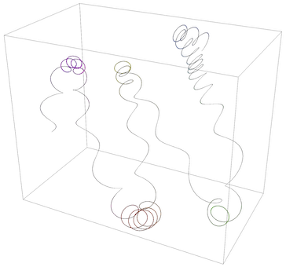
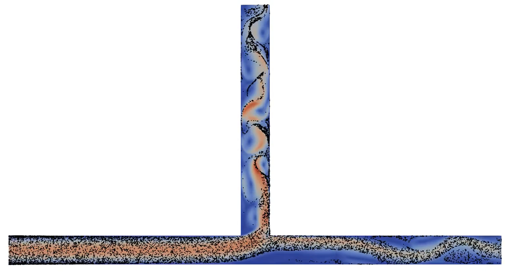
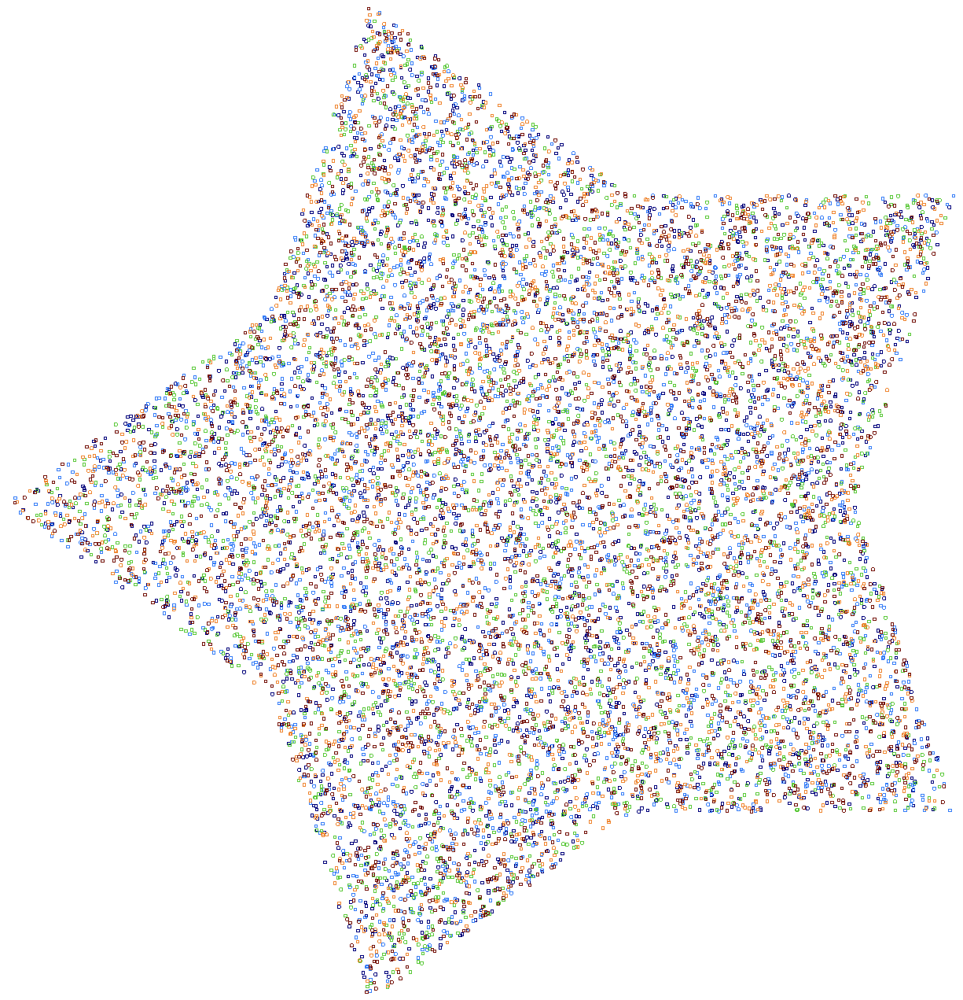
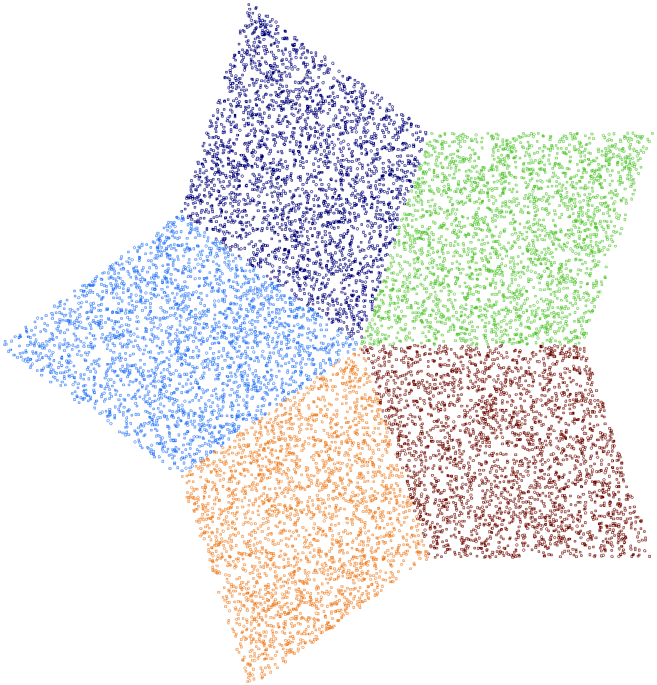
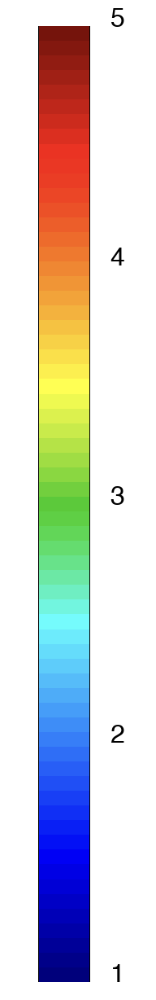

# Particles

MFEM now includes a scalable framework for particle-based discretizations,
supporting a wide range of applications such as tracer particles in
incompressible flow, one-way coupled charged particles subject
to Lorentz forces, and two-way coupled electrostatic Particle-in-Cell simulations.
The framework integrates seamlessly with existing MFEM abstractions such as
meshes and grid functions.

The framework introduces three core particle abstractions:

- [ParticleSet](https://github.com/mfem/mfem/blob/master/fem/particleset.hpp):
primary interface for interacting with the particle framework; it manages
particle data such as spatial coordinates, fields (e.g., mass, momentum, and energy),
tags (e.g., color, and order of time integration), and globally unique IDs,
in both serial and parallel.
- [ParticleVector](https://github.com/mfem/mfem/blob/master/linalg/particlevector.hpp):
derived from `mfem::Vector`, the `ParticleVector` container is used inside the
`ParticleSet` class to store a scalar or vector field for all particles,
with a separate `ParticleVector` for each field.
- [Particle](https://github.com/mfem/mfem/blob/master/fem/particleset.hpp): a
convenience container for data associated with a given particle.

Together with [FindPointsGSLIB](https://github.com/mfem/mfem/blob/master/fem/gslib.hpp),
these classes provide the building blocks for particle tracking and
particle-mesh coupling in MFEM.

The key features of the new particle framework are:

- arbitrary number of scalar (e.g., mass) and vector fields (e.g., velocity)
- arbitrary number of integer tags (e.g., color)
- GPU support for all particle data
- globally unique particle IDs for convenient post-processing
- particle migration across MPI ranks with `ParticleSet::Redistribute()`
- coupling with finite element mesh and grid function through `FindPointsGSLIB`
- ParaView visualization through CSV output with `ParticleSet::PrintCSV()`
- GLVis visualization for particle cloud and trajectories with new utilities in
  [miniapps/common/particles_extras.hpp](https://github.com/mfem/mfem/blob/master/miniapps/common/particles_extras.hpp)

Learn more about the framework from the [Particles in MFEM](pdf/workshop25/19_Signorelli_Particles.pdf) ([🎬](https://www.youtube.com/watch?v=oL8ThrRqRVw))
presentation at the [MFEM Community Workshop 2025](https://mfem.org/workshop25/).

Visualized below is a snapshot from a simulation
([🎬](img/gallery/workshop25/mfem-particles.mp4)) where particles are injected into the
[MFEM mesh](https://github.com/mfem/mfem/blob/master/data/mfem.mesh) at random
positions and velocities, with perfectly elastic collisions
to model interaction with domain boundaries.

# Particle Miniapps

### Lorentz Miniapp

The [**lorentz**](https://github.com/mfem/mfem/blob/master/miniapps/electromagnetics/lorentz.cpp)
miniapp demonstrates one-way coupled charged particle motion due to electric and
magnetic fields using the [Boris algorithm](https://doi.org/10.1063/1.4818428).
The input grid functions are generated using the
[**volta**](electromagnetics.md#volta-mini-application) and
[**tesla**](electromagnetics.md#tesla-mini-application) miniapps, and
these are subsequently used in `lorentz` with
[**FindPointsGSLIB**](https://mfem.org/howto/findpts/) to move particles.

### Navier Bifurcation Miniapp

The [navier_bifurcation](https://github.com/mfem/mfem/blob/master/miniapps/fluids/navier/navier_bifurcation.cpp)
miniapp demonstrates one-way coupled tracer particles
in incompressible flow ([🎬](img/gallery/workshop25/particles.mp4)).
Particles are injected at the inlet of a 2D bifurcating channel, and
move due to the drag and lift forces exerted on them by the surrounding
fluid.

### Electrostatic PIC Miniapp

The [electrostatic-pic](https://github.com/mfem/mfem/blob/master/miniapps/plasma/pic/electrostatic-pic.cpp)
miniapp demonstrates two-way coupled Particle-in-Cell simulation
(in 2D or 3D spatial dimensions) with charged particles subject to
electric field forces. At each time step:

1. particles deposit charge to the mesh,
2. a Poisson problem is solved for the electrostatic potential,
3. electric field grid function is computed using the gradient of the potential,
4. the electric field is interpolated at particle locations,
5. particle positions are updated under the effect of electric field.

This loop is repeated for a user-specified number of time steps.

### Particles Redistribute Miniapp

The [particles_redist](https://github.com/mfem/mfem/blob/master/miniapps/gslib/particles_redist.cpp)
miniapp is a compact demonstration of parallel particle redistribution.
Particles are initialized randomly over the global mesh on each rank.
Since particles may not initially reside on the same rank as the mesh element
that overlaps them, particle-mesh coupling can become communication intensive.
`ParticleSet::Redistribute()` moves each particle to the rank of the overlapping element.
Visualized below is output from one of the sample runs of the `particles_redist` miniapp.

  

    
    
<small>Initial distribution</small>

  

  

    
    
<small>Post redistribute</small>

  

  

    
    
<small>Legend</small>

  

