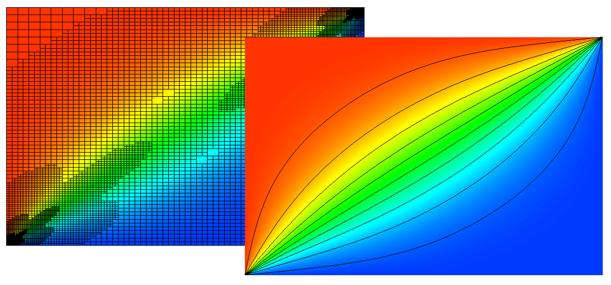

tag-gettingstarted:

# Plasma Physics Mini Applications

$\newcommand{\A}{\vec{A}}\newcommand{\B}{\vec{B}}
\newcommand{\D}{\vec{D}}\newcommand{\E}{\vec{E}}
\newcommand{\H}{\vec{H}}\newcommand{\J}{\vec{J}}
\newcommand{\M}{\vec{M}}\newcommand{\P}{\vec{P}}
\newcommand{\F}{\vec{F}}
\newcommand{\dd}[2]{\frac{\partial #1}{\partial #2}}
\newcommand{\cross}{\times}\newcommand{\inner}{\cdot}
\newcommand{\div}{\nabla\cdot}\newcommand{\curl}{\nabla\times}
\newcommand{\grad}{\nabla}$

The `miniapps/plasma` directory contains a collection of plasma
physics miniapps based on MFEM.

Plasma Physics is a broad and fascinating field. Our mini applications
will tread a narrow path through this field but hopefully point the
way towards a more thorough exploration using MFEM. We will confine
ourselves to simple examples of magnetized cold plasmas. The existance
of a background magnetic field will create anisotropies in otherwise
familiar partial differential equations. The "cold" plasma limitation
means that thermal motions of electrons and ions are small enough as
to be negligible which simplifies many interactions and effective
material coefficients.

Compared to the [example codes](examples.md), the miniapps are more complex,
demonstrating more advanced usage of the library. They are intended to be more
representative of MFEM-based application codes. We recommend that new users
start with the example codes before moving to the miniapps.

The current (and future) plasma miniapps are described below.

## Electromagnetic Wave Propagation in Magnetized Cold Plasma

The equations describing electromagnetic phenomena are known
collectively as the Maxwell Equations. For a brief overview see the
discussion in
[Electromagnetics](electromagnetics.md#Electromagnetics). For harmonic
fields with time dependence of the form $e^{-i\omega t}$ the Maxwell
equations can be written as:

  $$\begin{align}
    \curl\H + i\omega\D & = \J    \label{ampere}  \\\\
    \curl\E - i\omega\B & = 0     \label{faraday} \\\\
                 \div\D & = \rho  \label{gauss}   \\\\
                 \div\B & = 0     \label{divb}
  \end{align}$$

In magnetized cold plasmas the Maxwell equations still hold
unaltered. However, the background magnetic field, $\B_0$, restricts
the motion of electrons and ions which move freely along the field but
follow helical paths when accelerated in other directions. This leads
to an effective dielectric tensor, $\epsilon$, which can be highly
anisotropic.  This coefficient appears in the constitutive relation
$D = \epsilon\E$. The form of this tensor can be written as:

$$
\epsilon/\epsilon_0 = (I - \hat\{b}\otimes\hat\{b})\, S + \hat\{b}\otimes\hat\{b}\, P + i\,\[\hat\{b}\]_\times\, D
$$

Where $\hat{b}\equiv\frac{\B_0}{\|\B_0\|}$, $\[\hat{b}]_\times$ is the
operator which computes the cross product with $\hat\{b}$. As an
example consider a background magnetic flux directed along the
$\hat{z}$ direction. In this case the dielectric tensor becomes:

$$\epsilon = \epsilon_0\,\left(
\begin{array}{3}
   S & -i\,D & 0\\\\
i\,D &     S & 0\\\\
   0 &     0 & P
\end{array}
\right)$$

$S$, $D$, and $P$ are called Stix coefficients (named after [Thomas H.
Stix](https://en.wikipedia.org/wiki/Thomas_H._Stix) from Princeton
University) given by:

$$\begin{align\*}
S & = 1 - \sum_s\frac{\omega_{ps}^2}{\omega^2-\Omega_s^2} \\\\
D & = \sum_s\frac{\Omega_s}{\omega}\frac{\omega_{ps}^2}{\omega^2-\Omega_s^2} \\\\
P & = 1 - \sum_s\frac{\omega_{ps}^2}{\omega^2} \\\\
\end{align\*}$$

Where the sums are taken over ion species, $\omega=2\pi f$ and $f$ is
the wave frequency, $\omega_{ps}$ is the plasma frequency related to
mass, charge, and density of the plasma species, and $\Omega_s$ is the
cyclotron frequency related to the background magnetic field intensity
and the mass and charge of the ion species.

Clearly, this anisotropy will give rise to effects related to the
polarization of the electric field and the direction of wave
propagation. In addition to this it must be noted that the complicated
dependence of the Stix coefficients on the background magnetic field
strength and the electron and ion densities can produce drastic
changes in the character of the dielectric tensor throughout the
domain with its eigenvalues varying by several orders of magnitude. In
particular we should point out that this effective dielectric tensor
may have strongly negative eigenvalues. These characteristics of the
dielectric tensor significantly increase the numerical difficulties
already present in seeking solutions to the Maxwell equations.

### Stix 1D Mini Application

Coming soon...

## Anisotropic Thermal Diffusion in Magnetized Plasma

Magnetic fields influence charged particles through the Lorentz force
term $q\,\vec{v}\times\vec{B}$ which leads to helical particle
trajectories. Particles moving parallel to the magnetic field will be
unaffected but particles moving transverse to the field will have
their path wrapped around the magnetic field direction thereby
impeding their progress in transverse directions. This, of course, is
the mechanism which makes it possible to magnetically confine
plasmas. This confinement restricts the diffusion of various
quantities in plasmas including the mixing of different ion species as
well as the diffusion of thermal energy in transverse directions.

For example, the thermal diffusion in a magnetized plasma can be
$10^9-10^{12}$ times stronger along the magnetic field compared to the
transverse directions. This can be expressed as an anisotropic thermal
conductivity, $\kappa$:

$$
\kappa = \hat\{b}\otimes\hat\{b}\,\kappa_\parallel + (I - \hat\{b}\otimes\hat\{b})\,\kappa_\perp
$$

Where, again, $\hat{b}\equiv\frac{\B_0}{\|\B_0\|}$ and $\vec{B}_0$ is
the background magnetic field.

Strong anisotropies where $\frac{\kappa_\parallel}{\kappa_\perp}$ is
greater than a few orders of magnitude can be very challenging to
accurately simulate numerically due to loss of accuracy. MFEM is
developing a small collection of simple miniapps to investigate
different approaches to addressing these challenges. These miniapps
solve the Poisson problem in two space dimensions,

$$-\div\left(\kappa\grad\varphi\right) = \rho$$

with various source functions, $\rho$, and/or boundary conditions,
$\varphi\|\_\Gamma = \varphi_\{BC}$.

### Umansky Mini Application

The plasma physics mini applications named `umansky_cg` and
`umansky_dg` demonstrate two methods for exploring the test problem
defined in the paper "On numerical solution of strongly anisotropic
diffusion equation on misaligned grids" by M.V. Umansky, M.S. Day, and
T. D. Rognlien published in 2005.

