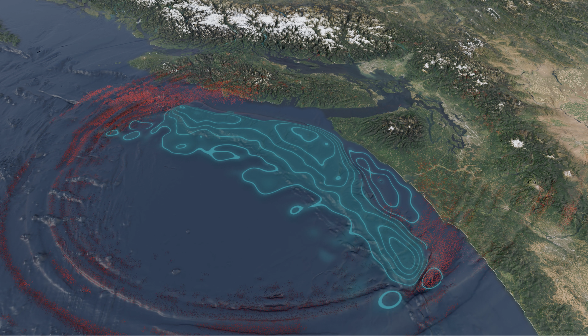

# MFEM in the Real World

The MFEM software library provides advanced finite element discretization methods to many high-performance computing (HPC) applications in the Department of Energy, academia, and industry. In the decade-plus since being released as open source, MFEM’s [capabilities](features.md) have grown to include dynamic adaptive mesh refinement, mesh optimization, high-order methods, scalable solvers, GPU support, and more. Today the project has over 120 contributors, 150 GitHub visitors per day, and 180 downloads per day.

Below are examples of MFEM’s usage in the global community. Contribute your usage of MFEM by referring to the [project template](project-template.md) and [opening a PR](https://github.com/mfem/web/pulls).

## Center for Efficient Exascale Discretizations

[CEED](https://ceed.exascaleproject.org/) was a co-design center within the U.S. Department of Energy’s [Exascale Computing Project](https://www.exascaleproject.org/) (2016–2024). This research partnership involved 30+ computational scientists from two DOE labs and five universities, including members of the Nek5000, MFEM, MAGMA, OCCA, and PETSc projects. CEED produced a range of software products supporting general finite element algorithms on triangular, quadrilateral, tetrahedral and hexahedral meshes in 3D, 2D and 1D. The project’s efforts continue to provide efficient matrix-free operator evaluation for any order space on any order mesh, including high-order curved meshes and all geometries in the de Rham complex. Many MFEM features were developed during the ECP’s lifetime thanks to CEED’s [Applications](https://ceed.exascaleproject.org/ap/) and [Finite Element](https://ceed.exascaleproject.org/fe/) thrusts.

- [CEED participating organizations](https://ceed.exascaleproject.org/about/)
- [CEED software releases](https://ceed.exascaleproject.org/news/)

## Rodin (Université Grenoble Alpes)

[Rodin](https://cbritopacheco.github.io/rodin/) is a lightweight, modular shape, density, and topology optimization framework written in C++, enabling the rapid prototyping of shape optimization algorithms. Rodin provides many of the associated functionalities needed when implementing shape and topology optimization algorithms. These functionalities range from refining and remeshing the underlying shape, to providing elegant mechanisms to specify and solve variational problems. Rodin allows for easy specification and resolution of variational problems, provides uniform class interfaces and transparent conversions between different types of meshes and grid functions, enforces semantic rules related to weak formulations, and adds functionalities of its own on top of wrapped classes. The software library uses MFEM for  assembling and solving the linear systems related to the weak formulations.

- [Rodin examples and tutorials](https://cbritopacheco.github.io/rodin/examples-index.html)
- 2022 MFEM workshop: Carlos Brito Pacheco presents *Rodin: Lightweight and Modern C++17 Shape, Density and Topology Optimization Framework* ([PDF](pdf/workshop22/05_BritoPacheco_Rodin.pdf), [video](https://youtu.be/ZhfDFRJjnU0))

## Tsunami Early Warning (UT Austin, UCSD, LLNL)

This collaboration developed a digital twin that improves tsunami forecasting for coastal areas near earthquake zones, such as the Cascadia subduction zone—a 1,000-kilometer stretch where tectonic plates converge. The project uses MFEM to create a 3D finite element mesh of the Cascadia zone based on bathymetric data (i.e., water depth measurements). Seafloor pressure sensor data informs inference of approximately 1 billion parameters that represent spatiotemporal seafloor motion during a hypothetical magnitude 8.7 earthquake occurring near the coastline. The framework then generates physics-based simulations of seismic wave and tsunami propagation. A unique kernel optimization strategy scaled the digital twin to 43,520 GPUs of LLNL’s exascale El Capitan supercomputer and resulted in the largest known finite element computation. The team’s paper won the [2025 ACM Gordon Bell Prize](https://awards.acm.org/bell/).

- Henneking S, Venkat S, Dobrev V, Camier J, Kolev T, Fernando M, Gabriel A-A, Ghattas O. [Real-time Bayesian inference at extreme scale: A digital twin for tsunami early warning applied to the Cascadia subduction zone](https://dl.acm.org/doi/full/10.1145/3712285.3771787). *SC'25: Proceedings of the International Conference for High Performance Computing, Networking, Storage and Analysis*, 2025.
- Coverage from [LLNL News](https://www.llnl.gov/article/53636/llnl-ut-ucsd-win-gordon-bell-prize-exascale-tsunami-forecasting)
- Technical talks at the 2025 MFEM Community Workshop: Henneking [PDF](pdf/workshop25/04_Henneking_Cascadia_Subduction_Zone.pdf), [video](https://youtu.be/cIHR7PnN9sw); Camier [PDF](pdf/workshop25/07_Camier_Kernel_Optimization.pdf), [video](https://youtu.be/_sRXcYk66ko)

## Wellbore Stability Analysis (OpenSim Technology)

[OpenSim Technology](https://opensim.technology/) models the structural mechanics of subsurface wellbores to prevent collapse. The project uses pyMFEM to solves the equations of linear elasticity for mechanical equalibrium. OpenSim’s synthetic well model requires a refined mesh around the wellbore itself to accurately capture stress points, and uses a coarser mesh farther away from that focal point in order to keep the computational cost down. The model can compute a second grid of concentric rings, which depict stresses around the cylindrical wellbore and identify failure zones. The team continues to develop this code and has recently implemented performance speedups with parallel processing, and they are working on a web app for engineers to use in the field.

- [OpenSim Technology’s publications](https://opensim.technology/publications)
- [OpenSim Technology’s test cases](https://opensim.technology/test-cases)
- 2022 MFEM workshop: Adolfo Rodriguez presents *Using MFEM for Wellbore Stability Analysis* ([PDF](pdf/workshop22/15_Rodriguez_Wellbore.pdf), [video](https://youtu.be/gBEApU1V_80))
