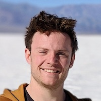
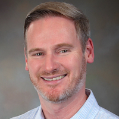
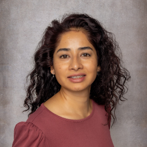
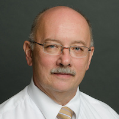
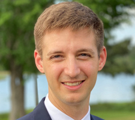
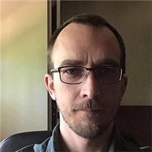

# FEM@LLNL Seminar Series

The FEM@LLNL seminar series is focused on finite element research and applications talks of interest to the MFEM community. Videos will be added to a [YouTube playlist](https://www.youtube.com/playlist?list=PLy9rIbGDXrG1Lfy3Um-KEPqFae7Ipghqj) as well as this site's [videos page](videos.md).

### <i class="fa fa-envelope-o" aria-hidden="true"></i> Sign-Up

Fill in [this form](https://docs.google.com/forms/d/e/1FAIpQLScrJ9QT7v7abx2ELcETKJnhWaU7_Wa2V3d7WIPdf3_JYK4JmA/viewform?usp=sf_link) to sign-up for future FEM@LLNL seminar announcements.

---

### <i class="fa fa-star"></i> Next Talk

#### David Moxey and Edward Erasmie-Jones (King's College London)
##### *NektarIR: A Domain-Specific Compiler for High-Order Finite Element Operations on Heterogeneous Hardware*
##### [**9:00am PDT, February 10, 2026**](https://everytimezone.com)

[<button type="button" class="btn btn-success">
**Webex**
</button>]()

**Abstract:** The transition to heterogeneous or GPU-dominated hardware in high-performance computing (HPC) infrastructure has highlighted the need for hardware-extensible implementations of HPC applications in scientific computing and AI. Ensuring that these implementations are optimised for the specific hardware target poses a significant challenge, as the optimisation process requires specific hardware-level knowledge that is not only outside the scientific domain but also varies across different hardware types and vendors. In this talk, we present some of the approaches being used to enable this transition within the Nektar++ framework, which aims to present an interface for the development of solvers based on the spectral/hp element method. We first focus on our present redevelopment efforts to enable Nektar++ to transition from solely CPU to GPU architectures. Here, we have a particular interest in the performance of matrix-free operators for unstructured three-dimensional meshes of different element types (e.g. tetrahedra, prisms). These are a critical component in the simulation of problems that involve complex geometries, which is a key focus of our framework.

 In the second half of the talk, we present a second approach that is designed to provide longer-term flexibility for Nektar++, and potentially other software frameworks based on the high-order finite element method. This project, NektarIR, is a domain-specific compiler for high-order finite element operations on CPU and GPU hardwares. Using the MLIR project, we have created an intermediate representation of a high-level abstraction of the operations that is rewritten and lowered through a series of passes to optimised and hardware-specific kernels. These kernels are then just-in-time (JIT) compiled for the specific hardware and architecture using LLVM and can be used in the construction of spectral/hp element solvers for computational fluid dynamics. We present benchmarks for the overhead introduced by our compiler pipeline and a run-time performance comparison of our kernels against the Nektar++ spectral/hp element framework.

---

### <i class="fa fa-check" aria-hidden="true"></i> Previous Talks

#### Andrea Beck (University of Stuttgart)
##### *Efficient solution strategies for multiscale flow problems: combining adaptive high order discretizations, models and data*
##### February 2, 2026

[<button type="button" class="btn btn-primary">
**Slides**
</button>](pdf/seminar/beck.pdf)
&nbsp;&nbsp;
[<button type="button" class="btn btn-success">
**Talk Recording**
</button>]()

**Abstract:** Multiscale and multiphysics problems are typically governed by a wide range of interacting temporal and spatial scales, with different physical processes often dominating the opposing ends of the scale range. The simulation of these phenomena requires highly accurate and efficient numerical schemes that should allow for adaptive and flexible discretization strategies to tailor the approximation scheme to the locally dominating physical effect. Still, for practical applications, the occurring scale range in relevant engineering applications typically remains too immense even for well-parallelized simulations on nascent exascale architectures. Here, scale-bridging models must supplement upscaled governing equations to enable simulations of for example turbulent flows, flows with phase interfaces and so on.
  In this talk, I will present contributions and recent advances to both fields: First, I will discuss highly accurate and locally adaptive numerical schemes based on DGSEM for solving the compressible Navier-Stokes equations on pre-exascale systems and beyond with a focus on applications in the aerospace engineering sector. In the second part of my talk, I will discuss how and where (and where not) machine learning methods can help devise the necessary scale bridging models that are numerically and mathematically consistent and provide examples of successful CFD/ML hybrid applications.

#### Jay Gopalakrishnan (Portland State University)
##### *Matrix-valued finite elements*
##### January 20, 2026

[<button type="button" class="btn btn-primary">
**Slides**
</button>](pdf/seminar/gopalakrishnan.pdf)
&nbsp;&nbsp;
[<button type="button" class="btn btn-success">
**Talk Recording**
</button>]()

**Abstract:** Matrix-valued finite elements arise naturally in
continuum models, with stress elements in structural mechanics as
typical examples. This talk begins by describing a recent element for
viscous stresses in fluid mechanics. Its development is motivated by
recent H(div)-conforming approximations of fluid velocity, in which
the divergence-free constraint of viscous incompressible flows can be
enforced exactly. We identify a natural companion space for viscous
stresses and develop simple elements with nt-continuity (where n and t
denote normal and tangential components on element interfaces,
respectively), corresponding to shear continuity of traceless viscous
stresses. The associated Sobolev space is a low-regularity,
nonstandard space H(curl div) of matrix-valued functions. The
resulting method, termed the Mass-Conserving Stress-yielding (MCS)
method, is exactly mass conserving, pressure robust, yields
optimal-order approximations for velocity, pressure, stress, and
vorticity, and relies only on facet-based coupling, making it amenable
to hybridization. The talk then places these developments in the
broader context of other matrix-valued finite elements, including
nn-continuous Hellan–Herrmann–Johnson elements and tt-continuous Regge
elements. We present a recent avenue for connecting these apparently
disparate developments in nn-, nt-, and tt-continuous matrix-valued
finite elements, and conclude with challenges in seeking unifying
principles for tensor-valued discretizations beyond the de Rham
complex.

#### Robert Falgout (LLNL)
##### *New Advances in hypre 3.0 for Mixed Precision and Semi-Structured Problems*
##### November 18, 2025

[<button type="button" class="btn btn-primary">
**Slides**
</button>](pdf/seminar/falgout.pdf)
&nbsp;&nbsp;
[<button type="button" class="btn btn-success">
**Talk Recording**
</button>](https://youtu.be/DK8yVzOo9Og)

**Abstract:** The version 3.0 release of hypre in September brought two major changes to the library: a rewrite of the semi-structured code with a new semi-structured algebraic multigrid solver (SSAMG), and a new mixed precision functionality with support for lower precision preconditioning of Krylov solvers. The overhaul of the semi-structured code was done to extend functionality from square matrices to rectangular matrices with full support for matrix-vector and matrix-matrix operations. This enabled the implementation of the SSAMG solver that takes advantage of structure and builds on the existing PFMG and BoomerAMG solvers. The mixed precision support allows users to switch precisions at runtime (with little change to user code) and enables the implementation of mixed-precision solvers. In this talk we will discuss the new features of the library and provide performance results for the new solvers and implementations.

#### Bill Henshaw (RPI)
##### *An O(N) Helmholtz Solver by Time-Filtering the Wave Equation*
##### November 4, 2025

[<button type="button" class="btn btn-primary">
**Slides**
</button>](pdf/seminar/henshaw.pdf)
&nbsp;&nbsp;
[<button type="button" class="btn btn-success">
**Talk Recording**
</button>](https://youtu.be/ZiRymGF3YuY)

**Abstract:** An efficient and high-order accurate solver for Helmholtz problems is described. The approach is based on the WaveHoltz algorithm which computes time-harmonic solutions by time-filtering solutions of the wave equation. The wave equation is solved efficiently with implicit time-stepping using as few as five time-steps per period, independent of the mesh size. When multigrid is used to solve the implicit time-stepping equations, the cost of the resulting WaveHoltz scheme scales linearly with the number of grid points N (at fixed frequency) and is thus optimal in CPU-time and memory usage as the mesh is refined. Krylov space solvers such as GMRES are used to accelerate the basic fixed-point iteration. Eigenvector deflation can be used to further improve the convergence. We have implemented the scheme for complex geometry using overset grids with a solver using the Overture framework. Numerical results are given for problems in two and three space dimensions, to second and fourth-order accuracy, and they show the potential of the approach to solve a wide range of large-scale Helmholtz problems.

#### Florian Schäfer (Courant Institute, NYU)
##### *Toward Information Geometric Mechanics*
##### September 30, 2025

[<button type="button" class="btn btn-primary">
**Slides**
</button>](pdf/seminar/schafer.pdf)
&nbsp;&nbsp;
[<button type="button" class="btn btn-success">
**Talk Recording**
</button>](https://youtu.be/tQnLkI8sE-Y)

**Abstract:** Shock waves in high-speed gas dynamics cause severe numerical difficulties for classical solvers and scientific machine learning. This talk begins with the observation that shock formation arises from the flow map reaching the boundary of the manifold of diffeomorphisms. We modify its geometry such that geodesics approach but never reach the boundary. The resulting information geometric regularization (IGR) has smooth solutions while avoiding the excessive dissipation of viscous regularizations, accelerating and simplifying the simulation of flows with shocks. We prove the existence of global strong IGR solutions in the unidimensional pressureless case and illustrate its practical utility on multidimensional examples with complex shock interactions. With S. Bryngelson and other collaborators, we use IGR to conduct the first compressible flow simulation exceeding a quadrillion degrees of freedom.
The modified geometry of the diffeomorphism manifold is the information geometry of the mass density. The last part of the talk explains how this observation motivates information geometric mechanics that views the solutions of continuum mechanical PDEs as parameters of probability distributions originating from statistical physics. Replacing the Euclidean geometry of individual particles with the information geometry of statistical families promises performant numerical methods that preserve the positivity of densities and energies and readily integrate with scientific machine learning.

#### John Evans (CU Boulder)
##### *Interpolation-Based Immersed Finite Element and Isogeometric Analysis*
##### June 12, 2025

[<button type="button" class="btn btn-primary">
**Slides**
</button>](pdf/seminar/evans.pdf)
&nbsp;&nbsp;
[<button type="button" class="btn btn-success">
**Talk Recording**
</button>](https://youtu.be/c3jJwj-St1Y)

**Abstract:** Immersed finite element methods enable the simulation of physical systems out of reach by classical finite element analysis, and they also streamline the development of powerful shape and topology optimization technologies. However, the development of an immersed finite element analysis code is a daunting and burdensome task even for domain experts. This talk introduces a novel approach to immersed finite element analysis that dramatically reduces implementation complexity.
Our method begins by interpolating finite element basis functions defined on a non-body-fitted background mesh onto a Lagrange basis defined over a body-fitted integration mesh. These interpolated basis functions are then used to perform immersed finite element analysis. Crucially, they can be represented locally using Lagrange shape functions via Lagrange extraction operators. This structure allows a classical finite element code to be converted into an immersed finite element code with minimal modifications. Specifically, the only additional ingredients required are: the Lagrange extraction operators, a connectivity array mapping local to global degrees of freedom, and the ability to evaluate the background basis function approximations and their derivatives via the extraction operators. The same framework also extends naturally to immersed isogeometric analysis.
The presentation will begin with an overview of the method, followed by a theoretical discussion on stability and convergence for a model problem. We will then demonstrate the method’s effectiveness on a range of examples from structural mechanics and fluid dynamics. Next, we will introduce our open-source software that generates the necessary data structures, enabling immersed finite element and isogeometric analysis within the popular FEniCS platform. Finally, we will show how interpolation onto a body-fitted integration mesh can also be used to convert classical finite element analysis codes into meshless analysis codes based on the Reproducing Kernel Particle Method.
This work is in collaboration with Jennifer Fromm, Ru Xiang, Han Zhao, and J.S. Chen (University of California San Diego), Nils Wunsch and Kurt Maute (University of Colorado Boulder), and David Kamensky (formerly University of California San Diego).

#### David Williams (Penn State)
##### *Finite Element Exterior Calculus in Four-Dimensional Space*
##### May 6, 2025

[<button type="button" class="btn btn-primary">
**Slides**
</button>](pdf/seminar/williams.pdf)
&nbsp;&nbsp;
[<button type="button" class="btn btn-success">
**Talk Recording**
</button>](https://youtu.be/dfIccjnOZKU)

**Abstract:** The purpose of this talk is to explain the key differences between standard finite element methods for 3D applications, and space-time finite element methods for 4D applications. These differences are elucidated through the lens of finite element exterior calculus (FEEC). Through FEEC, we can leverage the language of differential geometry and algebraic topology to construct finite element spaces in any number of dimensions. In this work, we use techniques from FEEC to construct derivative operators in 3D and 4D space. We explain the differences between these operators, and the associated Sobolev spaces. Thereafter, we construct conforming, high-order, finite element spaces on the tesseract, pentatope, and tetrahedral prism in 4D. These shapes are fundamental geometric quantities in 4D, as they correspond to the four-dimensional analogs of the cube, tetrahedron, and triangular prism, respectively.

#### Freddie Witherden (Texas A&M University)
##### *High Performance Asynchronous I/O for Exascale Spectral Element Methods*
##### April 22, 2025

[<button type="button" class="btn btn-primary">
**Slides**
</button>](pdf/seminar/witherden2.pdf)
&nbsp;&nbsp;
[<button type="button" class="btn btn-success">
**Talk Recording**
</button>](https://youtu.be/Wg5QsStcy2c)

**Abstract:** Despite recent developments in solid-state storage technology,
disk I/O in leadership-class machines has not kept pace with memory bandwidth
or arithmetic capabilities. As a consequence, simulations are spending
proportionally more time writing out checkpoint files than ever before. This
problem is compounded by the fact that most I/O middleware libraries offer only
limited support for non-blocking I/O, and where this capability is present, it
is almost always mutually exclusive with parallel I/O.
In this talk, we will provide an overview of the new massively parallel
asynchronous file format, which will debut with PyFR v3. The format, specifically
developed for discontinuous spectral element methods, offers a host of desirable
features. These include: a space-efficient node-based mesh description with
support for mixed elements and curvature; compact connectivity arrays that
enable fast parallel interface construction through neighbourhood collectives;
self-describing nodal solution representations with embedded metadata; support
for partial (subset) solutions; provisions for multiple pre-computed partitionings;
and output files that are independent of the chosen partitioning.
All of this is combined with disk I/O patterns that are entirely contiguous.
The format itself is based on the archival-grade HDF5 format but includes custom
I/O routines to enable more efficient parallel I/O and asynchronous capabilities.
After describing the format and its implementation in PyFR, we will conclude the
talk by discussing the benefits the new format provides in terms of ease of
deployment, particularly in how it enables users to bypass potentially outdated
vendor-provided builds of HDF5.

#### Łukasz Kaczmarczyk (University of Glasgow)
##### *Mixed Finite Element Formulation for Solid Mechanics Problems*
##### April 8, 2025

[<button type="button" class="btn btn-primary">
**Slides**
</button>](pdf/seminar/kaczmarczyk.pdf)
&nbsp;&nbsp;
[<button type="button" class="btn btn-success">
**Talk Recording**
</button>](https://youtu.be/fdv_pi4NYlw)

**Abstract:** During the talk, I will focus on the implementation of the mixed
finite element method for small-strain elasticity and its extension to
large-strain nearly incompressible problems. The finite element formulation
includes four independently approximated fields: stresses, logarithmic
stretches, rotation vectors, and displacements. The first two are associated
with conserving linear and angular momentum, respectively. The other two fields
are associated with the constitutive equation and the consistency between
displacements and deformation. An exponential map establishes the relationship
between the rotation vectors and the rotation tensor. The stresses are
approximated in the H-div space, while the remaining three fields are in the L2
space.  This formulation results in a very sparse system of equations that can
be efficiently solved in parallel using hybridisation with a block solver,
thereby enabling highly scalable and robust solvers. The system hybridisation
involves 'breaking' the H-div space, such that continuity of normal fluxes,
i.e., tractions, is no longer enforced a priori, and introducing a hybridised
field on mesh skeleton faces and contact surfaces. Such a field acts as a
kinematic Lagrange multiplier enforcing continuity of normal
tractions. Moreover, the hybridised Lagrange multiplier field is conveniently
used to enforce contact conditions. Since hybridised Lagrange multipliers are
approximated on skeleton faces and are interpreted as displacements, this leads
to a dual mixed formulation of contact.  Moreover, since continuity of the
displacement field is enforced in a weak sense by continuity of fluxes, this
enables a natural methodology to simulate cracks, such that the mesh topology
does not change while the crack is propagating. Furthermore, since the H-div
space provides traces of fluxes on faces, the mixed element enables efficient
calculation of face crack release energy. Since this methodology enables crack
propagation on fixed mesh technology, and if it is based on an energy-based
crack propagation criterion, it inherits the robustness of the phase field while
being as efficient as methods which resolves crack discreetly.  In an algebraic
sense, since all fields in the interior become fields in the L2 space, and
fields on skeleton faces are in H1/2, the system of equations is extremely
sparse and can be solved using a Schur complement, eliminating interior
fields. The resulting Schur matrix is extremely sparse and consists of five
blocks in each row in 3D and four blocks in 2D. This structure resembles the
matrix structure emerging from the finite volume method on hexahedral or
quadrilateral elements, making it suitable for multigrid solvers and exploitable
in parallel implementations on GPUs.

#### Stefan Turek (Technical University Dortmund)
##### *Hardware-oriented Numerics for Massively Parallel & Low Precision Accelerator Hardware and Application to "large scale" CFD Problems*
##### March 11, 2025

[<button type="button" class="btn btn-primary">
**Slides**
</button>](pdf/seminar/turek.pdf)
&nbsp;&nbsp;
[<button type="button" class="btn btn-success">
**Talk Recording**
</button>](https://youtu.be/8nmblHRXsos)

**Abstract:** The aim of this talk is to present and to discuss how modern High
Performance Computing (HPC) facilities including massively parallel hardware
with millions of cores together with very fast, but lower precision accelerator
hardware can be exploited via techniques from hardware-oriented Numerics for
PDEs so that a very high computational and numerical efficiency can be
obtained. Here, as prototypical large scale PDE-based applications, we
concentrate on nonstationary flow simulations with hundreds of millions or even
billions of spatial unknowns in long-time computations with many thousands up to
millions of time steps. For the expected huge computational resources in the
coming exascale era, such spatially discretized problems which typically are
treated sequentially in time, that means one time step after the other, are
still too small to exploit adequately the huge number of compute nodes, resp.,
cores so that further parallelism, for instance w.r.t. time, might get
necessary. In this context, we discuss how "parallel-in-space global-in-time"
Newton-Krylov Multigrid approaches can be designed which allow a much higher
degree of parallelism. Moreover, to exploit current accelerator hardware in
lower precision (for instance, GPUs), that means mainly working in single or
even half precision, we discuss the concept of "prehandling" (in contrast to
"preconditioning") of the corresponding ill-conditioned systems of equations,
for instance arising from Poisson-like problems in incompressible flow
simulations. Here, we assume a transformation into an equivalent linear system
with similar sparsity but with much lower condition numbers so that the use of
lower precision hardware might get feasible. In our talk, we provide for both
aspects numerical results as "proof-of-concept" and discuss the challenges,
particularly for large scale flow problems.

#### Patrick Zulian (Università della Svizzera italiana / UniDistance Suisse)
##### *Immersed Domain Approach for Fluid-Structure-Contact Interaction Problems*
##### February 18, 2025

[<button type="button" class="btn btn-primary">
**Slides**
</button>](pdf/seminar/zulian.pdf)
&nbsp;&nbsp;
[<button type="button" class="btn btn-success">
**Talk Recording**
</button>](https://youtu.be/8YOEUaD8jdg)

**Abstract:** The study of fluid-structure interaction (FSI) has gained
significant traction in recent decades, with applications spanning various
disciplines, including geophysics and biomedicine. In FSI, computational
techniques are defined by the choice of discrete domain representation, falling
into two main categories: "boundary-fitted" or "non-boundary-fitted"
meshes. Boundary-fitted methods explicitly represent the fluid-solid interface
and deform the fluid mesh in tandem with the solid mesh, typically within an
arbitrary Eulerian-Lagrangian (ALE) framework. While these methods offer high
accuracy, substantial solid deformations can severely distort the fluid mesh,
leading to numerical problems and the need for remeshing. Non-boundary-fitted
methods, on the other hand, maintain separate and non-matching fluid and
structure meshes. The structure is described within a Lagrangian framework,
while the fluid is typically described in a fully Eulerian framework. This
flexibility demands higher mesh resolution to maintain comparable accuracy,
necessitating the consideration of parallel computing.
We present an immersed domain approach for the numerical solution of
fluid-structure-contact-interaction (FSCI) problems. Within the overlapping
volume, the fluid and structure are coupled, while mortar-based techniques are
employed to couple different structures in contact on their
surfaces. Specifically, we utilize dual Lagrange multipliers, which, within the
nonlinear solution procedure, enable discrete field transfer using standard
matrix-vector multiplication or storage of the linearized system of equations in
a single matrix, thus facilitating algebraic multigrid strategies. We illustrate
our general algorithmic framework and our primary parallel computing tools and
discuss two studies conducted using variations of our approach.
The first study simulates the complete dynamics of a bio-prosthetic heart
valve. We model the interactions between blood and the valve, blood and the
aortic wall, and leaflets during valve closure. This solution strategy is
specifically designed to address the contact problem using non-smooth methods,
with solid and structure sub-problems solved in a segregated and iterative
manner.
The second study simulates a diaphragm pump and the contact interaction between
an elastic valve displaced by the fluid and the valve seats. This approach is
monolithic, and penalty methods are employed to impose contact conditions.

#### Svetlana Tokareva (Los Alamos National Laboratory)
##### *A High-Order Matrix-Free Finite Element Method for Hyperbolic Problems*
##### January 14, 2025

[<button type="button" class="btn btn-primary">
**Slides**
</button>](pdf/seminar/tokareva.pdf)
&nbsp;&nbsp;
[<button type="button" class="btn btn-success">
**Talk Recording**
</button>](https://youtu.be/xy_c_NYDXb8)

**Abstract:** Many multiphysics applications require high-order, physically
consistent and computationally efficient discretizations of hyperbolic PDEs. In
this talk, we will present a mass-matrix-free finite element (MF-FE) scheme,
which provides an explicit and arbitrary high order approximation of the smooth
solutions of the hyperbolic PDEs both in space and time. The design of the
scheme allows for an efficient diagonalization of the mass matrix without any
loss of accuracy. This is achieved by coupling the FEM formulation
[[1]](https://doi.org/10.1016/j.camwa.2018.05.009) with a Deferred Correction
(DeC) type method [[2]](https://global-sci.org/intro/article_detail/jcm/8648.html)
for the discretization in time. The advantage of such a matrix-free approach
consists in preserving a compact approximation stencil even at high orders,
which reduces the computational cost compared to classical finite element
techniques and provides potential benefit for exascale computing on future
computer architectures. In this talk we focus on the staggered grid MF-FEM (SG
MF-FEM) scheme for the Lagrangian hydrodynamics. We will present the simulation
results for several challenging benchmark problems. Finally, will discuss how
structure-preserving properties (such as positivity and preservation of local
bounds) of the proposed MF-FE method can be enforced using convex limiting for
blending the high-order and low-order element residuals
[[3]](https://doi.org/10.1016/j.cma.2018.11.036).

#### Martin Kronbichler (Ruhr University Bochum)
##### *Efficient Simulation of Fluid Flows using High-Order Finite Elements with the deal.II Library*
##### December 17, 2024

[<button type="button" class="btn btn-primary">
**Slides**
</button>](pdf/seminar/kronbichler.pdf)
&nbsp;&nbsp;
[<button type="button" class="btn btn-success">
**Talk Recording**
</button>](https://youtu.be/46xUzWbU2GI)

**Abstract:** This talk will present research on high-order discontinuous Galerkin methods for incompressible fluid flow. Starting from a formulation that enforces the inter-element continuity of the normal velocities and point-wise divergence-free velocities, akin to H(div) finite element spaces, we look into the efficient execution of the resulting discrete formulations. For high-order methods, matrix-free operator evaluation based on sum factorization is highly attractive. It is aligned with the properties of modern multi-core processors and GPUs: By replacing memory-intensive sparse matrices of traditional solvers by redundant computations of integrals, considerably higher performance can be reached because of a better balance between arithmetic work and memory transfer. The talk will look into the use of these techniques for iterative solvers arising from time integration with splitting methods, including both the pressure Poisson equation solved with multigrid preconditioners, Helmholtz-like equations with diagonal or block-diagonal preconditioners, and the H(div)-enforcing penalty step with block-wise inverses based on the fast diagonalization method combined with the Sherman-Morrison-Woodbury formula. The application efficiency will be analyzed and the general-purpose implementation of the algorithms within the deal.II finite element library.

#### Pablo Brubeck (University of Oxford)
##### *FIAT: From Basis Functions to Efficient Finite Element Solvers*
##### November 12, 2024

[<button type="button" class="btn btn-primary">
**Slides**
</button>](pdf/seminar/brubeck.pdf)
&nbsp;&nbsp;
[<button type="button" class="btn btn-success">
**Talk Recording**
</button>](https://youtu.be/QJW-fduOKBI)

**Abstract:** The FInite element Automatic Tabulator (FIAT) is a powerful Python
library for tabulating basis functions. In this talk, we present two major
recent developments in FIAT. First, we have extended the FIAT abstraction to
natively support macroelements. Macroelements offer conforming discretizations
with highly desirable properties, such as divergence-free vector fields, and
divergence-conforming symmetric tensors with low-order polynomial
degrees. Elements implemented include the Hsieh-Clough-Tocher macroelement for
biharmonic problems, the divergence-free, H1-conforming, inf-sup stable
Guzmán-Neilan macroelement for Stokes, and the Johnson-Mercier macroelement for
strongly-symmetric, H(div)-conforming stresses in solid mechanics. We also
improved the performance of tabulation and quadrature for simplicial high-order
elements, and introduced novel basis functions, leading to solvers with better
complexity in polynomial degree. Inspired by the fast diagonalization method,
we define new degrees of freedom on simplices as moments against a
numerically-computed orthogonal polynomial basis to decouple element interiors
in the stiffness matrix. We exploit this decoupling in a domain decomposition
method with vertex or edge subdomains on the interface degrees of freedom, and
Jacobi relaxation for the interior degrees of freedom. This enables fast solvers
for high-order discretizations of the Riesz maps of the spaces of the de Rham
complex (Lagrange, Nédélec, Raviart-Thomas, and Brezzi-Douglas-Marini). For
each case, we illustrate the performance gains with numerical examples in
Firedrake.

#### Denis Ridzal (Sandia National Laboratories)
##### *R-Adaptive Mesh Optimization to Enhance Finite Element Basis Compression*
##### October 15, 2024

[<button type="button" class="btn btn-primary">
**Slides**
</button>](pdf/seminar/ridzal.pdf)
&nbsp;&nbsp;
[<button type="button" class="btn btn-success">
**Talk Recording**
</button>](https://www.youtube.com/watch?v=4t7QOuPK-8g)

**Abstract:** Modern computing systems are capable of exascale calculations.
While these systems continue to grow in processing power, the available system
memory has not increased commensurately. A predominant approach to limit the
memory usage in large-scale applications is to exploit the abundant processing
power and continually recompute many low-level simulation quantities, rather
than storing them. However, this approach can adversely impact the throughput of
the simulation and diminish the benefits of modern computing architectures.
We present two novel contributions to reduce the memory burden while maintaining
performance in simulations based on finite element discretizations. The first
contribution develops dictionary-based data compression schemes that detect and
exploit the structure of the discretization, due to redundancies across the
finite element mesh. These schemes are shown to reduce the memory requirements
of key computational kernels by more than 99% on meshes with large numbers of
nearly identical mesh cells. For applications where this structure does not
exist, our second contribution leverages a recently developed augmented
Lagrangian sequential quadratic programming algorithm to enable r-adaptive mesh
optimization, with the goal of enhancing redundancies in the mesh. Numerical
results demonstrate the effectiveness of the proposed methods to detect, exploit
and enhance mesh structure on examples inspired by large-scale applications.

#### Daniele Panozzo (Courant Institute, NYU)
##### *Geometric Predicates for Unconditionally Robust Elastodynamics Simulation*
##### October 1, 2024

[<button type="button" class="btn btn-primary">
**Slides**
</button>](pdf/seminar/panozzo.pdf)
&nbsp;&nbsp;
[<button type="button" class="btn btn-success">
**Talk Recording**
</button>](https://www.youtube.com/watch?v=LfuheDyppXU)

**Abstract:** The numerical solution of partial differential equations (PDE) is
ubiquitously used for physical simulation in scientific computing and
engineering. Ideally, a PDE solver should be opaque: the user provides as input
the domain boundary, boundary conditions, and the governing equations, and the
code returns an evaluator that can compute the value of the solution at any
point of the input domain. This is surprisingly far from being the case for all
existing open-source or commercial software, despite the research efforts in
this direction and the large academic and industrial interest. To a large
extent, this is due to lack of robustness in geometric algorithms used to create
the discretization, detect collisions, and evaluate element validity.
I will present the incremental potential contact simulation paradigm, which
provides strong robustness guarantees in simulation codes, ensuring, for the
first time, validity of the trajectories accounting for floating point rounding
errors over an entire elastodynamic simulation with contact. A core part of this
approach is the use of a conservative line-search to check for collisions
between geometric primitives and for ensuring validity of the deforming elements
over linear trajectories.
I will discuss both problems in depth, showing that SOTA approaches favor
numerical efficiency but are unfortunately not robust to floating point
rounding, leading to major failures in simulation. I will then present an
alternative approach based on judiciously using rational and interval types to
ensure provable correctness, while keeping a running time comparable with
non-conservative methods.
To conclude, I will discuss a set of applications enabled by this approach in
microscopy and biomechanics, including traction force estimation on a live
zebrafish and efficient modeling and simulation of fibrous materials.

#### Rubén Sevilla (Swansea University)
##### *Mesh Generation and Adaptation using Green AI*
##### September 17, 2024

[<button type="button" class="btn btn-primary">
**Slides**
</button>](pdf/seminar/sevilla.pdf)
&nbsp;&nbsp;
[<button type="button" class="btn btn-success">
**Talk Recording**
</button>](https://www.youtube.com/watch?v=2_bLfUg_Ok0)

**Abstract:** Most methods used to solve partial differential equations require
creating a mesh that represents the model's geometry. Today, unstructured mesh
technology is widely used, allowing three-dimensional meshes with hundreds of
millions of elements to be generated in just a few minutes. However, when
optimising a design, many simulations are needed for different operating
conditions and geometric configurations. Creating the best mesh for each setup
becomes time-consuming due to the requirement of excessive human intervention
and expertise. This talk will cover our recent work on using artificial
intelligence to predict near-optimal meshes suitable for simulations. The main
idea is to take advantage of the large amount of data that already exists in the
industry to improve the selection of a suitable spacing function, including
anisotropic spacing. The proposed approach aims to use knowledge from previous
simulations to guide the mesh generation process. I will assess the proposed
method based on the accuracy of the predictions, efficiency, and environmental
impact. This includes considering the carbon footprint and energy consumption of
the computations required for a parametric CFD analysis under different flow
conditions and angles of attack. For transient problems, the use of high order
methods provides several advantages due to the low dissipation and dispersion
errors associated to these schemes. An attractive approach to simulate these
problems is to incorporate degree adaptive schemes to enhance the approximation
only where needed. In this talk I will also present our recent work on using
artificial intelligence to aid a degree adaptive process.

#### Esteban Ferrer and David Huergo (Universidad Politécnica de Madrid)
##### *New Avenues in High Order Fluid Dynamics*
##### September 3, 2024

[<button type="button" class="btn btn-primary">
**Slides**
</button>](pdf/seminar/ferrer+huergo.pdf)
&nbsp;&nbsp;
[<button type="button" class="btn btn-success">
**Talk Recording**
</button>](https://www.youtube.com/watch?v=VM7wMq7luJU)

**Abstract:** We present the latest developments of our High-Order Spectral
Element Solver (HORSES3D), an open source high-order discontinuous Galerkin
framework capable of solving a variety of flow applications, including
compressible flows (with or without shocks), incompressible flows, various RANS
and LES turbulence models, particle dynamics, multiphase flows, and aeroacoustics
[[1](https://arxiv.org/abs/2206.09733)]. Recent developments allow us to
simulate challenging multiphysics including turbulent flows, multiphase and
moving bodies, using local h and p-adaption. In addition, we present recent work
that couples Machine Learning and reinforcement learning techniques with high
order simulations.

#### Patrick Farrell (University of Oxford)
##### *Designing conservative and accurately dissipative numerical integrators in time*
##### July 30, 2024

[<button type="button" class="btn btn-primary">
**Slides**
</button>](pdf/seminar/farrell.pdf)
&nbsp;&nbsp;
[<button type="button" class="btn btn-success">
**Talk Recording**
</button>](https://www.youtube.com/watch?v=Cp8bhpSIia4)

**Abstract:** Numerical methods for the simulation of transient systems with
structure-preserving properties are known to exhibit greater accuracy and
physical reliability, in particular over long durations. These schemes are often
built on powerful geometric ideas for broad classes of problems, such as
Hamiltonian or reversible systems. However, there remain difficulties in
devising higher-order- in-time structure-preserving discretizations for
nonlinear problems, and in conserving non-polynomial invariants.
In this work we propose a new, general framework for the construction of
structure-preserving timesteppers via finite elements in time and the systematic
introduction of auxiliary variables. The framework reduces to Gauss methods
where those are structure-preserving, but extends to generate arbitrary-order
structure-preserving schemes for nonlinear problems, and allows for the
construction of schemes that conserve multiple higher-order invariants. We
demonstrate the ideas by devising novel schemes that exactly conserve all known
invariants of the Kepler and Kovalevskaya problems, arbitrary-order schemes for
the compressible Navier–Stokes equations that conserve mass, momentum, and
energy, and provably dissipate entropy, and multi-conservative schemes for the
Benjamin-Bona-Mahony equation.

#### Gonzalo de Diego (Courant Institute)
##### *Numerical Solvers for Viscous Contact Problems in Glaciology*
##### May 6, 2024

[<button type="button" class="btn btn-primary">
**Slides**
</button>](pdf/seminar/dediego.pdf)
&nbsp;&nbsp;
[<button type="button" class="btn btn-success">
**Talk Recording**
</button>](https://www.youtube.com/watch?v=qrvOCgSORqY)

**Abstract:** Viscous contact problems are time-dependent viscous flow problems where the fluid is in contact with a solid surface from which it can detach and reattach. Over sufficiently long timescales, ice is assumed to flow like a viscous fluid with a nonlinear rheology. Therefore, certain phenomena in glaciology, like the formation of subglacial cavities in the base of an ice sheet or the dynamics of marine ice sheets (continental ice sheets that slide into the ocean and go afloat at a grounding line, detaching from the bedrock), can be modelled as viscous contact problems. In particular, these problems can be described by coupling the Stokes equations with contact boundary conditions to free boundary equations that evolve the ice domain in time. In this talk, I will describe the difficulties that arise when attempting to solve this system numerically and I will introduce a method that is capable of overcoming them.

#### Nat Trask (University of Pennsylvania)
##### *A Data Driven Finite Element Exterior Calculus*
##### April 2, 2024

[<button type="button" class="btn btn-primary">
**Slides**
</button>](pdf/seminar/trask.pdf)
&nbsp;&nbsp;
[<button type="button" class="btn btn-success">
**Talk Recording**
</button>](https://www.youtube.com/watch?v=7B8GotJP_Y0)

**Abstract:** Despite the recent flurry of work employing machine learning to develop surrogate models to accelerate scientific computation, the "black-box" underpinnings of current techniques fail to provide the verification and validation guarantees provided by modern finite element methods. In this talk we present a data-driven finite element exterior calculus for developing reduced-order models of multiphysics systems when the governing equations are either unknown or require closure. The framework employs deep learning architectures typically used for logistic classification to construct a trainable partition of unity which provides notions of control volumes with associated boundary operators. This alternative to a traditional finite element mesh is fully differentiable and allows construction of a discrete de Rham complex with a corresponding Hodge theory. We demonstrate how models may be obtained with the same robustness guarantees as traditional mixed finite element discretization, with deep connections to contemporary techniques in graph neural networks. For applications developing digital twins where surrogates are intended to support real time data assimilation and optimal control, we further develop the framework to support Bayesian optimization of unknown physics on the underlying adjacency matrices of the chain complex. By framing the learning of fluxes via an optimal recovery problem with a computationally tractable posterior distribution, we are able to develop models with intrinsic representations of epistemic uncertainty.

#### William Moses (University of Illinois Urbana-Champaign)
##### *Supercharging Programming Through Compiler Technology*
##### March 14, 2024

[<button type="button" class="btn btn-primary">
**Slides**
</button>](pdf/seminar/moses.pdf)
&nbsp;&nbsp;
[<button type="button" class="btn btn-success">
**Talk Recording**
</button>](https://www.youtube.com/watch?v=EZrICuXp8FE)

**Abstract:** The decline of Moore's law and an increasing reliance on computation has led to an explosion of specialized software packages and hardware architectures. While this diversity enables unprecedented flexibility, it also requires domain-experts to learn how to customize programs to efficiently leverage the latest platform-specific API's and data structures, instead of working on their intended problem. Rather than forcing each user to bear this burden, I propose building high-level abstractions within general-purpose compilers that enable fast, portable, and composable programs to be automatically generated. This talk will demonstrate this approach through compilers that I built for two domains: automatic differentiation and parallelism. These domains are critical to both scientific computing and machine learning, forming the basis of neural network training, uncertainty quantification, and high-performance computing. For example, a researcher hoping to incorporate their climate simulation into a machine learning model must also provide a corresponding derivative simulation. My compiler, Enzyme, automatically generates these derivatives from existing computer programs, without modifying the original application. Moreover, operating within the compiler enables Enzyme to combine differentiation with program optimization, resulting in asymptotically and empirically faster code. Looking forward, this talk will also touch on how this domain-agnostic compiler approach can be applied to new directions, including probabilistic programming.

#### Sungho Lee (University of Memphis)
##### *LAGHOST: Development of Lagrangian High-Order Solver for Tectonics*
##### March 5, 2024

[<button type="button" class="btn btn-primary">
**Slides**
</button>](pdf/seminar/lee.pdf)
&nbsp;&nbsp;
[<button type="button" class="btn btn-success">
**Talk Recording**
</button>](https://www.youtube.com/watch?v=7APgvXM7xH0)

**Abstract:** Long-term geological and tectonic processes associated with large deformation highlight the importance of using a moving Lagrangian frame. However, modern advancements in the finite element method, such as MPI parallelization, GPU acceleration, high-order elements, and adaptive grid refinement for tectonics based on this frame, have not been updated. Moreover, the existing solvers available in open access suffer from limited tutorials, a poor user manual, and several dependencies that make model building complex. These limitations can discourage both new users and developers from utilizing and improving these models. As a result, we are motivated to develop a user-friendly, Lagrangian thermo-mechanical numerical model that incorporates visco-elastoplastic rheology to simulate long-term tectonic processes like mountain building, mantle convection and so on. We introduce an ongoing project called LAGHOST (Lagrangian High-Order Solver for Tectonics), which is an MFEM-based tectonic solver. LAGHOST expands the capabilities of MFEM's LAGHOS mini-app. Currently, our solver incorporates constitutive equation, body force, mass scaling, dynamic relaxation, Mohr-Coulomb plasticity, plastic softening, Winkler foundation, remeshing, and remapping. To evaluate LAGHOST, we conducted four benchmark tests. The first test involved compressing an elastic box at a constant velocity, while the second test focused on the compaction of a self-weighted elastic column. To enable larger time-step sizes and achieve quasi-static solutions in the benchmarks, we introduced a fictitious density and implemented dynamic relaxation. This involved scaling the density factor and introducing a portion of force component opposing the previous velocity direction at nodal points. Our results exhibited good agreement with analytical solutions. Subsequently, we incorporated Mohr-Coulomb plasticity, a reliable model for predicting rock failure, into LAGHOST. We revisited the elastic box benchmark and considered plastic materials. By considering stress correction arising from plastic yielding, we confirmed that the updated solution from elastic guess aligned with the analytical solution. Furthermore, we applied LAGHOST to simulate the evolution of a normal fault, a significant tectonic phenomenon. To model normal fault evolution, we introduced strain softening on cohesion as the dominant factor based on geological evidence. Our simulations successfully captured the normal fault's evolution, with plastic strain localizing at shallow depths before propagating deeper. The fault angle reached approximately 60 degrees, in line with the Mohr-Coulomb failure theory.

#### Kevin Chung (LLNL)
##### *Data-Driven DG FEM Via Reduced Order Modeling and Domain Decomposition*
##### February 6, 2024

[<button type="button" class="btn btn-primary">
**Slides**
</button>](pdf/seminar/chung.pdf)
&nbsp;&nbsp;
[<button type="button" class="btn btn-success">
**Talk Recording**
</button>](https://www.youtube.com/watch?v=CfRSzUOM0Ug)

**Abstract:** Numerous cutting-edge scientific technologies originate at the laboratory scale, but transitioning them to practical industry applications can be a formidable challenge. Traditional pilot projects at intermediate scales are costly and time-consuming. Alternatives such as E-pilots can rely on high-fidelity numerical simulations, but even these simulations can be computationally prohibitive at larger scales. To overcome these limitations, we propose a scalable, component reduced order model (CROM) method. We employ Discontinuous Galerkin Domain Decomposition (DG-DD) to decompose the physics governing equation for a large-scale system into repeated small-scale unit components. Critical physics modes are identified via proper orthogonal decomposition (POD) from small-scale unit component samples. The computationally expensive, high-fidelity discretization of the physics governing equation is then projected onto these modes to create a reduced order model (ROM) that retains essential physics details. The combination of DG-DD and POD enables ROMs to be used as building blocks comprised of unit components and interfaces, which can then be used to construct a global large-scale ROM without data at such large scales. This method is demonstrated on the Poisson and Stokes flow equations, showing that it can solve equations about 15−40 times faster with only ∼ 1% relative error, even at scales 1000 times larger than the unit components. This research is ongoing, with efforts to apply these methods to more complex physics such as Navier-Stokes equation, highlighting their potential for transitioning laboratory-scale technologies to practical industrial use.

#### Brian Young
##### *A Full-Wave Electromagnetic Simulator for Frequency-Domain S-Parameter Calculations*
##### January 9, 2024

[<button type="button" class="btn btn-primary">
**Slides**
</button>](pdf/seminar/young.pdf)
&nbsp;&nbsp;
[<button type="button" class="btn btn-success">
**Talk Recording**
</button>](https://www.youtube.com/watch?v=uknQqYw-d0o)

**Abstract:** An open-source and free full-wave electromagnetic simulator is presented that addresses the engineering community’s need for the calculation of frequency-domain S-parameters. Two-dimensional port simulations are used to excite the 3D space and to extract S-parameters using modal projections. Matrix solutions are performed using complex computations. Features enabled by the MFEM library include adaptive mesh refinement, arbitrary order finite elements, and parallel processing using MPI. Implementation details are presented along with sample results and accuracy demonstrations.

#### Jesse Chan (Rice University)
##### *High order positivity-preserving entropy stable discontinuous Galerkin discretizations*
##### December 5, 2023

[<button type="button" class="btn btn-primary">
**Slides**
</button>](pdf/seminar/chan.pdf)
&nbsp;&nbsp;
[<button type="button" class="btn btn-success">
**Talk Recording**
</button>](https://www.youtube.com/watch?v=x33D171lXjc)

**Abstract:** High order discontinuous Galerkin (DG) methods provide high order accuracy and geometric flexibility, but are known to be unstable when applied to nonlinear conservation laws whose solutions exhibit shocks and under-resolved solution features. Entropy stable schemes improve robustness by ensuring that physically relevant solutions satisfy a semi-discrete cell entropy inequality independently of numerical resolution and solution regularization while retaining formal high order accuracy. In this talk, we will review the construction of entropy stable high order discontinuous Galerkin methods and describe approaches for enforcing that solutions are "physically relevant" (i.e., the thermodynamic variables remain positive).

#### Youngsoo Choi (LLNL)
##### *Physics-guided interpretable data-driven simulations*
##### November 14, 2023

[<button type="button" class="btn btn-primary">
**Slides**
</button>](pdf/seminar/choi.pdf)
&nbsp;&nbsp;
[<button type="button" class="btn btn-success">
**Talk Recording**
</button>](https://www.youtube.com/watch?v=nWOC_BR3x-8)

**Abstract:** A computationally demanding physical simulation often presents a significant impediment to scientific and technological progress. Fortunately, recent advancements in machine learning (ML) and artificial intelligence have given rise to data-driven methods that can expedite these simulations. For instance, a well-trained 2D convolutional deep neural network can provide a 100,000-fold acceleration in solving complex problems like Richtmyer-Meshkov instability [[1](https://arxiv.org/abs/2208.11477)]. However, conventional black-box ML models lack the integration of fundamental physics principles, such as the conservation of mass, momentum, and energy. Consequently, they often run afoul of critical physical laws, raising concerns among physicists. These models attempt to compensate for the absence of physics information by relying on vast amounts of data. Additionally, they suffer from various drawbacks, including a lack of structure-preservation, computationally intensive training phases, reduced interpretability, and susceptibility to extrapolation issues. To address these shortcomings, we propose an approach that incorporates physics into the data-driven framework. This integration occurs at different stages of the modeling process, including the sampling and model-building phases. A physics-informed greedy sampling procedure minimizes the necessary training data while maintaining target accuracy [[2](https://arxiv.org/abs/2204.12005)]. A physics-guided data-driven model not only preserves the underlying physical structure more effectively but also demonstrates greater robustness in extrapolation compared to traditional black-box ML models. We will showcase numerical results in areas such as hydrodynamics [[3](https://arxiv.org/abs/2104.11404),[4](https://arxiv.org/abs/2009.11990)], particle transport [[5](https://doi.org/10.1016/j.jcp.2020.109845)], plasma physics, pore-collapse, and 3D printing to highlight the efficacy of these data-driven approaches. The advantages of these methods will also become apparent in multi-query decision-making applications, such as design optimization [[6](https://doi.org/10.1016/j.cma.2021.113813),[7](https://doi.org/10.1016/j.jcp.2020.109787)].

#### Ben Southworth (Los Alamos National Laboratory)
##### *Superior discretizations and AMG solvers for extremely anisotropic diffusion via hyperbolic operators*
##### October 17, 2023

[<button type="button" class="btn btn-primary">
**Slides**
</button>](pdf/seminar/southworth.pdf)
&nbsp;&nbsp;
[<button type="button" class="btn btn-success">
**Talk Recording**
</button>](https://www.youtube.com/watch?v=MZ9qPFbWw68)

**Abstract:** Heat conduction in magnetic confinement fusion can reach anisotropy ratios of 10^9-10^10, and in complex problems the direction of anisotropy may not be aligned with (or is impossible to align with) the spatial mesh. Such problems pose major challenges for both discretization accuracy and efficient implicit linear solvers. Although the underlying problem is elliptic or parabolic in nature, we argue that the problem is better approached from the perspective of hyperbolic operators. The problem is posed in a directional gradient first order formulation, introducing a directional heat flux along magnetic field lines as an auxiliary variable. We then develop novel continuous and discontinuous discretizations of the mixed system, using stabilization techniques developed for hyperbolic problems. The resulting block matrix system is then reordered so that the advective operators are on the diagonal, and the system is solved using AMG based on approximate ideal restriction (AIR), which is particularly efficient for upwind discretizations of advection. Compared with traditional discretizations and AMG solvers, we achieve orders of magnitude reduction in error and AMG iterations in the extremely anisotropic regime.

#### Natasha Sharma (University of Texas at El Paso)
##### *A Continuous Interior Penalty Method Framework for Sixth Order Cahn-Hilliard-type Equations with applications to microstructure evolution and microemulsions*
##### July 18, 2023

[<button type="button" class="btn btn-primary">
**Slides**
</button>](pdf/seminar/sharma.pdf)
&nbsp;&nbsp;
[<button type="button" class="btn btn-success">
**Talk Recording**
</button>](https://www.youtube.com/watch?v=5O4Uv9agXHU)

**Abstract:** The focus of this talk is on presenting unconditionally stable, uniquely solvable, and convergent numerical methods to solve two classes of the sixth-order Cahn-Hilliard-type equations. The first class arises as the so-called phase field crystal atomistic model of crystal growth, which has been employed to simulate a number of physical phenomena such as crystal growth in a supercooled liquid, crack propagation in ductile material, dendritic and eutectic solidification. The second class, henceforth referred to as Microemulsion systems (ME systems) appears as a model capturing the dynamics of phase transitions in ternary oil-water-surfactant systems in which three phases namely a microemulsion, almost pure oil, and almost pure water can coexist in equilibrium. ME systems have several applications ranging from enhanced oil recovery to the development of environmentally friendly solvents and drug delivery systems. Despite the widespread applications of these models, the major challenge impeding their use has been and continues to be a lack of understanding of the complex systems which they model. Thus, building computational models for these systems is crucial to the understanding of these systems. The presence of the higher order derivative in combination with a time-dependent process poses many challenges to the creation of stable, convergent, and efficient numerical methods approximating solutions to these equations. In this talk, we present a continuous interior penalty Galerkin framework for solving these equations and theoretically establish the desirable properties of stability, unique solvability, and first-order convergence. We close the talk by presenting the numerical results of some benchmark problems to verify the practical performance of the proposed approach and discuss some exciting current and future applications.

#### Freddie Witherden (Texas A&M University)
##### *FSSpMDM — Accelerating Small Sparse Matrix Multiplications by Run-Time Code Generation*
##### June 20, 2023

[<button type="button" class="btn btn-primary">
**Slides**
</button>](pdf/seminar/witherden.pdf)
&nbsp;&nbsp;
[<button type="button" class="btn btn-success">
**Talk Recording**
</button>](https://www.youtube.com/watch?v=dBiAImFDNUk)

**Abstract:** Small matrix multiplications are a key building block of modern
high-order finite element method solvers. Such multiplications describe the act
of applying a specific finite element operator onto a set of state vectors. The
small and irregular size of these multiplications makes them poor candidates for
generic matrix multiplication routines. Moreover, for elements with a tensor
product construction, the operators themselves can exhibit a significant degree
of sparsity. In this talk, I will describe the code generation strategies
employed by our Fixed Size Sparse Matrix-Dense Matrix (FSSpMDM) routine in
libxsmm and show how these result in performant operator kernels for prismatic
and hexahedral elements. Strategies will be described for both x86-64
(AVX2/AVX-512) and AARCH64 (NEON/SVE) instruction sets. Results will be
presented on recent Intel and Apple CPUs and compared against the well-known
GiMMiK C code generation library.

#### Frank Giraldo (Naval Postgraduate School)
##### *Using High-Order Element-Based Galerkin Methods to Capture Hurricane Intensification*
##### May 16, 2023

[<button type="button" class="btn btn-primary">
**Slides**
</button>](pdf/seminar/giraldo.pdf)
&nbsp;&nbsp;
[<button type="button" class="btn btn-success">
**Talk Recording**
</button>](https://www.youtube.com/watch?v=yesKLcqYWZU)

**Abstract:** Properly capture hurricane rapid intensification (where the winds
increase by 30 knots in the first 24 hours) remains challenging for atmospheric
models. The reason is that we need LES-type scales 𝒪(100m) which is still
elusive due to computational cost. In this talk, I describe the work that we are
doing in this area and how element-based Galerkin Methods are being used to
approximate spatial derivatives. I will also discuss the time-integration
strategy that we are exploring for this class of problems. In particular, we are
exploring process Multirate methods whereby each process in a system of
nonlinear partial different equations (PDEs) uses a time-integrator and
time-step commensurate with the wave-speed of that process. We have constructed
Multirate methods of any order using extrapolation methods. Along this same
idea, we have also developed a multi-modeling framework (MMF) designed to
replace the physical parameterizations used in weather/climate models. Our
approach is to view the coarse-scale and fine-scale models through the lens of
Variational Multi-Scale (VMS) methods in order to give MMF a more rigorous
mathematical foundation. Our end goal is to use MMF in order to better resolve
the inner core of hurricanes. In addition, I will show some results using flux
differencing discontinuous Galerkin Methods for constructing both Kinetic Energy
Preserving and Entropy Stable methods and discuss why we need scalable models in
order to achieve our goals. Our model, NUMA, is a 3D nonhydrostatic atmospheric
model that runs on large CPU clusters and on GPUs.

#### Leszek F. Demkowicz (University of Texas at Austin)
##### *Full Envelope DPG Approximation for Electromagnetic Waveguides. Stability and Convergence Analysis*
##### April 25, 2023

[<button type="button" class="btn btn-primary">
**Slides**
</button>](pdf/seminar/demkowicz.pdf)
&nbsp;&nbsp;
[<button type="button" class="btn btn-success">
**Talk Recording**
</button>](https://www.youtube.com/watch?v=HboMmtGvCW4)

**Abstract:** The presented work started with a convergence and stability analysis for
the so-called full envelope approximation used in analyzing optical amplifiers
(lasers). The specific problem of interest was the simulation of Transverse
Mode Instabilities (TMI). The problem translates into the solution of a system
of two nonlinear time-harmonic Maxwell equations coupled with a transient
heat equation. Simulation of a 1 m long fiber involves the resolution of 10 M
wavelengths. A superefficient MPI/openMP hp FE code run on a supercomputer gets you
to the range of ten thousand wavelengths. The resolution of the additional
thousand wavelengths is done using an exponential ansatz e^{ikz} in the
z-coordinate. This results in a non-standard Maxwell problem.
The stability and convergence analysis for the problem has been restricted to
the linear case only. It turns out that the modified Maxwell problem is stable
if and only if the original waveguide problem is stable and the boundedness
below stability constants are identical. We have converged to the task of
determining the boundedness below constant.
The stability analysis started with an easier, acoustic waveguide problem.
Separation of variables leads to an eigenproblem for a self-adjoint
operator in the transverse plane (in x,y). Expansion of the solution
in terms of the corresponding eigenvectors leads then to a decoupled
system of ODEs, and a stability analysis for a two-point BVP for an ODE
parametrized with the corresponding eigenvalues. The L^2-orthogonality
of the eigenmodes and the stability result for a single mode, lead then
to the final result: the inverse boundedness below constant depends inversely
linearly upon the length L of the waveguide.
The corresponding stability for the Maxwell waveguide turned out to be
unexpectedly difficult. The equation is vector-valued so a direct separation
of variables is out to begin with. An exponential ansatz in z leads to
a non-standard eigenproblem involving an operator that is non-self
adjoint even for the easiest, homogeneous case. The answer to the problem
came from a tricky analysis of the eigenproblem combined with the perturbation
technique for perturbed self-adjoint operators. The use of perturbation
theory requires an assumption on the smallness of perturbation of
the dielectric constant (around a constant value) but with no additional
assumptions on its differentiability (discontinuities are allowed).
In the end, the final result is similar to that for the acoustic waveguide -
the boundedness below constant depends inversely linearly on L.

#### Joachim Schöberl (Vienna University of Technology)
##### *The Netgen/NGSolve Finite Element Software*
##### March 28, 2023

[<button type="button" class="btn btn-primary">
**Slides**
</button>](https://github.com/NGSolve/Talk-LLNL/blob/main/talk_LLNL.ipynb)
&nbsp;&nbsp;
[<button type="button" class="btn btn-success">
**Talk Recording**
</button>](https://www.youtube.com/watch?v=3aYoeoNBq94)

**Abstract:** In this talk we give an overview of the open source finite element software Netgen/NGSolve,
available from [www.ngsolve.org](https://www.ngsolve.org). We show how to setup various physical models using
FEniCS-like Python scripting. We discuss how we use NGSolve for teaching finite element methods, and how
recent research projects have contributed to the further development of the NGSolve software. Some recent
highlights are matrix-valued finite elements with applications in elasticity, fluid dynamics, and numerical
relativity. We show how the recently extended framework of linear operators allows the utilization of GPUs
for linear solvers, as well as time-dependent problems.

#### Vikram Gavini (University of Michigan)
##### *Fast, Accurate and Large-scale Ab-initio Calculations for Materials Modeling*
##### March 7, 2023

[<button type="button" class="btn btn-primary">
**Slides**
</button>](pdf/seminar/gavini.pdf)
&nbsp;&nbsp;
[<button type="button" class="btn btn-success">
**Talk Recording**
</button>](https://www.youtube.com/watch?v=K8Hl7udBvlg)

**Abstract:** Electronic structure calculations, especially those using density functional theory (DFT), have been very useful in understanding and predicting a wide range of materials properties. The importance of DFT calculations to engineering and physical sciences is evident from the fact that ~20% of computational resources on some of the world's largest public supercomputers are devoted to DFT calculations. Despite the wide adoption of DFT, the state-of-the-art implementations of DFT suffer from cell-size and geometry limitations, with the widely used codes in solid state physics being limited to periodic geometries and typical simulation domains containing a few hundred atoms.
This talk will present our recent advances towards the development of computational methods and numerical algorithms for conducting fast and accurate large-scale DFT calculations using adaptive finite-element discretization, which form the basis for the recently released [DFT-FE open-source code](https://github.com/dftfeDevelopers/dftfe). Details of the implementation, including mixed precision algorithms and asynchronous computing, will be presented. The computational efficiency, scalability and performance of DFT-FE will be presented, which demonstrates a significant outperformance of widely used plane-wave DFT codes.

#### Som Dutta (Utah State University)
##### *Quantifying the Potential of Covid-19 Transmission Across Scales: Using SEM based Navier-Stokes solver and the CEAT*
##### February 7, 2023

[<button type="button" class="btn btn-primary">
**Slides**
</button>](pdf/seminar/dutta.pdf)
&nbsp;&nbsp;
[<button type="button" class="btn btn-success">
**Talk Recording**
</button>](https://www.youtube.com/watch?v=qBTe46xu42Q)

**Abstract:** The ongoing Covid-19 pandemic has redefined our understanding of respiratory infectious disease transmission. The primary modes of transmission of the SARS-CoV-2 virus has been identified to be airborne, with human generated respiratory aerosols being the main carrier of the virus. Understanding the dispersion of these aerosols/droplets generated during speaking and coughing, has helped quantify potential for transmission and design effective mitigation strategies.
Through my talk I will present how models at two ends of the spatio-temporal resolution spectrum helped quantify the physics and aid NASA Ames administrators design mitigation strategies. For the higher spatio-temporal resolution I will illustrate how the high-order SEM based Navier-Stokes solver Nek5000/NekRS was utilized to develop the models, including algorithms developed through CEED. I will present the two main modes of respiratory aerosol/droplet dispersal indoors, first at a shorter time-scale through expiratory events like coughing, and second at a longer time-scale through the room ventilation system induced flow and turbulence. At the other end of the spatio-temporal resolution, I will talk briefly about Covid-19 Exposure Assessment Tool (CEAT), a novel tool developed to account for multiple factors that affect transmission. I will end my talk by briefly discussing how we can bridge the scales and heterogeneities in the problem with the aid of cutting edge computing and data-driven methods, so that we are fully prepared for the next pandemic.
The work presented here has been facilitated by funding through DOE's National Virtual Biotechnology Laboratory (NVBL).

#### Stefan Henneking (University of Texas at Austin)
##### *Bayesian Inversion of an Acoustic-Gravity Model for Predictive Tsunami Simulation*
##### January 10, 2023

[<button type="button" class="btn btn-primary">
**Slides**
</button>](pdf/seminar/henneking.pdf)
&nbsp;&nbsp;
[<button type="button" class="btn btn-success">
**Talk Recording**
</button>](https://www.youtube.com/watch?v=wMZqz3AoL3E&list=PLy9rIbGDXrG1Lfy3Um-KEPqFae7Ipghqj&index=14)

**Abstract:** To improve tsunami preparedness, early-alert systems and real-time monitoring are essential. We use a novel approach for predictive tsunami modeling within the Bayesian inversion framework. This effort focuses on informing the immediate response to an occurring tsunami event using near-field data observation. Our forward model is based on a coupled acoustic-gravity model (e.g., Lotto and Dunham, Comput Geosci (2015) 19:327-340). Similar to other tsunami models, our forward model relies on transient boundary data describing the location and magnitude of the seafloor deformation. In a real-time scenario, these parameter fields must be inferred from a variety of measurements, including observations from pressure gauges mounted on the seafloor. One particular difficulty of this inference problem lies in the accurate inversion from sparse pressure data recorded in the near-field where strong hydroacoustic waves propagate in the compressible ocean; these acoustic waves complicate the task of estimating the hydrostatic pressure changes related to the forming surface gravity wave. Our space-time model is discretized with finite elements in space and finite differences in time. The forward model incurs a high computational complexity, since the pressure waves must be resolved in the 3D compressible ocean over a sufficiently long time span. Due to the infeasibility of rapidly solving the corresponding inverse problem for the fully discretized space-time operator, we discuss approaches for using compact representations of the parameter-to-observable map.

#### Lin Mu (University of Georgia)
##### *An Efficient and Effective FEM Solver for Diffusion Equation with Strong Anisotropy*
##### December 13, 2022
[<button type="button" class="btn btn-primary">
**Slides**
</button>](pdf/seminar/mu.pdf)
&nbsp;&nbsp;
[<button type="button" class="btn btn-success">
**Talk Recording**
</button>](https://www.youtube.com/watch?v=2b9XKH4lcHE&list=PLy9rIbGDXrG1Lfy3Um-KEPqFae7Ipghqj&index=13)

**Abstract:** The Diffusion equation with strong anisotropy has broad applications. In this project, we discuss numerical solution of diffusion equations with strong anisotropy on meshes not aligned with the anisotropic vector field, focusing on application to magnetic confinement fusion. In order to resolve the numerical pollution for simulations on a non-anisotropy-aligned mesh and reduce the associated high computational cost, we developed a high-order discontinuous Galerkin scheme with an efficient preconditioner. The auxiliary space preconditioning framework is designed by employing a continuous finite element space as the auxiliary space for the discontinuous finite element space. An effective line smoother that can mitigate the high-frequency error perpendicular to the magnetic field has been designed by a graph-based approach to pick the line smoother that is approximately perpendicular to the vector fields when the mesh does not align with anisotropy. Numerical experiments for several benchmark problems are presented to validate the effectiveness and robustness.

#### Garth Wells (University of Cambridge)
##### *FEniCSx: design of the next generation FEniCS libraries for finite element methods*
##### November 8, 2022
[<button type="button" class="btn btn-primary">
**Slides**
</button>](pdf/seminar/wells.pdf)
&nbsp;&nbsp;
[<button type="button" class="btn btn-success">
**Talk Recording**
</button>](https://www.youtube.com/watch?v=D-YcVd4-_2E&list=PLy9rIbGDXrG1Lfy3Um-KEPqFae7Ipghqj&index=12)

**Abstract:** The [FEniCS Project](https://fenicsproject.org/) provides libraries for solving partial differential equations using the finite element method. An aim of the FEniCS Project has been to provide high-performance solver environments that closely mirror mathematical syntax, with the hypothesis that high-level representations means that solvers are faster to write, easier to debug, and can deliver faster runtime performance than is reasonably possible by hand. Using domain-specific languages and code generation techniques, arguably the FEniCS libraries delivered on these goals for a set of problems. However, over time limitations, including performance and extensibility, become clear and maintainability/sustainability became an issue.Building on experiences from the FEniCS libraries, I will present and discuss the design on the next generation of tools, FEniCSx. The new design retains strengths of the past approach, and addresses limitations using new designs and new tools. Solvers can be written in C++ or Python, and a number of design changes allow the creation of flexible, fast solvers in Python. In the second part of my presentation, I will discuss high-performance finite element kernels (limited to CPUs on this occasion), motivated by the Center for Efficient Exascale Discretizations 'bake-off' problems, and which would not have been possible in the original FEniCS libraries. Double, single and half-precision kernels are considered, and results include (i) the observation that kernels with vector intrinsics can be slower than auto-vectorised kernels for common cases, and (ii) a cache-aware performance model which is remarkably accurate in predicting performance across architectures.

#### Dennis Ogiermann (University of Bochum)
##### *Computing Meets Cardiology: Making Heart Simulations Fast and Accurate*
##### September 13, 2022
[<button type="button" class="btn btn-primary">
**Slides**
</button>](pdf/seminar/ogiermann.pdf)
&nbsp;&nbsp;
[<button type="button" class="btn btn-success">
**Talk Recording**
</button>](https://www.youtube.com/watch?v=h0tviC32kE8&list=PLy9rIbGDXrG1Lfy3Um-KEPqFae7Ipghqj&index=11)

**Abstract:** Heart diseases are an ubiquitous societal burden responsible for a majority of deaths world wide. A central problem in developing effective treatments for heart diseases is the inherent complexity of the heart as an organ. From a modeling perspective, the heart can be interpreted as a biological pump involving multiple physical fields, namely fluid and solid mechanics, as well as chemistry and electricity, all interacting on different time scales. This multiphysics and multiscale aspect makes simulations inherently expensive, especially when approached with naive numerical techniques. However, computational models can be extraordinarily useful in helping us understanding how the healthy heart functions and especially how malfunctions influence different diseases. In this context, also information about possible weaknesses of therapies can be obtained to ultimately improve clinical treatment and decision support. In this talk, we will focus primarily on two important model classes in computational cardiology and their respective efficient numerical treatment without compromising significant accuracy. The first class is the problem of computing electrocardiograms (ECG) from electrical heart simulations. Since ECG measurements can give a wide range of insights about a wide range of heart diseases they offer suitable data to validate our electrophysiological models and verify our numerical schemes on organ-scale. Known numerical issues, arising in the context of electrophysiological models, will be reviewed. The second class addresses bidirectionally coupled electromechanical models and their efficient numerical treatment. Focus will be on a unified space-time adaptive operator splitting framework developed on top of MFEM which proves highly efficient so far for the investigated model classes while still preserving high accuracy.

#### Ricardo Vinuesa (KTH)
##### *Modeling and Controlling Turbulent Flows through Deep Learning*
##### August 23, 2022
[<button type="button" class="btn btn-primary">
**Slides**
</button>](pdf/seminar/vinuesa.pdf)
&nbsp;&nbsp;
[<button type="button" class="btn btn-success">
**Talk Recording**
</button>](https://www.youtube.com/watch?v=0_y70sNTcrY&list=PLy9rIbGDXrG1Lfy3Um-KEPqFae7Ipghqj&index=10)

**Abstract:** The advent of new powerful deep neural networks (DNNs) has fostered their application in a wide range of research areas, including more recently in fluid mechanics. In this presentation, we will cover some of the fundamentals of deep learning applied to computational fluid dynamics (CFD). Furthermore, we explore the capabilities of DNNs to perform various predictions in turbulent flows: we will use convolutional neural networks (CNNs) for non-intrusive sensing, i.e. to predict the flow in a turbulent open channel based on quantities measured at the wall. We show that it is possible to obtain very good flow predictions, outperforming traditional linear models, and we showcase the potential of transfer learning between friction Reynolds numbers of 180 and 550. We also discuss other modelling methods based on autoencoders (AEs) and generative adversarial networks (GANs), and we present results of deep-reinforcement-learning-based flow control.

#### Jeffrey Banks (RPI)
##### *Efficient Techniques for Fluid Structure Interaction: Compatibility Coupling and Galerkin Differences*
##### July 26, 2022
[<button type="button" class="btn btn-primary">
**Slides**
</button>](pdf/seminar/banks.pdf)
&nbsp;&nbsp;
[<button type="button" class="btn btn-success">
**Talk Recording**
</button>](https://www.youtube.com/watch?v=l_Ds7jfTBUU&list=PLy9rIbGDXrG1Lfy3Um-KEPqFae7Ipghqj&index=9)

**Abstract:** Predictive simulation increasingly involves the dynamics of complex systems with multiple interacting physical processes. In designing simulation tools for these problems, both the formulation of individual constituent solvers, as well as coupling of such solvers into a cohesive simulation tool must be addressed. In this talk, I discuss both of these aspects in the context of fluid-structure interaction, where we have recently developed a new class of stable and accurate partitioned solvers that overcome added-mass instability through the use of so-called compatibility boundary conditions. Here I will present partitioned coupling strategies for incompressible FSI. One interesting aspect of CBC-based coupling is the occurrence of nonstandard and/or high-derivative operators, which can make adoption of the techniques challenging, e.g. in the context of FEM methods. To address this, I will also discuss our newly developed Galerkin Difference approximations, which may provide a natural pathway for CBCs in an FEM context. Although GD is fundamentally a finite element approximation based on a Galerkin projection, the underlying GD space is nonstandard and is derived using profitable ideas from the finite difference literature. The resulting schemes possess remarkable properties including nodal superconvergence and the ability to use large CFL-one time steps. I will also present preliminary results for GD discretizations on unstructured grids using MFEM.

#### Paul Fischer (UIUC/ANL)
##### *Outlook for Exascale Fluid Dynamics Simulations*
##### June 21, 2022
[<button type="button" class="btn btn-primary">
**Slides**
</button>](pdf/seminar/fischer.pdf)
&nbsp;&nbsp;
[<button type="button" class="btn btn-success">
**Talk Recording**
</button>](https://www.youtube.com/watch?v=WqrwDarTdss&list=PLy9rIbGDXrG1Lfy3Um-KEPqFae7Ipghqj&index=8)

**Abstract:** We consider design, development, and use of simulation software for exascale computing, with a particular emphasis on fluid dynamics simulation. Our perspective is through the lens of the high-order code Nek5000/RS, which has been developed under DOE's Center for Efficient Exascale Discretizations (CEED). Nek5000/RS is an open source thermal fluids simulation code with a long development history on leadership computing platforms--it was the first commercial software on distributed memory platforms and a Gordon Bell Prize winner on Intel's ASCII Red. There are a myriad of objectives that drive software design choices in HPC, such as scalability, low-memory, portability, and maintainability. Throughout, our design objective has been to address the needs of the user, including facilitating data analysis and ensuring flexibility with respect to platform and number of processors that can be used.

When running on large-scale HPC platforms, three of the most common user questions are

+ How long will my job take?

+ How many nodes will be required?

+ Is there anything I can do to make my job run faster?

Additionally, one might have concerns about storage, post-processing (Will I be able to analyze the results?Where?), and queue times. This talk will seek to answer several of these questions over a broad range of fluid-thermal problems from the perspective of a Nek5000/RS user. We specifically address performance with data for NekRS on several of the DOE's pre-exascale architectures, which feature AMD MI250X or NVIDIA V100 or A100 GPUs.

#### Mike Puso (LLNL)
##### *Topics in Immersed Boundary and Contact Methods: Current LLNL Projects and Research*
##### May 24, 2022
[<button type="button" class="btn btn-primary">
**Slides**
</button>](pdf/seminar/puso.pdf)
&nbsp;&nbsp;
[<button type="button" class="btn btn-success">
**Talk Recording**
</button>](https://www.youtube.com/watch?v=RasTXV6IYC0&list=PLy9rIbGDXrG1Lfy3Um-KEPqFae7Ipghqj&index=7)

**Abstract:** Many of the most interesting phenomena in solid mechanics occurs at material interfaces. This can be in the form of fluid structure interaction, cracks, material discontinuities, impact etc. Solutions to these problems often require some form of immersed/embedded boundary method or contact or combination of both. This talk will provide a brief overview of different lab efforts in these areas and presents some of the current research aspects and results using from LLNL production codes. Technically speaking, the methods discussed here all require Lagrange multipliers to satisfy the constraints on the interface of overlapping or dissimilar meshes which complicates the solution. Stability and consistency of Lagrange multiplier approaches can be hard to achieve both in space and time. For example, the wrong choice of multiplier space will either be over-constrained and/or cause oscillations at the material interfaces for simple statics problems. For dynamics, many of the basic time integration schemes such as Newmark's method are known to be unstable due to gaps opening and closing. Here we introduce some (non-Nitsche) stabilized multiplier spaces for immersed boundary and contact problems and a structure preserving time integration scheme for long time dynamic contact problems. Finally, I will describe some on-going efforts extending this work.

#### Robert Chiodi (UIUC)
##### *CHyPS: An MFEM-Based Material Response Solver for Hypersonic Thermal Protection Systems*
##### April 26, 2022
[<button type="button" class="btn btn-primary">
**Slides**
</button>](pdf/seminar/chiodi.pdf)
&nbsp;&nbsp;
[<button type="button" class="btn btn-success">
**Talk Recording**
</button>](https://www.youtube.com/watch?v=Z7jJZ1Z5gz0&list=PLy9rIbGDXrG1Lfy3Um-KEPqFae7Ipghqj&index=6)

**Abstract:** The University of Illinois at Urbana-Champaign's Center for Hypersonics and Entry Systems Studies has developed a material response solver, named CHyPS, to predict the behavior of thermal protection systems for hypersonic flight. CHyPS uses MFEM to provide the underlying discontinuous Galerkin spatial discretization and linear solvers used to solve the equations. In this talk, we will briefly present the physics and corresponding equations governing material response in hypersonic environments. We will also include a discussion on the implementation of a direct Arbitrary Lagrangian-Eulerian approach to handle mesh movement resulting from the ablation of the material surface. Results for standard community test cases developed at a series of Ablation Workshop meetings over the past decade will be presented and compared to other material response solvers. We will also show the potential of high-order solutions for simulating thermal protection system material response.

#### Tamas Horvath (Oakland University)
##### *Space-Time Hybridizable Discontinuous Galerkin with MFEM*
##### March 29, 2022
[<button type="button" class="btn btn-primary">
**Slides**
</button>](pdf/seminar/horvath.pdf)
&nbsp;&nbsp;
[<button type="button" class="btn btn-success">
**Talk Recording**
</button>](https://www.youtube.com/watch?v=v8-EubYMT-A&list=PLy9rIbGDXrG1Lfy3Um-KEPqFae7Ipghqj&index=5)

**Abstract:** Unsteady partial differential equations on deforming domains appear in many real-life scenarios, such as wind turbines, helicopter rotors, car wheels, free-surface flows, etc. We will focus on the space-time finite element method, which is an excellent approach to discretize problems on evolving domains. This method uses discontinuous Galerkin to discretize both in the spatial and temporal directions, allowing for an arbitrarily high-order approximation in space and time. Furthermore, this method automatically satisfies the geometric conservation law, which is essential for accurate solutions on time-dependent domains. The biggest criticism is that the application of space-time discretization increases the computational complexity significantly. To overcome this, we can use the high-order accurate Hybridizable or Embedded discontinuous Galerkin method. Numerical results will be presented to illustrate the applicability of the method for fluid flow around rigid bodies.

#### Tobin Isaac (Georgia Tech)
##### *Unifying the Analysis of Geometric Decomposition in FEEC*
##### March 22, 2022
[<button type="button" class="btn btn-primary">
**Slides**
</button>](https://tinyurl.com/isaac-feec-mfem)
&nbsp;&nbsp;
[<button type="button" class="btn btn-success">
**Talk Recording**
</button>](https://www.youtube.com/watch?v=edK62yPUtIs&list=PLy9rIbGDXrG1Lfy3Um-KEPqFae7Ipghqj&index=4)

**Abstract:** Two operations take function spaces and make them suitable for finite element computations. The first is the construction of trace-free subspaces (which creates "bubble" functions) and the second is the extension of functions from cell boundaries into cell interiors (which create edge functions with the correct continuity): together these operations define the _geometric decomposition_ of a function space. In finite element exterior calculus (FEEC), these two operations have been treated separately for the two main families of finite elements: full polynomial elements and trimmed polynomial elements. In this talk we will see how one constructor of trace-free functions and one extension operator can be used for both families, and indeed for all differential forms. We will also examine the practicality of these two operators as tools for implementing geometric decompositions in actual finite element codes.

#### Raphaël Zanella (UT Austin)
##### *Axisymmetric MFEM-Based Solvers for the Compressible Navier-Stokes Equations and Other Problems*
##### March 1, 2022
[<button type="button" class="btn btn-primary">
**Slides**
</button>](pdf/seminar/zanella.pdf)
&nbsp;&nbsp;
[<button type="button" class="btn btn-success">
**Talk Recording**
</button>](https://www.youtube.com/watch?v=qCW60wWmv4Y&list=PLy9rIbGDXrG1Lfy3Um-KEPqFae7Ipghqj&index=3)

**Abstract:** An axisymmetric model leads, when suitable, to a substantial cut in the computational cost with respect to a 3D model. Although not as accurate, the axisymmetric model allows to quickly obtain a result which can be satisfying. Simple modifications to a 2D finite element solver allow to obtain an axisymmetric solver. We present MFEM-based parallel axisymmetric solvers for different problems. We first present simple axisymmetric solvers for the Laplacian problem and the heat equation. We then present an axisymmetric solver for the compressible Navier-Stokes equations. All solvers are based on H^1-conforming finite element spaces. The correctness of the implementation is verified with convergence tests on manufactured solutions. The Navier-Stokes solver is used to simulate axisymmetric flows with an analytical solution (Poiseuille and Taylor-Couette) and an air flow in a plasma torch geometry.

#### Robert Carson (LLNL)
##### *An Overview of ExaConstit and Its Use in the ExaAM Project*
##### February 1, 2022
[<button type="button" class="btn btn-primary">
**Slides**
</button>](pdf/seminar/carson.pdf)
&nbsp;&nbsp;
[<button type="button" class="btn btn-success">
**Talk Recording**
</button>](https://www.youtube.com/watch?v=I0kTJdR8oZU&list=PLy9rIbGDXrG1Lfy3Um-KEPqFae7Ipghqj&index=2)

**Abstract:** As additively manufactured (AM) parts become increasingly more popular in industry, a growing need exists to help expediate the certifying process of parts. The ExaAM project seeks to help this process by producing a workflow to model the AM process from the melt pool process all the way up to the part scale response by leveraging multiple physics codes run on upcoming exascale computing platforms. As part of this workflow, ExaConstit is a next-generation quasi-static, solid mechanics FEM code built upon MFEM used to connect local microstructures and local properties within the part scale response. Within this talk, we will first provide an overview of ExaConstit, how we have ported it over to the GPU, and some performance numbers on a number of different platforms. Next, we will discuss how we have leveraged MFEM and the FLUX workflow to run hundreds of high-fidelity simulations on Summit in-order to generate the local properties needed to drive the part scale simulation in the ExaAM workflow. Finally, we will show case a few other areas ExaConstit has been used in.

#### Guglielmo Scovazzi (Duke University)
##### *The Shifted Boundary Method: An Immersed Approach for Computational Mechanics*
##### January 20, 2022
[<button type="button" class="btn btn-primary">
**Slides**
</button>](pdf/seminar/scovazzi.pdf)
&nbsp;&nbsp;
[<button type="button" class="btn btn-success">
**Talk Recording**
</button>](https://www.youtube.com/watch?v=WJ5dAhOR6Gg&list=PLy9rIbGDXrG1Lfy3Um-KEPqFae7Ipghqj&index=1)

**Abstract:** Immersed/embedded/unfitted boundary methods obviate the need for continual re-meshing in many applications involving rapid prototyping and design. Unfortunately, many finite element embedded boundary methods are also difficult to implement due to the need to perform complex cell cutting operations at boundaries, and the consequences that these operations may have on the overall conditioning of the ensuing algebraic problems. We present a new, stable, and simple embedded boundary method, named "shifted boundary method" (SBM), which eliminates the need to perform cell cutting. Boundary conditions are imposed on a surrogate discrete boundary, lying on the interior of the true boundary interface. We then construct appropriate field extension operators, by way of Taylor expansions, with the purpose of preserving accuracy when imposing the boundary conditions. We demonstrate the SBM on large-scale solid and fracture mechanics problems; thermomechanics problems; porous media flow problems; incompressible flow problems governed by the Navier-Stokes equations (also including free surfaces); and problems governed by hyperbolic conservation laws.

---

### <i class="fa fa-calendar" aria-hidden="true"></i> Future Talks

&nbsp;

#### Ido Akkerman (Delft university of Technology)
##### **March 10, 2026**

---

#### Jed Brown (CU Boulder)
##### **April 7, 2026**

---

#### Brendan Keith (Brown)
##### **May 5, 2026**

---

#### Xevi Roca (Barcelona Supercomputing Center)
##### **June 9, 2026**

