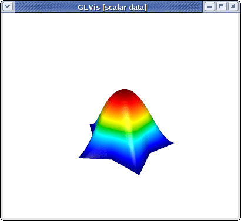
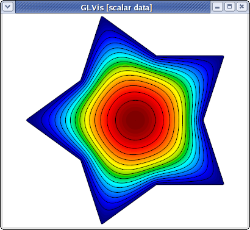
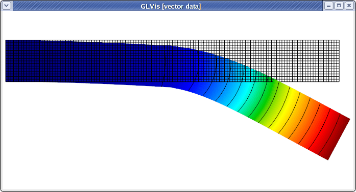
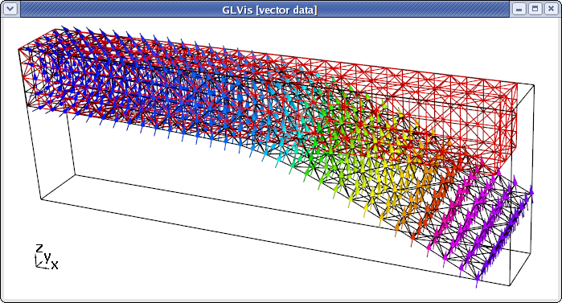
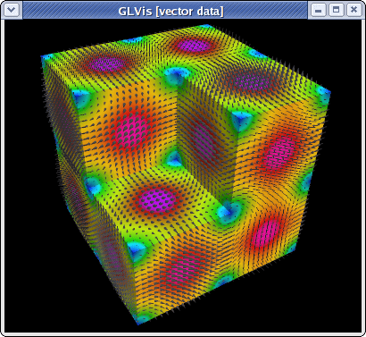
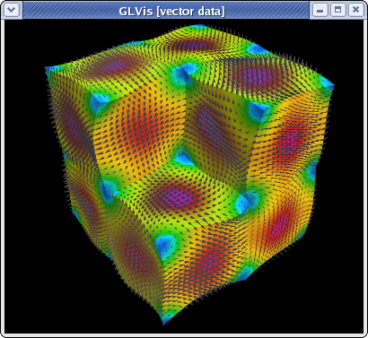
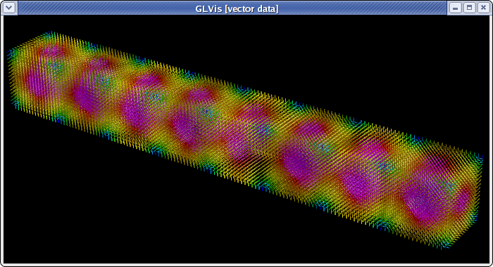
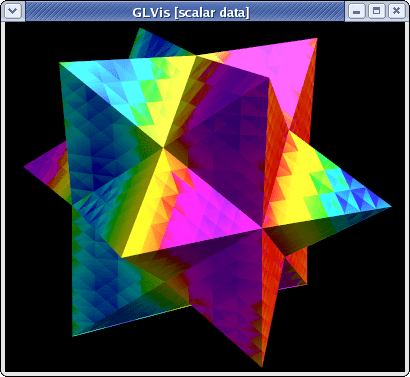

<script type="text/x-mathjax-config">
  MathJax.Hub.Config({tex2jax: {inlineMath: [['$','$']]}});
</script>
<script type="text/javascript"
  src="//cdn.mathjax.org/mathjax/latest/MathJax.js?config=TeX-AMS-MML_HTMLorMML">
</script>

# Serial Tutorial

## Summary

This tutorial illustrates the building and sample use of the following MFEM serial example codes:

  - [Example 1](#example-1)
  - [Example 2](#example-2)
  - [Example 3](#example-3)

An interactive documentation of all example codes is available [here](examples.md).

## Building

Follow the [serial instructions](building.md#serial-version-of-mfem-and-glvis) to build the MFEM library and to start a GLVis server. The latter is the recommended visualization software for MFEM (though its use is optional).

To build the serial example codes, type `make` in MFEM's examples directory:
```sh
~/mfem/examples> make
g++ -O3 -I.. ex1.cpp -o ex1 -L.. -lmfem
g++ -O3 -I.. ex2.cpp -o ex2 -L.. -lmfem
g++ -O3 -I.. ex3.cpp -o ex3 -L.. -lmfem
g++ -O3 -I.. ex4.cpp -o ex4 -L.. -lmfem
g++ -O3 -I.. ex5.cpp -o ex5 -L.. -lmfem
g++ -O3 -I.. ex6.cpp -o ex6 -L.. -lmfem
g++ -O3 -I.. ex7.cpp -o ex7 -L.. -lmfem
g++ -O3 -I.. ex8.cpp -o ex8 -L.. -lmfem
g++ -O3 -I.. ex9.cpp -o ex9 -L.. -lmfem
g++ -O3 -I.. ex10.cpp -o ex10 -L.. -lmfem
```

## Example 1

This example code demonstrates the use of MFEM to define a simple
linear finite element discretization of the Laplace problem
$-\Delta u = 1$ with homogeneous Dirichlet boundary conditions. To run it, simply specify the input mesh file (which will be refined to a final mesh with no more than 50,000 elements):
```sh
~/mfem/examples> ex1 -m ../data/star.mesh
   Iteration :   0  (B r, r) = 0.00111712
   Iteration :   1  (B r, r) = 0.00674088
   Iteration :   2  (B r, r) = 0.0123008
...
   Iteration :  88  (B r, r) = 5.28955e-15
   Iteration :  89  (B r, r) = 1.99155e-15
   Iteration :  90  (B r, r) = 9.91309e-16
Average reduction factor = 0.857127
```
If a GLVis server is running, the computed finite element solution will appear in an interactive window:



You can examine the solution using the mouse and the GLVis [command keystrokes](https://raw.githubusercontent.com/GLVis/glvis/master/README).
Pressing "`RAfjlmm`", for example, will give us a 2D view without light or perspective showing the computed level lines:



This example saves two files called `refined.mesh` and `sol.gf`, which represent the refined mesh and the computed solution as a grid function. These can be visualized with `glvis -m refined.mesh -g sol.gf` as discussed [here](http://glvis.org/options-and-use#visualizing-functions).

Example 1 can be run on any mesh that is supported by MFEM, including 3D, curvilinear and VTK meshes, e.g.,
```sh
~/mfem/examples> ex1 -m ../data/fichera-q2.vtk
   Iteration :   0  (B r, r) = 0.0235996
   Iteration :   1  (B r, r) = 0.0476694
   Iteration :   2  (B r, r) = 0.0200109
...
   Iteration :  27  (B r, r) = 7.77888e-14
   Iteration :  28  (B r, r) = 2.36255e-14
   Iteration :  29  (B r, r) = 8.56679e-15
Average reduction factor = 0.610261
```


The picture above shows the solution with level lines plotted in normal direction of a cutting plane, and was produced by typing "`AaafmIMMooo`" followed by cutting plane adjustments with "`z`", "`y`" and "`w`".

## Example 2

This example code solves a simple linear elasticity problem describing a multi-material Cantilever beam. Note that the input mesh should have at least two materials and two boundary attributes as shown below:
```nohighlight
               +----------+----------+
  boundary --->| material | material |<--- boundary
  attribute 1  |    1     |    2     |     attribute 2
  (fixed)      +----------+----------+     (pull down)
```

The example demonstrates the use of (high-order) vector finite element spaces by supporting several different discretization options:
```sh
~/mfem/examples> ex2 -m ../data/beam-quad.mesh -o 2
Assembling: r.h.s. ... matrix ... done.
   Iteration :   0  (B r, r) = 1.88755e-06
   Iteration :   1  (B r, r) = 8.2357e-07
   Iteration :   2  (B r, r) = 9.9098e-07
...
   Iteration : 498  (B r, r) = 2.78279e-11
   Iteration : 499  (B r, r) = 3.75298e-11
   Iteration : 500  (B r, r) = 4.95682e-11
PCG: No convergence!
(B r_0, r_0) = 1.88755e-06
(B r_N, r_N) = 4.95682e-11
Number of PCG iterations: 500
Average reduction factor = 0.989508
```
The output shows the (curved) displaced mesh together with the inverse displacement vector field:



The above plot can be alternatively produced with:
```sh
glvis -m displaced.mesh -g sol.gf -k "RfjliiiiimmAbb"
```

Example 2 also works in 3D:
```sh
~/mfem/examples> ex2 -m ../data/beam-tet.mesh -o 3
Assembling: r.h.s. ... matrix ... done.
   Iteration :   0  (B r, r) = 2.7147e-06
   Iteration :   1  (B r, r) = 1.95756e-06
   Iteration :   2  (B r, r) = 2.24159e-06
...
   Iteration : 426  (B r, r) = 3.37563e-14
   Iteration : 427  (B r, r) = 3.06198e-14
   Iteration : 428  (B r, r) = 2.5706e-14
Average reduction factor = 0.978648
```

One can visualize the vector field, e.g., by pressing "`dbAfmeoooovvaa`" followed by scale and position adjustments with the mouse:



## Example 3

This example code solves a simple 3D electromagnetic diffusion problem corresponding to the second order definite Maxwell equation ${\rm curl\, curl}\, E + E = f$ discretized with the lowest order Nedelec finite elements. It computes the approximation error with a know exact solution, and requires a 3D input mesh:
```sh
~/mfem/examples> ex3 -m ../data/fichera.mesh
   Iteration :   0  (B r, r) = 121.209
   Iteration :   1  (B r, r) = 21.1137
   Iteration :   2  (B r, r) = 12.6503
...
   Iteration : 149  (B r, r) = 2.40571e-10
   Iteration : 150  (B r, r) = 1.39788e-10
   Iteration : 151  (B r, r) = 9.43635e-11
Average reduction factor = 0.911811

|| E_h - E ||_{L^2} = 0.00976655
```

To visualize the magnitude of the solution with the proportionally-sized vector field shown only on the boundary of the domain, type "`Vfooogt`" in the GLVis window (or run `glvis -m refined.mesh -g sol.gf -k "Vfooogt"`):



Curved meshes are also supported:
```sh
~/mfem/examples> ex3 -m ../data/fichera-q3.mesh
   Iteration :   0  (B r, r) = 135.613
   Iteration :   1  (B r, r) = 22.3785
   Iteration :   2  (B r, r) = 12.5215
...
   Iteration : 168  (B r, r) = 4.95911e-10
   Iteration : 169  (B r, r) = 2.23499e-10
   Iteration : 170  (B r, r) = 1.25714e-10
Average reduction factor = 0.921741

|| E_h - E ||_{L^2} = 0.0821686
```



To visualize the entire vector field, type "`fooogtevv`" instead, which will use uniform sized arrows colored according to their magnitude. Here is the corresponding plot from "`ex3 -m ../data/beam-hex.mesh`":



Since entire vector fields in 3D might be difficult to see, a good alternative might be to plot the separate components of the field as scalar functions. For example:
```sh
~/mfem/examples> ex3 -m ../data/escher.mesh
   Iteration :   0  (B r, r) = 348.797
   Iteration :   1  (B r, r) = 32.0699
   Iteration :   2  (B r, r) = 14.902
...
   Iteration : 159  (B r, r) = 4.16076e-10
   Iteration : 160  (B r, r) = 3.50907e-10
   Iteration : 161  (B r, r) = 3.22923e-10
Average reduction factor = 0.917548

|| E_h - E ||_{L^2} = 0.36541

~/mfem/examples> glvis -m refined.mesh -g sol.gf -gc 0 -k "gooottF"
```



The discontinuity of the Nedelec functions is clearly seen in the above plot.

