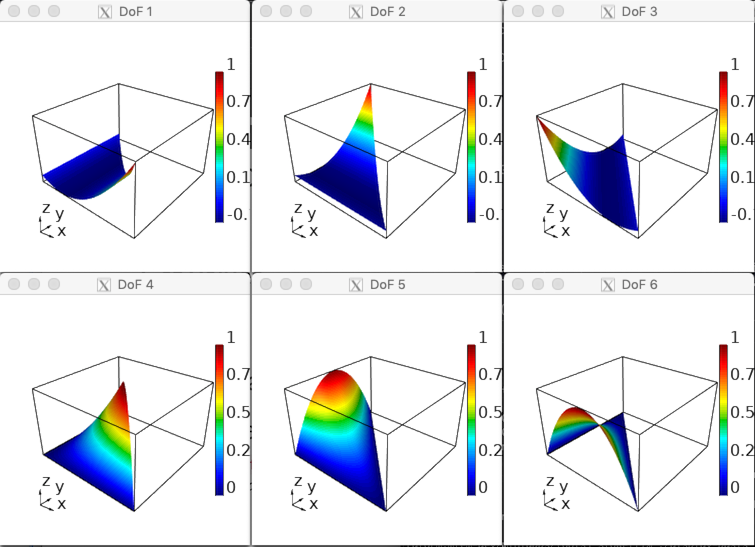

# Tools

## DataCollection Tools

### Convert DC

This tool, named `convert-dc` in the `miniapps/tools` subdirectory,
demonstrates how to convert between MFEM's different concrete
DataCollection options.

Currently supported data collection type options:

  | Nickname            | Full Class Name                                |
  |---------------------|:-----------------------------------------------|
  | visit               | VisItDataCollection (default)                  |
  | sidre or sidre_hdf5 | SidreDataCollection                            |
  | json                | ConduitDataCollection w/ protocol json         |
  | conduit_json        | ConduitDataCollection w/ protocol conduit_json |
  | conduit_bin         | ConduitDataCollection w/ protocol conduit_bin  |
  | hdf5                | ConduitDataCollection w/ protocol hdf5         |

### Load DC

The `load-dc` miniapp, found in the `miniapps/tools` subdirectory, loads and
visualizes (in GLVis) previously saved data using DataCollection sub-classes,
see e.g. Example 5/5p. Currently, only the VisItDataCollection class is
supported.

### Get Values

The `get-values` miniapp, found in `miniapps/tools`, loads previously saved
data using DataCollection sub-classes and outputs field values at a set of
points. Currently, only the VisItDataCollection class is supported.

```
# Number of fields
3
# Legend
# "Index" "Location":2 "pressure":1 "velocity":2
2 1 2
# Number of points
6
0 0.0 0.8 0.717336 -0.716172 -0.696674
1 0.2 0.8 0.876045 -0.875874 -0.852278
2 0.4 0.8 1.06999 -1.07106 -1.03923
3 0.6 0.8 1.30719 -1.30931 -1.26903
4 0.8 0.8 1.59678 -1.59601 -1.54949
5 1.0 0.8 1.94995 -1.94853 -1.89371
```

Point locations can be specified on the command line using `-p` or within a
data file whose name can be given with option `-pf`.  The data file format is:
```
number_of_points space_dimension
x_0 y_0 ...
x_1 y_1 ...
etc.
```

By default all available fields are evaluated.  The list of fields can be
reduced by specifying the desired field names with `-fn`. The `-fn` option
takes a space separated list of field names surrounded by qoutes.  Field
names containing spaces, such as "Field 1" and "Field 2", can be entered as:

```get-values -fn "Field\ 1 Field\ 2"```

By default the data is written to standard out.  This can be overwritten
with the `-o [filename]` option.

The output format contains comments as well as sizing information to aid in
subsequent processing.  The bulk of the data consists of one line per point
with a 0-based integer index followed by the point coordinates and then the
field data.  A legend, appearing before the bulk data, shows the order of
the fields along with the number of values per field (for vector data).

## General Tools

### Display Basis

The `display-basis` miniapp, found under `miniapps/tools`, visualizes various
types of finite element basis functions on a single mesh element in 1D, 2D,
and 3D.



The element type, basis type and order can be changed interactively.  The mesh
element is either the reference element, or a simple transformation of it.

### Low-Order Refined Transfer

The `lor-transfer` miniapp, found under `miniapps/tools` demonstrates the
capability to generate a *low-order refined* mesh from a high-order mesh, and to
transfer solutions between these meshes.


Grid functions can be transferred between the coarse, high-order mesh and the
low-order refined mesh using either $L^2$ projection or pointwise evaluation.
These transfer operators can be designed to discretely conserve mass and to
recover the original high-order solution when transferring a low-order grid
function that was obtained by restricting a high-order grid function to the
low-order refined space.

<script type="text/x-mathjax-config">MathJax.Hub.Config({TeX: {equationNumbers: {autoNumber: "all"}}, tex2jax: {inlineMath: [['$','$']]}});</script>
<script type="text/javascript" src="https://cdnjs.cloudflare.com/ajax/libs/mathjax/2.7.2/MathJax.js?config=TeX-AMS_HTML"></script>
