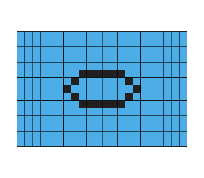
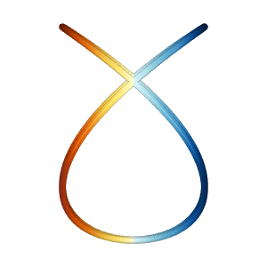
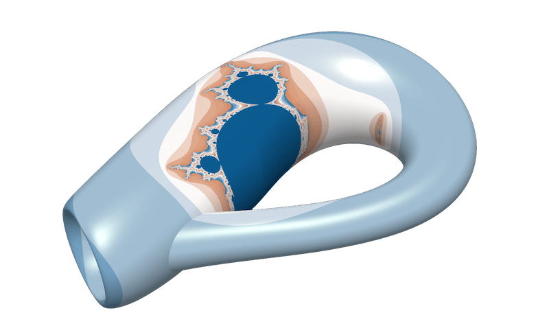
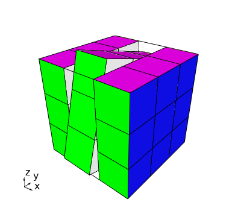
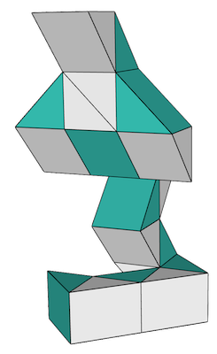

# Toys

A handful of "toy" miniapps of less serious nature demonstrate the
flexibility of MFEM (and provide a bit of fun):

## Automata

The `automata` miniapp implements a one dimensional elementary cellular
automata as described in:
[Wolfram MathWorld](https://mathworld.wolfram.com/ElementaryCellularAutomaton.html).

This miniapp shows a completely unnecessary use of the finite element
method to simply display binary data (but it's fun to play with).


The `automata` miniapp has only three options; `-vis` or `-no-vis` to
enable or disable visualization, `-ns` which defines the number of
steps to evolve the cellular automata, and `-r` to select the rule
which is applied at each step.  Rules for this type of cellular
automata consist of a sequence of 8 bits which are normally passed as
an integer 0-255.  The rule defines how to update each cell based on
the current values of that cell and its two nearest neighbors.

## Life

The `life` miniapp implements Conway's Game of Life. A few simple
starting positions are available as well as a random initial
state. The game will terminate only if two successive iterations are
identical.



Users can control the size of the domain and the initial placement of
simple objects like _blinkers_ and _gliders_.  Arbitrary patterns can
be supplied through the `--sketch-pad` or `-sp` option.  The sketch
pad was used to produce the above image with the command line:

``life -nx 30 -sp '11 11 1 1 1 1 1 1 1 1 2
                         1 0 1 1 1 1 0 1 2
                         1 1 1 1 1 1 1 1'``

The values following `-sp` are the starting coordinates of the pattern
followed by zeros or ones to indicate pixels that should be off or on,
any twos indicate new lines in the pattern.

## Lissajous

The `lissajous` miniapp generates two different Lissajous curves in 3D
which appear to spin vertically and/or horizontally, even though the
net motion is the same.

| Vertical Rotation                | Horizontal Rotation              |
|:---------------------------------|:---------------------------------|
| | |

Based on the 2019 Illusion of the year "Dual Axis Illusion" by Frank
Force, see [Dual Axis
Illusion](http://illusionoftheyear.com/2019/12/dual-axis-illusion).

## Mandel

The `mandel` miniapp is a specialized version of the `shaper` miniapp which
adapts a mesh to the Mandelbrot set.



Both planar and surface meshes are supported.

## Mondrian

The `mondrian` miniapp is a specialized version of the `shaper`
miniapp that converts an input image to an AMR mesh. It allows the
fast approximate meshing of any domain for which there is an image.


The input image should be in 8-bit grayscale PGM format. You can use a
number of image manipulation tools, such as GIMP (gimp.org) and ImageMagick's
convert utility (imagemagick.org/script/convert.php) to convert your image to
this format as a pre-processing step, e.g.:

```/usr/bin/convert australia.svg -compress none -depth 8 australia.pgm```

## Rubik

The `rubik` miniapp implements an interactive model of a Rubik's Cube&trade; puzzle.



The basic interactive command is of the form `[xyz][1,2,3][0-3]` which
rotates, about the x, y, or z axis, a single tier, indicated by the
first integer, by a number of increments, indicated by the final
integer.  Any manipulation of the cube can be accomplished with a
sequence of these simple three character commands.

Common commands:

| Command    | Action                                                         |
|:-----------|:---------------------------------------------------------------|
| `R`        | Resets or re-paints the cube                                   |
| `S` or `s` | Solve the cube starting from the top and working down          |
| `r[0-9]+`  | Specific number of random moves                                |
| `p`        | Print the current state of the cube to the screen              |
| `q`        | Quit                                                           |

Other commands:

| Command    | Action                                                         |
|:-----------|:---------------------------------------------------------------|
| `T`        | Solve the top tier only                                        |
| `M`        | Solve the middle tier assuming the top has already been solved |
| `B`        | Solve the bottom tier assuming the top and middle are done     |
| `c`        | Swap bottom tier corners in positions 0 and 1                  |
| `t[0,1]`   | Twist, in place, three of the bottom tier corners              |
| `e[0,1]`   | Permute three of the bottom tier edges                         |
| `f[2,4]`   | Flip, in place, 2 or 4 of the bottom tier edges                |

## Snake

The `snake` miniapp provides a light-hearted example of mesh manipulation and
GLVis integration.

The Rubik's Snake&trade; a.k.a. Twist is a simple tool for experimenting with
geometric shapes in 3D. It consists of 24 triangular prisms attached in
a row so that neighboring wedges can rotate against each other but cannot
be separated. An astonishing variety of different configurations can be
reached.

<a href="https://glvis.org/live/?stream=../data/streams/snake.saved" target="_blank">

</a>

Thirteen pre-programmed configurations are available via the `-c
[0-12]` command line option.  Other configurations can be reached with
the `-u` option.  Each configuration must be 23 integers long
corresponding to the 23 joints making up the Snake&trade; puzzle. The
values can be 0-3 indicating how far to rotate the joint in the
clockwise direction when looking along the snake from the starting
(lower) end. The values 0, 1, 2, and 3 correspond to angles of 0, 90,
180, and 270 degrees respectively.

## Spiral

The `spiral` miniapp provides a GLVis-based animation of an interesting fidget
spiral cone toy. The toy is made out of two parts which can (surprisingly) pass
through each other regardless of their orientation. Several different
configuration of the two parts are supported depending on the orientation and
which part is moving, see the `-c` option.

<center><video autoplay loop><source src="../img/examples/spiral.mp4"></video></center>

The miniapp uses the [STL model](https://www.thingiverse.com/thing:6682243) by
[Per Lundberg](https://www.thingiverse.com/lumor_) and surface mesh generated by
[Gmsh](https://gmsh.info). Note that since the mesh is large, it is stored in
the external [mfem/data](https://github.com/mfem/data) repository, which you
need to clone before building the code.
