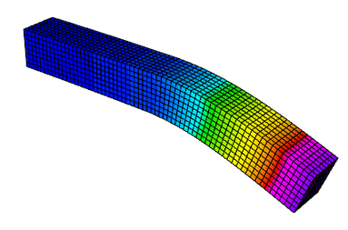
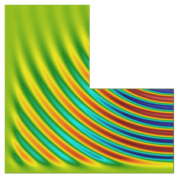

## <i class="fa fa-gears"></i>&nbsp; Tour of MFEM Examples

<span class="label label-default">30 minutes</span>
<span class="label label-default">intermediate</span>

---

<div class="panel panel-success">
<div class="panel-heading">
<h3 class="panel-title"><i class="fa fa-check"></i>&nbsp; Lesson Objectives</h3>
</div>
<div class="panel-body" style="line-height: 1.8;">
<i class="fa fa-square-o"></i>&nbsp; Learn about MFEM's main features through several of the examples included with the library. <br>
</div>
</div>

<div class="panel panel-info">
<div class="panel-heading">
<h3 class="panel-title"><i class="fa fa-info-circle"></i>&nbsp; Note</h3>
</div>
<div class="panel-body">
Please complete the <a href="../start"><i class="fa fa-play-circle"></i>&nbsp; Getting Started</a>
and <a href="../fem"><i class="fa fa-book"></i> Finite Element Basics</a> pages before this lesson.
</div>
</div>

---

### <i class="fa fa-check-square-o"></i>&nbsp; High-order methods
MFEM includes support for the full [*de Rham complex*](https://en.wikipedia.org/wiki/De_Rham_cohomology), $H^1-$conforming (continuous), $H(curl)-$conforming (continuous tangential component), $H(div)-$conforming (continuous normal component), and $L^2-$conforming (discontinuous) finite element discretization spaces in 2D and 3D. A compatible high-order de Rham complex on the discrete level can be constructed using the `*_FECollection` classes with `*` replaced by `H1`, `ND`, `RT`, and `L2`, respectively.

Note that MFEM supports arbitrary discretization order for the full de Rham complex. For example, here is an illustration of the FEM degrees of freedom on quadrilaterals for orders 1&mdash;3:


The first four MFEM examples serve as an introduction on how to construct and use these discrete spaces for the solution of various PDEs. All of them have the `-o`/`--order` command line parameter to specify the finite element space order at runtime.

Before building the example codes, make sure you are in the `examples` directory: `cd ~/mfem/examples`.

<div class="panel panel-info">
<div class="panel-heading">
<h3 class="panel-title"><i class="fa fa-info-circle"></i>&nbsp; Note</h3>
</div>
<div class="panel-body">
Remember to compile each numbered example before executing its sample runs: <code>make ex*</code> for the serial version or <code>make ex*p</code> for the parallel version. You can build multiple examples in the same command: <code>make ex3 ex4 ex3p ex4p</code>.
</div>
</div>


<i class="fa fa-arrow-circle-right"></i>&nbsp; **Example 1** ([ex1.cpp](https://github.com/mfem/mfem/blob/master/examples/ex1.cpp) and [ex1p.cpp](https://github.com/mfem/mfem/blob/master/examples/ex1p.cpp)) solves a simple Poisson problem using a scalar $H^1$ space. More specifically, it solves the problem $$-\Delta u = 1$$ with homogeneous Dirichlet boundary conditions.

Try the following sample runs:

    ./ex1 -m ../data/square-disc.mesh
    ./ex1 -m ../data/fichera.mesh
    mpirun -np 4 ex1p -m ../data/star-surf.mesh
    mpirun -np 4 ex1p -m ../data/mobius-strip.mesh

The plot on the right corresponds to the 2nd sample run with <kbd>i</kbd>, <kbd>Z</kbd> and <kbd>m</kbd> pressed in the GLVis window, followed by rotation with the mouse <kbd>Left</kbd> button.

---



<i class="fa fa-arrow-circle-right"></i>&nbsp; **Example 2** ([ex2.cpp](https://github.com/mfem/mfem/blob/master/examples/ex2.cpp) and [ex2p.cpp](https://github.com/mfem/mfem/blob/master/examples/ex2p.cpp)) solves a linear elasticity problem using a vector $H^1$ space. The problem describes a multi-material cantilever beam. The weak form is $$-{\rm div}({\sigma}({\bf u})) = 0$$ where $${\sigma}({\bf u}) = \lambda\, {\rm div}({\bf u})\,I + \mu\,(\nabla{\bf u} + \nabla{\bf u}^T)$$ is the stress tensor corresponding to displacement field ${\bf u}$, and $\lambda$ and $\mu$ are the material Lame constants. The boundary conditions are ${\bf u}=0$ on the fixed part of the boundary with attribute 1, and ${\sigma}({\bf u})\cdot n = f$ on the remainder with $f$ being a constant pull down vector on boundary elements with attribute 2, and zero otherwise.

Try the following sample runs:

    ./ex2 -m ../data/beam-tri.mesh
    ./ex2 -m ../data/beam-hex.mesh
    mpirun -np 4 ex2p -m ../data/beam-wedge.mesh
    mpirun -np 4 ex2p -m ../data/beam-quad.mesh -o 3 -elast

The plot on the right corresponds to the 2nd sample run with <kbd>m</kbd> pressed in the GLVis window.

---


<i class="fa fa-arrow-circle-right"></i>&nbsp; **Example 3**  ([ex3.cpp](https://github.com/mfem/mfem/blob/master/examples/ex3.cpp) and [ex3p.cpp](https://github.com/mfem/mfem/blob/master/examples/ex3p.cpp)) solves a 3D electromagnetic diffusion problem (definite Maxwell) using an $H(curl)$ finite element space. It solves the equation $$\nabla\times\nabla\times\, E + E = f$$ with boundary condition $ E \times n $ = "given tangential field". Here, the r.h.s. $f$ and the boundary condition data are computed using a given exact solution $E$.

Try the following sample runs:

    ./ex3 -m ../data/star.mesh
    ./ex3 -m ../data/beam-tri.mesh -o 2
    mpirun -np 4 ex3p -m ../data/fichera.mesh
    mpirun -np 4 ex3p -m ../data/escher.mesh -o 2

The plot on the right corresponds to the 3rd sample run with <kbd>m</kbd> and <kbd>A</kbd> pressed in the GLVis window.

---


<i class="fa fa-arrow-circle-right"></i>&nbsp; **Example 4** ([ex4.cpp](https://github.com/mfem/mfem/blob/master/examples/ex4.cpp) and [ex4p.cpp](https://github.com/mfem/mfem/blob/master/examples/ex4p.cpp)) solves a 2D/3D $H(div)$ diffusion problem using an $H(div)$ finite element space. The $H(div)$
     diffusion problem corresponds to the second-order definite equation $$-{\rm grad}(\alpha\,{\rm div}(F)) + \beta F = f$$ with boundary condition $F \cdot n$ = "given normal field". Here, the r.h.s. $f$ and the boundary condition data are computed using a given exact solution $F$.

Try the following sample runs:

    ./ex4 -m ../data/square-disc.mesh
    ./ex4 -m ../data/periodic-square.mesh -no-bc
    mpirun -np 4 ex4p -m ../data/fichera-q2.vtk
    mpirun -np 4 ex4p -m ../data/amr-quad.mesh

The plot on the right is similar to the 1st sample run with <kbd>R</kbd>, <kbd>j</kbd> and <kbd>l</kbd> pressed in the GLVis window.

---

### <i class="fa fa-check-square-o"></i>&nbsp; Discontinuous Galerkin

</a>
MFEM supports high-order Discontinuous Galerkin (DG) discretizations through various face integrators. Additionally, it includes numerous explicit and implicit ODE time integrators which are used for the solution of time-dependent PDEs.

<i class="fa fa-arrow-circle-right"></i>&nbsp; **Example 9** ([ex9.cpp](https://github.com/mfem/mfem/blob/master/examples/ex9.cpp) and [ex9p.cpp](https://github.com/mfem/mfem/blob/master/examples/ex9p.cpp)) solves the time-dependent advection equation $$\frac{\partial u}{\partial t} + v \cdot \nabla u = 0,$$ where $v$ is a given fluid velocity, and $u_0(x)=u(0,x)$ is a given initial condition.

The example demonstrates the use of DG bilinear forms, the use of explicit and implicit (with block ILU
preconditioning) ODE time integrators, the definition of periodic boundary conditions through periodic meshes, as well as the use of
[GLVis](https://glvis.org) for persistent visualization of a time-evolving
solution.

Try the following sample runs:

    ./ex9 -m ../data/periodic-square.mesh -p 3 -r 4 -dt 0.0025 -tf 9 -vs 20
    ./ex9 -m ../data/disc-nurbs.mesh -p 1 -r 3 -dt 0.005 -tf 9
    mpirun -np 4 ex9p -m ../data/star-q3.mesh -p 1 -rp 1 -dt 0.004 -tf 9
    mpirun -np 16 ex9p -m ../data/amr-hex.mesh -p 1 -rs 1 -rp 0 -dt 0.005 -tf 0.5

The plot on the right corresponds to the 1st sample run with <kbd>R</kbd>, <kbd>j</kbd> and <kbd>l</kbd> pressed in the GLVis window.

<div class="panel panel-info">
<div class="panel-heading">
<h3 class="panel-title"><i class="fa fa-info-circle"></i>&nbsp; Note</h3>
</div>
<div class="panel-body">
In time-dependent simulations, the GLVis window will be automatically updated with the solutions at
the new time steps as they are computed (how frequently this is done is governed by the <code>-vs</code>
command line parameter above). To start/pause these updates press <kbd>space</kbd> in the GLVis window,
or click the &nbsp;<i class="fa fa-pause"></i>&nbsp; icon in the upper center portion of the window.
</div>
</div>

---

### <i class="fa fa-check-square-o"></i>&nbsp; Nonlinear elasticity


<i class="fa fa-arrow-circle-right"></i>&nbsp; **Example 10** ([ex10.cpp](https://github.com/mfem/mfem/blob/master/examples/ex10.cpp) and [ex10p.cpp](https://github.com/mfem/mfem/blob/master/examples/ex10p.cpp)) solves a time dependent nonlinear elasticity problem of the form $$ \frac{dv}{dt} = H(x) + S v\,,\qquad \frac{dx}{dt} = v\,, $$ where $H$ is a hyperelastic model and $S$ is a viscosity operator of Laplacian type. The geometry of the domain is assumed to be as follows:


The example demonstrates the use of nonlinear operators, as well as their
implicit time integration using a Newton method for solving an associated
reduced backward-Euler type nonlinear equation. Each Newton step requires the
inversion of a Jacobian matrix, which is done through a (preconditioned) inner
solver.

Before trying this example, modify the source code of `ex10.cpp` to disable the
second stream visualization as follows:
```diff
@@ -298,7 +298,7 @@ int main(int argc, char *argv[])
       vis_v.precision(8);
       v.SetFromTrueVector(); x.SetFromTrueVector();
       visualize(vis_v, mesh, &x, &v, "Velocity", true);
-      vis_w.open(vishost, visport);
+      // vis_w.open(vishost, visport);
       if (vis_w)
       {
          oper.GetElasticEnergyDensity(x, w);
```

Similarly, make the following changes in `ex10p.cpp`:
```diff
@@ -344,7 +344,7 @@ int main(int argc, char *argv[])
       // Make sure all ranks have sent their 'v' solution before initiating
       // another set of GLVis connections (one from each rank):
       MPI_Barrier(pmesh->GetComm());
-      vis_w.open(vishost, visport);
+      // vis_w.open(vishost, visport);
       if (vis_w)
       {
          oper.GetElasticEnergyDensity(x_gf, w_gf);
```

Now rebuild both examples: `make ex10 ex10p` and try the following sample runs:

    ./ex10 -m ../data/beam-hex.mesh -s 2 -r 1 -o 2 -dt 3
    ./ex10 -m ../data/beam-tri.mesh -s 3 -r 2 -o 2 -dt 3
    mpirun -np 4 ex10p -m ../data/beam-wedge.mesh -s 2 -rs 1 -dt 3
    mpirun -np 4 ex10p -m ../data/beam-tet.mesh -s 2 -rs 1 -dt 3

---

### <i class="fa fa-check-square-o"></i>&nbsp; Adaptive mesh refinement


MFEM provides support for local conforming and non-conforming adaptive mesh refinement (AMR) with arbitrary-order hanging nodes, anisotropic refinement, derefinement, and parallel load balancing. The AMR support covers the full de Rham complex, i.e., the energy spaces $H^1$, $H(curl)$, $H(div)$ and $L^2$. You can choose from several error estimators, such as the Zienkiewicz-Zhu (ZZ) or the Kelly estimator, to drive the AMRs. We recommend looking at examples 6, 15, 21, and 30 for some simulations with AMR.

<i class="fa fa-arrow-circle-right"></i>&nbsp; **Example 15** ([ex15.cpp](https://github.com/mfem/mfem/blob/master/examples/ex15.cpp) and [ex15p.cpp](https://github.com/mfem/mfem/blob/master/examples/ex15p.cpp)) demonstrates MFEM's capability to refine, derefine, and load balance non-conforming meshes in 2D and 3D as well as on linear, curved, and surface meshes. In this example the mesh is adapted to a time-dependent solution. At each time step the problem is solved on a sequence of adaptive meshes that are refined based on a simple ZZ estimator. At the end of the refinement process, the error estimates are used to identify elements that are over-refined, and a single derefinement step is performed. Finally, in the parallel case, a load-balancing step is executed.

Try the following sample runs:

    ./ex15 -n 3
    ./ex15 -m ../data/square-disc.mesh
    ./ex15 -est 1 -e 0.0001
    mpirun -np 4 ex15p -m ../data/mobius-strip.mesh
    mpirun -np 4 ex15p -m ../data/fichera.mesh -tf 0.5

The plot on the right is related to the parallel version of the 1st sample run with <kbd>R</kbd>, <kbd>j</kbd>, <kbd>l</kbd> and <kbd>m</kbd> pressed in the GLVis window.

---

### <i class="fa fa-check-square-o"></i>&nbsp; Complex-valued problems

MFEM provides a user-friendly interface for solving complex valued systems.
These kinds of problems can be formulated using the classes `ComplexOperator`,
`ComplexLinearForm`, `SesquilinearForm`, `ComplexGridFunction`, and their parallel
counterparts. You can define the weak formulation by providing the integrators
of real and imaginary parts independently and then use similar methods as in
the real problems (such us `Assemble`, `FormLinearSystem`, and `RecoverFEMSolution`)
to recover the solution.

Currently, there are two examples demonstrating the use of complex-valued systems.


<i class="fa fa-arrow-circle-right"></i>&nbsp; **Example 22** ([ex22.cpp](https://github.com/mfem/mfem/blob/master/examples/ex22.cpp) and [ex22p.cpp](https://github.com/mfem/mfem/blob/master/examples/ex22p.cpp)) implements three variants of a damped harmonic oscillator:

* A scalar $H^1$ field:
  $$-\nabla\cdot\left(a \nabla u\right) - \omega^2 b\,u + i\,\omega\,c\,u = 0$$

* A vector $H(curl)$ field:
  $$\nabla\times\left(a\nabla\times\vec{u}\right) - \omega^2 b\,\vec{u} + i\,\omega\,c\,\vec{u} = 0$$

* A vector $H(div)$ field:
  $$-\nabla\left(a \nabla\cdot\vec{u}\right) - \omega^2 b\,\vec{u} + i\,\omega\,c\,\vec{u} = 0$$

In each case the field is driven by a forced oscillation, with angular
frequency $\omega$ imposed at the boundary or a portion of the boundary.

Try the following sample runs:

    ./ex22 -m ../data/inline-quad.mesh -o 3 -p 1
    ./ex22 -m ../data/inline-hex.mesh -o 2 -p 2 -pa
    mpirun -np 4 ex22p -m ../data/star.mesh -o 2 -sigma 10.0
    mpirun -np 4 ex22p -m ../data/inline-pyramid.mesh -o 1

---



<i class="fa fa-arrow-circle-right"></i>&nbsp; **Example 25** ([ex25.cpp](https://github.com/mfem/mfem/blob/master/examples/ex25.cpp) and [ex25p.cpp](https://github.com/mfem/mfem/blob/master/examples/ex25p.cpp)) illustrates the use of a [Perfectly Matched Layer](https://en.wikipedia.org/wiki/Perfectly_matched_layer) (PML) for the simulation of time-harmonic electromagnetic waves propagating in unbounded domains. The implementation involves the introduction of an artificial absorbing layer that minimizes undesired reflections. Inside this layer a complex coordinate stretching map forces the wave modes to decay exponentially.

The example solves the indefinite Maxwell equations
$$ \nabla \times (a \nabla \times E) - \omega^2 b E = f $$ where $a = \mu^{-1} |J|^{-1} J^T J$,
$b= \epsilon |J| J^{-1} J^{-T}$ and $J$ is the Jacobian matrix of the coordinate
transformation.

Try the following sample runs:

    ./ex25 -o 3 -f 10.0 -ref 2 -prob 1
    ./ex25 -o 2 -f 1.0 -ref 2 -prob 3
    mpirun -np 4 ex25p -o 2 -f 8.0 -rs 2 -rp 2 -prob 4 -m ../data/inline-quad.mesh
    mpirun -np 4 ex25p -o 2 -f 1.0 -rs 2 -rp 2 -prob 0 -m ../data/beam-quad.mesh

---

<div class="panel panel-warning">
<div class="panel-heading">
<h3 class="panel-title"><i class="fa fa-question-circle"></i>&nbsp; Questions?</h3>
</div>
<div class="panel-body">
Ask for help in the tutorial <a href="https://radiuss-llnl.slack.com/archives/C03T2DQCSC8">Slack channel</a>.
</div>
</div>

<div class="panel panel-success">
<div class="panel-heading">
<h3 class="panel-title"><i class="fa fa-external-link"></i>&nbsp; Next Steps</h3>
</div>
<div class="panel-body" style="line-height: 1.8; margin-bottom: -10pt;">
Depending on your interests pick one of the following lessons:<br>
<ul>
<li> <a href="../meshvis"><i class="fa fa-picture-o"></i>&nbsp; Meshing and Visualization</a>
<li> <a href="../solvers"><i class="fa fa-tasks"></i>&nbsp; Solvers and Scalability</a>
<li> <a href="../further"><i class="fa fa-rocket"></i>&nbsp; Further Steps</a>
</ul>
</div>
</div>

---

Back to the [MFEM tutorial page](index.md)

<script type="text/x-mathjax-config">MathJax.Hub.Config({TeX: {equationNumbers: {autoNumber: "all"}}, tex2jax: {inlineMath: [['$','$']]}});</script>
<script type="text/javascript" src="https://cdnjs.cloudflare.com/ajax/libs/mathjax/2.7.2/MathJax.js?config=TeX-AMS_HTML"></script>
