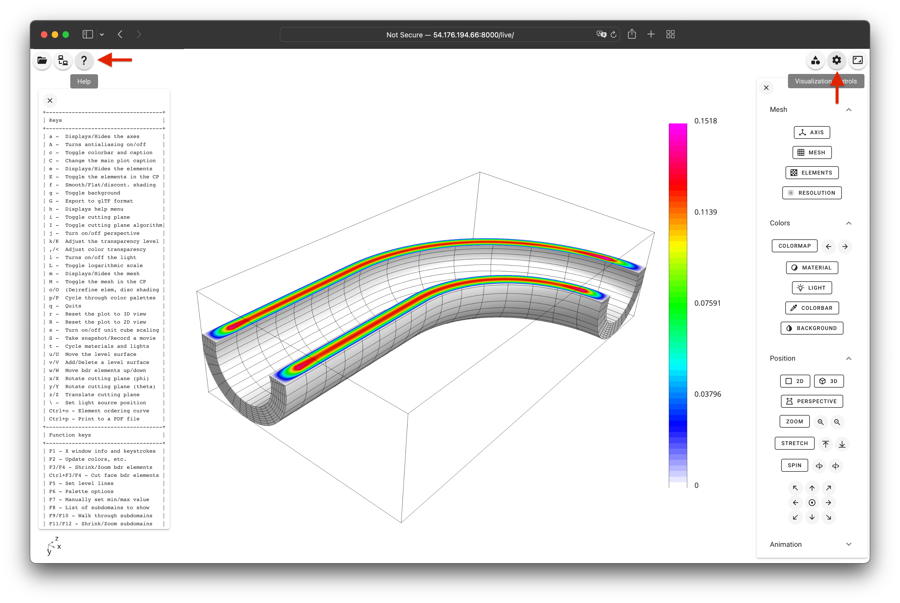

## <i class="fa fa-book"></i>&nbsp; Finite Element Basics

<span class="label label-default">45 minutes</span>
<span class="label label-default">basic</span>

---

<div class="panel panel-success">
<div class="panel-heading">
<h3 class="panel-title"><i class="fa fa-check"></i>&nbsp; Lesson Objectives</h3>
</div>
<div class="panel-body" style="line-height: 1.8;">
<i class="fa fa-square-o"></i>&nbsp; Understand a basic finite element discretization of the Poisson equation in MFEM.<br>
<i class="fa fa-square-o"></i>&nbsp; Learn how to launch serial and parallel runs of MFEM examples.<br>
<i class="fa fa-square-o"></i>&nbsp; Learn how to visualize the results of MFEM simulations.
</div>
</div>

<div class="panel panel-info">
<div class="panel-heading">
<h3 class="panel-title"><i class="fa fa-info-circle"></i>&nbsp; Note</h3>
</div>
<div class="panel-body">
Please complete the <a href="../start"><i class="fa fa-play-circle"></i>&nbsp; Getting Started</a>
page before this lesson.
</div>
</div>

---

### <i class="fa fa-check-square-o"></i>&nbsp; Poisson equation

The [_Poisson Equation_](https://en.wikipedia.org/wiki/Poisson's_equation) is a
partial differential equation (PDE) that can be used to model steady-state heat
conduction, electric potentials, and gravitational fields. In mathematical terms

$$
-\Delta u = f
$$

where _u_ is the potential field and _f_ is the source function. This PDE is a
generalization of the [_Laplace Equation_](https://en.wikipedia.org/wiki/Laplace%27s_equation).

To approximately solve the above continuous equation on computers, we need to
[discretize](https://en.wikipedia.org/wiki/Discretization) it by introducing a
finite (discrete) number of unknowns to compute for. In the
[_Finite Element Method_](https://en.wikipedia.org/wiki/Finite_element_method) (FEM),
this is done using the concept of _basis functions_.

Instead of calculating the exact analytic solution _u_, we approximate it

$$
u \approx u_h := \sum_{j=1}^n c_j \varphi_j
$$

where $u_h$ is the finite element approximation with degrees of freedom (unknown
coefficients) $c_j$, and $\varphi_j$ are known _basis functions_. The FEM basis
functions are typically piecewise-polynomial functions on a given computational mesh,
which are only non-zero on small portions of the mesh.


With finite elements, the mesh can be totally unstructured, curved, and
non-conforming:


In order to solve for the unknown coefficients of $u_h$, we convert our equation
into its <a href="../../fem_weak_form/">weak form</a> (also known as its *variational form*).
To do so, we multiply the entire equation (1) by a _test function_, 
$v \approx v_h = \sum_{i=1}^n c_i \varphi_i$, and integrate over the domain, $\Omega$:

$$\sum_{j=1}^n \sum_{i=1}^n - \int_\Omega c_j \nabla \cdot (\nabla \varphi_j) c_i \varphi_i = \sum_{i=1}^n \int_\Omega f c_i \varphi_i$$

Because the test function coefficients have not been explicitly specified, 
this equation must hold for any choice of $c_i$ which allows us to simplify:

$$\sum_{j=1}^n \int_\Omega - c_j \nabla \cdot (\nabla \varphi_j) \varphi_i = \int_\Omega f \varphi_i$$

We simplify further by reducing the order of derivative through application of 
integration by parts and the [divergence theorem](https://en.wikipedia.org/wiki/Divergence_theorem),

$$\sum_{j=1}^n\int_\Omega c_j \nabla \varphi_j \cdot \nabla \varphi_i - \int_{\partial\Omega} c_j \nabla \varphi_j \varphi_i = \int_\Omega f \varphi_i$$

We assume homogeneous Dirichlet boundary conditions corresponding, for example, 
to zero temperature on the whole boundary. This eliminates the boundary term to give

$$\sum_{j=1}^n\int_\Omega c_j \nabla \varphi_j \cdot \nabla \varphi_i = \int_\Omega f \varphi_i$$

which holds for all $\varphi_i$. Since the basis functions are known, we can rewrite (6) as

$$
A x = b
$$

where

$$
A_{ij} = \int_\Omega \nabla \varphi_j \cdot \nabla \varphi_i
$$

$$
b_i = \int_\Omega f \varphi_i
$$

$$
x_j = c_j
$$

This is a $n \times n$ linear system that can be solved directly or iteratively
for the unknown coefficients. Note that we are free to choose the computational
mesh and the basis functions $\varphi_i$, and therefore the finite space, as we
see fit.

<div class="panel panel-info">
<div class="panel-heading">
<h3 class="panel-title"><i class="fa fa-info-circle"></i>&nbsp; Note</h3>
</div>
<div class="panel-body">
The above is a basic introduction to finite elements in the simplest possible settings.
To learn more, you can visit MFEM's <a href="../../fem/">Finite Element Method</a> page.
</div>
</div>

---

### <i class="fa fa-check-square-o"></i>&nbsp; Annotated Example 1

MFEM's Example 1 implements the above simple FEM for the Poisson problem
in the source file [examples/ex1.cpp](https://github.com/mfem/mfem/blob/master/examples/ex1.cpp).
We set $f=1$ in (1) and enforce homogeneous Dirichlet boundary conditions on the whole boundary.

Below we highlight selected portions of the example code and connect them with
the description in the previous section. You can follow along by browsing
`ex1.cpp` in your VS Code browser window. In the settings of this tutorial, the
visualization will automatically update in the GLVis browser window.

The computational mesh is provided as input (option `-m`), it could be 3D, 2D,
surface, hex/tet, etc. The following code
(lines [120-137](https://github.com/mfem/mfem/blob/master/examples/ex1.cpp#L120-L137))
loads the mesh from the given file, `mesh_file`; creates the corresponding
MFEM object `mesh` of class `Mesh`; and refines the mesh uniformly to about
50,000 elements. You can easily modify the refinement by changing the definition of `ref_levels`.

```c++
Mesh mesh(mesh_file, 1, 1);
int dim = mesh.Dimension();

int ref_levels = (int)floor(log(50000./mesh.GetNE())/log(2.)/dim);
for (int l = 0; l < ref_levels; l++)
{
   mesh.UniformRefinement();
}
```

In the next section we create the finite element space, i.e., specify the finite
element basis functions $\varphi_j$ on the mesh. This involves the MFEM classes
`FiniteElementCollection`, which specifies the space (including its `order`,
provided as input via `-o`), and `FiniteElementSpace`, which connects the space
and the mesh.

Focusing on the common case `order > 0`, the code in lines
[139-162](https://github.com/mfem/mfem/blob/master/examples/ex1.cpp#L139-L162)
is essentially:

```c++
FiniteElementCollection *fec = new H1_FECollection(order, dim);
FiniteElementSpace fespace(&mesh, fec);
cout << "Number of finite element unknowns: " << fespace.GetTrueVSize() << endl;
```

The printed number of finite element unknowns (typically) corresponds to the
size of the linear system $n$ from the previous section.

The finite element degrees of freedom that are on the domain boundary are then
extracted in lines
[164-174](https://github.com/mfem/mfem/blob/master/examples/ex1.cpp#L164-L174).
We need those to impose the Dirichlet boundary conditions.

```c++
Array<int> ess_tdof_list;
if (mesh.bdr_attributes.Size())
{
   Array<int> ess_bdr(mesh.bdr_attributes.Max());
   ess_bdr = 1;
   fespace.GetEssentialTrueDofs(ess_bdr, ess_tdof_list);
}
```

The method `GetEssentialTrueDofs` takes a marker array of `Mesh` boundary
attributes and returns the `FiniteElementSpace` degrees of freedom that belong
to the marked attributes (the non-zero entries of `ess_bdr`).

The right-hand side $b$ is constructed in lines
[176-182](https://github.com/mfem/mfem/blob/master/examples/ex1.cpp#L176-L182).
In MFEM terminology, integrals of the form (9) are implemented in the
class `LinearForm`. The `Coefficient` object corresponds to $f$ from the
previous section, which here is set to $1$. You can easily specify more general
$f$ with other coefficient classes, e.g., `FunctionCoefficient`.

```c++
LinearForm b(&fespace);
ConstantCoefficient one(1.0);
b.AddDomainIntegrator(new DomainLFIntegrator(one));
b.Assemble();
```

The finite element approximation $u_h$ is described in MFEM as a `GridFunction`
belonging to the `FiniteElementSpace`. Note that a `GridFunction` object can be
viewed both as the function $u_h$ in (2) as well as the vector of degrees of
freedom $x$ in (10). See lines
[184-188](https://github.com/mfem/mfem/blob/master/examples/ex1.cpp#L184-L188).

```c++
GridFunction x(&fespace);
x = 0.0;
```

We need to initialize `x` with the boundary values we want to impose as Dirichlet
boundary conditions (for simplicity, here we just set `x=0` in the whole domain).

The matrix $A$ is represented as a `BilinearForm` object, with a specific
`DiffusionIntegrator` corresponding to the weak form (8). See lines
[190-210](https://github.com/mfem/mfem/blob/master/examples/ex1.cpp#L190-L210).

```c++
BilinearForm a(&fespace);
if (pa) { a.SetAssemblyLevel(AssemblyLevel::PARTIAL); }
if (fa) { a.SetAssemblyLevel(AssemblyLevel::FULL); }
a.AddDomainIntegrator(new DiffusionIntegrator(one));
a.Assemble();
```

MFEM supports different assembly levels for $A$ (from global matrix to
matrix-free) and many different [integrators](https://mfem.org/bilininteg/).
You can also provide a variety of coefficients to the integrator, for example,
`PWConstCoefficient` to specify different material properties in different
portions of the domain.

The linear system (7) is formed in lines
[212-216](https://github.com/mfem/mfem/blob/master/examples/ex1.cpp#L212-L216)
and solved with a variety of options in lines
[218-252](https://github.com/mfem/mfem/blob/master/examples/ex1.cpp#L218-L252).
One simple case is:

```c++
OperatorPtr A;
Vector B, X;

a.FormLinearSystem(ess_tdof_list, x, b, A, X, B);
cout << "Size of linear system: " << A->Height() << endl;

GSSmoother M((SparseMatrix&)(*A));
PCG(*A, M, B, X, 1, 200, 1e-12, 0.0);
```
The method `FormLinearSystem` takes the `BilinearForm`, `LinearForm`,
`GridFunction`, and boundary conditions (i.e., `a`, `b`, `x`, and `ess_tdof_list`);
applies any necessary transformations such as eliminating boundary conditions
(specified by the boundary values of `x`, applying conforming constraints for
non-conforming AMR, static condensation, etc.); and produces the corresponding
matrix $A$, right-hand side vector $B$, and unknown vector $X$.

In the above example, we then solve `A X = B` with
[conjugate gradient](https://en.wikipedia.org/wiki/Conjugate_gradient_method) iterations,
using a simple [Gauss-Seidel](https://en.wikipedia.org/wiki/Gauss%E2%80%93Seidel_method)
preconditioner. We set the maximum number of iterations to `200` and a convergence
criteria of residual norm reduction by 6 orders of magnitude (`1e-12` is the square of
that relative tolerance).

Solving the linear system is one of the main computational bottlenecks
in the FEM. It can take many preconditioned conjugate gradient (PCG) iterations
depending on the problem size, the difficulty of the problem, and the choice of the
preconditioner.

Once the linear system is solved, we recover the solution as a finite element
grid function, and then visualize and save the final results to disk (files
`refined.mesh` and `sol.gf`). See lines
[254-274](https://github.com/mfem/mfem/blob/master/examples/ex1.cpp#L254-L274).

```c++
a.RecoverFEMSolution(X, b, x);

ofstream mesh_ofs("refined.mesh");
mesh.Print(mesh_ofs);
ofstream sol_ofs("sol.gf");
x.Save(sol_ofs);

socketstream sol_sock("localhost", 19916);
sol_sock << "solution\n" << mesh << x << flush;
```

---

### <i class="fa fa-check-square-o"></i>&nbsp; Parallel Example 1p

Like most MFEM examples, Example 1 has also a parallel version in the source file
[examples/ex1p.cpp](https://github.com/mfem/mfem/blob/master/examples/ex1p.cpp), which
illustrates the ease of transition between sequential and MPI-parallel code. The
parallel version supports all options of the serial example, and can be executed
on varying numbers of MPI ranks, e.g., with `mpirun -np`. Besides MPI, in parallel
we also depend on METIS for mesh partitioning and
[*hypre*](https://computing.llnl.gov/projects/hypre-scalable-linear-solvers-multigrid-methods)
for solvers.

The differences between the two versions are small, and you can compare them for
yourself by opening both files in your VS Code window.

The main additions in `ex1p.cpp` compared to `ex1.cpp` are:

*Initializing MPI and hypre*
```c++
Mpi::Init();
Hypre::Init();
```

*Splitting the serial mesh in parallel with additional parallel refinement*
```c++
ParMesh pmesh(MPI_COMM_WORLD, mesh);
int par_ref_levels = 2;
for (int l = 0; l < par_ref_levels; l++)
{
   pmesh.UniformRefinement();
}
```

*Using the `Par`-prefixed versions of the classes*
```c++
ParFiniteElementSpace fespace(&pmesh, fec);
ParLinearForm b(&fespace);
ParGridFunction x(&fespace);
ParBilinearForm a(&fespace);
```

*Parallel PCG with hypre's algebraic multigrid BoomerAMG preconditioner*
```c++
Solver *prec = new HypreBoomerAMG;
CGSolver cg(MPI_COMM_WORLD);
cg.SetRelTol(1e-12);
cg.SetMaxIter(2000);
cg.SetPrintLevel(1);
cg.SetPreconditioner(*prec);
cg.SetOperator(*A);
cg.Mult(B, X);
```

<div class="panel panel-info">
<div class="panel-heading">
<h3 class="panel-title"><i class="fa fa-info-circle"></i>&nbsp; Note</h3>
</div>
<div class="panel-body">
Unlike in the serial version, we expect the number of PCG iterations to remain
relatively bounded with the <code>BoomerAMG</code> preconditioner independent of
the mesh size, coefficient jumps, and number of MPI ranks. Note, however, that
algebraic multigrid has a non-trivial setup phase, which can be comparable in
terms of time with the PCG solve phase. For more details, see the
<a href="../solvers"><i class="fa fa-tasks"></i>&nbsp; Solvers and Scalability</a>
page.
</div> </div>

---

### <i class="fa fa-check-square-o"></i>&nbsp; Serial and parallel runs

Both `ex1` and `ex1p` come pre-built in the tutorial environment. You can see a
number of sample runs at the beginning of their corresponding source files when
you open them in VS Code.

To get a feel for how these examples work, you can copy and paste some of these
runs from the source to the terminal in VS Code. For example try these runs in the
VS Code terminal.

    ./ex1 -m ../data/escher.mesh
    ./ex1 -m ../data/l-shape.mesh
    ./ex1 -m ../data/mobius-strip.mesh


<div class="panel panel-danger">
<div class="panel-heading">
<h3 class="panel-title"><i class="fa fa-warning"></i>&nbsp; Warning</h3>
</div>
<div class="panel-body">
The current directory is not in the VS Code <code>PATH</code> so make
sure to add <code>./</code> before the executable, e.g.,
<code>./ex1 -m ../data/pipe-nurbs.mesh</code> not
<code>ex1 -m ../data/pipe-nurbs.mesh</code>.
</div>
</div>

<div class="panel panel-info">
<div class="panel-heading">
<h3 class="panel-title"><i class="fa fa-info-circle"></i>&nbsp; Note</h3>
</div>
<div class="panel-body">
The GLVis visualization is local to your browser, so it may take a while
to update after a sample run. Once the data arrives, interaction with
the visualization window should be fast.
</div>
</div>

Here are some sample parallel runs:

    mpirun -np 16 ex1p
    mpirun -np 16 ex1p -m ../data/pipe-nurbs.mesh
    mpirun -np 48 ex1p -m ../data/escher-p2.mesh


The above plot shows the parallel decomposition in the first sample run,
with the following manipulations in the GLVis window: pressing keys <kbd>R</kbd>,
<kbd>j</kbd>, <kbd>b</kbd>, <kbd>g</kbd>, <kbd>F11</kbd> twice, <kbd>p</kbd> a
number of times, and zooming in with the <kbd>Right</kbd> mouse button.

---

### <i class="fa fa-check-square-o"></i>&nbsp; GPU runs

If your container supports CUDA you can explore GPU computations with:

    mpirun -np 4 ex1p -pa -d cuda

Additionally you can try out AmgX by changing your directory to `examples/amgx`
and building:

    cd amgx && make ex1p

After that you can run the example with

    mpirun -np 4 ex1p -d cuda --amgx-file amg_pcg.json

---

### <i class="fa fa-check-square-o"></i>&nbsp; GLVis interface

[GLVis](https://glvis.org) is a lightweight tool for accurate and flexible
finite element visualization based on MFEM. In this tutorial we use its web
version, which should work on any machine with a modern browser, including mobile
touch devices such as tablets and phones.

<div class="panel panel-info">
<div class="panel-heading">
<h3 class="panel-title"><i class="fa fa-info-circle"></i>&nbsp; Note</h3>
</div>
<div class="panel-body">
The GLVis and VS Code browser windows do not need to be on the same device.
For example, you can run VS Code on a computer, while GLVis shows the results
on your phone/tablet.
</div>
</div>

GLVis natively understands finite element data and can manipulate it in various
ways through the web interface or by typing (case sensitive) keystrokes in the
GLVis window.

To access the web interface, move to the top right of the GLVis window and press
the `Visualization controls` icon <span class="mdi mdi-settings mdi-18px"></span>. This will open a
number of buttons for controlling the mesh, colors, and position of the plot:



You can perform additional operations with the GLVis key commands and mouse
functions. Most of them are described in the `Help` window that appears when
clicking the<span class="mdi mdi-help mdi-18px"></span>icon in the upper
left corner, or by pressing the <kbd>h</kbd> key.

Some of the more useful key commands and mouse functions are:

- <kbd>A</kbd> &mdash; Turn on/off the use of anti-aliasing/multi-sampling
- <kbd>b</kbd> &mdash; Toggle the boundary in 2D scalar mode
- <kbd>c</kbd> &mdash; Show/hide color bar
- <kbd>F11</kbd> / <kbd>F12</kbd> &mdash; Shrink/Zoom parallel subdomains
- <kbd>g</kbd> &mdash; Toggle background color (white/black)
- <kbd>i</kbd> &mdash; Toggle cutting plane
- <kbd>j</kbd> &mdash; Turn on/off perspective
- <kbd>Left</kbd> &mdash; Rotate the plot
- <kbd>Left</kbd> + <kbd>Shift</kbd> &mdash; Spin the plot (according to the dragging vector)
- <kbd>m</kbd> &mdash; Toggle the mesh state.
- <kbd>p</kbd> / <kbd>P</kbd> &mdash; Cycle through color palettes (lots of options)
- <kbd>r</kbd> &mdash; Reset the plot to 3D view
- <kbd>R</kbd> &mdash; Cycle through 2D projections (looking above/below in `x`/`y`/`z` directions)
- <kbd>Right</kbd> &mdash; Zoom in/out
- <kbd>S</kbd> &mdash; Take an image snapshot
- <kbd>space</kbd> &mdash; Pause solution update in time-dependent simulations
- <kbd>t</kbd> &mdash; Cycle materials and lights
- <kbd>x</kbd> / <kbd>X</kbd> &mdash; Rotate cutting plane (`\phi`) in 3D
- <kbd>y</kbd> / <kbd>Y</kbd> &mdash; Rotate cutting plane (`\theta`) in 3D
- <kbd>z</kbd> / <kbd>Z</kbd> &mdash; Translate cutting plane in 3D

Note that you may need to press <kbd>fn</kbd> and/or <kbd>Ctrl</kbd> to escape some
of the function keys.

For more details, see the full list of
[key commands](https://github.com/GLVis/glvis/blob/master/README.md#key-commands) and
[mouse functions](https://github.com/GLVis/glvis/blob/master/README.md#mouse-functions)
in the GLVis [README](https://github.com/GLVis/glvis/blob/master/README.md).

<div class="panel panel-danger">
<div class="panel-heading">
<h3 class="panel-title"><i class="fa fa-warning"></i>&nbsp; Warning</h3>
</div>
<div class="panel-body">
If the GLVis window becomes unresponsive, try
<a href="../start/#set-up-glvis">disconnecting and connecting</a> again.
If this doesn't help,
run the following in the VS Code terminal:
<code>pkill -f glvis-browser-server</code>, then force-reload the GLVis
browser window and <a href="../start/#set-up-glvis">connect</a> again.
</div>
</div>

---

<div class="panel panel-warning">
<div class="panel-heading">
<h3 class="panel-title"><i class="fa fa-question-circle"></i>&nbsp; Questions?</h3>
</div>
<div class="panel-body">
Ask for help in the tutorial <a href="https://radiuss-llnl.slack.com/archives/C03T2DQCSC8">Slack channel</a>.
</div>
</div>

<div class="panel panel-success">
<div class="panel-heading">
<h3 class="panel-title"><i class="fa fa-external-link"></i>&nbsp; Next Steps</h3>
</div>
<div class="panel-body" style="line-height: 1.8; margin-bottom: -10pt;">
Depending on your interests pick one of the following lessons:<br>
<ul>
<li> <a href="../examples"><i class="fa fa-gears"></i>&nbsp; Tour of MFEM Examples</a>
<li> <a href="../meshvis"><i class="fa fa-picture-o"></i>&nbsp; Meshing and Visualization</a>
<li> <a href="../solvers"><i class="fa fa-tasks"></i>&nbsp; Solvers and Scalability</a>
</ul>
</div>
</div>

---

Back to the [MFEM tutorial page](index.md)

<script type="text/x-mathjax-config">MathJax.Hub.Config({TeX: {equationNumbers: {autoNumber: "all"}}, tex2jax: {inlineMath: [['$','$']]}});</script>
<script type="text/javascript" src="https://cdnjs.cloudflare.com/ajax/libs/mathjax/2.7.2/MathJax.js?config=TeX-AMS_HTML"></script>
<link href="https://cdn.jsdelivr.net/npm/@mdi/font@4.x/css/materialdesignicons.min.css" rel="stylesheet">
