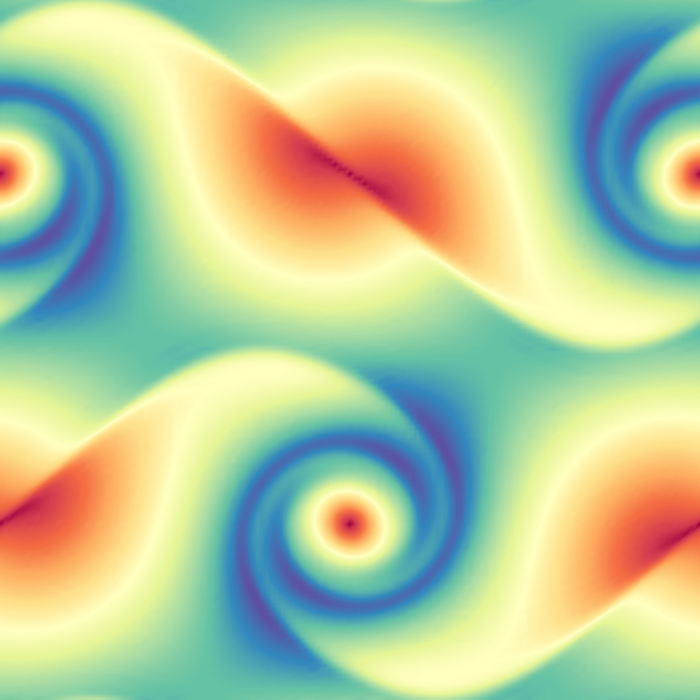

## <i class="fa fa-rocket"></i>&nbsp; Further Steps

30 minutes
advanced

---

<h3 class="panel-title"><i class="fa fa-check"></i>&nbsp; Lesson Objectives</h3>

<i class="fa fa-square-o"></i>&nbsp; Explore additional examples and miniapps. 
<i class="fa fa-square-o"></i>&nbsp; Write a simple simulation by extending existing examples. 
<i class="fa fa-square-o"></i>&nbsp; Learn more about MFEM and join the community.

<h3 class="panel-title"><i class="fa fa-info-circle"></i>&nbsp; Note</h3>

Please complete <a href="../start"><i class="fa fa-play-circle"></i>&nbsp; Getting Started</a>,
<a href="../fem"><i class="fa fa-book"></i> Finite Element Basics</a> and at least one of
the <a href="../examples"><i class="fa fa-gears"></i>&nbsp; Tour of MFEM Examples</a>,
<a href="../meshvis"><i class="fa fa-picture-o"></i>&nbsp; Meshing and Visualization</a>, or
<a href="../solvers"><i class="fa fa-tasks"></i>&nbsp; Solvers and Scalability</a>
pages before this lesson.

---

### <i class="fa fa-check-square-o"></i>&nbsp; Explore additional examples and miniapps
MFEM includes a number of well-documented [example codes and miniapps](https://mfem.org/examples)
that can be used as tutorials, as well as simple starting points for user applications.

These examples and miniapps are available in the `mfem/examples` and `mfem/miniapps`
subdirectories of your VS Code terminal.

The full list of examples is below. Feel free to explore any of them depending
on your interests, but we recommend starting with the ones marked with a ⭐.

- [Example 0](https://docs.mfem.org/html/ex0_8cpp_source.html) &mdash; Simplest MFEM example, good starting point for new users (nodal H1 FEM for the Poisson problem). ⭐
- [Example 1](https://docs.mfem.org/html/examples_2ex1_8cpp_source.html) &mdash; Nodal H1 FEM for the Poisson problem. ⭐
- [Example 2](https://docs.mfem.org/html/ex2_8cpp_source.html) &mdash; Vector FEM for linear elasticity.
- [Example 3](https://docs.mfem.org/html/ex3_8cpp_source.html) &mdash; Nedelec H(curl) FEM for the definite Maxwell problem.
- [Example 4](https://docs.mfem.org/html/ex4_8cpp_source.html) &mdash; Raviart-Thomas H(div) FEM for the grad-div problem.
- [Example 5](https://docs.mfem.org/html/ex5_8cpp_source.html) &mdash; Mixed pressure-velocity FEM for the Darcy problem.
- [Example 6](https://docs.mfem.org/html/ex6_8cpp_source.html) &mdash; Non-conforming adaptive mesh refinement (AMR) for the Poisson problem.
- [Example 7](https://docs.mfem.org/html/ex7_8cpp_source.html) &mdash; Screened Poisson equation on a surface (the unit sphere). ⭐
- [Example 8](https://docs.mfem.org/html/ex8_8cpp_source.html) &mdash; Discontinuous Petrov-Galerkin (DPG) for the Poisson problem.
- [Example 9](https://docs.mfem.org/html/ex9_8cpp_source.html) &mdash; Discontinuous Galerkin (DG) time-dependent advection. ⭐
- [Example 10](https://docs.mfem.org/html/ex10_8cpp_source.html) &mdash; Time-dependent implicit nonlinear elasticity. ⭐
- [Example 11](https://docs.mfem.org/html/ex11p_8cpp_source.html) &mdash; Parallel Laplace eigensolver.
- [Example 12](https://docs.mfem.org/html/ex12p_8cpp_source.html) &mdash; Parallel linear elasticity eigensolver.
- [Example 13](https://docs.mfem.org/html/ex13p_8cpp_source.html) &mdash; Parallel Maxwell eigensolver.
- [Example 14](https://docs.mfem.org/html/ex14_8cpp_source.html) &mdash; DG for the Poisson problem.
- [Example 15](https://docs.mfem.org/html/ex15_8cpp_source.html) &mdash; Dynamic AMR for Poisson with prescribed time-dependent source. ⭐
- [Example 16](https://docs.mfem.org/html/ex16_8cpp_source.html) &mdash; Time-dependent nonlinear heat equation.
- [Example 17](https://docs.mfem.org/html/ex17_8cpp_source.html) &mdash; DG for linear elasticity.
- [Example 18](https://docs.mfem.org/html/ex18_8cpp_source.html) &mdash; DG for the Euler equations.
- [Example 19](https://docs.mfem.org/html/ex19_8cpp_source.html) &mdash; Incompressible nonlinear elasticity.
- [Example 20](https://docs.mfem.org/html/ex20_8cpp_source.html) &mdash; Symplectic ODE integration.
- [Example 21](https://docs.mfem.org/html/ex21_8cpp_source.html) &mdash; AMR for linear elasticity.
- [Example 22](https://docs.mfem.org/html/ex22_8cpp_source.html) &mdash; Complex-valued linear systems. ⭐
- [Example 23](https://docs.mfem.org/html/ex23_8cpp_source.html) &mdash; Second-order in time wave equation. ⭐
- [Example 24](https://docs.mfem.org/html/ex24_8cpp_source.html) &mdash; Mixed finite element spaces and interpolators.
- [Example 25](https://docs.mfem.org/html/ex25_8cpp_source.html) &mdash; Perfectly Matched Layer (PML) for Maxwell equations.
- [Example 26](https://docs.mfem.org/html/ex26_8cpp_source.html) &mdash; Multigrid preconditioner for the Poisson problem. ⭐
- [Example 27](https://docs.mfem.org/html/ex27_8cpp_source.html) &mdash; Boundary conditions for the Laplace problem.
- [Example 28](https://docs.mfem.org/html/ex28_8cpp_source.html) &mdash; Constraints and sliding boundary conditions.
- [Example 29](https://docs.mfem.org/html/ex29_8cpp_source.html) &mdash; Solving PDEs on embedded surfaces.
- [Example 30](https://docs.mfem.org/html/ex30_8cpp_source.html) &mdash; Mesh preprocessing, resolving problem data.
- [Example 31](https://docs.mfem.org/html/ex31_8cpp_source.html) &mdash; Nedelec H(curl) FEM for the anisotropic definite Maxwell problem.
- [Example 32](https://docs.mfem.org/html/ex32p_8cpp_source.html) &mdash; Parallel Nedelec Maxwell eigensolver with anisotropic permittivity.
- [Example 33](https://docs.mfem.org/html/ex33_8cpp_source.html) &mdash; Nodal C0 FEM for the fractional Laplacian problem.
- [Example 34](https://docs.mfem.org/html/ex34_8cpp_source.html) &mdash; Source function from SubMesh.
- [Example 35](https://docs.mfem.org/html/ex35p_8cpp_source.html) &mdash; Port boundary condition from SubMesh.
- [Example 36](https://docs.mfem.org/html/ex36_8cpp_source.html) &mdash; High-order FEM for the obstacle problem.
- [Example 37](https://docs.mfem.org/html/ex37_8cpp_source.html) &mdash; Topology optimization.
- [Example 38](https://docs.mfem.org/html/ex38_8cpp_source.html) &mdash; Cut-surface and cut-volume integration.
- [Example 39](https://docs.mfem.org/html/ex39_8cpp_source.html) &mdash; Named mesh attributes.
- [Example 40](https://docs.mfem.org/html/ex40_8cpp_source.html) &mdash; Eikonal equation.
- [Example 41](https://docs.mfem.org/html/ex41_8cpp_source.html) &mdash; DG/CG IMEX time dependent advection-diffusion.

Most of these examples have a serial and a parallel version, illustrating the ease of transition and the minimal code changes between the two.

Many examples also have modifications that take advantage of optional third-party libraries such as [PETSc](https://docs.mfem.org/html/petsc_8hpp.html), [SLEPc](https://docs.mfem.org/html/slepc_8hpp.html), [SUNDIALS](https://docs.mfem.org/html/sundials_8hpp.html), [PUMI](https://docs.mfem.org/html/pumi_8hpp.html), [Ginkgo](https://docs.mfem.org/html/ginkgo_8hpp.html), and [HiOp](https://docs.mfem.org/html/hiop_8hpp.html).

Beyond the examples, a number of miniapps are available that are more representative of the advanced usage of the library in physics/application codes. Some of the included miniapps are:

- [Volta](https://docs.mfem.org/html/volta_8cpp_source.html) &mdash; Simple electrostatics simulation code.
- [Tesla](https://docs.mfem.org/html/tesla_8cpp_source.html) &mdash; Simple magnetostatics simulation code.

- [Maxwell](https://docs.mfem.org/html/electromagnetics_2maxwell_8cpp_source.html) &mdash; Transient electromagnetics simulation code.
- [Joule](https://docs.mfem.org/html/joule_8cpp_source.html) &mdash; Transient magnetics and Joule heating miniapp.
- [Navier](https://docs.mfem.org/html/classmfem_1_1navier_1_1NavierSolver.html#details) &mdash; Solver for the incompressible time-dependent Navier-Stokes equations.
- [Mesh Explorer](https://docs.mfem.org/html/mesh-explorer_8cpp_source.html) &mdash; Visualize and manipulate meshes.
- [Mesh Optimizer](https://docs.mfem.org/html/mesh-optimizer_8cpp_source.html) &mdash; Optimize high-order meshes.
- [Shaper](https://docs.mfem.org/html/shaper_8cpp_source.html) &mdash; Resolve material interfaces by mesh refinement.

- [Interpolation](https://docs.mfem.org/html/findpts_8cpp_source.html) &mdash; Evaluation of high-order finite element functions in physical space.
- [Overlapping Grids](https://github.com/mfem/mfem/blob/master/miniapps/gslib/schwarz_ex1.cpp) &mdash; Schwarz coupling of single- and multi-physics problems.
- [Extrapolation](https://docs.mfem.org/html/extrapolate_8cpp_source.html) &mdash; Finite element extrapolation solver.
- [Distance](https://docs.mfem.org/html/distance_8cpp_source.html) &mdash; Finite element distance solver.
- [Shifted Diffusion](https://docs.mfem.org/html/miniapps_2shifted_2diffusion_8cpp_source.html) &mdash; High-Order shifted boundary method for non body-fitted meshes.
- [Minimal Surface](https://docs.mfem.org/html/minimal-surface_8cpp_source.html) &mdash; Compute the minimal surface of a given mesh.
- [Display Basis](https://docs.mfem.org/html/display-basis_8cpp_source.html) &mdash; Visualize finite element basis functions.
- [LOR Transfer](https://docs.mfem.org/html/lor-transfer_8cpp_source.html) &mdash; Map functions between high-order and low-order-refined spaces.
- [SPDE](https://github.com/mfem/mfem/blob/master/miniapps/spde/generate_random_field.cpp) &mdash; Generate a Gaussian random field via the SPDE method; i.e., by solving a fractional PDE with random load.
- [Contact](https://github.com/mfem/mfem/blob/master/miniapps/tribol/contact-patch-test.cpp) &mdash; Mortar contact patch test for elasticity using the [Tribol](https://github.com/LLNL/Tribol) library.
- [Multidomain](https://github.com/mfem/mfem/blob/master/miniapps/multidomain/multidomain.cpp) &mdash; Multidomain and SubMesh demonstration Miniapp.
- [DPG](https://github.com/mfem/mfem/blob/master/miniapps/dpg) &mdash; Discontinuous Petrov-Galerkin (DPG) for various examples.

In addition, the sources for several external benchmark/proxy-apps built on top of MFEM are available:

- [Laghos](https://github.com/CEED/Laghos) &mdash; High-Order Lagrangian hydrodynamics miniapp.
- [Remhos](https://github.com/CEED/Remhos) &mdash; High-Order advection remap miniapp.
- [Mulard](https://www.osti.gov/servlets/purl/1092516) &mdash; Multigroup thermal radiation diffusion miniapp.

A handful of "toy" miniapps of a less serious nature demonstrate the flexibility of MFEM (and provide a bit of fun):

- [Automata](https://docs.mfem.org/html/automata_8cpp_source.html) &mdash; Model of a simple cellular automata.
- [Life](https://docs.mfem.org/html/life_8cpp_source.html) &mdash; Model of Conway's game of life.

- [Lissajous](https://docs.mfem.org/html/lissajous_8cpp_source.html) &mdash; Spinning optical illusion.
- [Mandel](https://docs.mfem.org/html/mandel_8cpp_source.html) &mdash; Fractal visualization with AMR.
- [Mondrian](https://docs.mfem.org/html/mondrian_8cpp_source.html) &mdash; Convert any image to an AMR mesh.
- [Rubik](https://docs.mfem.org/html/rubik_8cpp_source.html) &mdash; Interactive Rubik's Cube&trade; puzzle.
- [Snake](https://docs.mfem.org/html/snake_8cpp_source.html) &mdash; Model of the Rubik's Snake&trade; puzzle.
- [Spiral](https://docs.mfem.org/html/spiral_8cpp_source.html) &mdash; Animation of a spiral cone toy.

---

### <i class="fa fa-check-square-o"></i>&nbsp; Write a simple simulation
Modify the miniapps and example codes to create a simple simulation of your
own. You can edit the source code and rebuild the binary simply
with `make`.

For example, you can solve a steady-state heat conduction problem in 2D and 3D
using the `shaper` miniapp (modified for the cable shape) to define the mesh and
`ex1` or `ex1p` to solve it (modified to include separate coefficients for air
and cable).

Please consult the MFEM [code documentation](https://mfem.org/dox/) and
don't hesitate to ask if you have any implementation questions.

<h3 class="panel-title"><i class="fa fa-trophy"></i>&nbsp; We want to see your creativity!</h3>

Post your visualization images in the <a href="https://radiuss-llnl.slack.com/archives/C03T2DQCSC8">Slack channel</a> for a chance to be featured on MFEM's <a href="http://mfem.org/gallery/">gallery page</a>!

---

### <i class="fa fa-check-square-o"></i>&nbsp; Install MFEM + GLVis on your own machine

Download MFEM from [mfem.org/download](https://mfem.org/download) or clone it
from [GitHub](https://github.com/mfem/mfem/) and follow the building
instructions here: [mfem.org/building](https://mfem.org/building).

You should be able to download and install the serial version in 10 minutes.
The parallel version of MFEM requires installing _hypre_ and METIS (see the [building instructions](https://mfem.org/building/#parallel-mpi-version-of-mfem)).

Alternatively, if you already have Spack, you can build with `spack install mfem glvis`.

With your own installation, you can explore additional topics not covered in this
tutorial such as:

- [Partial Assembly](../../howto/assembly_levels/) and the [Finite Element Operator Decomposition](../../performance#finite-element-operator-decomposition).

- [GPU Support](../../gpu-support/) on NVIDIA and AMD hardware.

- Integrations with [PETSc](https://docs.mfem.org/html/petsc_8hpp.html), [SUNDIALS](https://docs.mfem.org/html/sundials_8hpp.html), [SuperLU](https://docs.mfem.org/html/superlu_8hpp.html), [libCEED](https://github.com/CEED/libCEED), [PUMI](https://docs.mfem.org/html/pumi_8hpp.html), [Ginkgo](https://docs.mfem.org/html/ginkgo_8hpp.html), [HiOp](https://docs.mfem.org/html/hiop_8hpp.html), and more.

- Python support with the [PyMFEM](https://github.com/mfem/PyMFEM) wrapper and Jupyter notebooks [{style="display:inline;margin:0"}](https://colab.research.google.com/github/GLVis/pyglvis/blob/main/examples/ex1.ipynb "Python Jupyter notebook").

---

### <i class="fa fa-check-square-o"></i>&nbsp; Visit the MFEM website

For more information about MFEM, visit the website, [mfem.org](https://mfem.org), including the

- [Features](https://mfem.org/features),
- [Examples](https://mfem.org/examples/),
- [Publications](https://mfem.org/publications/), and
- [Finite Elements](https://mfem.org/fem/), pages.

Review the [Videos](https://mfem.org/videos) for recordings from MFEM [seminars](https://mfem.org/seminar/), [workshops](https://mfem.org/workshop/), and conference presentations:

You may also be interested in visiting the websites of the related [GLVis](https://glvis.org),
[CEED](https://ceed.exascaleproject.org), and [BLAST](https://computing.llnl.gov/projects/blast) projects.

---

### <i class="fa fa-check-square-o"></i>&nbsp; Join the community

If MFEM looks exciting to you, please join the [community on GitHub](https://github.com/mfem/mfem/)
and help us make it better! 🚀

We welcome contributions and feedback at all levels: bugfixes; code improvements;
simplifications; new mesh, discretization, or solver capabilities; improved documentation;
new examples and miniapps; HPC performance improvements; etc.
See [CONTRIBUTING.md](https://github.com/mfem/mfem/blob/master/CONTRIBUTING.md) for more details.

You can contact the MFEM team by posting to the GitHub [issue tracker](https://github.com/mfem/mfem/issues)
or at [mfem-dev@llnl.gov](mailto:mfem-dev@llnl.gov).

---

<h3 class="panel-title"><i class="fa fa-thumbs-up"></i>&nbsp; Thank you!</h3>

Thank you for participating in the MFEM tutorial. Please let us know if you have any questions in the <a href="https://radiuss-llnl.slack.com/archives/C03T2DQCSC8">Slack channel</a>.

---

Back to the [MFEM tutorial page](index.md)

