# MFEM Videos

A collection of MFEM-related videos, including recorded talks from the MFEM workshops, conferences, and other presentations.

## FEM@LLNL Seminars

---

#### Łukasz Kaczmarczyk (University of Glasgow)
#### *HMixed Finite Element Formulation for Solid Mechanics Problems*
##### **April 8, 2025** | [FEM@LLNL Seminar Series](https://mfem.org/seminar)
<a class="youtube" href="https://youtu.be/fdv_pi4NYlw"></img></a>

During the talk, I will focus on the implementation of the mixed finite element method for small-strain elasticity and its extension to large-strain nearly incompressible problems. The finite element formulation includes four independently approximated fields: stresses, logarithmic stretches, rotation vectors, and displacements. The first two are associated with conserving linear and angular momentum, respectively. The other two fields are associated with the constitutive equation and the consistency between displacements and deformation. An exponential map establishes the relationship between the rotation vectors and the rotation tensor. The stresses are approximated in the H-div space, while the remaining three fields are in the L2 space. This formulation results in a very sparse system of equations that can be efficiently solved in parallel using hybridisation with a block solver, thereby enabling highly scalable and robust solvers. The system hybridisation involves 'breaking' the H-div space, such that continuity of normal fluxes, i.e., tractions, is no longer enforced a priori, and introducing a hybridised field on mesh skeleton faces and contact surfaces. Such a field acts as a kinematic Lagrange multiplier enforcing continuity of normal tractions. Moreover, the hybridised Lagrange multiplier field is conveniently used to enforce contact conditions. Since hybridised Lagrange multipliers are approximated on skeleton faces and are interpreted as displacements, this leads to a dual mixed formulation of contact. Moreover, since continuity of the displacement field is enforced in a weak sense by continuity of fluxes, this enables a natural methodology to simulate cracks, such that the mesh topology does not change while the crack is propagating. Furthermore, since the H-div space provides traces of fluxes on faces, the mixed element enables efficient calculation of face crack release energy. Since this methodology enables crack propagation on fixed mesh technology, and if it is based on an energy-based crack propagation criterion, it inherits the robustness of the phase field while being as efficient as methods which resolves crack discreetly. In an algebraic sense, since all fields in the interior become fields in the L2 space, and fields on skeleton faces are in H1/2, the system of equations is extremely sparse and can be solved using a Schur complement, eliminating interior fields. The resulting Schur matrix is extremely sparse and consists of five blocks in each row in 3D and four blocks in 2D. This structure resembles the matrix structure emerging from the finite volume method on hexahedral or quadrilateral elements, making it suitable for multigrid solvers and exploitable in parallel implementations on GPUs.

---

#### Stefan Turek (Technical University Dortmund)
#### *Hardware-oriented Numerics for Massively Parallel & Low Precision Accelerator Hardware and Application to "large scale" CFD Problems*
##### **March 11, 2025** | [FEM@LLNL Seminar Series](https://mfem.org/seminar)
<a class="youtube" href="https://youtu.be/8nmblHRXsos"></img></a>

The aim of this talk is to present and to discuss how modern High Performance Computing (HPC) facilities including massively parallel hardware with millions of cores together with very fast, but lower precision accelerator hardware can be exploited via techniques from hardware-oriented Numerics for PDEs so that a very high computational and numerical efficiency can be obtained. Here, as prototypical large scale PDE-based applications, we concentrate on nonstationary flow simulations with hundreds of millions or even billions of spatial unknowns in long-time computations with many thousands up to millions of time steps. For the expected huge computational resources in the coming exascale era, such spatially discretized problems which typically are treated sequentially in time, that means one time step after the other, are still too small to exploit adequately the huge number of compute nodes, resp., cores so that further parallelism, for instance w.r.t. time, might get necessary. In this context, we discuss how "parallel-in-space global-in-time" Newton-Krylov Multigrid approaches can be designed which allow a much higher degree of parallelism. Moreover, to exploit current accelerator hardware in lower precision (for instance, GPUs), that means mainly working in single or even half precision, we discuss the concept of "prehandling" (in contrast to "preconditioning") of the corresponding ill-conditioned systems of equations, for instance arising from Poisson-like problems in incompressible flow simulations. Here, we assume a transformation into an equivalent linear system with similar sparsity but with much lower condition numbers so that the use of lower precision hardware might get feasible. In our talk, we provide for both aspects numerical results as "proof-of-concept" and discuss the challenges, particularly for large scale flow problems.

---

#### Patrick Zulian (Università della Svizzera italiana / UniDistance Suisse)
#### *Immersed Domain Approach for Fluid-Structure-Contact Interaction Problems*
##### **February 18, 2025** | [FEM@LLNL Seminar Series](https://mfem.org/seminar)
<a class="youtube" href="https://youtu.be/8YOEUaD8jdg"></img></a>

The study of fluid-structure interaction (FSI) has gained significant traction in recent decades, with applications spanning various disciplines, including geophysics and biomedicine. In FSI, computational techniques are defined by the choice of discrete domain representation, falling into two main categories: "boundary-fitted" or "non-boundary-fitted" meshes. Boundary-fitted methods explicitly represent the fluid-solid interface and deform the fluid mesh in tandem with the solid mesh, typically within an arbitrary Eulerian-Lagrangian (ALE) framework. While these methods offer high accuracy, substantial solid deformations can severely distort the fluid mesh, leading to numerical problems and the need for remeshing. Non-boundary-fitted methods, on the other hand, maintain separate and non-matching fluid and structure meshes. The structure is described within a Lagrangian framework, while the fluid is typically described in a fully Eulerian framework. This flexibility demands higher mesh resolution to maintain comparable accuracy, necessitating the consideration of parallel computing. We present an immersed domain approach for the numerical solution of fluid-structure-contact-interaction (FSCI) problems. Within the overlapping volume, the fluid and structure are coupled, while mortar-based techniques are employed to couple different structures in contact on their surfaces. Specifically, we utilize dual Lagrange multipliers, which, within the nonlinear solution procedure, enable discrete field transfer using standard matrix-vector multiplication or storage of the linearized system of equations in a single matrix, thus facilitating algebraic multigrid strategies. We illustrate our general algorithmic framework and our primary parallel computing tools and discuss two studies conducted using variations of our approach. The first study simulates the complete dynamics of a bio-prosthetic heart valve. We model the interactions between blood and the valve, blood and the aortic wall, and leaflets during valve closure. This solution strategy is specifically designed to address the contact problem using non-smooth methods, with solid and structure sub-problems solved in a segregated and iterative manner. The second study simulates a diaphragm pump and the contact interaction between an elastic valve displaced by the fluid and the valve seats. This approach is monolithic, and penalty methods are employed to impose contact conditions.

---

#### Svetlana Tokareva (Los Alamos National Laboratory)
#### *A High-Order Matrix-Free Finite Element Method for Hyperbolic Problems*
##### **January 14, 2025** | [FEM@LLNL Seminar Series](https://mfem.org/seminar)
<a class="youtube" href="https://youtu.be/xy_c_NYDXb8"></img></a>

Many multiphysics applications require high-order, physically consistent and computationally efficient discretizations of hyperbolic PDEs. In this talk, we will present a mass-matrix-free finite element (MF-FE) scheme, which provides an explicit and arbitrary high order approximation of the smooth solutions of the hyperbolic PDEs both in space and time. The design of the scheme allows for an efficient diagonalization of the mass matrix without any loss of accuracy. This is achieved by coupling the FEM formulation [[1]](https://doi.org/10.1016/j.camwa.2018.05.009) with a Deferred Correction (DeC) type method [[2]](https://global-sci.org/intro/article_detail/jcm/8648.html) for the discretization in time. The advantage of such a matrix-free approach consists in preserving a compact approximation stencil even at high orders, which reduces the computational cost compared to classical finite element techniques and provides potential benefit for exascale computing on future computer architectures. In this talk we focus on the staggered grid MF-FEM (SG MF-FEM) scheme for the Lagrangian hydrodynamics. We will present the simulation results for several challenging benchmark problems. Finally, will discuss how structure-preserving properties (such as positivity and preservation of local
bounds) of the proposed MF-FE method can be enforced using convex limiting for blending the high-order and low-order element residuals [[3]](https://doi.org/10.1016/j.cma.2018.11.036).

---

#### Martin Kronbichler (Ruhr University Bochum)
#### *Efficient Simulation of Fluid Flows using High-Order Finite Elements with the deal.II Library*
##### **December 17, 2024** | [FEM@LLNL Seminar Series](https://mfem.org/seminar)
<a class="youtube" href="https://youtu.be/46xUzWbU2GI"></img></a>

This talk will present research on high-order discontinuous Galerkin methods for incompressible fluid flow. Starting from a formulation that enforces the inter-element continuity of the normal velocities and point-wise divergence-free velocities, akin to H(div) finite element spaces, we look into the efficient execution of the resulting discrete formulations. For high-order methods, matrix-free operator evaluation based on sum factorization is highly attractive. It is aligned with the properties of modern multi-core processors and GPUs: By replacing memory-intensive sparse matrices of traditional solvers by redundant computations of integrals, considerably higher performance can be reached because of a better balance between arithmetic work and memory transfer. The talk will look into the use of these techniques for iterative solvers arising from time integration with splitting methods, including both the pressure Poisson equation solved with multigrid preconditioners, Helmholtz-like equations with diagonal or block-diagonal preconditioners, and the H(div)-enforcing penalty step with block-wise inverses based on the fast diagonalization method combined with the Sherman-Morrison-Woodbury formula. The application efficiency will be analyzed and the general-purpose implementation of the algorithms within the deal.II finite element library.

---

#### Pablo Brubeck (University of Oxford)
#### *FIAT: From Basis Functions to Efficient Finite Element Solvers*
##### **November 12, 2024** | [FEM@LLNL Seminar Series](https://mfem.org/seminar)
<a class="youtube" href="https://youtu.be/QJW-fduOKBI"></img></a>

The FInite element Automatic Tabulator (FIAT) is a powerful Python library for tabulating basis functions. In this talk, we present two major recent developments in FIAT. First, we have extended the FIAT abstraction to natively support macroelements. Macroelements offer conforming discretizations with highly desirable properties, such as divergence-free vector fields, and divergence-conforming symmetric tensors with low-order polynomial degrees. Elements implemented include the Hsieh-Clough-Tocher macroelement for biharmonic problems, the divergence-free, H1-conforming, inf-sup stable Guzmán-Neilan macroelement for Stokes, and the Johnson-Mercier macroelement for strongly-symmetric, H(div)-conforming stresses in solid mechanics. We also improved the performance of tabulation and quadrature for simplicial high-order elements, and introduced novel basis functions, leading to solvers with better complexity in polynomial degree. Inspired by the fast diagonalization method, we define new degrees of freedom on simplices as moments against a numerically-computed orthogonal polynomial basis to decouple element interiors in the stiffness matrix. We exploit this decoupling in a domain decomposition method with vertex or edge subdomains on the interface degrees of freedom, and Jacobi relaxation for the interior degrees of freedom. This enables fast solvers for high-order discretizations of the Riesz maps of the spaces of the de Rham complex (Lagrange, Nédélec, Raviart-Thomas, and Brezzi-Douglas-Marini). For each case, we illustrate the performance gains with numerical examples in Firedrake.

---

#### Denis Ridzal (Sandia National Laboratories)
#### *R-Adaptive Mesh Optimization to Enhance Finite Element Basis Compression*
##### **October 15, 2024** | [FEM@LLNL Seminar Series](https://mfem.org/seminar)

<a class="youtube" href="https://www.youtube.com/watch?v=4t7QOuPK-8g"></img></a>

Modern computing systems are capable of exascale calculations. While these systems continue to grow in processing power, the available system memory has not increased commensurately. A predominant approach to limit the memory usage in large-scale applications is to exploit the abundant processing power and continually recompute many low-level simulation quantities, rather than storing them. However, this approach can adversely impact the throughput of the simulation and diminish the benefits of modern computing architectures. We present two novel contributions to reduce the memory burden while maintaining performance in simulations based on finite element discretizations. The first contribution develops dictionary-based data compression schemes that detect and exploit the structure of the discretization, due to redundancies across the finite element mesh. These schemes are shown to reduce the memory requirements of key computational kernels by more than 99% on meshes with large numbers of nearly identical mesh cells. For applications where this structure does not exist, our second contribution leverages a recently developed augmented Lagrangian sequential quadratic programming algorithm to enable r-adaptive mesh optimization, with the goal of enhancing redundancies in the mesh. Numerical results demonstrate the effectiveness of the proposed methods to detect, exploit and enhance mesh structure on examples inspired by large-scale applications.

---

#### Daniele Panozzo (Courant Institute, NYU)
#### *Geometric Predicates for Unconditionally Robust Elastodynamics Simulation*
##### **October 1, 2024** | [FEM@LLNL Seminar Series](https://mfem.org/seminar)
<a class="youtube" href="https://youtu.be/LfuheDyppXU"></img></a>

The numerical solution of partial differential equations (PDE) is ubiquitously used for physical simulation in scientific computing and engineering. Ideally, a PDE solver should be opaque: the user provides as input the domain boundary, boundary conditions, and the governing equations, and the code returns an evaluator that can compute the value of the solution at any point of the input domain. This is surprisingly far from being the case for all existing open-source or commercial software, despite the research efforts in this direction and the large academic and industrial interest. To a large extent, this is due to lack of robustness in geometric algorithms used to create the discretization, detect collisions, and evaluate element validity. I will present the incremental potential contact simulation paradigm, which provides strong robustness guarantees in simulation codes, ensuring, for the first time, validity of the trajectories accounting for floating point rounding errors over an entire elastodynamic simulation with contact. A core part of this approach is the use of a conservative line-search to check for collisions between geometric primitives and for ensuring validity of the deforming elements over linear trajectories. I will discuss both problems in depth, showing that SOTA approaches favor numerical efficiency but are unfortunately not robust to floating point rounding, leading to major failures in simulation. I will then present an alternative approach based on judiciously using rational and interval types to ensure provable correctness, while keeping a running time comparable with non-conservative methods. To conclude, I will discuss a set of applications enabled by this approach in microscopy and biomechanics, including traction force estimation on a live zebrafish and efficient modeling and simulation of fibrous materials.

---

#### Rubén Sevilla (Swansea University)
#### *Mesh Generation and Adaptation using Green AI*
##### **September 17, 2024** | [FEM@LLNL Seminar Series](https://mfem.org/seminar)

<a class="youtube" href="https://www.youtube.com/watch?v=2_bLfUg_Ok0"></img></a>

Most methods used to solve partial differential equations require creating a mesh that represents the model's geometry. Today, unstructured mesh technology is widely used, allowing three-dimensional meshes with hundreds of millions of elements to be generated in just a few minutes. However, when optimising a design, many simulations are needed for different operating conditions and geometric configurations. Creating the best mesh for each setup becomes time-consuming due to the requirement of excessive human intervention and expertise. This talk will cover our recent work on using artificial intelligence to predict near-optimal meshes suitable for simulations. The main idea is to take advantage of the large amount of data that already exists in the industry to improve the selection of a suitable spacing function, including anisotropic spacing. The proposed approach aims to use knowledge from previous simulations to guide the mesh generation process. I will assess the proposed method based on the accuracy of the predictions, efficiency, and environmental impact. This includes considering the carbon footprint and energy consumption of the computations required for a parametric CFD analysis under different flow conditions and angles of attack. For transient problems, the use of high order methods provides several advantages due to the low dissipation and dispersion errors associated to these schemes. An attractive approach to simulate these problems is to incorporate degree adaptive schemes to enhance the approximation only where needed. In this talk I will also present our recent work on using artificial intelligence to aid a degree adaptive process.

---

#### Esteban Ferrer and David Huergo (Universidad Politécnica de Madrid)
#### *New Avenues in High Order Fluid Dynamics*
##### **September 3, 2024** | [FEM@LLNL Seminar Series](https://mfem.org/seminar)

<a class="youtube" href="https://www.youtube.com/watch?v=VM7wMq7luJU"></img></a>

We present the latest developments of our High-Order Spectral Element Solver (HORSES3D), an open source high-order discontinuous Galerkin framework capable of solving a variety of flow applications, including compressible flows (with or without shocks), incompressible flows, various RANS and LES turbulence models, particle dynamics, multiphase flows, and aeroacoustics [[1](https://arxiv.org/abs/2206.09733)]. Recent developments allow us to simulate challenging multiphysics including turbulent flows, multiphase and moving bodies, using local h and p-adaption. In addition, we present recent work that couples Machine Learning and reinforcement learning techniques with high order simulations.

---

#### Patrick Farrell (University of Oxford)
#### *Designing conservative and accurately dissipative numerical integrators in time*
##### **July 30, 2024** | [FEM@LLNL Seminar Series](https://mfem.org/seminar)

<a class="youtube" href="https://www.youtube.com/watch?v=Cp8bhpSIia4"></img></a>

Numerical methods for the simulation of transient systems with structure-preserving properties are known to exhibit greater accuracy and physical reliability, in particular over long durations. These schemes are often built on powerful geometric ideas for broad classes of problems, such as Hamiltonian or reversible systems. However, there remain difficulties in devising higher-order- in-time structure-preserving discretizations for nonlinear problems, and in conserving non-polynomial  invariants. In this work we propose a new, general framework for the construction of structure-preserving timesteppers via finite elements in time and the systematic introduction of auxiliary variables. The framework reduces to Gauss methods where those are structure-preserving, but extends to generate arbitrary-order structure-preserving schemes for nonlinear problems, and allows for the construction of schemes that conserve multiple higher-order invariants. We demonstrate the ideas by devising novel schemes that exactly conserve all known invariants of the Kepler and Kovalevskaya problems, arbitrary-order schemes for the compressible Navier–Stokes equations that conserve mass, momentum, and energy, and provably dissipate entropy, and multi-conservative schemes for the Benjamin-Bona-Mahony equation.

---

#### Gonzalo de Diego (Courant Institute)
#### *Numerical Solvers for Viscous Contact Problems in Glaciology*
##### **May 6, 2024** | [FEM@LLNL Seminar Series](https://mfem.org/seminar)

<a class="youtube" href="https://www.youtube.com/watch?v=qrvOCgSORqY">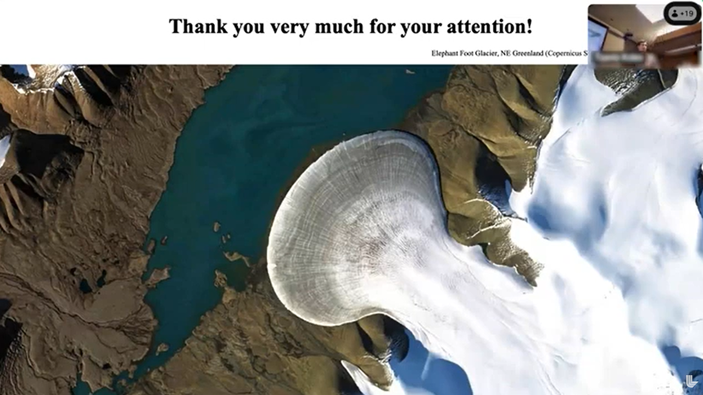</img></a>

Viscous contact problems are time-dependent viscous flow problems where the fluid is in contact with a solid surface from which it can detach and reattach. Over sufficiently long timescales, ice is assumed to flow like a viscous fluid with a nonlinear rheology. Therefore, certain phenomena in glaciology, like the formation of subglacial cavities in the base of an ice sheet or the dynamics of marine ice sheets (continental ice sheets that slide into the ocean and go afloat at a grounding line, detaching from the bedrock), can be modelled as viscous contact problems. In particular, these problems can be described by coupling the Stokes equations with contact boundary conditions to free boundary equations that evolve the ice domain in time. In this talk, I will describe the difficulties that arise when attempting to solve this system numerically and I will introduce a method that is capable of overcoming them.

---

#### Nat Trask (University of Pennsylvania)
#### *A Data Driven Finite Element Exterior Calculus*
##### **April 2, 2024** | [FEM@LLNL Seminar Series](https://mfem.org/seminar)

<a class="youtube" href="http://youtube.com/watch?v=7B8GotJP_Y0"></img></a>

Despite the recent flurry of work employing machine learning to develop surrogate models to accelerate scientific computation, the "black-box" underpinnings of current techniques fail to provide the verification and validation guarantees provided by modern finite element methods. In this talk we present a data-driven finite element exterior calculus for developing reduced-order models of multiphysics systems when the governing equations are either unknown or require closure. The framework employs deep learning architectures typically used for logistic classification to construct a trainable partition of unity which provides notions of control volumes with associated boundary operators. This alternative to a traditional finite element mesh is fully differentiable and allows construction of a discrete de Rham complex with a corresponding Hodge theory. We demonstrate how models may be obtained with the same robustness guarantees as traditional mixed finite element discretization, with deep connections to contemporary techniques in graph neural networks. For applications developing digital twins where surrogates are intended to support real time data assimilation and optimal control, we further develop the framework to support Bayesian optimization of unknown physics on the underlying adjacency matrices of the chain complex. By framing the learning of fluxes via an optimal recovery problem with a computationally tractable posterior distribution, we are able to develop models with intrinsic representations of epistemic uncertainty.

---

#### William Moses (University of Illinois Urbana-Champaign)
#### *Supercharging Programming Through Compiler Technology*
##### **March 14, 2024** | [FEM@LLNL Seminar Series](https://mfem.org/seminar)

<a class="youtube" href="https://www.youtube.com/watch?v=EZrICuXp8FE">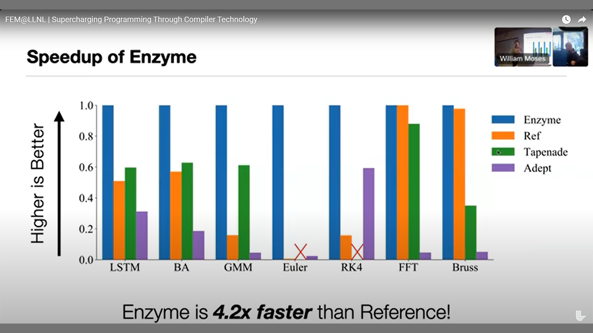</img></a>

The decline of Moore's law and an increasing reliance on computation has led to an explosion of specialized software packages and hardware architectures. While this diversity enables unprecedented flexibility, it also requires domain-experts to learn how to customize programs to efficiently leverage the latest platform-specific API's and data structures, instead of working on their intended problem. Rather than forcing each user to bear this burden, I propose building high-level abstractions within general-purpose compilers that enable fast, portable, and composable programs to be automatically generated. This talk will demonstrate this approach through compilers that I built for two domains: automatic differentiation and parallelism. These domains are critical to both scientific computing and machine learning, forming the basis of neural network training, uncertainty quantification, and high-performance computing. For example, a researcher hoping to incorporate their climate simulation into a machine learning model must also provide a corresponding derivative simulation. My compiler, Enzyme, automatically generates these derivatives from existing computer programs, without modifying the original application. Moreover, operating within the compiler enables Enzyme to combine differentiation with program optimization, resulting in asymptotically and empirically faster code. Looking forward, this talk will also touch on how this domain-agnostic compiler approach can be applied to new directions, including probabilistic programming.

---

#### Sungho Lee (University of Memphis)
#### *LAGHOST: Development of Lagrangian High-Order Solver for Tectonics*
##### **March 5, 2024** | [FEM@LLNL Seminar Series](https://mfem.org/seminar)

<a class="youtube" href="https://www.youtube.com/watch?v=7APgvXM7xH0"></img></a>

Long-term geological and tectonic processes associated with large deformation highlight the importance of using a moving Lagrangian frame. However, modern advancements in the finite element method, such as MPI parallelization, GPU acceleration, high-order elements, and adaptive grid refinement for tectonics based on this frame, have not been updated. Moreover, the existing solvers available in open access suffer from limited tutorials, a poor user manual, and several dependencies that make model building complex. These limitations can discourage both new users and developers from utilizing and improving these models. As a result, we are motivated to develop a user-friendly, Lagrangian thermo-mechanical numerical model that incorporates visco-elastoplastic rheology to simulate long-term tectonic processes like mountain building, mantle convection and so on. We introduce an ongoing project called LAGHOST (Lagrangian High-Order Solver for Tectonics), which is an MFEM-based tectonic solver. LAGHOST expands the capabilities of MFEM's LAGHOS mini-app. Currently, our solver incorporates constitutive equation, body force, mass scaling, dynamic relaxation, Mohr-Coulomb plasticity, plastic softening, Winkler foundation, remeshing, and remapping. To evaluate LAGHOST, we conducted four benchmark tests. The first test involved compressing an elastic box at a constant velocity, while the second test focused on the compaction of a self-weighted elastic column. To enable larger time-step sizes and achieve quasi-static solutions in the benchmarks, we introduced a fictitious density and implemented dynamic relaxation. This involved scaling the density factor and introducing a portion of force component opposing the previous velocity direction at nodal points. Our results exhibited good agreement with analytical solutions. Subsequently, we incorporated Mohr-Coulomb plasticity, a reliable model for predicting rock failure, into LAGHOST. We revisited the elastic box benchmark and considered plastic materials. By considering stress correction arising from plastic yielding, we confirmed that the updated solution from elastic guess aligned with the analytical solution. Furthermore, we applied LAGHOST to simulate the evolution of a normal fault, a significant tectonic phenomenon. To model normal fault evolution, we introduced strain softening on cohesion as the dominant factor based on geological evidence. Our simulations successfully captured the normal fault's evolution, with plastic strain localizing at shallow depths before propagating deeper. The fault angle reached approximately 60 degrees, in line with the Mohr-Coulomb failure theory.

---

#### Kevin Chung (LLNL)
#### *Data-Driven DG FEM Via Reduced Order Modeling and Domain Decomposition*
##### **February 6, 2024** | [FEM@LLNL Seminar Series](https://mfem.org/seminar)

<a class="youtube" href="https://www.youtube.com/watch?v=CfRSzUOM0Ug"></img></a>

Numerous cutting-edge scientific technologies originate at the laboratory scale, but transitioning them to practical industry applications can be a formidable challenge. Traditional pilot projects at intermediate scales are costly and time-consuming. Alternatives such as E-pilots can rely on high-fidelity numerical simulations, but even these simulations can be computationally prohibitive at larger scales. To overcome these limitations, we propose a scalable, component reduced order model (CROM) method. We employ Discontinuous Galerkin Domain Decomposition (DG-DD) to decompose the physics governing equation for a large-scale system into repeated small-scale unit components. Critical physics modes are identified via proper orthogonal decomposition (POD) from small-scale unit component samples. The computationally expensive, high-fidelity discretization of the physics governing equation is then projected onto these modes to create a reduced order model (ROM) that retains essential physics details. The combination of DG-DD and POD enables ROMs to be used as building blocks comprised of unit components and interfaces, which can then be used to construct a global large-scale ROM without data at such large scales. This method is demonstrated on the Poisson and Stokes flow equations, showing that it can solve equations about 15−40 times faster with only ∼ 1% relative error, even at scales 1000 times larger than the unit components. This research is ongoing, with efforts to apply these methods to more complex physics such as Navier-Stokes equation, highlighting their potential for transitioning laboratory-scale technologies to practical industrial use.

---

#### Brian Young
#### *A Full-Wave Electromagnetic Simulator for Frequency-Domain S-Parameter Calculations*
##### **January 9, 2024** | [FEM@LLNL Seminar Series](https://mfem.org/seminar)

<a class="youtube" href="https://www.youtube.com/watch?v=uknQqYw-d0o"></img></a>

An open-source and free full-wave electromagnetic simulator is presented that addresses the engineering community’s need for the calculation of frequency-domain S-parameters. Two-dimensional port simulations are used to excite the 3D space and to extract S-parameters using modal projections. Matrix solutions are performed using complex computations. Features enabled by the MFEM library include adaptive mesh refinement, arbitrary order finite elements, and parallel processing using MPI. Implementation details are presented along with sample results and accuracy demonstrations.

---

#### Jesse Chan (Rice University)
#### *High order positivity-preserving entropy stable discontinuous Galerkin discretizations*
##### **December 5, 2023** | [FEM@LLNL Seminar Series](https://mfem.org/seminar)

<a class="youtube" href="https://www.youtube.com/watch?v=x33D171lXjc"></img></a>

High order discontinuous Galerkin (DG) methods provide high order accuracy and geometric flexibility, but are known to be unstable when applied to nonlinear conservation laws whose solutions exhibit shocks and under-resolved solution features. Entropy stable schemes improve robustness by ensuring that physically relevant solutions satisfy a semi-discrete cell entropy inequality independently of numerical resolution and solution regularization while retaining formal high order accuracy. In this talk, we will review the construction of entropy stable high order discontinuous Galerkin methods and describe approaches for enforcing that solutions are "physically relevant" (i.e., the thermodynamic variables remain positive).

---

#### Youngsoo Choi (LLNL)
#### *Physics-guided interpretable data-driven simulations*
##### **November 14, 2023** | [FEM@LLNL Seminar Series](https://mfem.org/seminar)

<a class="youtube" href="https://www.youtube.com/watch?v=nWOC_BR3x-8">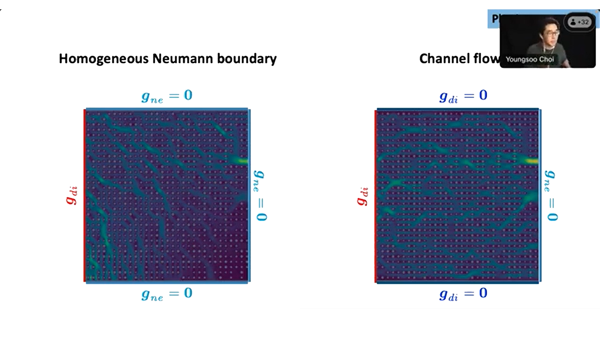</img></a>

A computationally demanding physical simulation often presents a significant impediment to scientific and technological progress. Fortunately, recent advancements in machine learning (ML) and artificial intelligence have given rise to data-driven methods that can expedite these simulations. For instance, a well-trained 2D convolutional deep neural network can provide a 100,000-fold acceleration in solving complex problems like Richtmyer-Meshkov instability [[1](https://arxiv.org/abs/2208.11477)]. However, conventional black-box ML models lack the integration of fundamental physics principles, such as the conservation of mass, momentum, and energy. Consequently, they often run afoul of critical physical laws, raising concerns among physicists. These models attempt to compensate for the absence of physics information by relying on vast amounts of data. Additionally, they suffer from various drawbacks, including a lack of structure-preservation, computationally intensive training phases, reduced interpretability, and susceptibility to extrapolation issues. To address these shortcomings, we propose an approach that incorporates physics into the data-driven framework. This integration occurs at different stages of the modeling process, including the sampling and model-building phases. A physics-informed greedy sampling procedure minimizes the necessary training data while maintaining target accuracy [[2](https://arxiv.org/abs/2204.12005)]. A physics-guided data-driven model not only preserves the underlying physical structure more effectively but also demonstrates greater robustness in extrapolation compared to traditional black-box ML models. We will showcase numerical results in areas such as hydrodynamics [[3](https://arxiv.org/abs/2104.11404),[4](https://arxiv.org/abs/2009.11990)], particle transport [[5](https://doi.org/10.1016/j.jcp.2020.109845)], plasma physics, pore-collapse, and 3D printing to highlight the efficacy of these data-driven approaches. The advantages of these methods will also become apparent in multi-query decision-making applications, such as design optimization [[6](https://doi.org/10.1016/j.cma.2021.113813),[7](https://doi.org/10.1016/j.jcp.2020.109787)].

#### Ben Southworth (Los Alamos National Laboratory)
#### *Superior discretizations and AMG solvers for extremely anisotropic diffusion via hyperbolic operators*
##### **October 17, 2023** | [FEM@LLNL Seminar Series](https://mfem.org/seminar)

<a class="youtube" href="https://www.youtube.com/watch?v=MZ9qPFbWw68"></img></a>

Heat conduction in magnetic confinement fusion can reach anisotropy ratios of 10^9-10^10, and in complex problems the direction of anisotropy may not be aligned with (or is impossible to align with) the spatial mesh. Such problems pose major challenges for both discretization accuracy and efficient implicit linear solvers. Although the underlying problem is elliptic or parabolic in nature, we argue that the problem is better approached from the perspective of hyperbolic operators. The problem is posed in a directional gradient first order formulation, introducing a directional heat flux along magnetic field lines as an auxiliary variable. We then develop novel continuous and discontinuous discretizations of the mixed system, using stabilization techniques developed for hyperbolic problems. The resulting block matrix system is then reordered so that the advective operators are on the diagonal, and the system is solved using AMG based on approximate ideal restriction (AIR), which is particularly efficient for upwind discretizations of advection. Compared with traditional discretizations and AMG solvers, we achieve orders of magnitude reduction in error and AMG iterations in the extremely anisotropic regime.

---

#### Natasha Sharma (University of Texas at El Paso)
#### *A Continuous Interior Penalty Method Framework for Sixth Order Cahn-Hilliard-type Equations with applications to microstructure evolution and microemulsions*
##### **July 18, 2023** | [FEM@LLNL Seminar Series](https://mfem.org/seminar)

<a class="youtube" href="https://www.youtube.com/watch?v=5O4Uv9agXHU"></img></a>

The focus of this talk is on presenting unconditionally stable, uniquely solvable, and convergent numerical methods to solve two classes of the sixth-order Cahn-Hilliard-type equations. The first class arises as the so-called phase field crystal atomistic model of crystal growth, which has been employed to simulate a number of physical phenomena such as crystal growth in a supercooled liquid, crack propagation in ductile material, dendritic and eutectic solidification. The second class, henceforth referred to as Microemulsion systems (ME systems) appears as a model capturing the dynamics of phase transitions in ternary oil-water-surfactant systems in which three phases namely a microemulsion, almost pure oil, and almost pure water can coexist in equilibrium. ME systems have several applications ranging from enhanced oil recovery to the development of environmentally friendly solvents and drug delivery systems. Despite the widespread applications of these models, the major challenge impeding their use has been and continues to be a lack of understanding of the complex systems which they model. Thus, building computational models for these systems is crucial to the understanding of these systems. The presence of the higher order derivative in combination with a time-dependent process poses many challenges to the creation of stable, convergent, and efficient numerical methods approximating solutions to these equations. In this talk, we present a continuous interior penalty Galerkin framework for solving these equations and theoretically establish the desirable properties of stability, unique solvability, and first-order convergence. We close the talk by presenting the numerical results of some benchmark problems to verify the practical performance of the proposed approach and discuss some exciting current and future applications.

---

#### Freddie Witherden (Texas A&M University)
#### *FSSpMDM — Accelerating Small Sparse Matrix Multiplications by Run-Time Code Generation*
##### **June 20, 2023** | [FEM@LLNL Seminar Series](https://mfem.org/seminar)

<a class="youtube" href="https://www.youtube.com/watch?v=dBiAImFDNUk">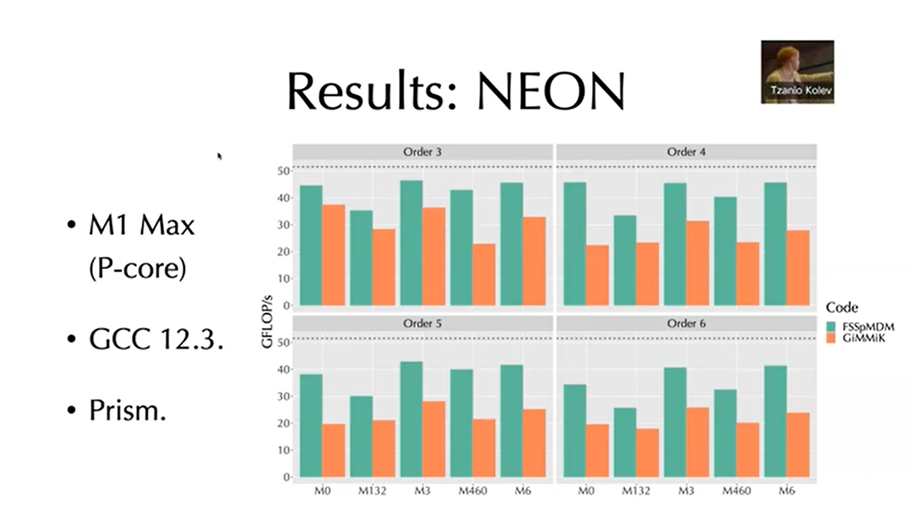</img></a>

Small matrix multiplications are a key building block of modern
high-order finite element method solvers. Such multiplications describe the act
of applying a specific finite element operator onto a set of state vectors. The
small and irregular size of these multiplications makes them poor candidates for
generic matrix multiplication routines. Moreover, for elements with a tensor
product construction, the operators themselves can exhibit a significant degree
of sparsity. In this talk, I will describe the code generation strategies
employed by our Fixed Size Sparse Matrix-Dense Matrix (FSSpMDM) routine in
libxsmm and show how these result in performant operator kernels for prismatic
and hexahedral elements. Strategies will be described for both x86-64
(AVX2/AVX-512) and AARCH64 (NEON/SVE) instruction sets. Results will be
presented on recent Intel and Apple CPUs and compared against the well-known
GiMMiK C code generation library.

---

#### Frank Giraldo (Naval Postgraduate School)
#### *Using High-Order Element-Based Galerkin Methods to Capture Hurricane Intensification*
##### **May 16, 2023** | [FEM@LLNL Seminar Series](https://mfem.org/seminar)

<a class="youtube" href="https://www.youtube.com/watch?v=yesKLcqYWZU"></img></a>

Properly capture hurricane rapid intensification (where the winds
increase by 30 knots in the first 24 hours) remains challenging for atmospheric
models. The reason is that we need LES-type scales 𝒪(100m) which is still
elusive due to computational cost. In this talk, I describe the work that we are
doing in this area and how element-based Galerkin Methods are being used to
approximate spatial derivatives. I will also discuss the time-integration
strategy that we are exploring for this class of problems. In particular, we are
exploring process Multirate methods whereby each process in a system of
nonlinear partial different equations (PDEs) uses a time-integrator and
time-step commensurate with the wave-speed of that process. We have constructed
Multirate methods of any order using extrapolation methods. Along this same
idea, we have also developed a multi-modeling framework (MMF) designed to
replace the physical parameterizations used in weather/climate models. Our
approach is to view the coarse-scale and fine-scale models through the lens of
Variational Multi-Scale (VMS) methods in order to give MMF a more rigorous
mathematical foundation. Our end goal is to use MMF in order to better resolve
the inner core of hurricanes. In addition, I will show some results using flux
differencing discontinuous Galerkin Methods for constructing both Kinetic Energy
Preserving and Entropy Stable methods and discuss why we need scalable models in
order to achieve our goals.Our model, NUMA, is a 3D nonhydrostatic atmospheric
model that runs on large CPU clusters and on GPUs.

---

#### Leszek F. Demkowicz (University of Texas at Austin)
#### *Full Envelope DPG Approximation for Electromagnetic Waveguides. Stability and Convergence Analysis*
##### **April 25, 2023** | [FEM@LLNL Seminar Series](https://mfem.org/seminar)

<a class="youtube" href="https://www.youtube.com/watch?v=HboMmtGvCW4"></img></a>

The presented work started with a convergence and stability analysis for
the so-called full envelope approximation used in analyzing optical amplifiers
(lasers). The specific problem of interest was the simulation of Transverse
Mode Instabilities (TMI). The problem translates into the solution of a system
of two nonlinear time-harmonic Maxwell equations coupled with a transient
heat equation. Simulation of a 1 m long fiber involves the resolution of 10 M
wavelengths. A superefficient MPI/openMP hp FE code run on a supercomputer gets you
to the range of ten thousand wavelengths. The resolution of the additional
thousand wavelengths is done using an exponential ansatz e^{ikz} in the
z-coordinate. This results in a non-standard Maxwell problem.
The stability and convergence analysis for the problem has been restricted to
the linear case only. It turns out that the modified Maxwell problem is stable
if and only if the original waveguide problem is stable and the boundedness
below stability constants are identical. We have converged to the task of
determining the boundedness below constant.
The stability analysis started with an easier, acoustic waveguide problem.
Separation of variables leads to an eigenproblem for a self-adjoint
operator in the transverse plane (in x,y). Expansion of the solution
in terms of the corresponding eigenvectors leads then to a decoupled
system of ODEs, and a stability analysis for a two-point BVP for an ODE
parametrized with the corresponding eigenvalues. The L^2-orthogonality
of the eigenmodes and the stability result for a single mode, lead then
to the final result: the inverse boundedness below constant depends inversely
linearly upon the length L of the waveguide.
The corresponding stability for the Maxwell waveguide turned out to be
unexpectedly difficult. The equation is vector-valued so a direct separation
of variables is out to begin with. An exponential ansatz in z leads to
a non-standard eigenproblem involving an operator that is non-self
adjoint even for the easiest, homogeneous case. The answer to the problem
came from a tricky analysis of the eigenproblem combined with the perturbation
technique for perturbed self-adjoint operators. The use of perturbation
theory requires an assumption on the smallness of perturbation of
the dielectric constant (around a constant value) but with no additional
assumptions on its differentiability (discontinuities are allowed).
In the end, the final result is similar to that for the acoustic waveguide -
the boundedness below constant depends inversely linearly on L.

---

#### Joachim Schöberl (Vienna University of Technology)
#### *The Netgen/NGSolve Finite Element Software*
##### **March 28, 2023** | [FEM@LLNL Seminar Series](https://mfem.org/seminar)

<a class="youtube" href="https://www.youtube.com/watch?v=3aYoeoNBq94"></img></a>

In this talk we give an overview of the open source finite element software Netgen/NGSolve,
available from [www.ngsolve.org](https://www.ngsolve.org). We show how to setup various physical models using
FEniCS-like Python scripting. We discuss how we use NGSolve for teaching finite element methods, and how
recent research projects have contributed to the further development of the NGSolve software. Some recent
highlights are matrix-valued finite elements with applications in elasticity, fluid dynamics, and numerical
relativity. We show how the recently extended framework of linear operators allows the utilization of GPUs
for linear solvers, as well as time-dependent problems.

---

#### Vikram Gavini (University of Michigan)
#### *Fast, Accurate and Large-scale Ab-initio Calculations for Materials Modeling*
##### **March 7, 2023** | [FEM@LLNL Seminar Series](https://mfem.org/seminar)

<a class="youtube" href="https://www.youtube.com/watch?v=K8Hl7udBvlg"></img></a>

Electronic structure calculations, especially those using density functional theory (DFT), have been very useful in understanding and predicting a wide range of materials properties. The importance of DFT calculations to engineering and physical sciences is evident from the fact that ~20% of computational resources on some of the world's largest public supercomputers are devoted to DFT calculations. Despite the wide adoption of DFT, the state-of-the-art implementations of DFT suffer from cell-size and geometry limitations, with the widely used codes in solid state physics being limited to periodic geometries and typical simulation domains containing a few hundred atoms.
This talk will present our recent advances towards the development of computational methods and numerical algorithms for conducting fast and accurate large-scale DFT calculations using adaptive finite-element discretization, which form the basis for the recently released [DFT-FE open-source code](https://github.com/dftfeDevelopers/dftfe). Details of the implementation, including mixed precision algorithms and asynchronous computing, will be presented. The computational efficiency, scalability and performance of DFT-FE will be presented, which demonstrates a significant outperformance of widely used plane-wave DFT codes.

---

#### Stefan Henneking (University of Texas at Austin)
#### *Bayesian Inversion of an Acoustic-Gravity Model for Predictive Tsunami Simulation*
##### **January 10, 2023** | [FEM@LLNL Seminar Series](https://mfem.org/seminar)

<a class="youtube" href="https://www.youtube.com/watch?v=wMZqz3AoL3E"></img></a>

To improve tsunami preparedness, early-alert systems and real-time monitoring are essential. We use a novel approach for predictive tsunami modeling within the Bayesian inversion framework. This effort focuses on informing the immediate response to an occurring tsunami event using near-field data observation. Our forward model is based on a coupled acoustic-gravity model (e.g., Lotto and Dunham, Comput Geosci (2015) 19:327—340). Similar to other tsunami models, our forward model relies on transient boundary data describing the location and magnitude of the seafloor deformation. In a real-time scenario, these parameter fields must be inferred from a variety of measurements, including observations from pressure gauges mounted on the seafloor. One particular difficulty of this inference problem lies in the accurate inversion from sparse pressure data recorded in the near-field where strong hydroacoustic waves propagate in the compressible ocean; these acoustic waves complicate the task of estimating the hydrostatic pressure changes related to the forming surface gravity wave. Our space-time model is discretized with finite elements in space and finite differences in time. The forward model incurs a high computational complexity, since the pressure waves must be resolved in the 3D compressible ocean over a sufficiently long time span. Due to the infeasibility of rapidly solving the corresponding inverse problem for the fully discretized space-time operator, we discuss approaches for using compact representations of the parameter-to-observable map.

---

#### Lin Mu (University of Georgia)
#### *An Efficient and Effective FEM Solver for Diffusion Equation with Strong Anisotropy*
##### **December 13, 2022** | [FEM@LLNL Seminar Series](https://mfem.org/seminar)

<a class="youtube" href="https://www.youtube.com/watch?v=wMZqz3AoL3E"></img></a>

The Diffusion equation with strong anisotropy has broad applications. In this project, we discuss numerical solution of diffusion equations with strong anisotropy on meshes not aligned with the anisotropic vector field, focusing on application to magnetic confinement fusion. In order to resolve the numerical pollution for simulations on a non-anisotropy-aligned mesh and reduce the associated high computational cost, we developed a high-order discontinuous Galerkin scheme with an efficient preconditioner. The auxiliary space preconditioning framework is designed by employing a continuous finite element space as the auxiliary space for the discontinuous finite element space. An effective line smoother that can mitigate the high-frequency error perpendicular to the magnetic field has been designed by a graph-based approach to pick the line smoother that is approximately perpendicular to the vector fields when the mesh does not align with anisotropy. Numerical experiments for several benchmark problems are presented to validate the effectiveness and robustness.

---

#### Garth Wells (University of Cambridge)
#### *FEniCSx: design of the next generation FEniCS libraries for finite element methods*
##### **November 8, 2022** | [FEM@LLNL Seminar Series](https://mfem.org/seminar)

<a class="youtube" href="https://www.youtube.com/watch?v=D-YcVd4-_2E"></img></a>

The [FEniCS Project](https://fenicsproject.org/) provides libraries for solving partial differential equations using the finite element method. An aim of the FEniCS Project has been to provide high-performance solver environments that closely mirror mathematical syntax, with the hypothesis that high-level representations means that solvers are faster to write, easier to debug, and can deliver faster runtime performance than is reasonably possible by hand. Using domain-specific languages and code generation techniques, arguably the FEniCS libraries delivered on these goals for a set of problems. However, over time limitations, including performance and extensibility, become clear and maintainability/sustainability became an issue.Building on experiences from the FEniCS libraries, I will present and discuss the design on the next generation of tools, FEniCSx. The new design retains strengths of the past approach, and addresses limitations using new designs and new tools. Solvers can be written in C++ or Python, and a number of design changes allow the creation of flexible, fast solvers in Python. In the second part of my presentation, I will discuss high-performance finite element kernels (limited to CPUs on this occasion), motivated by the Center for Efficient Exascale Discretizations 'bake-off' problems, and which would not have been possible in the original FEniCS libraries. Double, single and half-precision kernels are considered, and results include (i) the observation that kernels with vector intrinsics can be slower than auto-vectorised kernels for common cases, and (ii) a cache-aware performance model which is remarkably accurate in predicting performance across architectures.

---

#### Dennis Ogiermann (University of Bochum)
#### *Computing Meets Cardiology: Making Heart Simulations Fast and Accurate*
##### **September 13, 2022** | [FEM@LLNL Seminar Series](https://mfem.org/seminar)

<a class="youtube" href="https://www.youtube.com/watch?v=h0tviC32kE8"></img></a>

Heart diseases are an ubiquitous societal burden responsible for a majority of deaths world wide. A central problem in developing effective treatments for heart diseases is the inherent complexity of the heart as an organ. From a modeling perspective, the heart can be interpreted as a biological pump involving multiple physical fields, namely fluid and solid mechanics, as well as chemistry and electricity, all interacting on different time scales. This multiphysics and multiscale aspect makes simulations inherently expensive, especially when approached with naive numerical techniques. However, computational models can be extraordinarily useful in helping us understanding how the healthy heart functions and especially how malfunctions influence different diseases. In this context, also information about possible weaknesses of therapies can be obtained to ultimately improve clinical treatment and decision support. In this talk, we will focus primarily on two important model classes in computational cardiology and their respective efficient numerical treatment without compromising significant accuracy. The first class is the problem of computing electrocardiograms (ECG) from electrical heart simulations. Since ECG measurements can give a wide range of insights about a wide range of heart diseases they offer suitable data to validate our electrophysiological models and verify our numerical schemes on organ-scale. Known numerical issues, arising in the context of electrophysiological models, will be reviewed. The second class addresses bidirectionally coupled electromechanical models and their efficient numerical treatment. Focus will be on a unified space-time adaptive operator splitting framework developed on top of MFEM which proves highly efficient so far for the investigated model classes while still preserving high accuracy.

---

#### Ricardo Vinuesa (KTH)
#### *Modeling and Controlling Turbulent Flows through Deep Learning*
##### **August 23, 2022** | [FEM@LLNL Seminar Series](https://mfem.org/seminar)

<a class="youtube" href="https://www.youtube.com/watch?v=0_y70sNTcrY"></img></a>

The advent of new powerful deep neural networks (DNNs) has fostered their application in a wide range of research areas, including more recently in fluid mechanics. In this presentation, we will cover some of the fundamentals of deep learning applied to computational fluid dynamics (CFD). Furthermore, we explore the capabilities of DNNs to perform various predictions in turbulent flows: we will use convolutional neural networks (CNNs) for non-intrusive sensing, i.e. to predict the flow in a turbulent open channel based on quantities measured at the wall. We show that it is possible to obtain very good flow predictions, outperforming traditional linear models, and we showcase the potential of transfer learning between friction Reynolds numbers of 180 and 550. We also discuss other modelling methods based on autoencoders (AEs) and generative adversarial networks (GANs), and we present results of deep-reinforcement-learning-based flow control.

---

#### Jeffrey Banks (RPI)
#### *Efficient Techniques for Fluid Structure Interaction: Compatibility Coupling and Galerkin Differences*
##### **July 26, 2022** | [FEM@LLNL Seminar Series](https://mfem.org/seminar)

<a class="youtube" href="https://www.youtube.com/watch?v=l_Ds7jfTBUU"></img></a>

Predictive simulation increasingly involves the dynamics of complex systems with multiple interacting physical processes. In designing simulation tools for these problems, both the formulation of individual constituent solvers, as well as coupling of such solvers into a cohesive simulation tool must be addressed. In this talk, I discuss both of these aspects in the context of fluid-structure interaction, where we have recently developed a new class of stable and accurate partitioned solvers that overcome added-mass instability through the use of so-called compatibility boundary conditions. Here I will present partitioned coupling strategies for incompressible FSI. One interesting aspect of CBC-based coupling is the occurrence of nonstandard and/or high-derivative operators, which can make adoption of the techniques challenging, e.g. in the context of FEM methods. To address this, I will also discuss our newly developed Galerkin Difference approximations, which may provide a natural pathway for CBCs in an FEM context. Although GD is fundamentally a finite element approximation based on a Galerkin projection, the underlying GD space is nonstandard and is derived using profitable ideas from the finite difference literature. The resulting schemes possess remarkable properties including nodal superconvergence and the ability to use large CFL-one time steps. I will also present preliminary results for GD discretizations on unstructured grids using MFEM.

---

#### Paul Fischer (UIUC/ANL)
#### *Outlook for Exascale Fluid Dynamics Simulations*
##### **June 21, 2022** | [FEM@LLNL Seminar Series](https://mfem.org/seminar)

<a class="youtube" href="https://www.youtube.com/watch?v=WqrwDarTdss"></img></a>

We consider design, development, and use of simulation software for exascale computing, with a particular emphasis on fluid dynamics simulation. Our perspective is through the lens of the high-order code Nek5000/RS, which has been developed under DOE's Center for Efficient Exascale Discretizations (CEED). Nek5000/RS is an open source thermal fluids simulation code with a long development history on leadership computing platforms—it was the first commercial software on distributed memory platforms and a Gordon Bell Prize winner on Intel's ASCII Red. There are a myriad of objectives that drive software design choices in HPC, such as scalability, low-memory, portability, and maintainability. Throughout, our design objective has been to address the needs of the user, including facilitating data analysis and ensuring flexibility with respect to platform and number of processors that can be used. When running on large-scale HPC platforms, three of the most common user questions are: How long will my job take? How many nodes will be required? Is there anything I can do to make my job run faster? Additionally, one might have concerns about storage, post-processing (Will I be able to analyze the results? Where?), and queue times. This talk will seek to answer several of these questions over a broad range of fluid-thermal problems from the perspective of a Nek5000/RS user. We specifically address performance with data for NekRS on several of the DOE's pre-exascale architectures, which feature AMD MI250X or NVIDIA V100 or A100 GPUs.

---

#### Mike Puso (LLNL)
#### *Topics in Immersed Boundary and Contact Methods: Current LLNL Projects and Research*
##### **May 24, 2022** | [FEM@LLNL Seminar Series](https://mfem.org/seminar)

<a class="youtube" href="https://www.youtube.com/watch?v=RasTXV6IYC0"></img></a>

Many of the most interesting phenomena in solid mechanics occurs at material interfaces. This can be in the form of fluid structure interaction, cracks, material discontinuities, impact etc. Solutions to these problems often require some form of immersed/embedded boundary method or contact or combination of both. This talk will provide a brief overview of different lab efforts in these areas and presents some of the current research aspects and results using from LLNL production codes. Technically speaking, the methods discussed here all require Lagrange multipliers to satisfy the constraints on the interface of overlapping or dissimilar meshes which complicates the solution. Stability and consistency of Lagrange multiplier approaches can be hard to achieve both in space and time. For example, the wrong choice of multiplier space will either be over-constrained and/or cause oscillations at the material interfaces for simple statics problems. For dynamics, many of the basic time integration schemes such as Newmark's method are known to be unstable due to gaps opening and closing. Here we introduce some (non-Nitsche) stabilized multiplier spaces for immersed boundary and contact problems and a structure preserving time integration scheme for long time dynamic contact problems. Finally, I will describe some on-going efforts extending this work.

---

#### Robert Chiodi (UIUC)
#### *CHyPS: An MFEM-Based Material Response Solver for Hypersonic Thermal Protection Systems*
##### **April 16, 2022** | [FEM@LLNL Seminar Series](https://mfem.org/seminar)

<a class="youtube" href="https://www.youtube.com/watch?v=Z7jJZ1Z5gz0"></img></a>

The University of Illinois at Urbana-Champaign’s Center for Hypersonics and Entry Systems Studies has developed a material response solver, named CHyPS, to predict the behavior of thermal protection systems for hypersonic flight. CHyPS uses MFEM to provide the underlying discontinuous Galerkin spatial discretization and linear solvers used to solve the equations. In this talk, we will briefly present the physics and corresponding equations governing material response in hypersonic environments. We will also include a discussion on the implementation of a direct Arbitrary Lagrangian-Eulerian approach to handle mesh movement resulting from the ablation of the material surface. Results for standard community test cases developed at a series of Ablation Workshop meetings over the past decade will be presented and compared to other material response solvers. We will also show the potential of high-order solutions for simulating thermal protection system material response.

---

#### Tamas Horvath (Oakland University)
#### *Space-Time Hybridizable Discontinuous Galerkin with MFEM*
##### **March 29, 2022** | [FEM@LLNL Seminar Series](https://mfem.org/seminar)

<a class="youtube" href="https://www.youtube.com/watch?v=v8-EubYMT-A">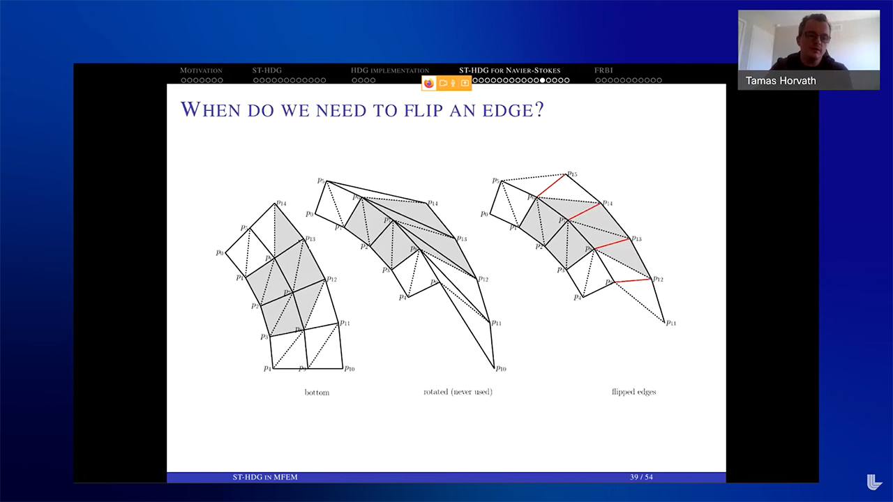</img></a>

Unsteady partial differential equations on deforming domains appear in many real-life scenarios, such as wind turbines, helicopter rotors, car wheels, free-surface flows, etc. We will focus on the space-time finite element method, which is an excellent approach to discretize problems on evolving domains. This method uses discontinuous Galerkin to discretize both in the spatial and temporal directions, allowing for an arbitrarily high-order approximation in space and time. Furthermore, this method automatically satisfies the geometric conservation law, which is essential for accurate solutions on time-dependent domains. The biggest criticism is that the application of space-time discretization increases the computational complexity significantly. To overcome this, we can use the high-order accurate Hybridizable or Embedded discontinuous Galerkin method. Numerical results will be presented to illustrate the applicability of the method for fluid flow around rigid bodies.

---

#### Tobin Isaac (Georgia Tech)
#### *Unifying the Analysis of Geometric Decomposition in FEEC*
##### **March 22, 2022** | [FEM@LLNL Seminar Series](https://mfem.org/seminar)

<a class="youtube" href="https://www.youtube.com/watch?v=edK62yPUtIs"></img></a>

Two operations take function spaces and make them suitable for finite element computations. The first is the construction of trace-free subspaces (which creates "bubble" functions) and the second is the extension of functions from cell boundaries into cell interiors (which create edge functions with the correct continuity): together these operations define the _geometric decomposition_ of a function space. In finite element exterior calculus (FEEC), these two operations have been treated separately for the two main families of finite elements: full polynomial elements and trimmed polynomial elements. In this talk we will see how one constructor of trace-free functions and one extension operator can be used for both families, and indeed for all differential forms. We will also examine the practicality of these two operators as tools for implementing geometric decompositions in actual finite element codes.

---

#### Raphaël Zanella (UT Austin)
#### *Axisymmetric MFEM-Based Solvers for the Compressible Navier-Stokes Equations and Other Problems*
##### **March 1, 2022** | [FEM@LLNL Seminar Series](https://mfem.org/seminar)

<a class="youtube" href="https://www.youtube.com/watch?v=qCW60wWmv4Y"></img></a>

An axisymmetric model leads, when suitable, to a substantial cut in the computational cost with respect to a 3D model. Although not as accurate, the axisymmetric model allows to quickly obtain a result which can be satisfying. Simple modifications to a 2D finite element solver allow to obtain an axisymmetric solver. We present MFEM-based parallel axisymmetric solvers for different problems. We first present simple axisymmetric solvers for the Laplacian problem and the heat equation. We then present an axisymmetric solver for the compressible Navier-Stokes equations. All solvers are based on H^1-conforming finite element spaces. The correctness of the implementation is verified with convergence tests on manufactured solutions. The Navier-Stokes solver is used to simulate axisymmetric flows with an analytical solution (Poiseuille and Taylor-Couette) and an air flow in a plasma torch geometry.

---

#### Robert Carson (LLNL)
#### *An Overview of ExaConstit and Its Use in the ExaAM Project*
##### **February 1, 2022** | [FEM@LLNL Seminar Series](https://mfem.org/seminar)

<a class="youtube" href="https://www.youtube.com/watch?v=I0kTJdR8oZU"></img></a>

As additively manufactured (AM) parts become increasingly more popular in industry, a growing need exists to help expediate the certifying process of parts. The ExaAM project seeks to help this process by producing a workflow to model the AM process from the melt pool process all the way up to the part scale response by leveraging multiple physics codes run on upcoming exascale computing platforms. As part of this workflow, ExaConstit is a next-generation quasi-static, solid mechanics FEM code built upon MFEM used to connect local microstructures and local properties within the part scale response. Within this talk, we will first provide an overview of ExaConstit, how we have ported it over to the GPU, and some performance numbers on a number of different platforms. Next, we will discuss how we have leveraged MFEM and the FLUX workflow to run hundreds of high-fidelity simulations on Summit in-order to generate the local properties needed to drive the part scale simulation in the ExaAM workflow. Finally, we will show case a few other areas ExaConstit has been used in.

---

#### Guglielmo Scovazzi (Duke)
#### *The Shifted Boundary Method: An Immersed Approach for Computational Mechanics*
##### **January 20, 2022** | [FEM@LLNL Seminar Series](https://mfem.org/seminar)

<a class="youtube" href="https://www.youtube.com/watch?v=WJ5dAhOR6Gg">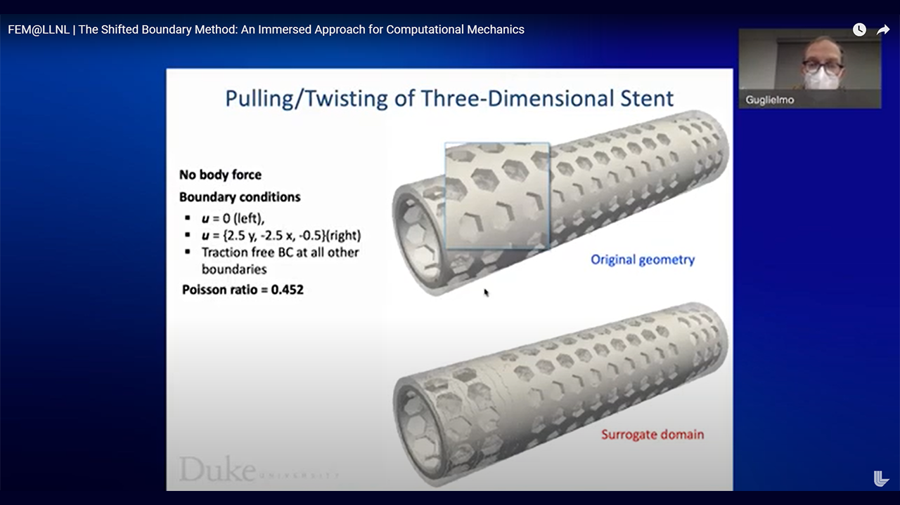</img></a>

Immersed/embedded/unfitted boundary methods obviate the need for continual re-meshing in many applications involving rapid prototyping and design. Unfortunately, many finite element embedded boundary methods are also difficult to implement due to the need to perform complex cell cutting operations at boundaries, and the consequences that these operations may have on the overall conditioning of the ensuing algebraic problems. We present a new, stable, and simple embedded boundary method, named “shifted boundary method” (SBM), which eliminates the need to perform cell cutting. Boundary conditions are imposed on a surrogate discrete boundary, lying on the interior of the true boundary interface. We then construct appropriate field extension operators, by way of Taylor expansions, with the purpose of preserving accuracy when imposing the boundary conditions. We demonstrate the SBM on large-scale solid and fracture mechanics problems; thermomechanics problems; porous media flow problems; incompressible flow problems governed by the Navier-Stokes equations (also including free surfaces); and problems governed by hyperbolic conservation laws.

## Conferences & Talks

---

#### Tzanio Kolev (LLNL)
#### *MFEM: Accelerating Efficient Solution of PDEs at Exascale*
##### **March 20, 2025** | [Banff International Research Station for Mathematical Innovation and Discovery](https://www.birs.ca/events/2025/5-day-workshops/25w5441)
<a class="youtube" href="https://www.birs.ca/events/2025/5-day-workshops/25w5441/videos/watch/202503201053-Kolev.html">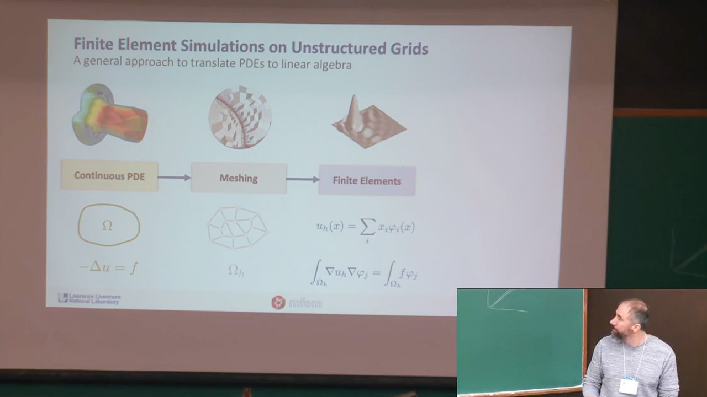</img></a>

Tzanio Kolev presented at the Banff International Research Station's (BIRS) workshop on [Geometric Mechanics Formulations for Continuum Mechanics](https://www.birs.ca/events/2025/5-day-workshops/25w5441). Modern GPU-based exascale architectures require rethinking of the numerical algorithms used in large-scale PDE-based applications. These architectures favor algorithms, such as high-order finite elements, that expose fine-grain parallelism and maximize the ratio of floating-point operations to energy intensive data movement. He presented an overview of MFEM, a scalable library for high-order finite element discretization of PDEs on general unstructured grids that employs partial assembly and matrix-free algorithms to power a wide variety of HPC applications. Our approach to efficient operator evaluation is based on a decomposed representation of the finite element operator, that factors a bilinear form into a series of sparse and dense components corresponding to the parallelism, mesh topology, basis, geometry, and pointwise physics in the problem. This exposes several layers of parallelism, enables the use of batched dgemss and tensor contractions, and only requires quadrature point values to be assembled for computing the action. The "partial assembly" formulation is a natural fit for modern HPC hardware because it results both in less (nearly optimal) computation and less (optimal) data movement compared to assembling a global sparse matrix, therefore increasing performance and reducing time to solution. In addition to discussing MFEM's capabilities and algorithms, the talk demonstrated their impact in several large-scale applications from the US Department of Energy.

---

#### Tzanio Kolev (LLNL)
#### *Advancing Computational Science with High-Order Finite Elements*
##### **February 12, 2025** | [SIAM Activity Group on Supercomputing](https://siag-sc.org)
<a class="youtube" href="https://youtu.be/Fa_KqW7np14"></img></a>

The demand for modeling and simulation in large-scale computational science has consistently driven the development of new numerical algorithms that are tailored to new architectures. For example, exascale architectures favor algorithms, such as high-order finite elements, that expose fine-grain parallelism and maximize the ratio of floating-point operations to energy intensive data movement. In [this talk](https://siag-sc.org/advancing-computational-science-with-high-order-finite-elements.html) we review recent work on GPU-oriented algorithms and software for high-order meshing, discretizations and solvers, and demonstrate their impact in several large-scale applications from the US Department of Energy.

SIAM-SC's Supercomputing Spotlights is a new webinar series featuring short presentations that highlight the impact and successes of HPC.

---

#### Tzanio Kolev (LLNL)
#### *PDE Simulations on Unstructured Grids with Finite Element Discretizations*
##### **March 15, 2023** | [IPAM at UCLA](https://www.ipam.ucla.edu/programs/long-programs/new-mathematics-for-the-exascale-applications-to-materials-science/)

<a class="youtube" href="https://www.youtube.com/watch?v=lJl1_LkyU1g"></img></a>

LLNL computational mathematician Tzanio Kolev presented an overview of MFEM as part of the long program on *New Mathematics for the Exascale: Applications to Materials Science* at the Institute for Pure and Applied Mathematics.

---

#### Vladimir Tomov (LLNL)
#### *Finite Element Algorithms and Research Topics in ALE Hydrodynamics*
##### **November 17, 2022** | [Texas A&M University-Corpus Christi Department of Math & Statistics](https://www.tamucc.edu/science/departments/math-and-statistics/index.php)

<a class="youtube" href="https://www.youtube.com/watch?v=WrV_rB4pAnE"></img></a>

LLNL computational mathematician Vladimir Tomov discussed high-order finite element methods research, development, and application in the context of shock hydrodynamics simulations. The method is based on an Arbitrary Lagrangian-Eulerian (ALE) formulation consisting of separate Lagrangian, mesh optimization, and remap phases. The presentation addressed the following topics: Lagrangian shock hydrodynamics on curved meshes; multi-material closure models; coupling to multigroup radiation diffusion; optimization, r-adaptivity, and surface fitting of high-order meshes; advection-based remap with nonlinear sharpening of material interfaces; synchronization between the max/min bounds of primal and conservative fields during remap; computationally efficient finite element kernels based on partial assembly and sum factorization. The talk also covered the existing methods followed by a discussion about the outstanding research challenges and ongoing work to address them.

#### John Camier (LLNL)
#### *All-Out Kernel Fusion: Reaching Peak Performance Faster in High-Order Finite Element Simulations*
##### **March 21–24, 2022** | [NVIDIA GTC22](https://www.nvidia.com/gtc/)

<a class="youtube" href="https://www.youtube.com/watch?v=M2a1eW9XMJQ"></img></a>

LLNL research scientist John Camier described recent improvements of high-order finite element CUDA kernels that can reduce the time-to-solution by a factor of 10. Augmenting traditional compiler representations with a general mathematical description enables a sustainable way to generate optimized kernels, matching the peak performance of hand-tuned CUDA code. Such intermediate graph-based representation provides significant potential for optimization, both in terms of minimizing the number of kernel launches and in reducing the memory bandwidth. Camier also presented results on single and multiple GPUs that demonstrate significant reduction in the local problem size required to reach peak performance, leading to faster time-to-solution in finite element applications.

---

#### Tzanio Kolev (LLNL)
#### *Efficient Finite Element Discretizations for Exascale Applications*
##### **February 25, 2021** | [ExCALIBUR SLE 3 workshop](https://excalibur-sle.github.io/)

<a class="youtube" href="https://www.youtube.com/watch?v=lsBSctsSMFY">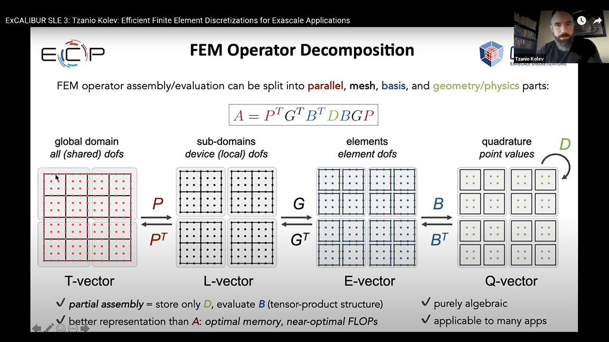</img></a>

ExCALIBUR SLE (Exascale Computing for System-Level Engineering) is a Design and Development Working Group that brings together working groups of experts from computer science, mathematics and engineering to address the challenge of how to simulate coupled physical process at a system level on future exascale systems.

---

#### Tzanio Kolev (LLNL), Mark Shephard (RPI), and Cameron Smith (RPI)
#### *Unstructured Meshing Technologies*
##### **August 6, 2018** | [ATPESC 2018](https://extremecomputingtraining.anl.gov/)

<a class="youtube" href="https://www.youtube.com/watch?v=Zh6pFjkmr0g"></img></a>

Presented at the Argonne Training Program on Extreme-Scale Computing 2018.
Slides for this presentation are available [here](https://extremecomputingtraining.anl.gov/files/2018/08/ATPESC_2018_Track-4_5_8-6_11am_Kolev-Shephard-Smith-Unstructured_Meshing_Technologies.pdf).

---

#### Tzanio Kolev (LLNL) and Mark Shephard (RPI)
#### *Unstructured Meshing Technologies*
##### **August 7, 2017** | [ATPESC 2017](https://extremecomputingtraining.anl.gov/)

<a class="youtube" href="https://www.youtube.com/watch?v=eJ6hRN7TeEU"></img></a>

Presented at the Argonne Training Program on Extreme-Scale Computing 2017.
Slides for this presentation are available [here](https://extremecomputingtraining.anl.gov/files/2017/08/ATPESC_2017_Track-4_07_8-7_1145am_Kolev-Shephard-Unstructured_Mesh_Technologies.pdf).

---

#### Tzanio Kolev (LLNL) and Mark Shephard (RPI)
#### *Conforming & Nonconforming Adaptivity for Unstructured Meshes*
##### **August 7, 2017** | [ATPESC 2017](https://extremecomputingtraining.anl.gov/)

<a class="youtube" href="https://www.youtube.com/watch?v=RLIZWXggXqU"></img></a>

Presented at the Argonne Training Program on Extreme-Scale Computing 2017.
Slides for this presentation are available [here](https://extremecomputingtraining.anl.gov/files/2017/08/ATPESC_2017_Track-4_13_8-7_630pm_Kolev-Shephard-Adaptivity_for_Unstructured_Meshes.pdf)

## MFEM Workshop 2024

---

#### Aaron Fisher  (LLNL)
#### *Welcome and Overview*
##### **October 22-24, 2024** | [MFEM Workshop 2024](workshop.md)

<a class="youtube" href="https://youtu.be/NX_PNUCdf2w"></img></a>

Aaron Fisher of LLNL kicked off the event with an overview of the workshop agenda, participant demographics, and community resources.

---

#### Tzanio Kolev (LLNL)
#### *The State of MFEM*
##### **October 22-24, 2024** | [MFEM Workshop 2024](workshop.md)

<a class="youtube" href="https://www.youtube.com/watch?v=uqjR-yr3ggs">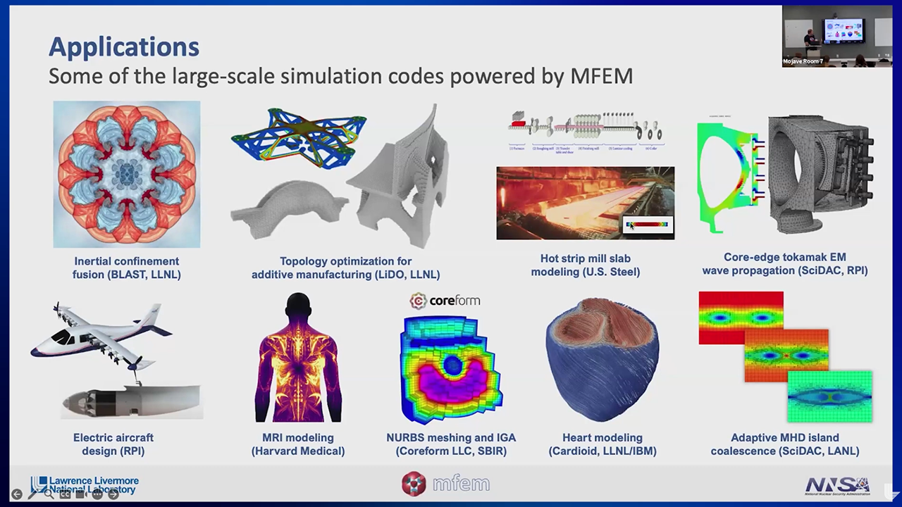</img></a>

MFEM project lead Tzanio Kolev described the project’s past, present, and future with an emphasis on its key capabilities, examples, and mini-apps. Kolev also highlighted the growth of the global community as well as features developed during 2024.

---

#### Veselin Dobrev (LLNL)
#### *Recent Developments*
##### **October 22-24, 2024** | [MFEM Workshop 2024](workshop.md)

<a class="youtube" href="https://youtu.be/9ee8e9KXDuU"></img></a>

Veselin Dobrev of LLNL detailed the project’s recent developments including meshing and discretization improvements, GPU acceleration and partial/full assembly support, new examples and mini-apps, and more. He also highlighted functionality such as anisotropic refinement, conforming H1 spaces, square pyramid shaped elements, and hybridized discontinuous Galerkin solutions.

---

#### Máté Kovács (Braid Technologies)
#### *Rust Wrapper for MFEM*
##### **October 22-24, 2024** | [MFEM Workshop 2024](workshop.md)

<a class="youtube" href="https://youtu.be/4X8Q06kKcFA"></img></a>

Rust is quickly emerging as a modern alternative to C++ for systems and performance-critical programming. With a user-centered design, "batteries included" philosophy around tooling, and principled approach to correctness, Rust holds a lot of potential to make complex libraries easier to use. Building a Rust wrapper for MFEM would achieve most of the benefits of a rewrite at a fraction of the effort. By showcasing this prototype, I hope to convince you that creating and maintaining a Rust wrapper for MFEM is a worthy goal. I will further argue that the small modifications to the C++ API that may be necessary to reach optimal integration with Rust would also improve the usability for C++.

---

#### Adrian Butscher (Autodesk Research)
#### *Geometrically Constrained Level Set Topology Optimization Using a Novel Hilbert Space Extension Method*
##### **October 22-24, 2024** | [MFEM Workshop 2024](workshop.md)

<a class="youtube" href="https://youtu.be/Xqt_pVMe05Y"></img></a>

We propose an approach for level-set based topology optimization which pairs conventional free-form shape updates with highly constrained shape updates along a user-specified part of the shape boundary. It is intended for the optimal design of shapes where certain parts of the shape boundary are required to preserve their geometry, up to well-defined parametric variations such as translations, rotations, and scalings. For instance, our approach could be used to optimize a shape that must include a circular aperture of optimal radius to accommodate a pin joint to another shape. Our approach allows us to optimize both the free-form geometry of the shape, as well as the position, orientation, and scale of the circular aperture. To generate the shape updates we construct a velocity field over the entire design space and transport the level-set function defining the shape along the field at each iteration. We construct this velocity field using a novel constrained Hilbert space extension (C-HSE) method that expands upon existing Hilbert space extension methods by incorporating the affine motion constraints into the variational problem. As a result, the C-HSE method generates a velocity field for the entire design domain that constitutes a descent direction for a user-specified optimization objective function, while ensuring that all constraints are met. The C-HSE allows multiple distinct regions to have different constraints, with many possible constraint types such as translation, rotation and scaling (or all three simultaneously). We show results on a variety of geometrically constrained boundary conditions on some canonical problems.

---

#### Ketan Mittal (LLNL)
#### *Interpolation at Arbitrary Points in High-Order Meshes on GPUs*
##### **October 22-24, 2024** | [MFEM Workshop 2024](workshop.md)

<a class="youtube" href="https://youtu.be/jVQvPvgNr9I"></img></a>

Robust and scalable arbitrary point interpolation is required in the finite element method and spectral element method for querying the partial differential equation solution at points of interest in the domain, comparison of solution between different meshes, and Lagrangian particle tracking. This is a challenging problem, particularly for high-order unstructured meshes partitioned in parallel with MPI, as it requires identifying the element that overlaps a given point and computing the reference space coordinates inside the element corresponding to the point. We present a robust and efficient way to address this problem for large-scale high-order meshes. First, a combination of globally partitioned and processor-local maps are used to determine a list of candidate MPI ranks and element pairs that could contain the point. Next, element-wise bounding boxes are used to further narrow down the list of candidate elements. Finally, Newton's method with trust region-based approach is used to invert the affine map for the candidate elements and determine the reference space coordinates corresponding to the point. Since GPU-based architectures have demonstrated to accelerate computational analyses using meshes with tensor-product elements, specialized kernel have been developed to effect the arbitrary point search and interpolation on GPUs. We demonstrate the effectiveness of this approach using various high-order meshes.

---

#### 2024 Student Lightning Talks
#### *Part 1*
##### **October 22-24, 2024** | [MFEM Workshop 2024](workshop.md)
<a class="youtube" href="https://youtu.be/DXM9_HAk13Y"></img></a>

The following students presented lightning talks in this video. See the [2024 workshop page](workshop.md) for abstracts.

- Julian Lüken (University of Antwerp): “Simulating Atom Probe Tomography Using MFEM”
- Aditya Parik (Utah State University): “Arbitrary Point Search and Interpolation on Surface Meshes”
- Gabriel Pinochet-Soto (Portland State University): “Exploring Generalized Jacobi Preconditioners and Smoothers in MFEM”

---

#### 2024 Student Lightning Talks
#### *Part 2*
##### **October 22-24, 2024** | [MFEM Workshop 2024](workshop.md)
<a class="youtube" href="https://youtu.be/X0hZ2N01gbs"></img></a>

The following students presented lightning talks in this video. See the [2024 workshop page](workshop.md) for abstracts.

- Matthew Blomquist (University of California Merced): “Semi-Lagrangian Characteristic Reconstruction and Projection for Transport under Incompressible Velocity Fields”
- Paul Moujaes (Technical University Dortmund): “Clip and Scale Limiting for Remapping H1 Velocity Fields in Lagrangian Hydrodynamics Simulations”
- Arjun Vijaywargiya (University of Notre Dame): “High Order Computation of MFC Barycenters with MFEM”
- Yi Zong (Tsinghua University): “FP16 Acceleration in Structured Multigrid Preconditioner for Real-World Problems”

---

#### Yu Leng (Los Alamos National Laboratory)
#### *Arbitrary Order Virtual Element Methods for High-Order Phase-Field Modeling of Dynamic Fracture*
##### **October 22-24, 2024** | [MFEM Workshop 2024](workshop.md)
<a class="youtube" href="https://youtu.be/R1WC2RO6B7Q"></img></a>

Accurate modeling of fracture nucleation and propagation in brittle and ductile materials subjected to dynamic loading is important in predicting material damage and failure under extreme conditions. Phase-field fracture models have garnered a lot of attention in recent years due to their success in representing damage and fracture processes in a wide class of materials and under a variety of loading conditions. Second-order phase-field fracture models are by far the most popular among researchers (and increasingly, among practitioners), but fourth-order models have started to gain broader acceptance since their more recent introduction. The exact solution corresponding to these high-order phase-field fracture models has higher regularity. Thus, numerical solutions of the model equations can achieve improved accuracy and higher spatial convergence rates. In this work, we develop a virtual element framework for the high-order phase-field model of dynamic fracture. The virtual element method (VEM) can be regarded as a generalization of the classical finite element method. In addition to many other desirable characteristics, the VEM allows computing on polytopal meshes. Here, we use H1-conforming virtual elements and the generalized-α time integration method for the momentum balance equation, and adopt H2-conforming virtual elements for the high-order phase-field equation. We verify our virtual element framework using classical quasi-static benchmark problems and demonstrate its capabilities with the aid of numerical simulations of dynamic fracture in brittle materials.

---

#### Michael Tupek (LLNL)
#### *Automatic Parameter Sensitivities in Serac for Engineering Applications*
##### **October 22-24, 2024** | [MFEM Workshop 2024](workshop.md)

<a class="youtube" href="https://youtu.be/KSQg-QE4Mpw"></img></a>

We present a framework for automatically calculating sensitivities for both topology and shape design optimization workflows. Building on MFEM infrastructure, we provide abstractions for quickly specifying, solving, coupling, and differentiating new PDEs for engineering applications. Recent developments in Serac include: highly robust nonlinear solvers, integration of the Tribol library for contact enforcement, coupled thermal-mechanics, differentiable material model library, and checkpointing for transient adjoint calculations.

---

#### Jan Nikl (LLNL)
#### *Hybridization of Convection-Diffusion Systems in MFEM*
##### **October 22-24, 2024** | [MFEM Workshop 2024](workshop.md)

<a class="youtube" href="https://youtu.be/xLe-zF-W994"></img></a>

Convection-diffusion systems are likely the most common class of partial differential equations appearing in practically all different applications. However, their mixed formulation typically suffers from prohibitively high computational costs and difficult preconditioning, especially close to the steady state where the system becomes a saddle point problem. The hybridization technique offers an appealing answer to these issues. The new framework for mixed systems enables single-line hybridization, reducing the problem to face traces of the total flux only. Solution of such system is then inexpensive, and preconditioning becomes nearly trivial. Non-linear convection is also supported with the action-based regime of operation. Description of the mechanism as well as code examples to show ease of usage are presented.

---

#### Vladimir Tomov (LLNL)
#### *Miniapps for Shock Hydro, Field Remap, and Mesh Optimization*
##### **October 22-24, 2024** | [MFEM Workshop 2024](workshop.md)

<a class="youtube" href="https://youtu.be/EGFBm7A5S6o"></img></a>

This presentation discusses recent advancements, research, and exploratory work in the MFEM miniapps for shock hydrodynamics (Laghos), field remap (Remhos), and mesh optimization. For shock hydro, we present the implementation of slip wall boundary conditions for curved domains, along with research involving material interfaces using the shifted interface method or cut-element integration through Algoim and moments-based integration. In the field remap miniapp, we cover developments in stabilized remap for continuous fields, interface sharpening techniques, and matrix-free methods for GPU execution. Lastly, we explore recent progress in mesh optimization, including surface fitting and its GPU implementation, tangential relaxation, automatic differentiation (AD) for complex objective functionals, enhanced metric theory and quality metrics, and hpr-adaptivity for the mesh representation. While some of these advancements are public, general methods that can be applied across various practical miniapps, others are exploratory, demonstrating how the miniapps can serve as a starting point for research in specific areas.

#### Hui-Chia Yu (Michigan State University)
#### *Battery Electrode Simulation Toolkit using MFEM (BESFEM)*
##### **October 22-24, 2024** | [MFEM Workshop 2024](workshop.md)

<a class="youtube" href="https://youtu.be/JY3r6JESv6c"></img></a>

Conventional sharp-interface simulations require mesh systems conformal to the domain of interest for solving governing equations. Our research team employs an alternative approach, the smoothed boundary method (SBM), that utilizes a continuous domain function to describe geometries and reformulate governing equations. This formulation enables solving governing equations on a regular Cartesian grid, eliminating the need for body-conforming meshes. We have been developing an Open-Source Battery Electrode Simulation Toolkit using MFEM (BESFEM). This toolkit integrates the SBM approach on the MFEM solver library (a product of the DOE's Exascale Computing Project). To enhance accuracy and computational efficiency, our team leverage MFEM's built-in adaptive mesh refinement (AMR) functionality, where elements near SBM diffuse interfaces are multilevel refined. BESFEM will be made fully available as a research and education tool for the battery science and materials science communities.

---

#### Dylan Copeland (LLNL)
#### *Sparse, Approximate Quadrature for Acceleration of Isogeometric Analysis & ROMs*
##### **October 22-24, 2024** | [MFEM Workshop 2024](workshop.md)

<a class="youtube" href="https://youtu.be/rhd665deQvQ"></img></a>

Numerical integration for assembly of FEM systems typically employs quadrature rules selected for the polynomial order of basis functions in each element. In some cases, a much sparser rule can maintain accuracy. We present an algebraic method for constructing sparse rules, by formulating a constraint system of states required to be integrated accurately. A nonnegative least squares solver finds a sparse, approximate solution to this constraint system, yielding a quadrature rule with fewer points. One application we demonstrate is isogeometric analysis, where a NURBS FEM space is defined on patches consisting of many elements. Setup times are greatly accelerated, by using patch-wise integration with sum factorization and reduced quadrature rules constructed on patches. Another area of application is reduced order models (ROM), where the FEM system is restricted to a reduced POD basis formed from training data. Instead of hyper-reduction methods such as DEIM, the empirical quadrature procedure (EQP) can be used to accelerate ROM simulations with a sparse quadrature rule in the reduced subspace. We demonstrate this on several benchmark problems in the Laghos miniapp and show that energy conservation is maintained.

---

#### Jacob Spainhour (CU Boulder)
#### *Robust Containment Queries over Collections of Parametric Curves via Generalized Winding Numbers*
##### **October 22-24, 2024** | [MFEM Workshop 2024](workshop.md)

<a class="youtube" href="https://youtu.be/rk_NfKkbVe0"></img></a>

The containment query is an important geometric primitive in many multiphysics applications. For example, when initializing multimaterial Arbitrary Lagrangian-Eulerian (ALE) simulations, we often need to determine whether arbitrary quadrature points from the background mesh are inside or outside the regions associated with each material. However, existing methods require expensive refinement to accurately capture curved regions. At the same time, many methods are wholly incompatible with user-defined geometries that contain geometric and numeric gaps and/or self-intersections. In this work, we develop a containment query for 2D regions defined by rational Bezier curves that operates directly on curved objects. Our method relies on the generalized winding number (GWN), a mathematical construction that can be evaluated for each curve independently, making the derived containment query robust to non-watertightness. We use an adaptive algorithm to compute the GWN field exactly, which permits fast evaluation for points considered "distant" to the curve while being numerically stable for points that are arbitrarily close. Overall, this classification scheme greatly expands the types of bounding geometry that can be used directly in shaping applications without the need for otherwise expensive repair techniques. If time permits, we will also discuss our extensions of this idea to 3D shapes defined by parametric surfaces.

---

#### Alexander Blair (UK Atomic Energy Authority)
#### *Platypus: An Open-Source Application for MFEM Problem Set-Up and Assembly in the MOOSE Framework*
##### **October 22-24, 2024** | [MFEM Workshop 2024](workshop.md)
<a class="youtube" href="https://youtu.be/gTdB6eLRd8I"></img></a>

The large-scale open-source finite element simulation framework MOOSE has built an extensive user community around its capabilities in solving large-scale FE problems across a wide range of physics domains whilst maintaining a simple interface for users. However, it currently lacks support for problem set-up and solution on GPU architectures, due in part to its default finite element library backend libMesh, restricting the range of facilities that it may effectively leverage. Here we present Platypus, an open-source MOOSE application under development for the massively parallel multiphysics simulations of finite element problems using the MFEM finite element library, supporting problem assembly and solves on both CPU and GPU architectures. We shall show some initial results on simple thermal and electromagnetic test problems and outline our development plans for supporting upcoming experiments at UKAEA at the HIVE and CHIMERA facilities.

---

#### Qi Tang (Georgia Institute of Technology)
#### *An Adaptive Newton-Based Free-Boundary Grad-Shafranov Solver*
##### **October 22-24, 2024** | [MFEM Workshop 2024](workshop.md)
<a class="youtube" href="https://youtu.be/Lpm0qOdhVpI"></img></a>

Equilibriums in magnetic confinement devices result from force balancing between the Lorentz force and the plasma pressure gradient. In an axisymmetric configuration like a tokamak, such an equilibrium is described by an elliptic equation for the poloidal magnetic flux, commonly known as the Grad-Shafranov equation. It is challenging to develop a scalable and accurate free-boundary Grad-Shafranov solver, since it is a fully nonlinear optimization problem that simultaneously solves for the magnetic field coil current outside the plasma to control the plasma shape. In this work, we develop a Newton-based free-boundary Grad-Shafranov solver using adaptive finite elements and preconditioning strategies. The free-boundary interaction leads to the evaluation of a domain-dependent nonlinear form of which its contribution to the Jacobian matrix is achieved through shape calculus. The optimization problem aims to minimize the distance between the plasma boundary and specified control points while satisfying two non-trivial constraints, which correspond to the nonlinear finite element discretization of the Grad-Shafranov equation and a constraint on the total plasma current involving a nonlocal coupling term. The linear system is solved by a block factorization, and AMG is called for sub-block elliptic operators. The unique contributions of this work include the treatment of a global constraint, preconditioning strategies, nonlocal reformulation, and the implementation of adaptive finite elements. It is found that the resulting Newton solver is robust, successfully reducing the nonlinear residual to 1e-6 and lower in a small handful of iterations while addressing the challenging case to find a Taylor state equilibrium where conventional Picard-based solvers fail to converge.

---

#### Dohyun Kim (Brown University)
#### *SiMPL Method: A Fast and Simple Method for Density-Based Topology Optimization*
##### **October 22-24, 2024** | [MFEM Workshop 2024](workshop.md)
<a class="youtube" href="https://youtu.be/4Tg4OyqBXlw"></img></a>

This talk will present a new first-order method for density-based topology optimization called SiMPL: Sigmoidal Mirror descent with Projected Lagrangian. This method delivers point-wise bound preserving density fields at every iteration. The design updates are based only on the first-order derivative information of the objective function, significantly simplifying practical implementations. We accelerate this method with adaptive step size and back-tracking line search. We numerically verified the mesh-independent behavior of the SiMPL method and observed significantly faster convergence compared to other popular first-order optimization algorithms for topology optimization. To outline the general applicability of the technique, we also include examples with (self-load) compliance minimization and compliant mechanism problems.

---

#### Mathias Schmidt (LLNL)
#### *Level-Set Topology Optimization with PDE Generated Conformal Meshes*
##### **October 22-24, 2024** | [MFEM Workshop 2024](workshop.md)

<a class="youtube" href="https://youtu.be/q3qCPVLJXn0"></img></a>

 The promise of topology optimization (TO) is to provide engineers with a systematic computational tool to support the development of optimal designs. A shortcoming of classic density based multi-material TO designs is the nebulous interphase region between materials, which leads to inaccurate response predictions in these very regions. In contrast, designs based on boundary and interface regions, rather than interphase regions, yield accurate response predictions. Level-set based TO is an example of such; however, the analysis of the response often requires repeated mesh generation or non-standard finite element computations. We present a solely PDE-based, level-set topology optimization approach in which geometries are described through the iso-contour of one or multiple level-set fields which are discretized over a mesh. The nodal heights serve as the design parameters. The governing field equations are discretized by a conformal discretization over a separate “analysis” mesh. In the optimization, the “analysis” mesh is morphed such that its boundary and interfaces conform with the isocontours of the LS fields. The mesh morphing is performed using the Target-Matrix Optimization Paradigm (TMOP) approach. Our TMOP formulation is a PDE-based mesh morphing operation which aims to improve the interface conformity while preserving mesh quality. Design sensitivities of the optimization cost and constraint functions with respect to all design level-set fields are computed through an adjoint approach which accounts for the mesh morphing process. The proposed analysis and optimization framework is based on MFEM, a free, lightweight, scalable C++ library for finite element methods which supports the optimization of large-scale problems. We investigate the robustness of the proposed optimization methodology by solving two- and three-dimensional multi-material optimization problems involving linear diffusion and elasticity. We discuss the advantages and challenges of our approach with regards to the mesh morphing process. LS regularization techniques are employed to produce a well-behaved mesh morphing problem throughout the optimization. Finally, select aspects and challenges of our approach with respect to parallel computing and processor decomposition are discussed.

 ---

#### Milan Holec (Xcimer)
#### *Predictive Modeling of the World's Most Powerful Fusion Laser at Xcimer*
##### **October 22-24, 2024** | [MFEM Workshop 2024](workshop.md)

<a class="youtube" href="https://youtu.be/vzpHeLb1QVs"></img></a>

According to the techno-economic studies, the ultraviolet Xcimer lasers offer the most straightforward path to the commercial fusion given the lowest J/$ price and their capacity to withstand MJ laser pulses, a fluence when the traditional solid state lasers break. We present our vision on how to model the future laser system spanning the micro-scales at 248nm laser wavelength and macro-scales at tens of meters of the actual laser beamline, where MFEM allows us to design a computationally efficient and accurate discretization based on mathematical details which we will describe in the presentation.

---

#### Yohann Dudouit (LLNL)
#### *Mitigating Rays-Effect in Phase-Space Advection with Matrix-Free HD DG Methods*
##### **October 22-24, 2024** | [MFEM Workshop 2024](workshop.md)

<a class="youtube" href="https://youtu.be/mC3tIq56FXU"></img></a>

The mitigation of the rays-effect in phase-space advection problems is a critical challenge in deterministic transport simulations, particularly when using traditional methods that struggle with numerical artifacts. In this work, we propose a novel high-dimensional matrix-free discontinuous Galerkin (DG) approach designed to address the rays-effect by fully discretizing phase space, including velocity components, up to six dimensions. This methodology avoids the excessive computational cost associated with Monte Carlo simulations while offering a deterministic alternative that preserves accuracy and scalability. A key component of our approach is the use of advanced coordinate transformations, which optimize the coordinate system to minimize the rays-effect by aligning the coordinate system with the net flux. Our matrix-free formulation minimizes memory usage and improves computational efficiency by avoiding the assembly of large sparse matrices, a critical factor when scaling to high-dimensional problems. Numerical experiments demonstrate the effectiveness of this approach in reducing rays-effect artifacts, providing a robust and scalable solution for high-dimensional transport problems.

## MFEM Workshop 2023

---

#### Aaron Fisher (LLNL)
#### *Welcome and Overview*
##### **October 26, 2023** | [MFEM Workshop 2023](workshop23.md)

<a class="youtube" href="https://www.youtube.com/watch?v=wgx0e8mdKu8"></img></a>

Aaron Fisher of LLNL kicked off the event with an overview of the workshop agenda, participant demographics, and community resources.

---

#### Tzanio Kolev (LLNL)
#### *The State of MFEM*
##### **October 26, 2023** | [MFEM Workshop 2023](workshop23.md)

<a class="youtube" href="https://www.youtube.com/watch?v=95OJe5DjjkA"></img></a>

MFEM principal investigator Tzanio Kolev described the project’s past, present, and future with an emphasis on its key capabilities (including adaptive mesh refinement, GPU support, and FEM operator decomposition and partial assembly), examples, and mini-apps. Kolev also highlighted the growth of the global community as well as features included in the recent v4.5 software release.

---

#### Veselin Dobrev (LLNL)
#### *Recent Developments*
##### **October 26, 2023** | [MFEM Workshop 2023](workshop23.md)

<a class="youtube" href="https://www.youtube.com/watch?v=1FCP0T5oIeE"></img></a>

Veselin Dobrev of LLNL detailed the project’s recent developments including sub-mesh extraction, linear form assembly on GPUs, coefficient evaluation on GPUs, new mini-apps and examples, Windows 2022 CI testing on GitHub, and more. He also summarized MFEM’s integrations with other software libraries and the team’s engagements with the Extreme-scale Scientific Software Development Kit, SciDAC, and the FASTMath Institute.

---

#### Sebastian Grimberg (AWS)
#### *Palace: PArallel LArge-scale Computational Electromagnetics*
##### **October 26, 2023** | [MFEM Workshop 2023](workshop23.md)

<a class="youtube" href="https://www.youtube.com/watch?v=jSuFUdLc8i0"></img></a>

Palace is a parallel finite element code for full-wave electromagnetics simulations based on the MFEM library. Palace is used at the AWS Center for Quantum Computing to perform large-scale 3D simulations of complex electromagnetics models and enable the design of quantum computing hardware. Grimberg provided an overview of the simulation capabilities of Palace as well as some recent developments for conforming and nonconforming adaptive mesh refinement, operator partial assembly, and GPU support.

---

#### Jacob Lotz (Delft University of Technology)
#### *Computation and Reduced Order Modelling of Periodic Flows*
##### **October 26, 2023** | [MFEM Workshop 2023](workshop23.md)

<a class="youtube" href="https://www.youtube.com/watch?v=lNIXeirM6Gg"></img></a>

Many types of periodic flows can be found in nature and industrial applications and their computation is expensive due to lengthy time simulations. His work aims to reduce the cost of these computations. His team solves periodic flows in a space-time domain in which both ends in time are periodic such that they only have to model one period. MFEM is used to discretize the space-time domain and solve our discretized system of equations. Lotz applies a hyper-reduced Proper Orthogonal Decomposition Galerkin reduced order model to speed up our computations. During the presentation he showed (results of) their full order model and their advances in reduced order modelling.

---

#### Boyan Lazarov (LLNL)
#### *Scalable Design and Optimization with MFEM*
##### **October 26, 2023** | [MFEM Workshop 2023](workshop23.md)

<a class="youtube" href="https://www.youtube.com/watch?v=7W8OCl5MLfw"></img></a>

Lazarov discussed recently added and ongoing code development facilitating the solution of shape and topology optimization problems. Both topology and shape optimization are gradient-based iterative algorithms aiming to find a material distribution that minimizes an objective and fulfills a set of constraints. Every optimization step includes a solution to a forward optimization problem, an evaluation of the objective and constraints, a solution to an adjoint problem associated with every objective or constraint, an evaluation of gradients, and an update of the design based on mathematical programming techniques. All these steps can be easily implemented and executed by using MFEM in a scalable manner, allowing the design and optimization of large-scale realistic industrial problems. Thus, the goal is to exemplify these features, highlight the techniques that simplify the implementation of new problems, and provide a glimpse into the future.

---

#### 2023 Student Lightning Talks
#### *Part 1*
##### **October 26, 2023** | [MFEM Workshop 2023](workshop23.md)

<a class="youtube" href="https://www.youtube.com/watch?v=c8WVPnTpvtI"></img></a>

The following four students presented in this video:

- Shani Martinez Weissberg (Tel Aviv University): “µFEA of a Rabbit Femur”
- Paul Moujaes (TU-Dortmund): “Dissipation-Based Entropy Stabilization for Slope-Limited Discontinuous Galerkin Approximations of Hyperbolic Problems”
- Alejandro Muñoz (Universidad de Granada): “Discontinuous Galerkin in the Time Domain for Maxwell’s Equations”
- Bill Ellis (UK Atomic Energy Authority): “Comparing Thermo-Mechanical Solves in MOOSE and MFEM”

---

#### 2023 Student Lightning Talks
#### *Part 2*
##### **October 26, 2023** | [MFEM Workshop 2023](workshop23.md)

<a class="youtube" href="https://www.youtube.com/watch?v=Gp88u3Eql2Y"></img></a>

The following four students presented in this video:

- Alexander Mote (Oregon State University): “A Neural Network Surrogate Model for Nonlocal Thermal Flux Calculations” (LLNL-PRES-854134)
- Amit Rotem (Virginia Tech): “GPU Acceleration of IPDG in MFEM”
- Josiah Brown (Relogic Research): “Project Minerva”
- Mike Pozulp (UC Berkeley): “An Implicit Monte Carlo Acceleration Scheme”

#### Syun'ichi Shiraiwa (PPPL)
#### *Radio-Frequency Wave Simulation in Hot Magnetized Plasma using Differential Operator for Non-Local Conductivity Response*
##### **October 26, 2023** | [MFEM Workshop 2023](workshop23.md)

<a class="youtube" href="https://www.youtube.com/watch?v=feUk70vXB7k"></img></a>

In high-temperature plasmas, the dielectric response to the RF fields is caused by freely moving charged particles, which naturally makes such a response non-local and correspondingly, the Maxwell wave problem becomes an integro-differential equation. A differential form of dielectric operator, based on the small k⊥ρ expansion, is widely used. However, they typically includes up-to the second order terms, and thus the use of such an operator is limited to the waves that satisfy k⊥ρ < 1. We propose an alternative approach to construct a dielectric operator, which includes all-order finite Larmor radius effects without explicitly containing higher order derivatives. We use a rational approximation of the plasma dielectric tensor in the wave number space, in order to yield a differential operator acting on the dielectric current (J). The 1D O-X-B mode-conversion of the electron Bernstein wave in the non-relativistic Maxwellian plasma was modeled using this approach. An agreement with analytic calculation and the conservation of wave energy carried by the Poynting flux and electron thermal motion (“sloshing”) is found. The connection between our construction method and superposition of Green’s function for these screened Poisson’s equations is presented. An approach to extend the operator in a multi-dimensional setting will also be discussed.

---

#### Tamas Horvath (Oakland University)
#### *Implementation of Hybridizable Discontinuous Galerkin Methods via the HDG Branch*
##### **October 26, 2023** | [MFEM Workshop 2023](workshop23.md)

<a class="youtube" href="https://www.youtube.com/watch?v=cajYzhxBDkw"></img></a>

Horvath presented the HDG branch, which was initially developed for HDG discretizations of advection-diffusion problems. Recent updates have made the branch highly adaptable for various applications, allowing a flexible implementation of HDG for many different PDEs. He showcased these enhancements and provide insights into their versatile usage across different problems.

---

#### Yohann Dudouit (LLNL)
#### *Empowering MFEM Using libCEED*
##### **October 26, 2023** | [MFEM Workshop 2023](workshop23.md)

<a class="youtube" href="https://www.youtube.com/watch?v=32JWerSEQyA"></img></a>

Dudouit began with an overview of the features introduced to MFEM through the integration of libCEED. He emphasized capabilities that are distinct from native MFEM functionalities, marking an enhancement in the software’s suite of tools, such as support for simplices, handling of mixed meshes, and support for p-adaptivity. The presentation concluded by showcasing benchmarks for various problems executed on different HPC architectures, illustrating the performance gains and efficiencies achieved through the libCEED integration.

---

#### Zhang Chunyu (Sun Yat-Sen University)
#### *Homogenized Energy Theory for Solution of Elasticity Problems with Consideration of Higher-Order Microscopic Deformations*
##### **October 26, 2023** | [MFEM Workshop 2023](workshop23.md)

<a class="youtube" href="https://www.youtube.com/watch?v=Ic5bujKlHh4"></img></a>

The classical continuum mechanics faces difficulties in solving problems involving highly inhomogeneous deformations. The proposed theory investigates the impact of high-order microscopic deformation on modeling of material behaviors and provides a refined interpretation of strain gradients through the averaged strain energy density. Only one scale parameter, i.e., the size of the Representative Volume Element(RVE), is required by the proposed theory. By employing the variational approach and the Augmented Lagrangian Method(ALM), the governing equations for deformation as well as the numerical solution procedure are derived. It is demonstrated that the homogenized energy theory offers plausible explanations and reasonable predictions for the problems yet unsolved by the classical theory such as the size effect of deformation and the stress singularity at the crack tip. The concept of averaged strain energy proves to be more suitable for describing the intricate mechanical behavior of materials. And high order partial differential equations can be effectively solved by the ALM by introducing supplementary variables to lower the highest order of the equations.

---

#### Eric Chin (LLNL)
#### *Contact Constraint Enforcement Using the Tribol Interface Physics Library*
##### **October 26, 2023** | [MFEM Workshop 2023](workshop23.md)

<a class="youtube" href="https://www.youtube.com/watch?v=OCurPCdTcno"></img></a>

Chin discussed recent additions to the Tribol interface physics library to simplify MPI parallel contact constraint enforcement in large deformation, implicit and explicit continuum solid mechanics simulations using MFEM. [Tribol](https://github.com/LLNL/Tribol) is an open-source software package available on GitHub and includes tools for contact detection, state-of-the-art Lagrangian contact methods such as common plane and mortar, and various enforcement techniques such as penalty and Lagrange multiplier. Additionally, Tribol recently added a domain redecomposer for coalescing proximal contact pairs on a single rank. Tribol’s features are designed to interact seamlessly with MFEM and other codes that use MFEM, with native support for MFEM data structures such as ParMesh, ParGridFunction, and HypreParMatrix. Chin highlighted the simplicity of adding Tribol features to an MFEM-based code by looking at integration with [Serac](https://github.com/LLNL/serac), an open-source implicit nonlinear thermal-structural simulation code.

---

#### Milan Holec (LLNL)
#### *Deterministic Transport MFEM-Miniapp*
##### **October 26, 2023** | [MFEM Workshop 2023](workshop23.md)

<a class="youtube" href="https://www.youtube.com/watch?v=Ijqv0v3zSQU"></img></a>

Holec introduced a new multidimensional discretization in MFEM enabling efficient high-order phase-space simulations of various types of Boltzmann transport. In terms of a generalized form of the standard discrete ordinate SN method for the phase-space, his team carefully designs discrete analogs obeying important continuous properties such as conservation of energy, preservation of positivity, preservation of the diffusion limit of transport, preservation of symmetry leading to rays-effect mitigation, and other laws of physics. Finally, Holec showed how to apply this new phase-space MFEM feature to increase the fidelity of modeling of fusion energy experiments.

---

#### Aaron Fisher (LLNL)
#### *Wrap-Up and Visualization Contest Winners*
##### **October 26, 2023** | [MFEM Workshop 2023](workshop23.md)

<a class="youtube" href="https://www.youtube.com/watch?v=DfqH7n1Sekg"></img></a>

The workshop concluded with the announcement of winners of the simulation and visualization contest: (1) displacement distribution of a loaded excavator arm under static equilibrium, rendered by Mehran Ebrahimi from Autodesk Research; and (2) leapfrogging vortex rings based on an MFEM incompressible Schrödinger fluid solver, rendered by John Camier from LLNL. Contest winners are featured in the [gallery](gallery.md).

## MFEM Workshop 2022

---

#### Aaron Fisher (LLNL)
#### *Welcome and Overview*
##### **October 25, 2022** | [MFEM Workshop 2022](workshop22.md)

<a class="youtube" href="https://www.youtube.com/watch?v=vaAA9zB1IQ8"></img></a>

Held on October 25, 2022, the second annual MFEM community workshop brought together users and developers for a review of software features and the development roadmap, a showcase of technical talks and applications, an interactive Q&A session, and a visualization contest. Aaron Fisher of LLNL kicked off the event with an overview of the workshop agenda, participant demographics, and community survey results.

---

#### Tzanio Kolev (LLNL)
#### *The State of MFEM*
##### **October 25, 2022** | [MFEM Workshop 2022](workshop22.md)

<a class="youtube" href="https://www.youtube.com/watch?v=I4pLPBYFR8o"></img></a>

MFEM principal investigator Tzanio Kolev described the project’s past, present, and future with an emphasis on its key capabilities (including adaptive mesh refinement, GPU support, and FEM operator decomposition and partial assembly), examples, and mini-apps. Kolev also highlighted the growth of the global community as well as features included in the recent v4.5 software release.

---

#### Veselin Dobrev (LLNL)
#### *Recent Developments in MFEM*
##### **October 25, 2022** | [MFEM Workshop 2022](workshop22.md)

<a class="youtube" href="https://www.youtube.com/watch?v=pZQP0Q4SbWU"></img></a>

Veselin Dobrev of LLNL detailed the project’s recent developments including sub-mesh extraction, linear form assembly on GPUs, coefficient evaluation on GPUs, new mini-apps and examples, Windows 2022 CI testing on GitHub, and more. He also summarized MFEM’s integrations with other software libraries and the team’s engagements with the Extreme-scale Scientific Software Development Kit, SciDAC, and the FASTMath Institute.

---

#### Ben Zwick (University of Western Australia)
#### *Solution of the Electroencephalography (EEG) Forward Problem*
##### **October 25, 2022** | [MFEM Workshop 2022](workshop22.md)

<a class="youtube" href="https://www.youtube.com/watch?v=2BgDwwCERm8"></img></a>

Ben Zwick of the University of Western Australia presented "Solution of the Electroencephalography (EEG) Forward Problem." The brain's electrical activity can be measured using EEG with electrodes attached to the scalp, or electrocorticography (ECoG), also known as intracranial EEG (iEEG), with electrodes implanted on the brain's surface. EEG source localization combines measurements from EEG or iEEG with data from medical imaging to estimate the location and strengths of the current sources that generated the measured electric potential at the electrodes. Source localization can be used to locate the epileptic zone in pharmaco-resistant focal epilepsies and study evoked related potentials. Accurate source localization requires fast and accurate solutions of the EEG forward problem, which involves calculating the electric potential within the brain volume given a predefined source. This presentation demonstrates how MFEM can be used to solve the EEG forward problem using patient-specific geometry and tissue conductivity obtained from medical images.

---

#### Carlos Brito Pacheco (Université Grenoble Alpes)
#### *Rodin: Density and Topology Optimization Framework*
##### **October 25, 2022** | [MFEM Workshop 2022](workshop22.md)

<a class="youtube" href="https://www.youtube.com/watch?v=ZhfDFRJjnU0"></img></a>

Carlos Brito Pacheco of Université Grenoble Alpes presented "Rodin: Lightweight and Modern C++17 Shape, Density and Topology Optimization Framework." He introduced the shape optimization library Rodin; a lightweight and modular shape optimization framework which provides many of the associated functionalities that are needed when implementing shape and topology optimization algorithms. These functionalities range from refining and remeshing the underlying shape, to providing elegant mechanisms to specify and solve variational problems. Learn more about [Rodin on GitHub](https://cbritopacheco.github.io/rodin/).

---

#### Tobias Duswald (CERN/TUM)
#### *Stochastic Fractional PDEs: Random Field Generation & Topology Optimization*
##### **October 25, 2022** | [MFEM Workshop 2022](workshop22.md)

<a class="youtube" href="https://www.youtube.com/watch?v=s2s2YyxdTmU"></img></a>

Tobias Duswald of CERN/Technical University of Munich presented "Stochastic Fractional PDEs with MFEM with Applications to Random Field Generation and Topology Optimization." Over the last several centuries, engineers, physicists, and mathematicians have learned how to describe their problems accurately with partial differential equations (PDEs). PDEs govern the laws of continuum mechanics, quantum mechanics, heat transfer, and many other phenomena. More recently, fractional PDEs have gained popularity in the scientific community because they allow for a more general description of complicated systems (e.g., multiphysics) by leveraging a real-valued exponent for the operators. Besides fractional operators, stochastic PDEs have also sparked the community's interest because they generalize the PDE framework to account for randomness appearing in many disciplines. This talk addresses the numerical solution of stochastic, fractional PDEs with MFEM. To deal with these two flavors of PDEs, Duswald introduced MFEM’s WhiteNoiseIntegrator to treat a stochastic linear form and adopt a rational approximation for the fractional operator. He presented results for three different use cases. First, he showed numerical results for the fractional Laplacian problem with homogeneous Dirichlet boundary conditions. Second, he generated Matérn-type Gaussian random fields (GRFs) by solving a specific stochastic, fractional PDE using an approach commonly referred to as SPDE method in the spatial statistics literature. Thirdly, he used GRFs to model geometric uncertainties in additive manufacturing processes and apply the model for topology optimization under uncertainty.

---

#### Alvaro Sánchez Villar (Princeton Plasma Physics Laboratory)
#### *MFEM Application to EM-Wave Simulation in ECR Space Plasma Thrusters*
##### **October 25, 2022** | [MFEM Workshop 2022](workshop22.md)

<a class="youtube" href="https://www.youtube.com/watch?v=PgsQwKFq9Yo"></img></a>

Alvaro Sánchez Villar of the Princeton Plasma Physics Laboratory presented "MFEM Application to EM-Wave Simulation in ECR Space Plasma Thrusters." The solution of Maxwell equations using the cold-plasma approximation is shown in the context of the design of electron cyclotron resonance plasma thrusters for space propulsion applications. This thruster class utilizes the electron cyclotron resonance to energize the plasma constituents and to sustain the plasma discharge. MFEM finite element discretization is used to solve for the time-harmonic electromagnetic waves. The shape and magnitude of the electromagnetic power density absorbed by the plasma is coupled to the plasma transport variables, and therefore determines the thruster operation performance parameters. Coupled simulations of the electromagnetic-wave and the plasma transport problems are used to interpret thruster operational principles, to understand its sensitivity to operational and design parameters, and compared to experimental measurements to both assess the accuracy of the current numerical model and to highlight its main limitations.

---

#### Brian Young
#### *OpenParEM2D: A 2D Simulator for Guided Waves*
##### **October 25, 2022** | [MFEM Workshop 2022](workshop22.md)

<a class="youtube" href="https://www.youtube.com/watch?v=_CqFJUu7E8E"></img></a>

Independent software developer Brian Young presented "OpenParEM2D: A Free, Open-Source Electromagnetic Simulator for 2D Waveguides and Transmission Lines." An overview is provided on a 2D electromagnetic simulator for guided waves called OpenParEM2D. It is an open-source and free project licensed under GPLv3 or later and released at its [website](https://openparem.org). Capabilities and methodology are presented.

---

#### Christina Migliore (MIT)
#### *The Development of the EM RF-Edge Interactions Mini-app “Stix” Using MFEM*
##### **October 25, 2022** | [MFEM Workshop 2022](workshop22.md)

<a class="youtube" href="https://www.youtube.com/watch?v=44VeX-AVxU8"></img></a>

Christina Migliore of MIT presented "The Development of the EM RF-Edge Interactions Mini-App Stix Using MFEM." Ion cyclotron radio frequency range (ICRF) power plays an important role in heating and current drive in fusion devices. However, experiments show that in the ICRF regime there is a formation of a radio frequency (RF) sheath at the material and antenna boundaries that influences sputtering and power dissipation. Given the size of the sheath relative to the scale of the device, it can be approximated as a boundary condition (BC). Electromagnetic field solvers in the ICRF regime typically treat material boundaries as perfectly conducting, thus ignoring the effect of the RF sheath. Here it is described progress of implementing a model for the RF sheath based on a finite impedance sheath BC formulated by J. Myra and D. A. D’Ippolito, Physics of Plasmas 22 (2015) which provides a representation of the RF rectified sheath including capacitive and resistive effects. This research will discuss the results from the development of a parallelized cold-plasma wave equation solver Stix that implements this non-linear sheath impedance BC through the method of finite elements in pseudo-1D and pseudo-2D using the MFEM library.

#### Will Pazner (Portland State University)
#### *High-Order Solvers + GPU Acceleration*
##### **October 25, 2022** | [MFEM Workshop 2022](workshop22.md)

<a class="youtube" href="https://www.youtube.com/watch?v=dIC7d1q27hM"></img></a>

Will Pazner of Portland State University presented "High-Order Solvers + GPU Acceleration." He discussed the benefits of high-order (HO) methods in modeling under-resolved physics and on modern computing architectures, acknowledging that solving HO finite element problems remains challenging. His talk included details about how MFEM supports matrix-free solvers for HO methods, HO operator setup and application, low-order-refined (LOR) preconditioning and matrix assembly, LOR assembly throughput on GPUs (including CPU and GPU comparisons and parallel scalability), and LOR adaptive mesh refinement preconditioning.

---

#### Jorge-Luis Barrera (LLNL)
#### *Shape and Topology Optimization Powered by MFEM*
##### **October 25, 2022** | [MFEM Workshop 2022](workshop22.md)

<a class="youtube" href="https://www.youtube.com/watch?v=eD6Xr2jRrss"></img></a>

Jorge-Luis Barrera of LLNL presented "Shape and Topology Optimization Powered by MFEM." He discussed the Livermore Design Optimization (LiDO) code, which solves optimization problems for a wide range of Lab-relevant engineering applications. Leveraging MFEM and the LLNL-developed engineering simulation code Serac, LiDO delivers a powerful suite of design tools that run on HPC systems. The talk highlighted several design examples that benefit from LiDO’s integration with MFEM, including multi-material geometries, octet truss lattices, and a concrete dam under stress. LiDO’s graph architecture that seamlessly integrates MFEM features ensures robust topology optimization, as well as shape optimization using nodal coordinates and level set fields as optimization variables.

---

#### Siu Wun Cheung (LLNL)
#### *Reduced Order Modeling for FE Simulations with MFEM & libROM*
##### **October 25, 2022** | [MFEM Workshop 2022](workshop22.md)

<a class="youtube" href="https://www.youtube.com/watch?v=QfczefW8Xgk"></img></a>

Siu Wun Cheung of LLNL presented "Reduced Order Modeling for Finite Element Simulations Through the Partnership of MFEM and libROM." MFEM provides a wide variety of mesh types and high-order finite element discretizations. However, subject to the model complexity and fine resolution of the discretization, the computational cost can be high, requiring a long time to complete a single forward simulation. In this talk, we will introduce various reduced order modeling techniques, which aim to lower the computational complexity and maintain good accuracy, including intrusive projection-based model reduction and non-intrusive approaches. We will demonstrate the use of reduced order modeling techniques in libROM (www.librom.net), which can be applied to various MFEM examples, including the Poisson problem, linear elasticity, linear advection, mixed nonlinear diffusion, nonlinear elasticity, nonlinear heat conduction, Euler equation, and optimal control problems.

---

#### Devlin Hayduke (ReLogic Research)
#### *Accelerated Deployment of MFEM Based Solvers in Large Scale Industrial Problems*
##### **October 25, 2022** | [MFEM Workshop 2022](workshop22.md)

<a class="youtube" href="https://www.youtube.com/watch?v=JT3RwzEeq8k"></img></a>

Devlin Hayduke of ReLogic Research presented "Project Minerva: Accelerated Deployment of MFEM Based Solvers in Large Scale Industrial Problems." While many Advanced Scientific Computing Research (ASCR) supported software packages are open source, they are often complicated to use, distributed primarily in source-code form targeting HPC systems, and potential adopters lack options for purchasing commercial support, training, and custom-development services. In response to this need, ReLogic Research, Inc., in collaboration with LLNL, is developing a secure, cloud deployable platform based on the MFEM software termed Minerva. Minerva will feature an integration layer allowing users of commercially available finite element pre/post-processing software (e.g., Abaqus/CAE, Hypermesh, Femap) for use with the Abaqus solver to run simulation studies with the MFEM discretization library and will strengthen further MFEM implemented solvers to make them applicable for solving large scale industrial design and optimization problems.

---

#### Synthetik Applied Technologies
#### *blastFEM: GPU-Accelerated, High-Performance, Energy-Efficient Solver*
##### **October 25, 2022** | [MFEM Workshop 2022](workshop22.md)

<a class="youtube" href="https://www.youtube.com/watch?v=tzQUlm0hlvE"></img></a>

Tim Brewer, Ben Shields, Peter Vonk, Jeff Heylmun, and Barlev Raymond of Synthetik Applied Technologies presented "blastFEM: A GPU-Accelerated, Very High-Performance and Energy-Efficient Solver for Highly Compressible Flows." Highly compressible multiphase and reactive flows are important, and manifest across a myriad of practical applications: novel energy production and propulsion methods, building design, safety and energy efficiency, material discovery, and maintenance of our nuclear arsenal. There are, however, few tools available to industry capable of simulating these flows at a resolution and scale suitable make predictions of adequate detail—at least within reasonable timeframes and budgetary constraints—to inform engineers and designers. A next generation, highly efficient simulation code is needed that can deliver results within useful timeframes, with sufficient detail to be useful to support simulation-driven design, discovery, and optimization. Furthermore, the code must be designed to run on modern and emerging heterogeneous architectures, and can efficiently leverage these architectures though the use of numerical schemes designed to maximized computational efficiency.

---

#### Adolfo Rodriguez (OpenSim Technology)
#### *Using MFEM for Wellbore Stability Analysis*
##### **October 25, 2022** | [MFEM Workshop 2022](workshop22.md)

<a class="youtube" href="https://www.youtube.com/watch?v=gBEApU1V_80"></img></a>

Adolfo Rodriguez of OpenSim Technology presented "Using MFEM for Wellbore Stability Analysis." He discussed the results from a Department of Energy Small Business Innovation Research project regarding the implementation of wellbore stability analysis for hydrocarbon producing wells.

---

#### Julian Andrej (LLNL)
#### *AWS Tutorial*
##### **October 25, 2022** | [MFEM Workshop 2022](workshop22.md)

<a class="youtube" href="https://www.youtube.com/watch?v=tsr6vza_7DM"></img></a>

In this tutorial, Julian Andrej of LLNL demonstrated how to use MFEM in the cloud (e.g., an Amazon Web Services instance) for scalable finite element discretization application development. Step-by-step instructions for the tutorial can be found on the [tutorial page](https://mfem.org/tutorial/).

---

#### Aaron Fisher (LLNL)
#### *Wrap-Up and Simulation Contest Winners*
##### **October 25, 2022** | [MFEM Workshop 2022](workshop22.md)

<a class="youtube" href="https://www.youtube.com/watch?v=7uExaQm8Dmk"></img></a>

Aaron Fisher of LLNL concluded the workshop by announcing the winners of the simulation and visualization contest: (1) streamlines of the electric field generated by a current dipole source located in the temporal lobe of an epilepsy patient, rendered by Ben Zwick of the University of Western Australia; (2) a topology-optimized heat sink, rendered by Tobias Duswald of CERN/Technical University of Munich; (3) the magnetic field induced by current running through copper wire in air, rendered by Will Pazner of Portland State University. Contest winners are featured in the MFEM [gallery](gallery.md).

## MFEM Workshop 2021

---

#### Aaron Fisher (LLNL)
#### *Wrap-Up and Simulation Contest Winners*
##### **October 20, 2021** | [MFEM Workshop 2021](workshop21.md)

<a class="youtube" href="https://www.youtube.com/watch?v=9WViLXI7wx4"></img></a>

MFEM’s first community workshop was held virtually on October 20, 2021, with participants around the world. Aaron Fisher of LLNL concluded the workshop by announcing the results of the simulation and visualization contest. The winners represent two very different research applications using MFEM: (1) the electric field generated by electrocardiogram waves of a rabbit’s heart ventricles, rendered by Dennis Ogiermann of Ruhr-University Bochum (Germany); (2) incompressible fluid flow around a rotating turbine, animated by Tamas Horvath of Oakland University (Michigan). Contest submissions are featured in the [gallery](gallery.md).

---

#### Will Pazner (LLNL)
#### *High-Order Matrix-Free Solvers*
##### **October 20, 2021** | [MFEM Workshop 2021](workshop21.md)

<a class="youtube" href="https://www.youtube.com/watch?v=d6Ic9itl21g"></img></a>

For users unfamiliar with MFEM’s solver library, Will Pazner of LLNL demonstrated a few ways—in some cases adding just a single line of code—to run scalable solvers for differential equations. These solvers execute hierarchical finite element discretizations for both low- and high-order problems.

---

#### Vladimir Tomov (LLNL)
#### *MFEM Capabilities for High-Order Mesh Optimization*
##### **October 20, 2021** | [MFEM Workshop 2021](workshop21.md)

<a class="youtube" href="https://www.youtube.com/watch?v=c-VcclDfT7Y"></img></a>

Vladimir Tomov of LLNL described MFEM’s mesh optimization strategies including ways the user can define target elements. He demonstrated optimizing a mesh’s shape by limiting displacements to preserve a boundary layer and by changing the size of a uniform mesh in a specific region. MFEM’s mesh-optimizing miniapps are [available online](https://mfem.org/meshing-miniapps).

---

#### William Dawn (NCSU)
#### *Unstructured Finite Element Neutron Transport using MFEM*
##### **October 20, 2021** | [MFEM Workshop 2021](workshop21.md)

<a class="youtube" href="https://www.youtube.com/watch?v=Gfq6HFOpKmA"></img></a>

William Dawn from North Carolina State University described his work with unstructured neutron transport. His team models microreactors, a new class of compact reactor with relatively small electrical output. As part of the Exascale Computing Project, Dawn’s team is modeling the MARVEL reactor, which is planned for construction at Idaho National Laboratory. MFEM satisfies their need for a finite element framework with GPU support and rapid prototyping. With MFEM, the team discretizes a neutron transport equation with six independent variables in space, direction, and energy.

Traditional neutron transport methods use a “sweeping” method to transport particles through a problem, but this is not feasible for generally unstructured meshes. In Dawn’s models, the Self-Adjoint Angular Flux (SAAF) form of the neutron transport equation is used to transform the neutron transport equation from a first-order hyperbolic form to a second-order elliptic form. Then, the SAAF equations are discretized with the finite element method and solved using MFEM. Due to the dependence of the neutron flux on angle and direction, these problems have a high vector-dimension with hundreds to thousands of degrees of freedom (DOF) per mesh vertex. Also, due to the second-order nature of these equations, highly refined meshes are required to sufficiently resolve reactor geometries with millions of vertices in a mesh. Results have been prepared for problems with billions of DOF using the Summit supercomputer at Oak Ridge National Laboratory.

---

#### Syun’ichi Shiraiwa (PPPL)
#### *Development of PyMFEM Python Wrapper for MFEM & Scalable RF Wave Simulation for Nuclear Fusion*
##### **October 20, 2021** | [MFEM Workshop 2021](workshop21.md)

<a class="youtube" href="https://www.youtube.com/watch?v=8MBXq1PwUV8"></img></a>

Syun’ichi Shiraiwa of Pacific Northwest National Laboratory introduced PyMFEM, a Python wrapper for MFEM that his team uses in radiofrequency (RF) wave simulations for the RF-SciDAC project. RF waves can be used to heat plasma in a nuclear fusion reaction. Simulations of this process present multiple challenges when incorporating a variety of antenna structures at different frequencies, waves with different wave lengths in the same space or spatially diverse, and RF wave effects on background plasma. To integrate MFEM, a C++ software library, into their multiphysics platform, Shiraiwa’s team created a code “wrapper” that binds MFEM to the external Python components of RF wave simulations, ultimately extending MFEM’s features to Python users. Shiraiwa described how the PyMFEM module works in serial and parallel and invited the audience to contribute to the open-source code.

---

#### Qi Tang (LANL)
#### *An Adaptive, Scalable Fully Implicit Resistive MHD Solver*
##### **October 20, 2021** | [MFEM Workshop 2021](workshop21.md)

<a class="youtube" href="https://www.youtube.com/watch?v=-YPgim5GrqE">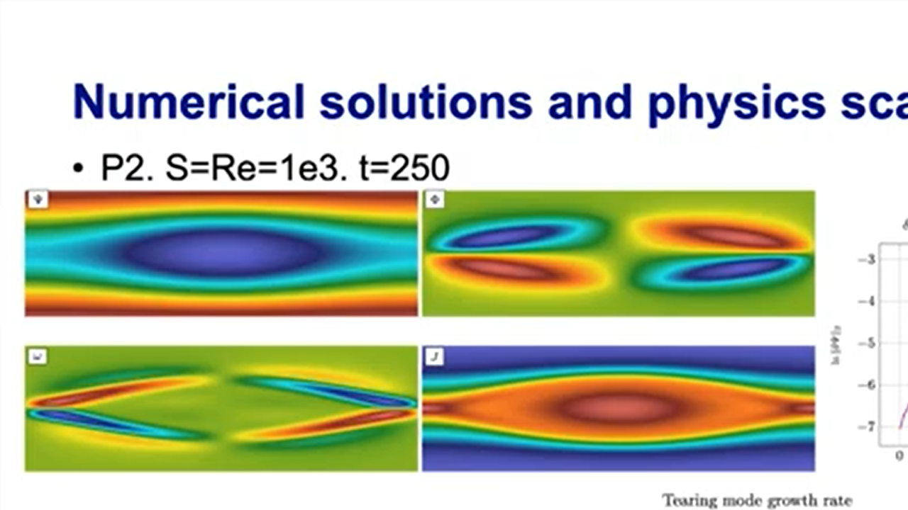</img></a>

Qi Tang of Los Alamos National Laboratory described his team’s development of an efficient, scalable solver for tokamak plasma simulations. Magnetohydrodynamics (MHD) equations are important for studying plasma systems, but efficient numerical solutions for MHD are extremely challenging due to disparate time and length scales, strong hyperbolic phenomena, and nonlinearity. Tang’s team has developed a high-order stabilized finite element algorithm for incompressible resistive MHD equations based on MFEM, which provides physics-based preconditioners, adaptive mesh refinement, parallelization, and load balancing. Tang showed animated examples of the model’s scalable and efficient results.

---

#### Jan Nikl (ELI Beamlines)
#### *Laser Plasma Modeling with High-Order Finite Elements*
##### **October 20, 2021** | [MFEM Workshop 2021](workshop21.md)

<a class="youtube" href="https://www.youtube.com/watch?v=N7kwS0FdaD8"></img></a>

Jan Nikl outlined how his team at the ELI Beamlines Centre uses MFEM for laser plasma modeling. Lasers have found their application in many scientific disciplines, where generation of plasma, the fourth state of matter, holds great potential for the future. A detailed description of laser produced plasmas is then essential for many applications, like (pre)pulses of ultra-intense lasers and ion acceleration beamlines, laboratory astrophysics, inertial confinement fusion, and many others. All of the mentioned are investigated at ELI Beamlines in the Czech Republic, a European laser facility aiming to operate the most intense laser system in the world. In this context, Nikl described the numerical construction based on the finite element method. This effort concentrates mainly on the Lagrangian hydrodynamics and Vlasov–Fokker–Planck–Maxwell kinetic description of plasma, utilizing the MFEM library for its flexibility and scalability.

---

#### Mathias Davids (Harvard)
#### *Modeling Peripheral Nerve Stimulations (PNS) in Magnetic Resonance Imaging (MRI)*
##### **October 20, 2021** | [MFEM Workshop 2021](workshop21.md)

<a class="youtube" href="https://www.youtube.com/watch?v=Mkz13lAH9Ak"></img></a>

Mathias Davids from Harvard Medical School presented MFEM’s use in a medical setting. Peripheral nerve stimulation (PNS) limits the usable image encoding performance in the latest generation of magnetic resonance imaging (MRI) scanners. The rapid switching of the MRI gradient coils’ magnetic fields induces electric fields in the human body strong enough to evoke unwanted action potential in peripheral nerves, leading to muscle contractions or touch perceptions. Despite its limiting role in MRI, PNS effects are not directly included during the coil design phase. Davids’ team developed a modeling tool to predict PNS thresholds and locations in the human body, allowing them to directly incorporate PNS metrics in the numeric coil winding optimization to design PNS-optimized coil layouts. This modeling tool relies on electromagnetic field simulations in heterogeneous finite element body models coupled to neurodynamic models of myelinated nerve fibers. This tool enables researchers to develop strategies that mitigate PNS effects without building expensive prototype MRI systems, maximizing the usable image encoding performance.

#### Marc Bolinches (UT)
#### *Development of DG Compressible Navier-Stokes Solver with MFEM*
##### **October 20, 2021** | [MFEM Workshop 2021](workshop21.md)

<a class="youtube" href="https://www.youtube.com/watch?v=3T9dQI1SU88"></img></a>

Marc Bolinches from the University of Texas at Austin described a compressible Navier-Stokes solver using MFEM v4.2 which did not include full support for GPUs. The solver uses the discontinuous Galerkin (DG) method as a space discretization and an explicit Runge-Kutta time-integration scheme. An effort has been made to fully support GPU computation by taking over some of the loops internal to the NonLinearForm class. This has also allowed us to implement overlap between computation and communication. The team hopes their open-source code will help other researchers in creating high-fidelity simulations of compressible flows.

---

#### Robert Rieben (LLNL)
#### *The Multiphysics on Advanced Platforms Project: Performance, Portability and Scaling*
##### **October 20, 2021** | [MFEM Workshop 2021](workshop21.md)

<a class="youtube" href="https://www.youtube.com/watch?v=4BK0-VzM1Po"></img></a>

High-energy-density physics (HEDP) experiments performed at LLNL and other Department of Energy laboratories require multiphysics simulations to predict the behavior of complex physical systems for applications including inertial confinement fusion, pulsed power, and material strength/equations-of-state studies. Robert Rieben described the variety of mathematical algorithms needed for these simulations, including ALE methods, unstructured adaptive mesh refinement, and high-order discretizations. LLNL’s Multiphysics on Advanced Platforms Project (MAPP) is developing a next-generation multiphysics code, called MARBL, based on high-order numerical methods and modular infrastructure for deployment on advanced HPC architectures. MARBL’s use of high-order methods produce better throughput on GPUs. MARBL uses MFEM for finite elements and mesh/field/operator abstractions while leveraging its support for efficient memory management. Rieben explained that co-design efforts among the MARBL, MFEM, and RAJA (portability software) teams led to better device utilization and improved performance for the MARBL code.

---

#### Felipe Gómez, Carlos del Valle, & Julián Jiménez (National University of Colombia)
#### *Phase Change Heat and Mass Transfer Simulation with MFEM*
##### **October 20, 2021** | [MFEM Workshop 2021](workshop21.md)

<a class="youtube" href="https://www.youtube.com/watch?v=OPRIpc2o_EA"></img></a>

Three undergraduate students—Felipe Gómez, Carlos del Valle, and Julián Jiménez—from the National University of Colombia presented their work using MFEM in an oceanographic model. Below the Arctic sea ice, and under the right conditions, a flux of icy brine flows down into the sea. The icy brine has a much lower fusion point and a higher density than normal seawater. As a result, it sinks while freezing everything around it, forming an ice channel called a brinicle (also known as ice stalactite). The team shared their simulations of this phenomenon assuming cylindrical symmetry. The fluid is considered viscous and quasi-stationary, and the problem is simulated taking advantage of the setup symmetries. The heat and salt transport are weakly coupled to the fluid motion and are modeled with the corresponding conservation equations, taking into account diffusive and convective effects. The coupled system of partial differential equations is discretized and solved with the help of the MFEM finite element library.

---

#### Thomas Helfer (CEA)
#### *MFEM-MGIS-MFront, a MFEM-Based Library for Nonlinear Solid Thermomechanic*
##### **October 20, 2021** | [MFEM Workshop 2021](workshop21.md)

<a class="youtube" href="https://www.youtube.com/watch?v=K6HrhFWdfx8"></img></a>

Thomas Helfer from the French Atomic Energy Commission (CEA) introduced the MFEM-MGIS-MFront library (MMM), which aims for efficient use of supercomputers in the field of implicit nonlinear thermomechanics. His team’s primary focus is to develop advanced nuclear fuel element simulations where the evolution of materials under irradiation are influenced by multiple phenomena (e.g., viscoplasticity, damage, phase transitions, swelling due to solid and gaseous fission products). MFEM provides this project with finite element abstractions, adaptive mesh refinement, and a parallel API. However, as applications dedicated to solid mechanics in MFEM are mostly limited to a few constitutive equations such as elasticity and hyperelasticity, Helfer explained that his team extended the software’s functionality to cover a broader spectrum of mechanics. Thus, this MMM project combines MFEM with the MFrontGenericInterfaceSupport (MGIS), an open-source C++ library that provides data structures to support arbitrarily complex nonlinear constitutive equations generated by the MFront code generator. MMM is developed within the scope of CEA’s PLEIADES project. Helfer’s presentation provided (1) an introduction to MMM goals; (2) a tutorial of MMM usage with a focus on the high-level user interface; (3) an overview of the core design choices of MMM and how MFEM was extended to support a range of scenarios; and (4) feedback on the two main issues encountered during MMM development.

---

#### Jamie Bramwell (LLNL)
#### *Serac: User-Friendly Abstractions for MFEM-Based Engineering Applications*
##### **October 20, 2021** | [MFEM Workshop 2021](workshop21.md)

<a class="youtube" href="https://www.youtube.com/watch?v=EHUID3fnHwU"></img></a>

Jamie Bramwell of LLNL presented an overview of the open-source [Serac project](https://serac.readthedocs.io/en/latest), whose goal is to provide user-friendly abstractions and modules that enable rapid development of complex nonlinear multiphysics simulation codes. She provided an overview of both the high-level physics modules (thermal conduction, solid mechanics, incompressible flow, electromagnetics) as well as the serac::Functional framework for quickly developing nonlinear GPU-enabled finite element method kernels.

---

#### Veselin Dobrev (LLNL)
#### *Recent Developments in MFEM*
##### **October 20, 2021** | [MFEM Workshop 2021](workshop21.md)

<a class="youtube" href="https://www.youtube.com/watch?v=oUk6tkHWjI4"></img></a>

Veselin Dobrev of LLNL detailed the project’s recent developments including memory manager improvements; serial support for p- and hp-refinement; high-order/low-order refined solution transfer; GLVis visualization via Jupyter Notebooks; and additional GPU support regarding HYPRE preconditioners, PETSc tools, and mesh optimization. MFEM now also integrates with various new libraries (AmgX, Gingko, FMS, and others), and continuous integration testing has been conducted on LLNL’s Quartz, Lassen, and Corona machines. Additionally, Dobrev summarized MFEM’s integrations with other software libraries and the team’s engagements with the Exascale Computing Project, SciDAC, the FASTMath Institute, and other projects.

---

#### Tzanio Kolev (LLNL)
#### *The State of MFEM*
##### **October 20, 2021** | [MFEM Workshop 2021](workshop21.md)

<a class="youtube" href="https://www.youtube.com/watch?v=p4u4AlUhamY"></img></a>

MFEM principal investigator Tzanio Kolev described the project’s past, present, and future with an emphasis on its key capabilities of discretization algorithms, built-in solvers, parallel scalability, adaptive mesh refinement, and support for a range of computing architectures. Kolev also highlighted the global community’s contributions as well as features included in the recent v4.3 software release.

---

#### Aaron Fisher (LLNL)
#### *Welcome and Overview*
##### **October 20, 2021** | [MFEM Workshop 2021](workshop21.md)

<a class="youtube" href="https://www.youtube.com/watch?v=534cBuede4w"></img></a>

The MFEM community workshop held virtually on October 20, 2021, brought together users and developers for a review of software features and the development roadmap, a showcase of technical talks and applications, collaborative breakout sessions, and a simulation contest. Aaron Fisher of LLNL kicked off the event with an overview of the workshop agenda, participant demographics, and community survey results.

## Other Videos

---

#### *LLNL HPC Software Tutorials: MFEM*
##### **Aug 22, 2024**

<a class="youtube" href="https://www.youtube.com/watch?v=Ps0wAuMbLVU"></img></a>

Instructions for a self-paced overview of MFEM.

---

#### *MFEM: Advanced Simulation Algorithms for HPC Applications*
##### **Jun 24, 2020**

<a class="youtube" href="https://www.youtube.com/watch?v=Rpccj3NopSE"></img></a>

Overview of MFEM 4.0 featuring some of its developers.

#### *Center for Applied Scientific Computing*
##### **Jul 12, 2019**

<a class="youtube" href="https://www.youtube.com/watch?v=5CIeSLWs7hI"></img></a>

Overview of the Center for Applied Scientific Computing at Lawrence Livermore National Laboratory, including a highlight of MFEM.

---

#### *S&TR Preview: Exascale Computing*
##### **October 6, 2016**

<a class="youtube" href="https://www.youtube.com/watch?v=ePWyiDf_XTg">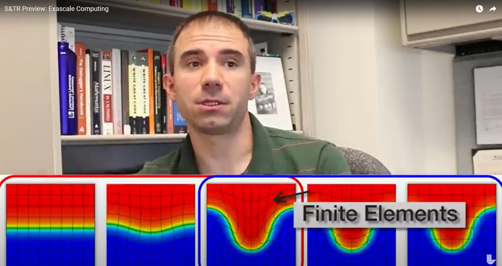</img></a>

Some early MFEM results in the [BLAST](https://computing.llnl.gov/projects/blast) project.

