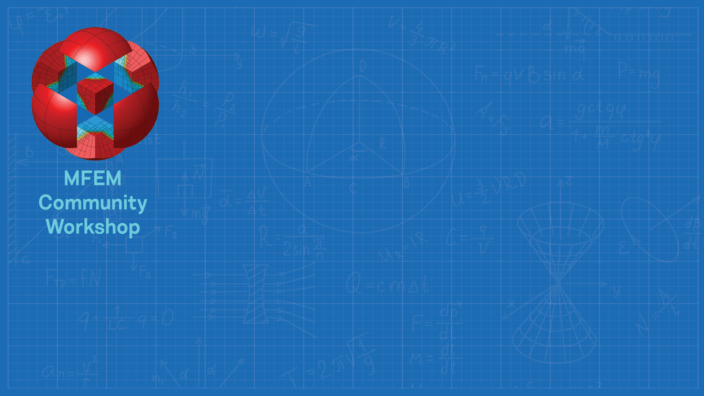

# MFEM Community Workshop
#### October 20, 2021
#### Virtual Meeting

### Overview

The MFEM team is happy to announce the first MFEM Community Workshop, which will
take place on October 20, 2021, virtually, using WebEx for videoconferencing.
The goal of the workshop is to foster collaboration among all MFEM users and
developers, share the latest MFEM features with the broader community, deepen
application engagements, and solicit feedback to guide future development
directions for the project.

**For questions, please contact the meeting organizers at**
**[mfem@llnl.gov](mailto:mfem@llnl.gov).**

### Registration

If you plan to attend, [please register no later than **October 18th**](https://docs.google.com/forms/d/e/1FAIpQLSdVnFGMlkOtfHYNrm0oEBNLKI7Skba5WTBloZiZqh4MRfD73w/viewform).
There is no registration fee. WebEx details will be distributed to participants prior to the event date.

### Meeting format

Depending on the interest and user feedback, the meeting will include the following elements:

- Project news and development updates from the MFEM team
- An overview of the latest features in MFEM-4.3 and GLVis-4.1
- Contributed talks from application developers utilizing MFEM
- Roadmap discussion for future development
- Technical discussions in breakout rooms for Electromagnetics, Fluids, and
  Structural Mechanics applications

Workshop participants are encouraged to join the
[MFEM Community Slack workspace](https://join.slack.com/t/mfemworkshop/shared_invite/zt-weieq6sh-yeu39dNdFRIKyGpoE2u9SQ)
to communicate with other MFEM users and developers before, during and after the
MFEM workshop.

The meeting activities will take place 7:45am-2:45pm Pacific Daylight Time (GMT-7):

#### Wednesday, October 20

| Time (PDT, GMT-7) | Activity | Presenter |
|---|---|---|
| 7:45-8:00 | **Welcome & Overview** | Aaron Fisher |
| 8:00-8:30 | **The State of MFEM & Roadmap** | Tzanio Kolev |
| 8:30-9:00 | **Recent Developments** | Veselin Dobrev |
| 9:00-10:00 | **Talks, Session I** (20 mins each) | • Jamie Bramwell (LLNL), *Serac: user-friendly abstractions for MFEM-based engineering applications* • Guillaume Latu (CEA), *MFEM-MGIS-MFront, a MFEM based library for non linear solid thermomechanics* • Julian Jimenez (National University of Colombia), *Phase change heat and mass transfer simulation with MFEM* |
| 10:00-10:30 | **Break & Group Photo**| All Download a virtual background below |
| 10:30-12:30 | **Talks, Session II** (20 mins each) | • Robert Rieben (LLNL), *The multiphysics on advanced platforms project: performance, portability and scaling* • Marc Bolinches (UT), *Development of DG compressible Navier Stokes solver with MFEM* • Mathias Davids (Harvard), *Modeling peripheral nerve stimulations in magnetic resonance imaging* • Jan Nikl (ELI Beamlines), *Laser plasma modeling with high-order finite elements* • Qi Tang (LANL), *An adaptive, scalable fully implicit resistive MHD solver* • Syun’ichi Shiraiwa (PPPL), *Development of PyMFEM python wrapper for MFEM and scalable RF wave simulation for nuclear fusion* |
| 12:30-1:00 | **Break** | All |
| 1:00-2:00 | **Talks, Session III** (20 mins each) | • William Dawn (NCSU), *Unstructured finite element neutron transport using MFEM* • Vladimir Tomov (LLNL), *MFEM capabilities for high-order mesh optimization* • Will Pazner (LLNL), *High-order matrix-free solvers* |
| 2:00-2:30 | **Breakout Sessions** | • Electromagnetics • Fluids • Structural Mechanics |
| 2:30-2:45 | **Wrap-up & Contest Winners** | Aaron Fisher |

### Simulation and Visualization Contest

The 2021 MFEM Workshop featured a simulation and visualization contest. The
submitted entries can be viewed in the [gallery](gallery.md).

### Virtual Backgrounds

We invite workshop participants to use the virtual backgrounds designed for this event. 
Click each image to enlarge, then right-click to save locally.

