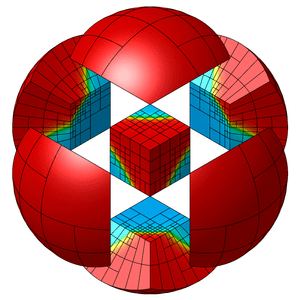

# MFEM Community Workshop
<h4>September 22-25, 2026</h4>
<h4>Georgia Tech + Virtual</h4>

### Overview

The MFEM team, together with Georgia Tech's School of Computational Science and Engineering and the Open Source Program Office, invite you to the 2026 MFEM Community Workshop, which will take place on September 22-25, 2026 in a hybrid format: in-person at [Georgia Tech](#venue) + virtually on Zoom. The goal of the workshop is to foster collaboration among all MFEM users and developers, share the latest MFEM features with the broader community, deepen application engagements, and solicit feedback to guide future development directions for the project.

*We encourage you to join us in person if you can!* As you make travel plans, please note that
the first day of the workshop (September 22) will be reserved for a hands-on MFEM tutorial.

*Please contact the meeting organizers with any questions: [mfem@llnl.gov](mailto:mfem@llnl.gov)*

### Registration

If you plan to attend, either in-person or virtually, [please register no later than **September 11th**](https://forms.gle/5sqBL3p7ReDTvWkt9).

* **In person:** The registration fee for in-person attendance is **$150 for regular participants** and **$75 for students**. After completing this registration form, you will receive separate payment instructions for the registration fee in a follow-up message.

* **Remote:** There is no registration fee for remote participants. Zoom details will be distributed prior to the event date.

### Venue

The workshop will take place at [Georgia Tech](http://gatech.edu/) (GT) in Atlanta, Georgia. GT is about a 30-minute drive from Hartsfield-Jackson Atlanta International Airport. Information about the meeting room and a map will be available soon.

### Meeting Format

This will be the third hybrid edition of the MFEM community workshop and the sixth overall. Elements of the workshop under discussion:

- Live, hands-on tutorial (**to be held on the first day of the workshop, September 22**)
- Project news and development updates from the MFEM team
- An overview of the latest features and future roadmap
- Contributed talks from application developers utilizing MFEM
- Student lightning talks
- Office hours with the MFEM team
- In-person poster session
- Visualization contest

See also the agendas for the previous [2025](../workshop25), [2024](../workshop24), [2023](../workshop23), [2022](../workshop22), and [2021](../workshop21) MFEM workshops.

Workshop participants are encouraged to join the
[MFEM Community Slack workspace](https://join.slack.com/t/mfemworkshop/shared_invite/zt-1hxasxnlt-erkRWQTMLmBoHUdXlB0Wfg)
to communicate with other MFEM users and developers before, during and after the
MFEM workshop.

### Agenda

Details will be posted soon.

### Simulation and Visualization Contest

We will be holding a simulation and visualization contest open to all attendees.
Participants can submit visualizations (images or videos) from MFEM-related
simulations. The winner of the competition (selected by the organizing
committee) will receive an MFEM T-shirt. We will also feature the images in the
[gallery](gallery.md). Here are the winners from the 2025 workshop:

<strong>Cascadia team:</strong> <em>Real-time Bayesian inference at extreme scale: A digital twin for tsunami early warning applied to the Cascadia subduction zone. This research won the <a href="https://awards.acm.org/bell/">2025 ACM Gordon Bell Prize</a>.</em>

<strong>Leonardo Molinari:</strong> <em>Electric field distribution during a radiofrequency (RF) ablation procedure on an idealized intracardiac geometry.</em>

---

### Virtual Backgrounds

We invite workshop participants to use the virtual backgrounds designed for this event.
Click each image to enlarge, then right-click to save locally.

---

### About Livermore and LLNL

Founded in 1869, Livermore is California's oldest wine region, framed by award-winning wineries,
farmlands, and ranches that mirror the valley's western heritage. As home to renowned science and
technology centers, Lawrence Livermore and Sandia national labs, Livermore is a technological hub
and an academically engaged community. It has become an integral part of the Bay Area, successfully
competing in the global market powered by its wealth of research, technology, and innovation.

For more than 70 years, [LLNL](https://www.llnl.gov/) has applied science and technology to make the world a safer place.
World-class facilities include the National Ignition Facility, the Advanced Manufacturing
Laboratory, and the Livermore Computing Center hosting the world's fastest exascale supercomputer,
El Capitan.

---

### About Georgia Tech

</img>

The [Georgia Institute of Technology](http://gatech.edu/) (Georgia Tech or GT), is one of the nation's
top public research universities with more than 50,000 students who study in person at the main campus
in Atlanta, at off-campus instructional sites such as Georgia Tech-Europe in France, and through distance
and online learning.

GT's [School of Computational Science and Engineering](https://cse.gatech.edu/) creates future leaders who
keep pace with and solve the most challenging problems in science, engineering, health, and social domains.
This research focuses on high-performance computing, modeling and simulation, and large-scale Big Data analytics
powered by machine learning and artificial intelligence to enable breakthroughs in scientific discovery and
engineering practice. GT's [Open Source Program Office (OSPO)](https://ospo.cc.gatech.edu/) supports the development, maintenance, and sustainability of open-source research software.

---

### Organizing Committee

[*Holly Auten*](https://people.llnl.gov/auten1)
┊  [*John Camier*](https://scholar.google.com/citations?user=-HEVv5EAAAAJ&hl=en)
┊  [*Brendan Keith*](https://brendankeith.github.io/)
┊  [*Tzanio Kolev*](https://people.llnl.gov/kolev1)
┊  [*Justin Laughlin*](https://www.linkedin.com/in/justin-laughlin)
┊  [*Will Pazner*](https://pazner.github.io)
┊  [*Socratis Petrides*](https://scholar.google.com/citations?user=yBKJuSsAAAAJ&hl=en)
┊  [*Sohail Reddy*](https://scholar.google.com/citations?user=trH03DQAAAAJ&hl=en)
┊  [*Syun'ichi Shiraiwa*](https://scholar.google.com/citations?user=17PZFkoAAAAJ&hl=en)
┊  [*Qi Tang*](https://tangqi.github.io)

---

### Previous Workshops

- [MFEM Community Workshop 2025](../workshop25)
- [MFEM Community Workshop 2024](../workshop24)
- [MFEM Community Workshop 2023](../workshop23)
- [MFEM Community Workshop 2022](../workshop22)
- [MFEM Community Workshop 2021](../workshop21)

